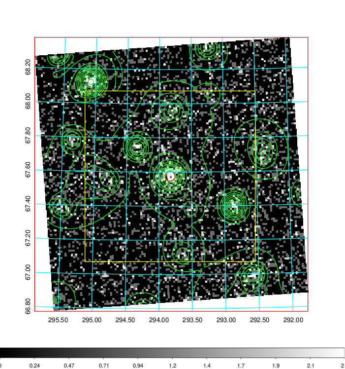
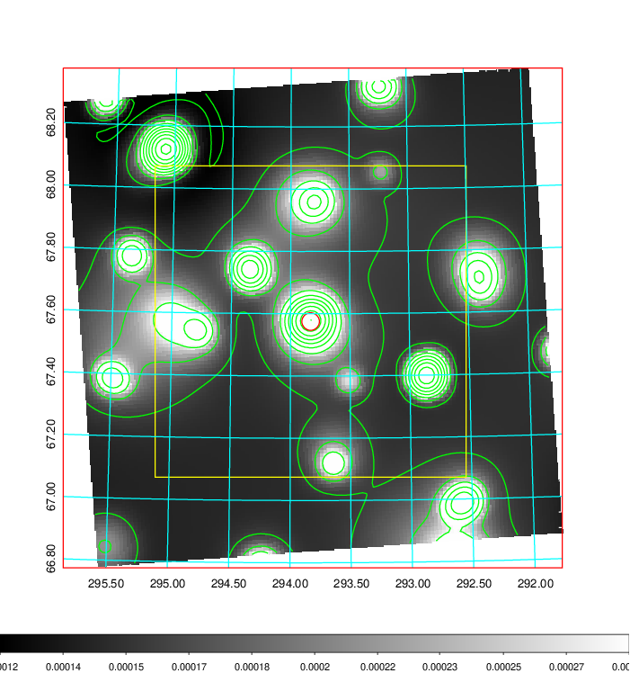
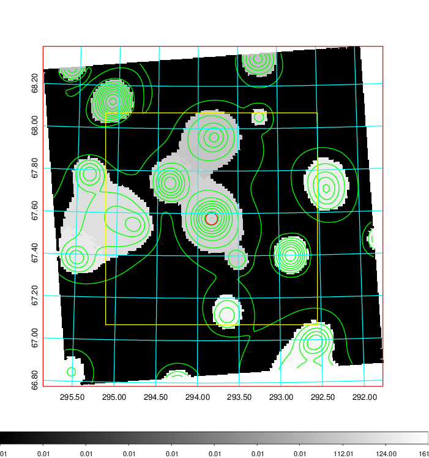
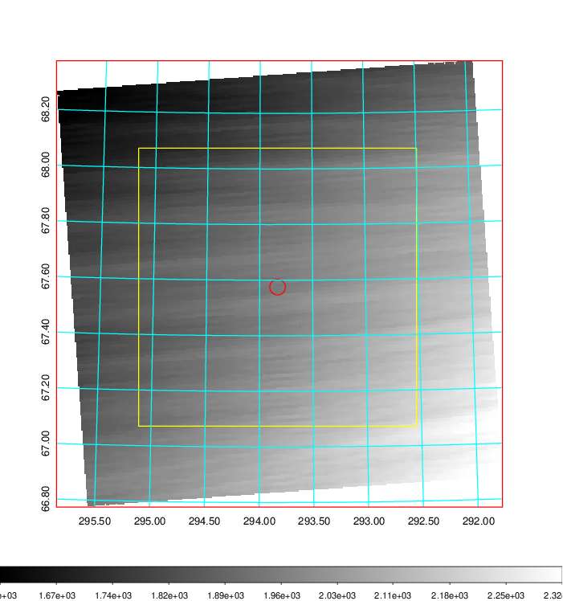
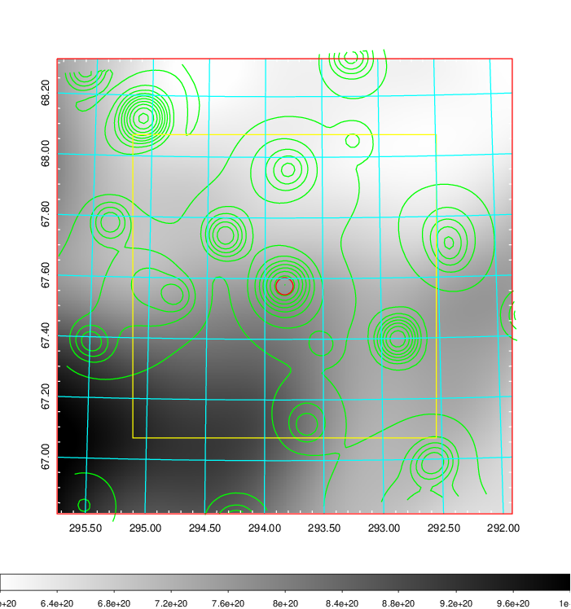
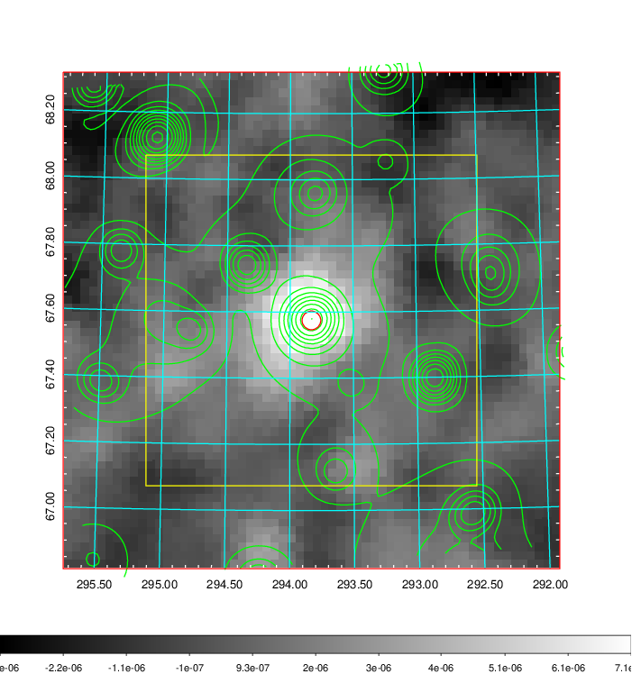
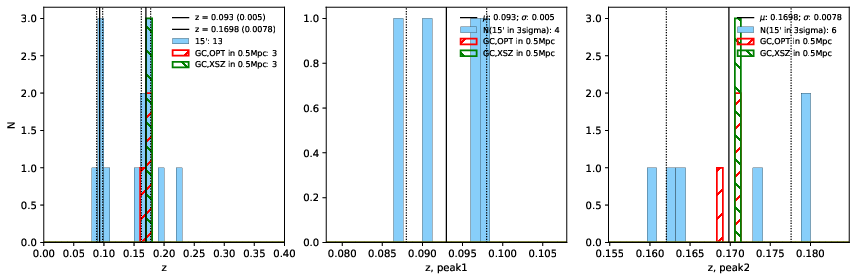
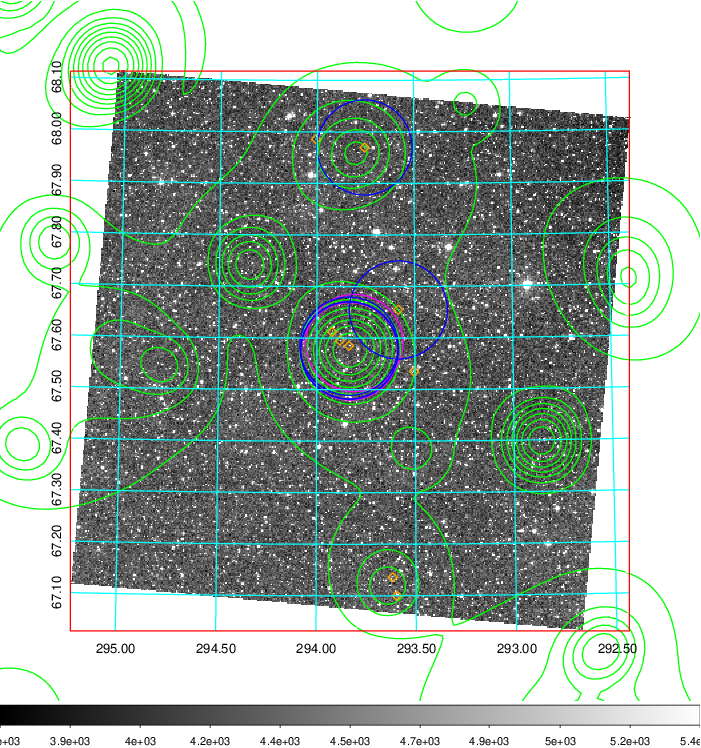
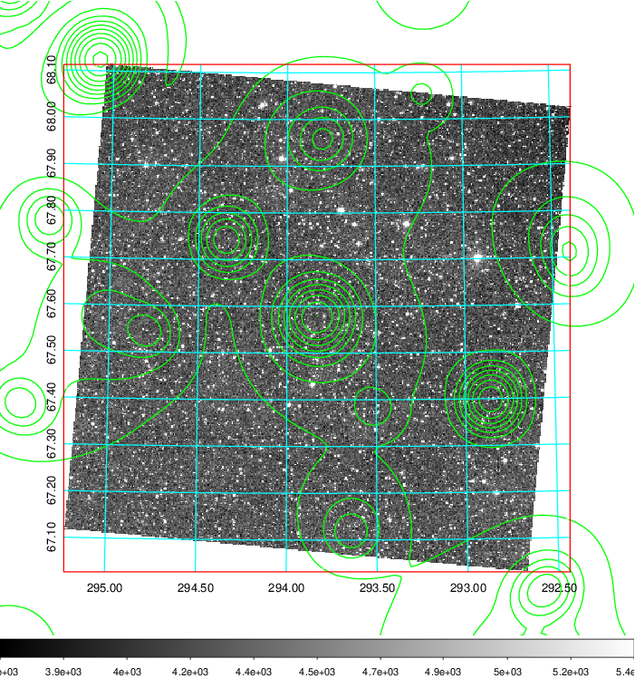
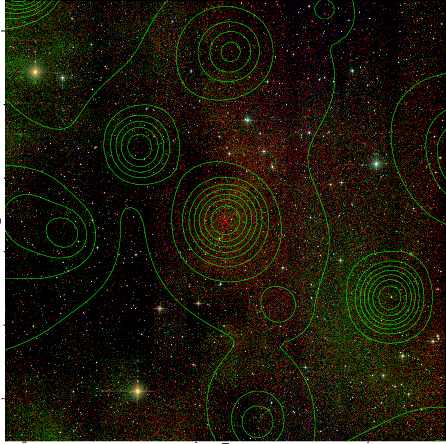

### 808

|Name|RAJ2000[deg]|DEJ2000[deg] |Ext[arcmin]| Ext,ml | z | z_src| C|GC(XSZ,Delta_z<0.01)| GC(OPT,Delta_z<0.01)|GC| R_sig[arcmin] | R500[arcmin] | R500[Mpc]| CRsig[c/s] | CR500[c/s] |L500[1E44 erg/s]|F500[1E-12 erg/s/cm^2]| M500[1E14 Msun]|Tx[keV]|Cnt_sig|Beta|Rc[arcmin]|Comment|Alias|
|---|---|---|---|---|---|------|---|--------|---------|----------|---|---|---|---|---|---|---|---|---|---|---|---|---|---|
|808| 293.831| 67.575| 1.70| 68.63| 0.1698(0.008)| z2, z_xsz| B| MCXC, PSZ2, Tar| W, Zw| MCXC, PSZ2, Tar, W| 8.312| 5.391| 0.937| 0.090(0.014)| 0.085(0.013)| 1.209(0.080)| 1.513(0.100)| 2.76(0.09)| 4.23(0.09)| 193.2| 0.895(-0.107+0.075)| 3.425(-0.577+0.407)| -| k157|

|[RASS image](../image/808/808_img.pdf)|[filtered image](../image/808/808_fil.pdf)|[Segment image](../image/808/808_seg.pdf)|
|-------------------|--------------------|-------------------|
|   |    |   |

|[Exposure image](../image/808/808_mex.pdf)| [nH image](../image/808/808_nh.pdf)| [Planck image](../image/808/808_p.pdf)|
|-------------------|--------------------|-------------------|
|   |     |  |

|[Redshift Histogram](../image/808/808_zg.pdf) | [DSS image(z1)](../image/808/808_dss_z1.pdf)      |  [DSS image(z2)](../image/808/808_dss_z2.pdf)    |
|-------------------|--------------------|-------------------|
| |  Blue circle for optical clusters;  Magenta circle for XSZ clusters;  all with r=1Mpc;  Only GC with Delta_z<0.01 are shown. |  Blue circle for optical clusters;  Magenta circle for XSZ clusters;  all with r=1Mpc;  Only GC with Delta_z<0.01 are shown.  |

|[known Abell/XSZ clusters](../image/808/808_gc.pdf) | [2MASS image](../image/808/808_2mass.pdf)      |
|-------------------|-------------------|
|  Magenta, blue and green circles  for optical, X-ray and SZ clusters  respectively, with redshift of clusters  labelled. The radius of circles  are 1Mpc.|  |

|[PS1 image](../image/808/808_ps1.pdf)            |
|-------------------|
|   |
