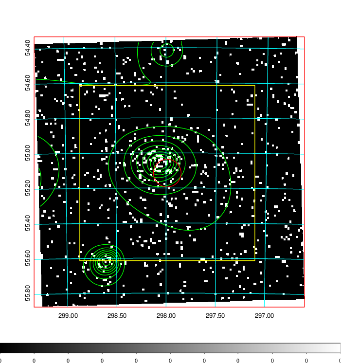
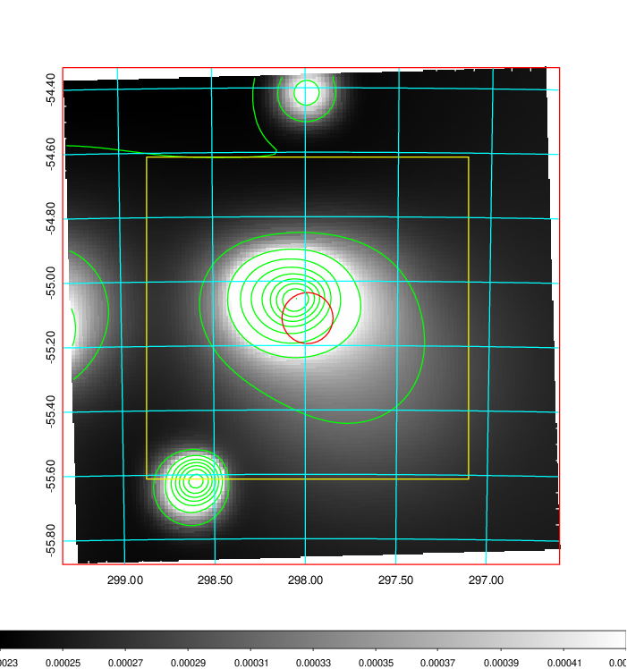
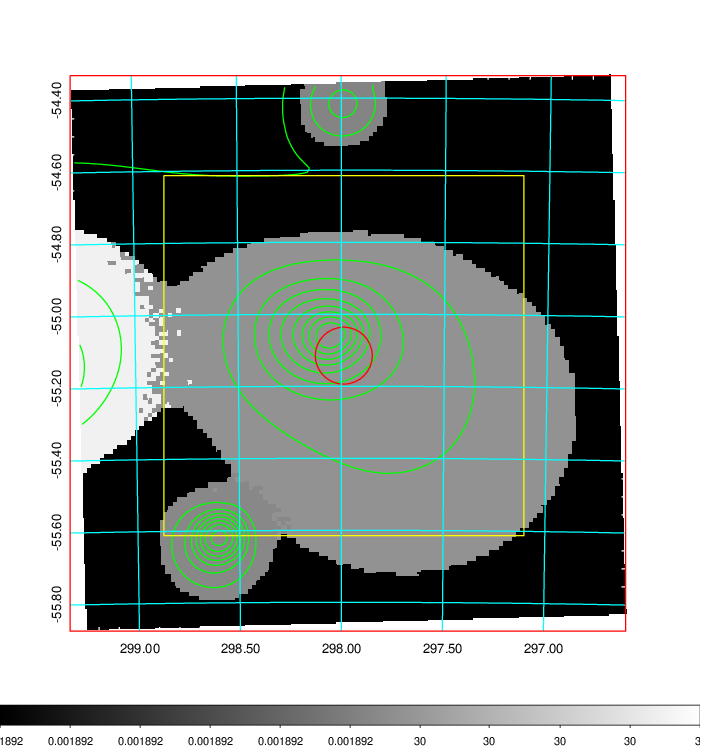
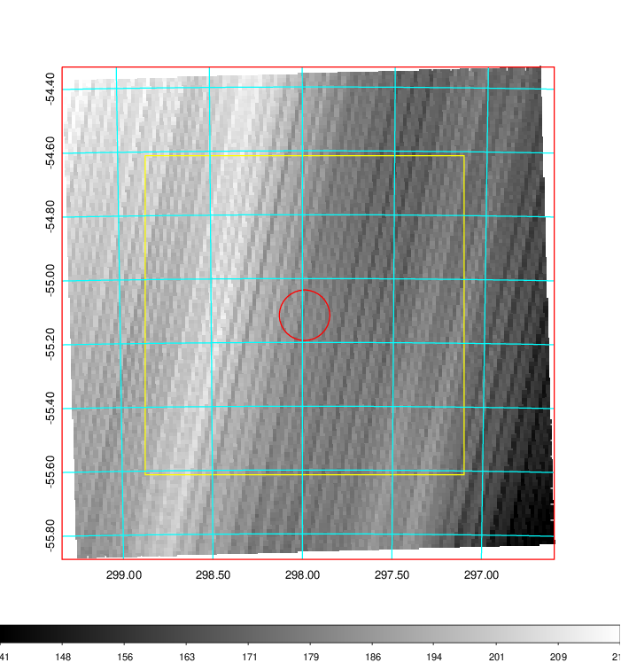
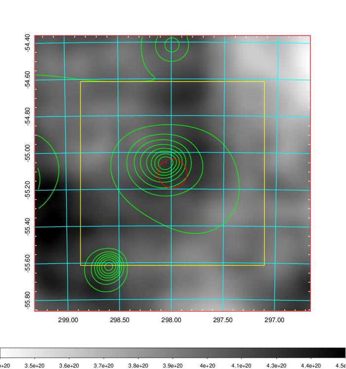
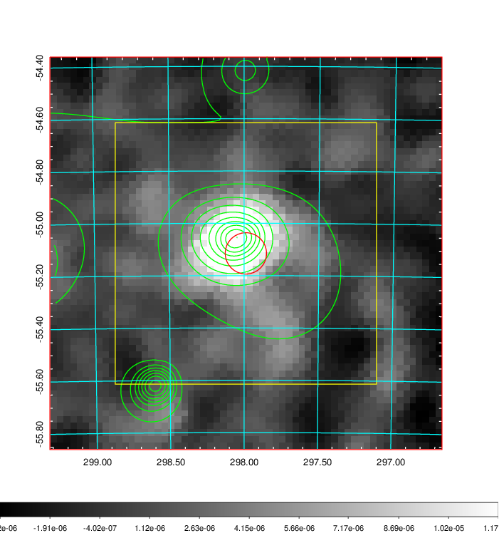
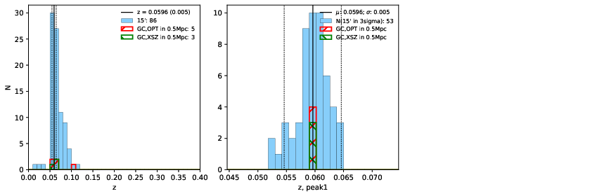
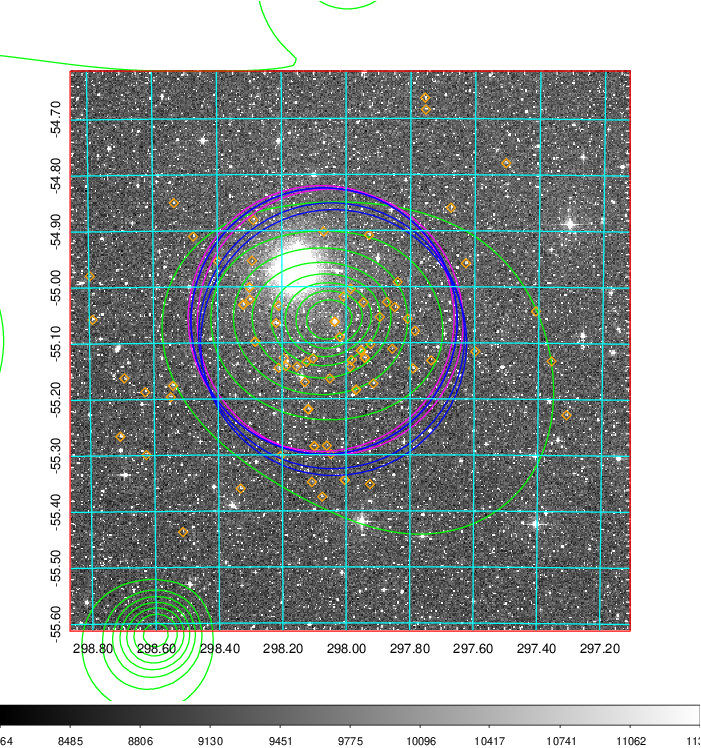
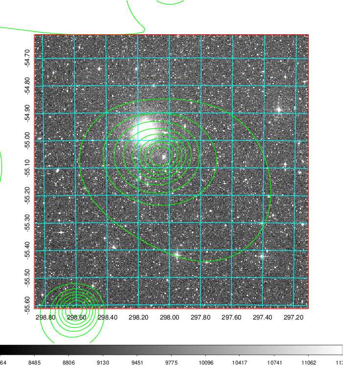
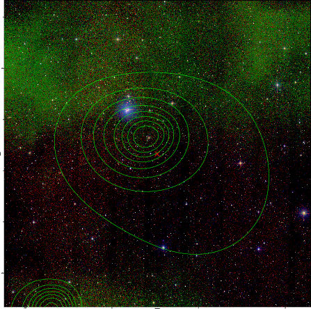

### 809

|Name|RAJ2000[deg]|DEJ2000[deg] |Ext[arcmin]| Ext,ml | z | z_src| C|GC(XSZ,Delta_z<0.01)| GC(OPT,Delta_z<0.01)|GC| R_sig[arcmin] | R500[arcmin] | R500[Mpc]| CRsig[c/s] | CR500[c/s] |L500[1E44 erg/s]|F500[1E-12 erg/s/cm^2]| M500[1E14 Msun]|Tx[keV]|Cnt_sig|Beta|Rc[arcmin]|Comment|Alias|
|---|---|---|---|---|---|------|---|--------|---------|----------|---|---|---|---|---|---|---|---|---|---|---|---|---|---|
|809| 297.988| -55.115| 4.74| 84.22| 0.0596(0.005)| z1, z_xsz| B| MCXC, PSZ2, Tar| A, N| A, MCXC, N, PSZ2, Tar, W| 29.638| 12.429| 0.859| 0.468(0.121)| 0.427(0.110)| 0.653(0.101)| 7.664(1.186)| 1.91(0.15)| 3.25(0.16)| 132.0| 0.904(-0.102+0.069)| 10.701(-1.477+1.065)| -| k515|

|[RASS image](../image/809/809_img.pdf)|[filtered image](../image/809/809_fil.pdf)|[Segment image](../image/809/809_seg.pdf)|
|-------------------|--------------------|-------------------|
|   |    |   |

|[Exposure image](../image/809/809_mex.pdf)| [nH image](../image/809/809_nh.pdf)| [Planck image](../image/809/809_p.pdf)|
|-------------------|--------------------|-------------------|
|   |     |  |

|[Redshift Histogram](../image/809/809_zg.pdf) | [DSS image(z1)](../image/809/809_dss_z1.pdf)      |  [DSS image(z2)](../image/809/809_dss_z2.pdf)    |
|-------------------|--------------------|-------------------|
| |  Blue circle for optical clusters;  Magenta circle for XSZ clusters;  all with r=1Mpc;  Only GC with Delta_z<0.01 are shown. |  Blue circle for optical clusters;  Magenta circle for XSZ clusters;  all with r=1Mpc;  Only GC with Delta_z<0.01 are shown.  |

|[Previous-identified clusters](../image/809/809_gc.pdf) | [2MASS image](../image/809/809_2mass.pdf)      |
|-------------------|-------------------|
|  Green, magenta, and blue circles  for optical, X-ray and SZ clusters  respectively, with redshift of clusters  labelled. The radius of circles  are 1Mpc.|  |

