

### 81

|Name|RAJ2000[deg]|DEJ2000[deg] |Ext[arcmin]| Ext,ml | z | z_src| C|GC(XSZ,Delta_z<0.01)| GC(OPT,Delta_z<0.01)|GC| R_sig[arcmin] | R500[arcmin] | R500[Mpc]| CRsig[c/s] | CR500[c/s] |L500[1E44 erg/s]|F500[1E-12 erg/s/cm^2]| M500[1E14 Msun]|Tx[keV]|Cnt_sig|Beta|Rc[arcmin]|Comment|Alias|
|---|---|---|---|---|---|------|---|--------|---------|----------|---|---|---|---|---|---|---|---|---|---|---|---|---|---|
|81| 25.520| 7.657| 7.12| 43.77| 0.0612(0.006)| z1, z_xsz| B| L03| A, N, W| A, C, L03, N, W| 14.162| 9.489| 0.672| 0.131(0.032)| 0.125(0.030)| 0.195(0.034)| 2.167(0.374)| 0.92(0.08)| 2.07(0.12)| 61.5| 0.814(-0.169+0.132)| 9.959(-2.206+1.792)| -| t354|

|[RASS image](../image/81/81_img.pdf)|[filtered image](../image/81/81_fil.pdf)|[Segment image](../image/81/81_seg.pdf)|
|-------------------|--------------------|-------------------|
| 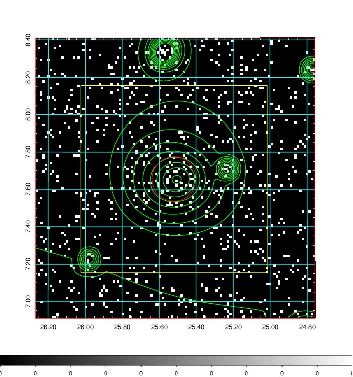  | 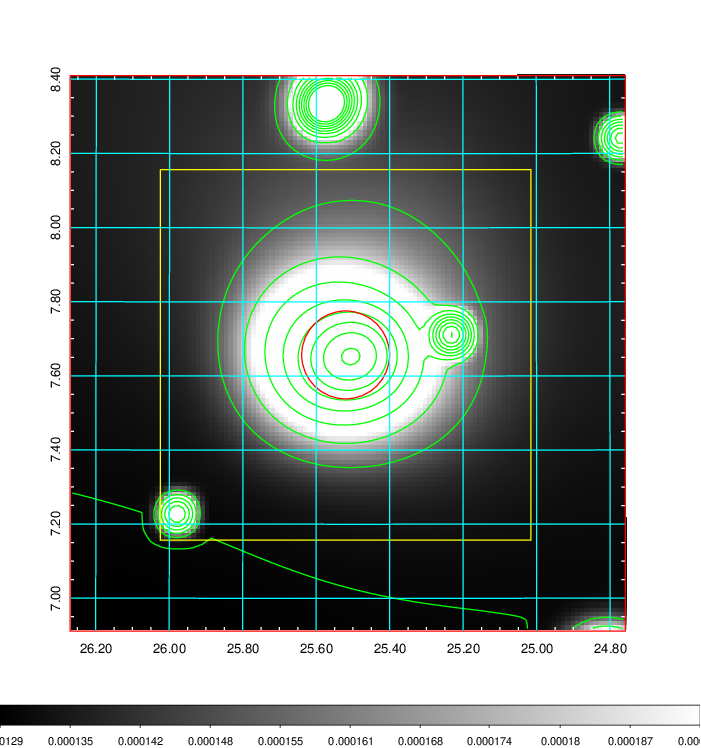   | 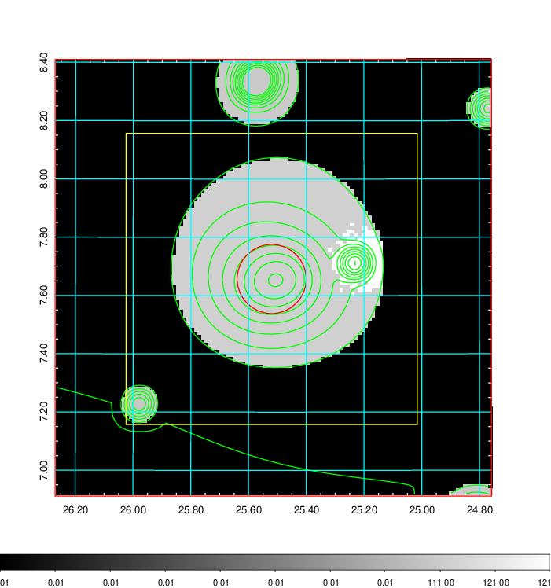  |

|[Exposure image](../image/81/81_mex.pdf)| [nH image](../image/81/81_nh.pdf)| [Planck image](../image/81/81_p.pdf)|
|-------------------|--------------------|-------------------|
|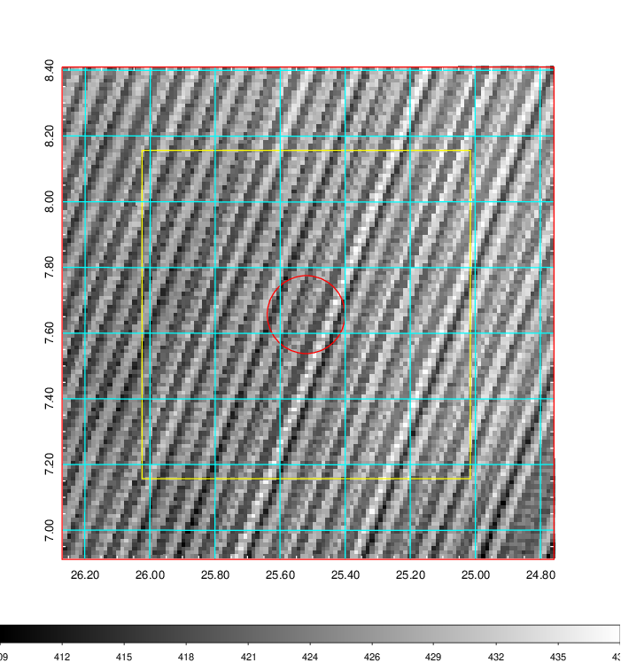   | 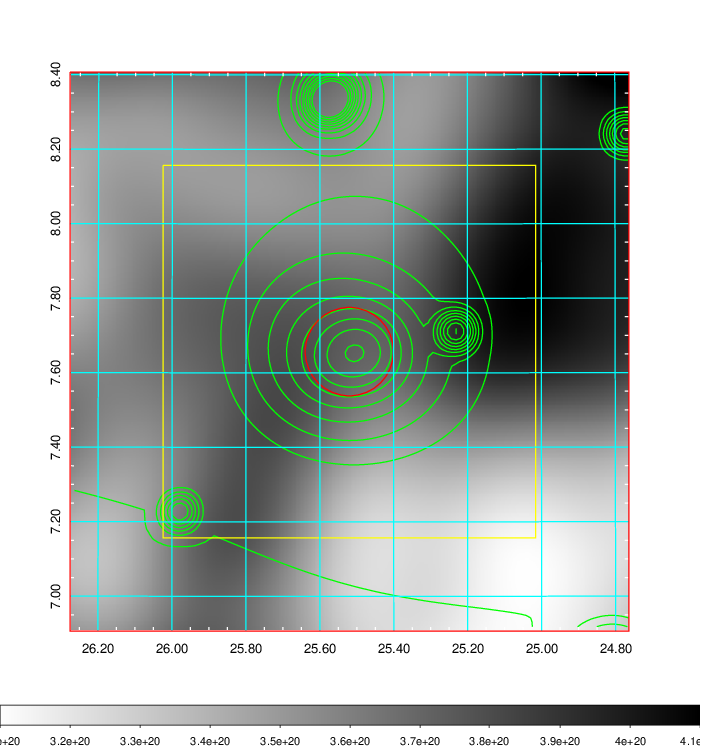    | 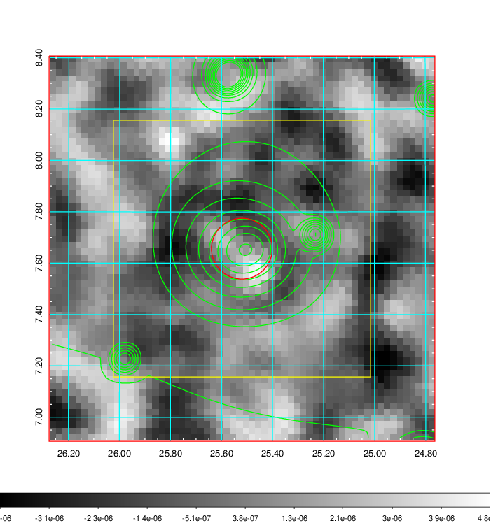 |

|[Redshift Histogram](../image/81/81_zg.pdf) | [DSS image(z1)](../image/81/81_dss_z1.pdf)      |  [DSS image(z2)](../image/81/81_dss_z2.pdf)    |
|-------------------|--------------------|-------------------|
|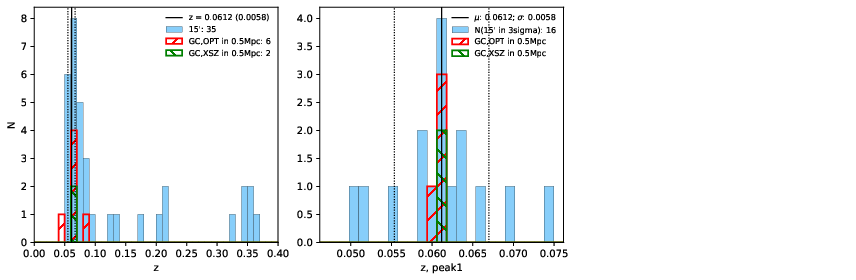 |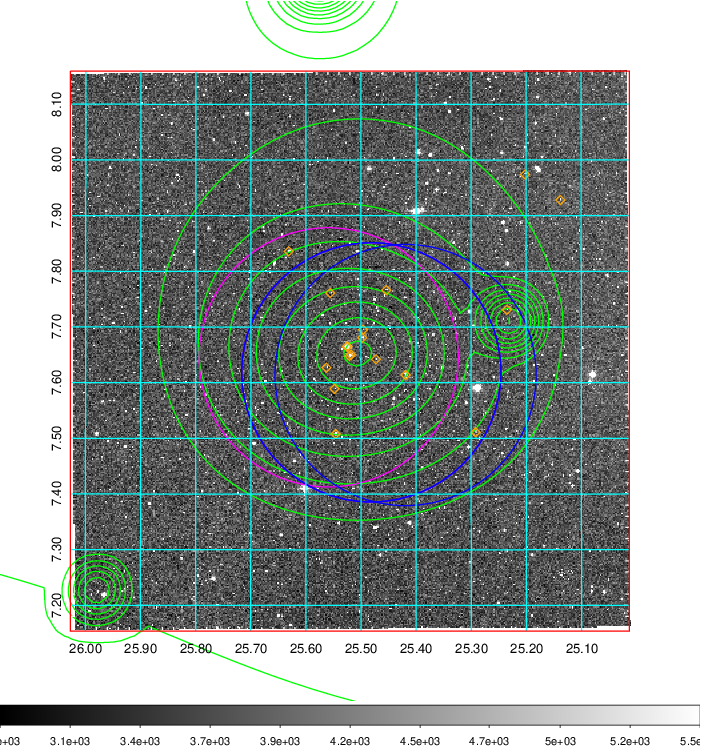  Blue circle for optical clusters;  Magenta circle for XSZ clusters;  all with r=1Mpc;  Only GC with Delta_z<0.01 are shown. | 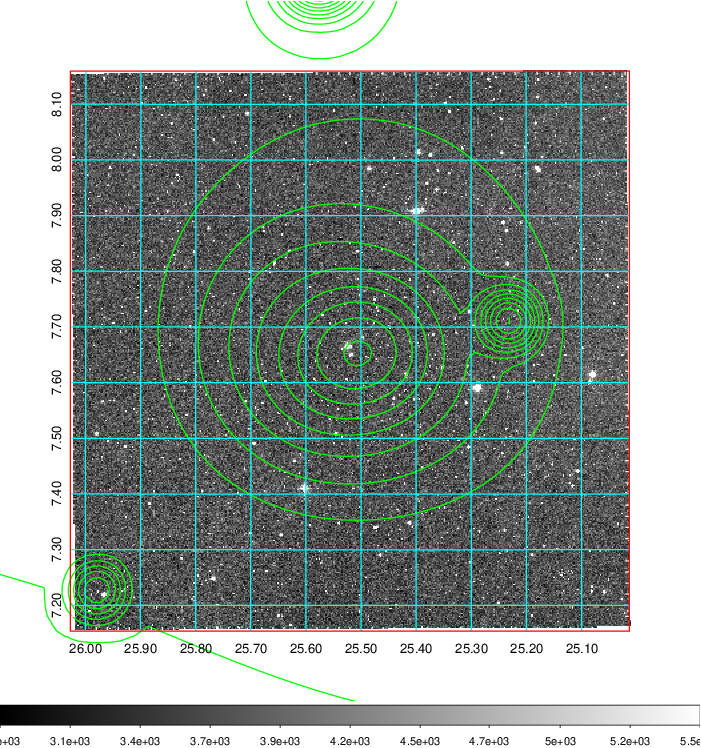 Blue circle for optical clusters;  Magenta circle for XSZ clusters;  all with r=1Mpc;  Only GC with Delta_z<0.01 are shown.  |

|[known Abell/XSZ clusters](../image/81/81_gc.pdf) | [2MASS image](../image/81/81_2mass.pdf)      |[SDSS image](../image/81/81_sdss.pdf)   |
|-------------------|-------------------|-------------------|
|  Magenta, blue and green circles  for optical, X-ray and SZ clusters  respectively, with redshift of clusters  labelled. The radius of circles  are 1Mpc.|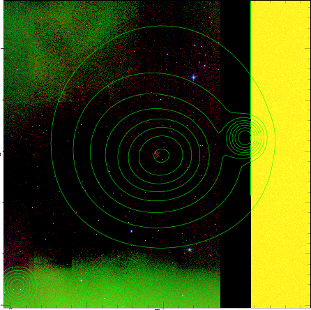  | 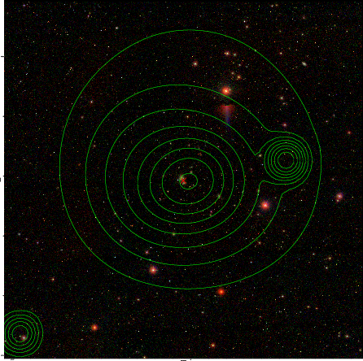  |

