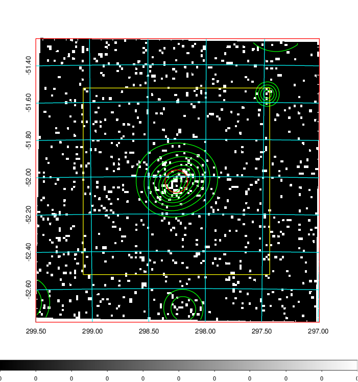
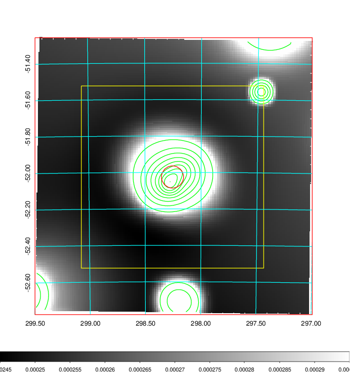
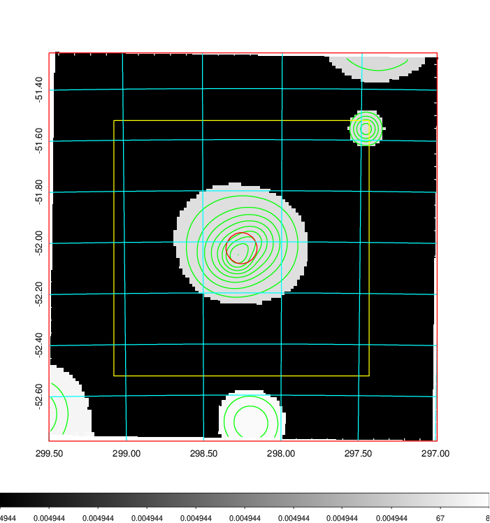
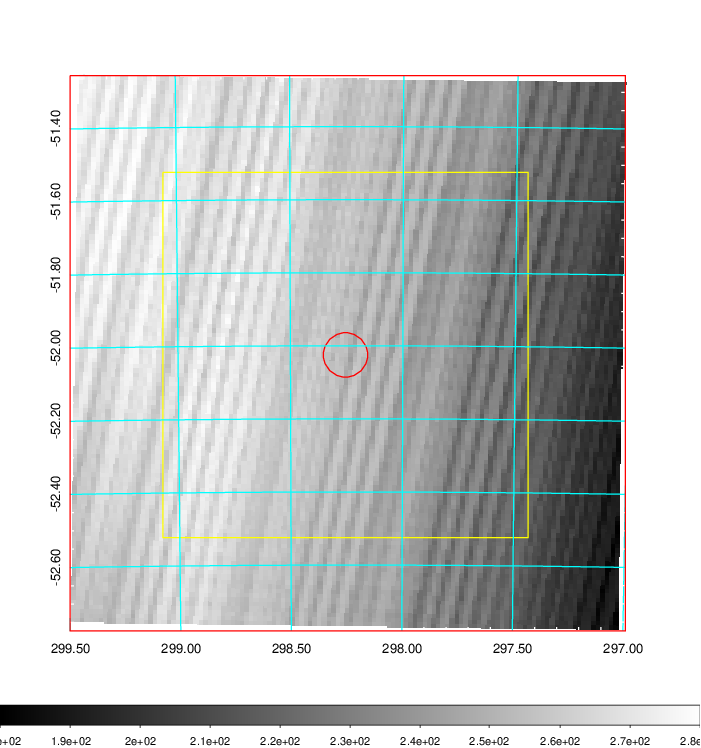
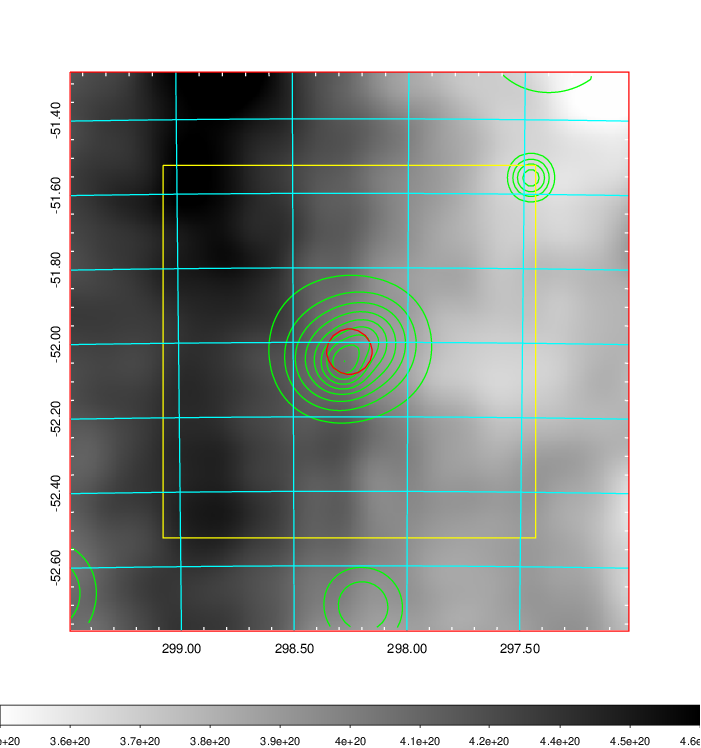
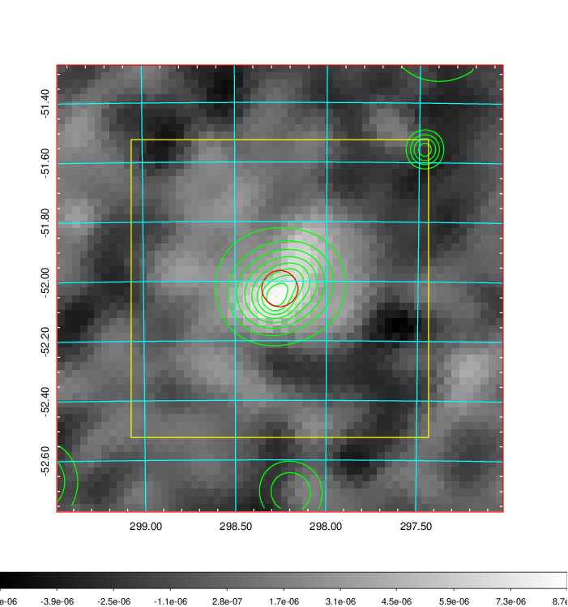
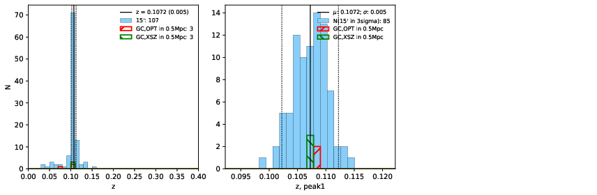
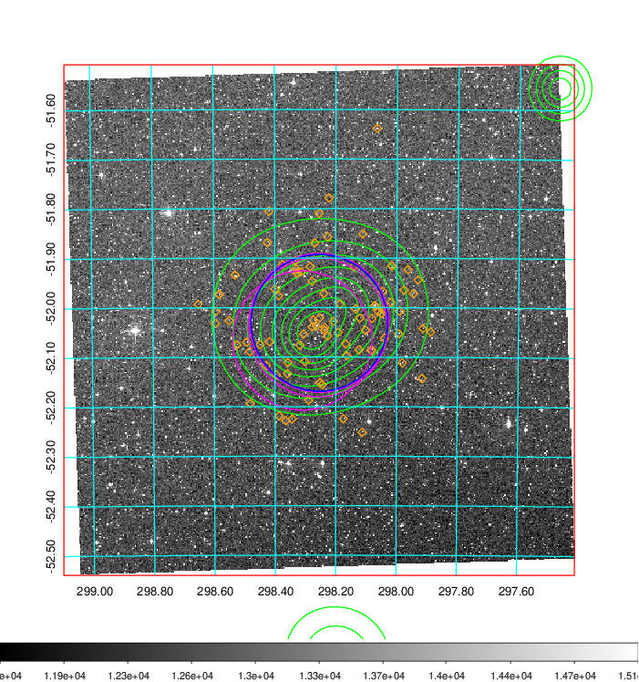
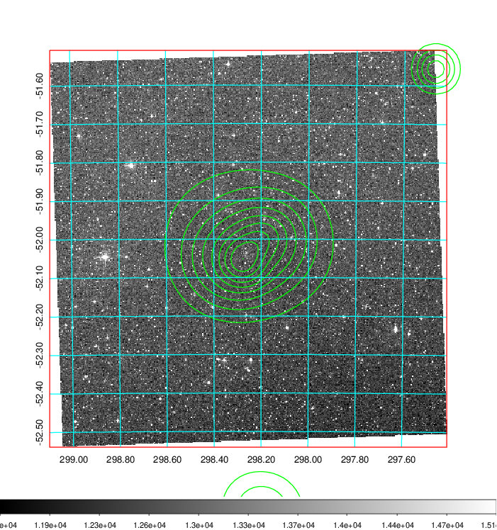
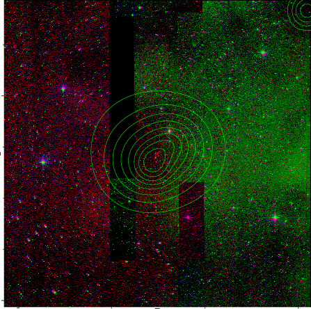

### 810

|Name|RAJ2000[deg]|DEJ2000[deg] |Ext[arcmin]| Ext,ml | z | z_src| C|GC(XSZ,Delta_z<0.01)| GC(OPT,Delta_z<0.01)|GC| R_sig[arcmin] | R500[arcmin] | R500[Mpc]| CRsig[c/s] | CR500[c/s] |L500[1E44 erg/s]|F500[1E-12 erg/s/cm^2]| M500[1E14 Msun]|Tx[keV]|Cnt_sig|Beta|Rc[arcmin]|Comment|Alias|
|---|---|---|---|---|---|------|---|--------|---------|----------|---|---|---|---|---|---|---|---|---|---|---|---|---|---|
|810| 298.255| -52.025| 3.65| 54.54| 0.1072(0.005)| z1, z_xsz| B| MCXC, PSZ2, Tar| A| A, MCXC, PSZ2, Tar, W| 9.288| 8.259| 0.972| 0.258(0.056)| 0.253(0.055)| 1.377(0.135)| 4.680(0.459)| 2.89(0.14)| 4.26(0.13)| 66.0| 0.885(-0.126+0.083)| 6.326(-1.069+0.800)| -| k452|

|[RASS image](../image/810/810_img.pdf)|[filtered image](../image/810/810_fil.pdf)|[Segment image](../image/810/810_seg.pdf)|
|-------------------|--------------------|-------------------|
|   |    |   |

|[Exposure image](../image/810/810_mex.pdf)| [nH image](../image/810/810_nh.pdf)| [Planck image](../image/810/810_p.pdf)|
|-------------------|--------------------|-------------------|
|   |     |  |

|[Redshift Histogram](../image/810/810_zg.pdf) | [DSS image(z1)](../image/810/810_dss_z1.pdf)      |  [DSS image(z2)](../image/810/810_dss_z2.pdf)    |
|-------------------|--------------------|-------------------|
| |  Blue circle for optical clusters;  Magenta circle for XSZ clusters;  all with r=1Mpc;  Only GC with Delta_z<0.01 are shown. |  Blue circle for optical clusters;  Magenta circle for XSZ clusters;  all with r=1Mpc;  Only GC with Delta_z<0.01 are shown.  |

|[known Abell/XSZ clusters](../image/810/810_gc.pdf) | [2MASS image](../image/810/810_2mass.pdf)      |
|-------------------|-------------------|
|  Magenta, blue and green circles  for optical, X-ray and SZ clusters  respectively, with redshift of clusters  labelled. The radius of circles  are 1Mpc.|  |

