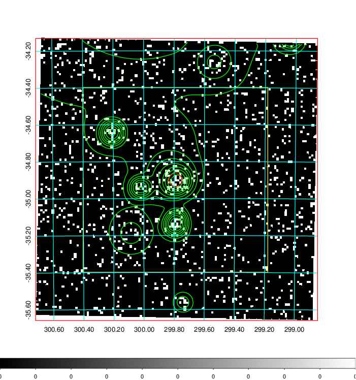
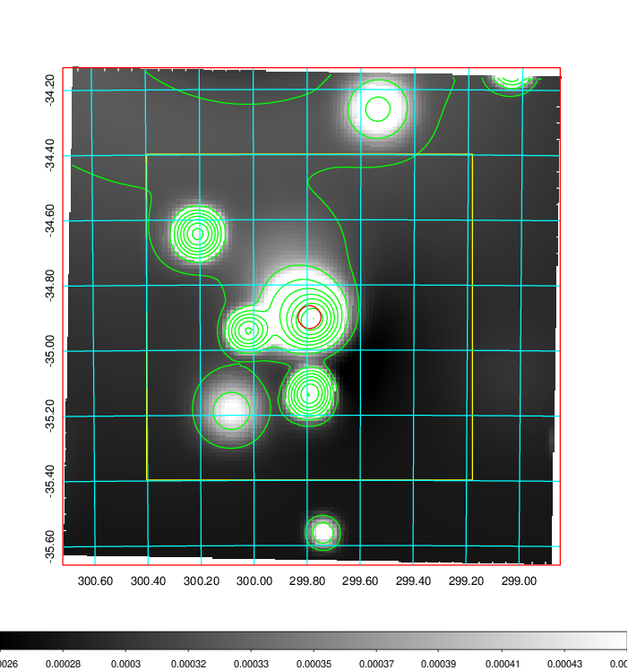
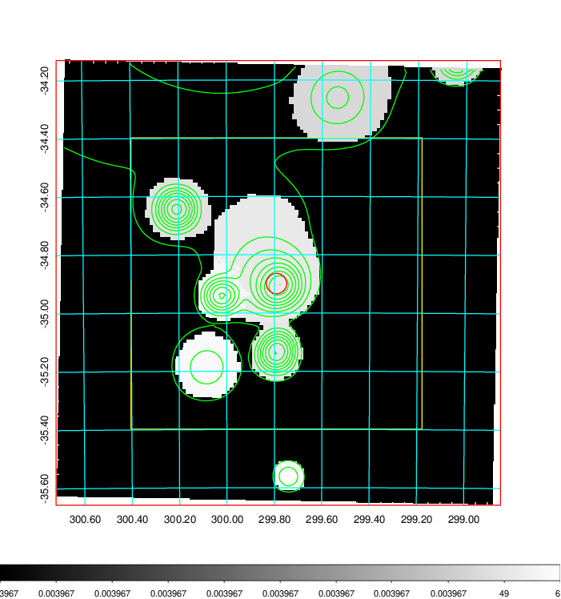
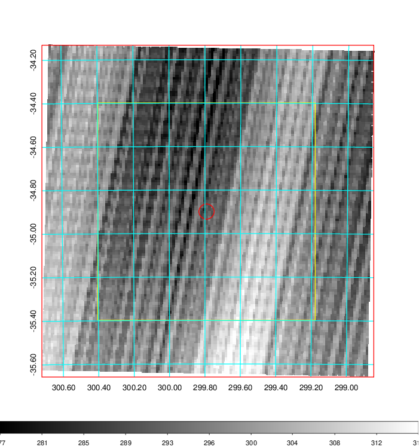
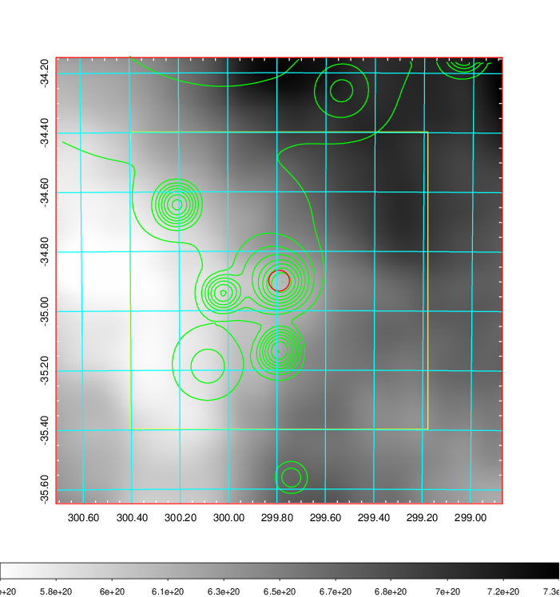
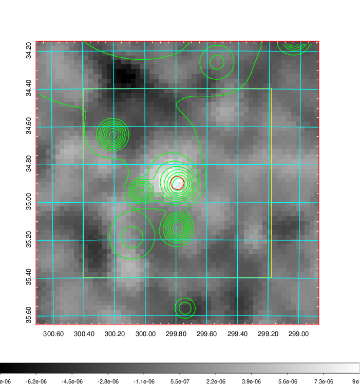
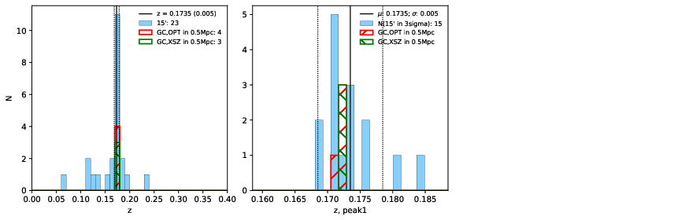
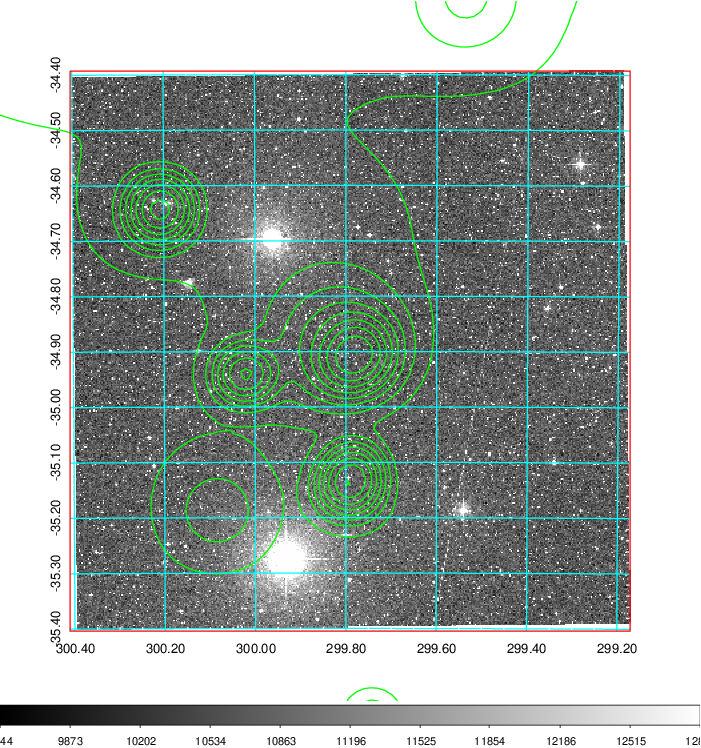
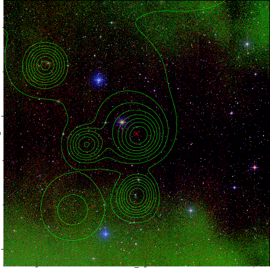

### 811

|Name|RAJ2000[deg]|DEJ2000[deg] |Ext[arcmin]| Ext,ml | z | z_src| C|GC(XSZ,Delta_z<0.01)| GC(OPT,Delta_z<0.01)|GC| R_sig[arcmin] | R500[arcmin] | R500[Mpc]| CRsig[c/s] | CR500[c/s] |L500[1E44 erg/s]|F500[1E-12 erg/s/cm^2]| M500[1E14 Msun]|Tx[keV]|Cnt_sig|Beta|Rc[arcmin]|Comment|Alias|
|---|---|---|---|---|---|------|---|--------|---------|----------|---|---|---|---|---|---|---|---|---|---|---|---|---|---|
|811| 299.791| -34.899| 2.10| 27.76| 0.1735(0.005)| z1, z_xsz| B| MCXC, PSZ2, Tar| A, N, W| A, MCXC, N, PSZ2, Tar, W| 18.775| 6.314| 1.116| 0.217(0.089)| 0.209(0.080)| 3.224(0.679)| 3.847(0.810)| 4.69(0.47)| 5.87(0.38)| 81.0| 0.655(-0.077+0.117)| 3.539(-0.897+1.191)| -| k236|

|[RASS image](../image/811/811_img.pdf)|[filtered image](../image/811/811_fil.pdf)|[Segment image](../image/811/811_seg.pdf)|
|-------------------|--------------------|-------------------|
|   |    |   |

|[Exposure image](../image/811/811_mex.pdf)| [nH image](../image/811/811_nh.pdf)| [Planck image](../image/811/811_p.pdf)|
|-------------------|--------------------|-------------------|
|   |     |  |

|[Redshift Histogram](../image/811/811_zg.pdf) | [DSS image(z1)](../image/811/811_dss_z1.pdf)      |  [DSS image(z2)](../image/811/811_dss_z2.pdf)    |
|-------------------|--------------------|-------------------|
| |  Blue circle for optical clusters;  Magenta circle for XSZ clusters;  all with r=1Mpc;  Only GC with Delta_z<0.01 are shown. |  Blue circle for optical clusters;  Magenta circle for XSZ clusters;  all with r=1Mpc;  Only GC with Delta_z<0.01 are shown.  |

|[Previous-identified clusters](../image/811/811_gc.pdf) | [2MASS image](../image/811/811_2mass.pdf)      |
|-------------------|-------------------|
|  Green, magenta, and blue circles  for optical, X-ray and SZ clusters  respectively, with redshift of clusters  labelled. The radius of circles  are 1Mpc.|  |

