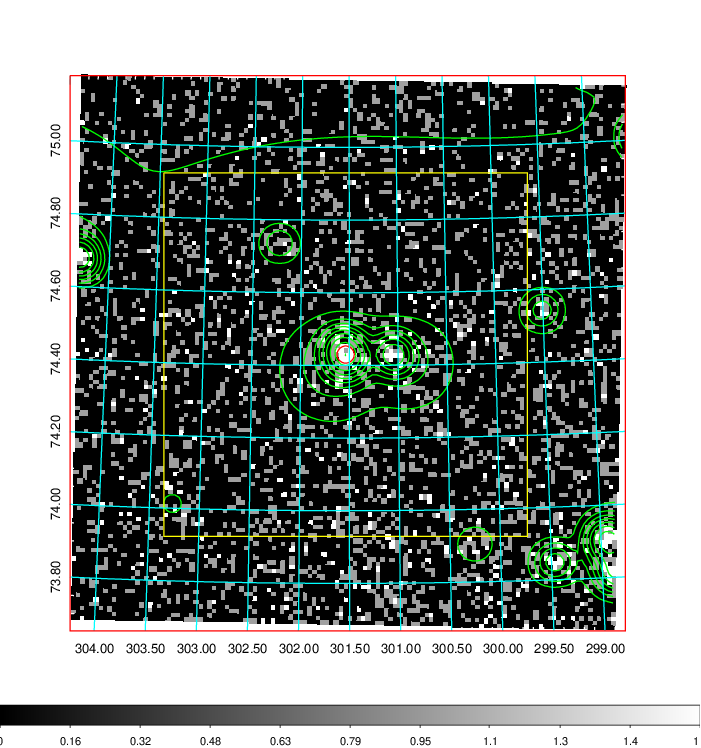
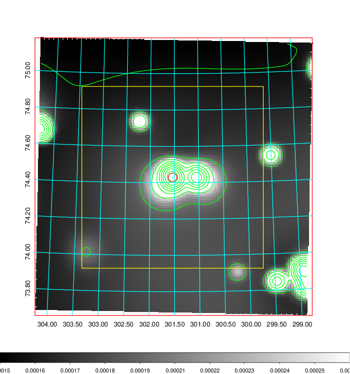
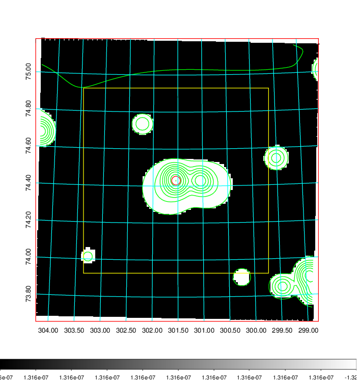
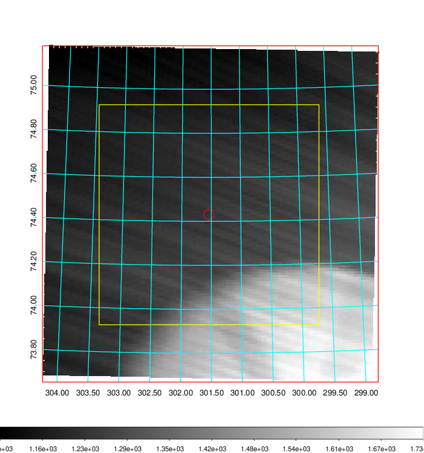
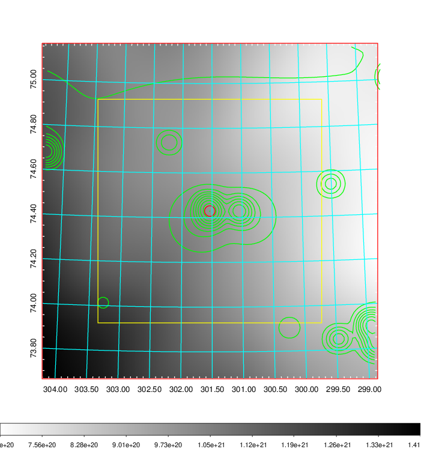
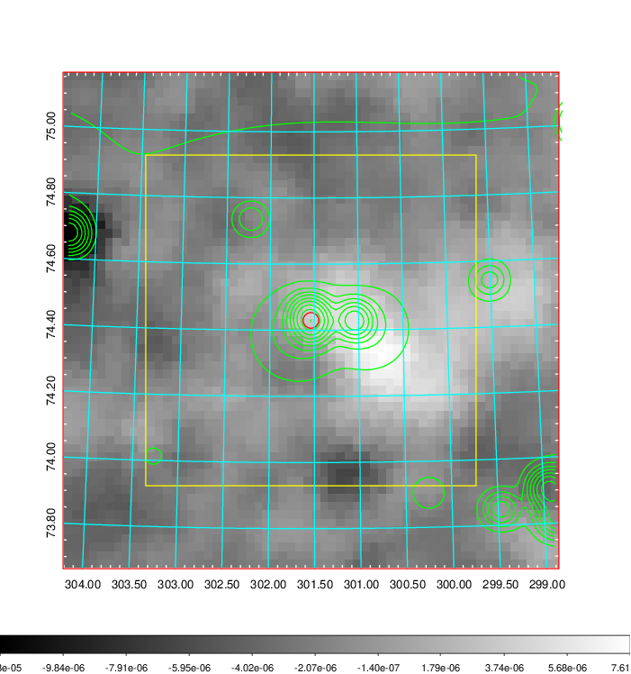
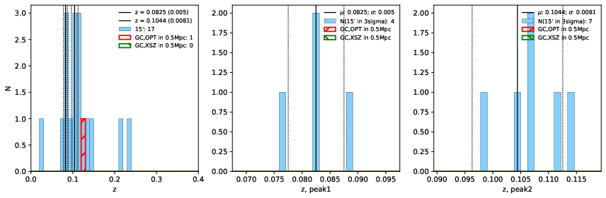
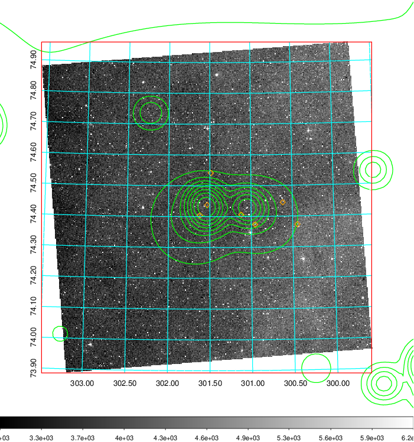
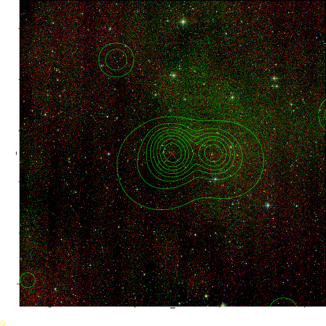
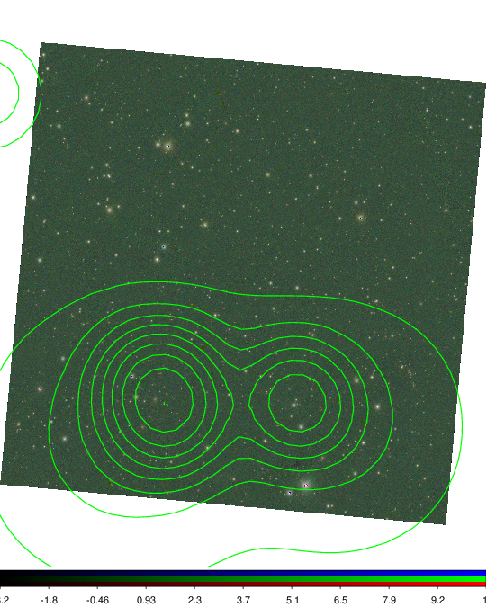

### 812

|Name|RAJ2000[deg]|DEJ2000[deg] |Ext[arcmin]| Ext,ml | z | z_src| C|GC(XSZ,Delta_z<0.01)| GC(OPT,Delta_z<0.01)|GC| R_sig[arcmin] | R500[arcmin] | R500[Mpc]| CRsig[c/s] | CR500[c/s] |L500[1E44 erg/s]|F500[1E-12 erg/s/cm^2]| M500[1E14 Msun]|Tx[keV]|Cnt_sig|Beta|Rc[arcmin]|Comment|Alias|
|---|---|---|---|---|---|------|---|--------|---------|----------|---|---|---|---|---|---|---|---|---|---|---|---|---|---|
|812| 301.538| 74.430| 1.42| 30.05| 0.1044(0.008)| z2,| G| -| -| W| 15.138| 7.307| 0.840| 0.127(0.020)| 0.117(0.019)| 0.551(0.049)| 1.982(0.178)| 1.86(0.08)| 3.25(0.09)| 218.9| 0.522(-0.016+0.036)| 1.390(-0.274+0.396)| -| t025|

|[RASS image](../image/812/812_img.pdf)|[filtered image](../image/812/812_fil.pdf)|[Segment image](../image/812/812_seg.pdf)|
|-------------------|--------------------|-------------------|
|   |    |   |

|[Exposure image](../image/812/812_mex.pdf)| [nH image](../image/812/812_nh.pdf)| [Planck image](../image/812/812_p.pdf)|
|-------------------|--------------------|-------------------|
|   |     |  |

|[Redshift Histogram](../image/812/812_zg.pdf) | [DSS image(z1)](../image/812/812_dss_z1.pdf)      |  [DSS image(z2)](../image/812/812_dss_z2.pdf)    |
|-------------------|--------------------|-------------------|
| |  Blue circle for optical clusters;  Magenta circle for XSZ clusters;  all with r=1Mpc;  Only GC with Delta_z<0.01 are shown. |  Blue circle for optical clusters;  Magenta circle for XSZ clusters;  all with r=1Mpc;  Only GC with Delta_z<0.01 are shown.  |

|[Previous-identified clusters](../image/812/812_gc.pdf) | [2MASS image](../image/812/812_2mass.pdf)      |
|-------------------|-------------------|
|  Green, magenta, and blue circles  for optical, X-ray and SZ clusters  respectively, with redshift of clusters  labelled. The radius of circles  are 1Mpc.|  |

|[PS1 image](../image/812/812_ps1.pdf)            |
|-------------------|
|   |
