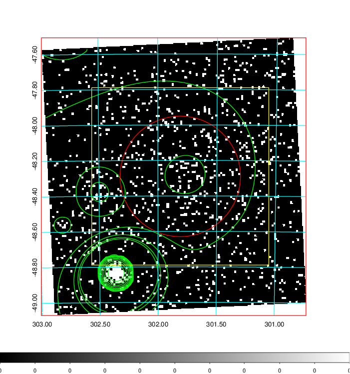
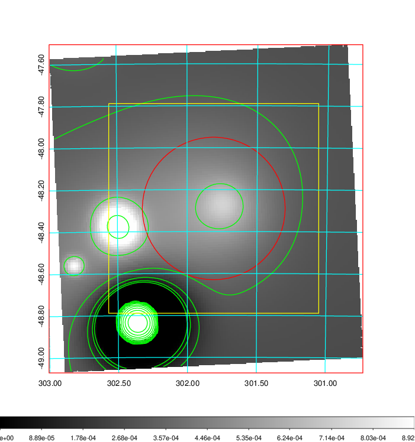
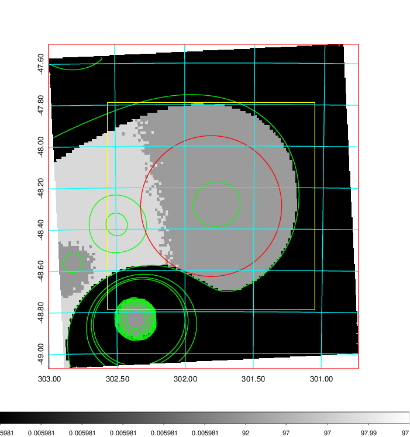
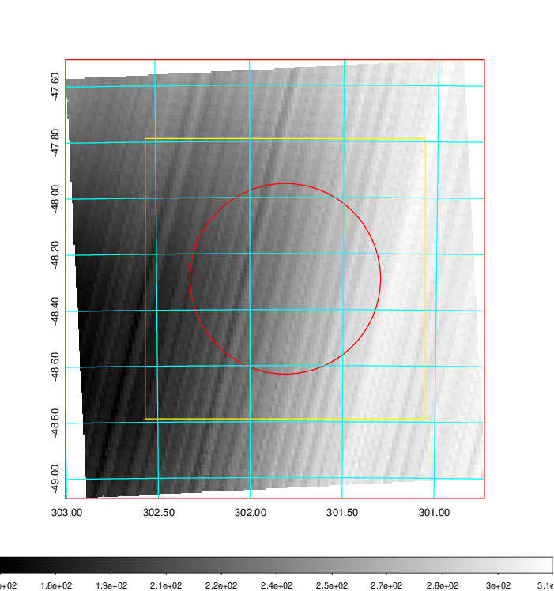
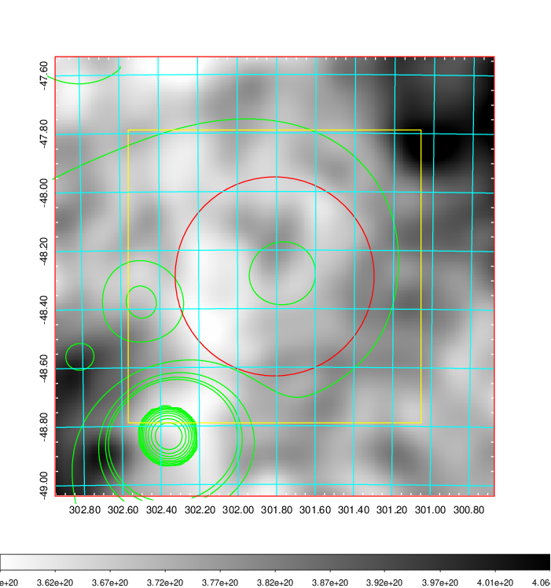
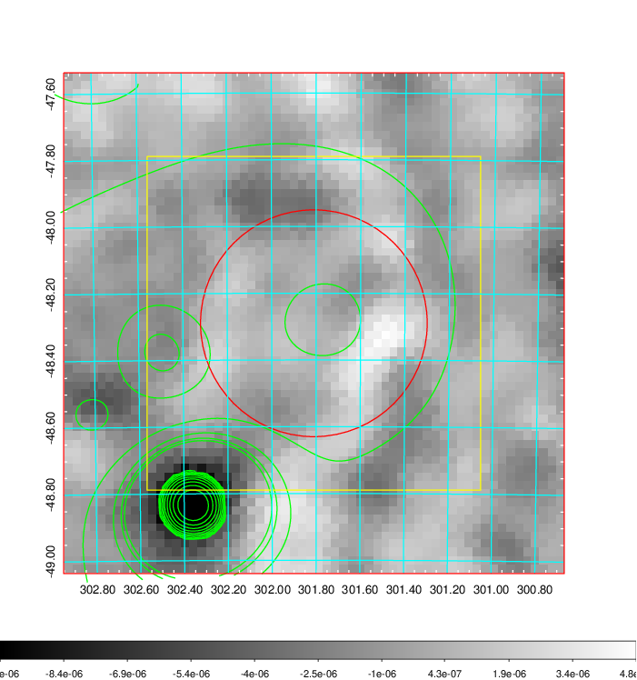
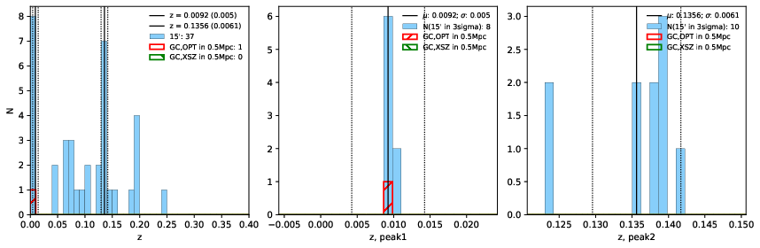
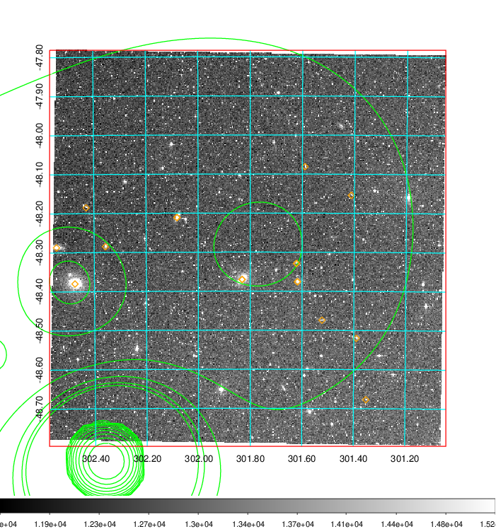
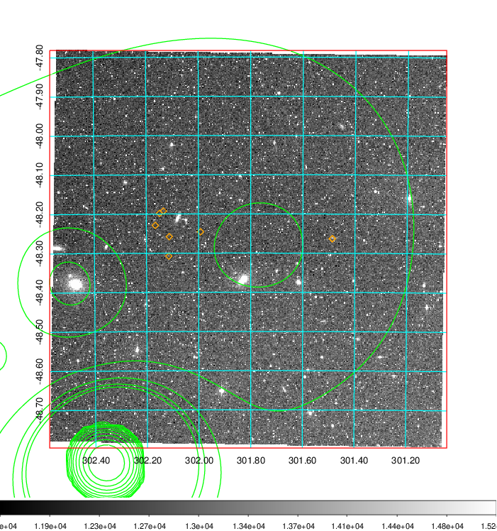
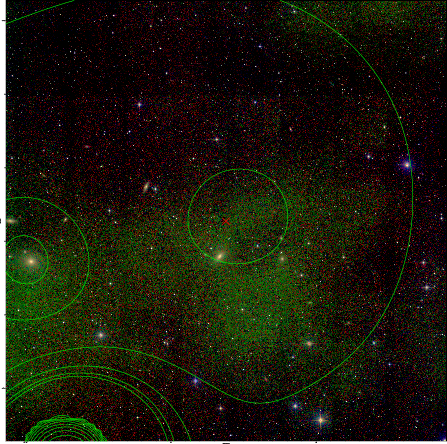

### 813

|Name|RAJ2000[deg]|DEJ2000[deg] |Ext[arcmin]| Ext,ml | z | z_src| C|GC(XSZ,Delta_z<0.01)| GC(OPT,Delta_z<0.01)|GC| R_sig[arcmin] | R500[arcmin] | R500[Mpc]| CRsig[c/s] | CR500[c/s] |L500[1E44 erg/s]|F500[1E-12 erg/s/cm^2]| M500[1E14 Msun]|Tx[keV]|Cnt_sig|Beta|Rc[arcmin]|Comment|Alias|
|---|---|---|---|---|---|------|---|--------|---------|----------|---|---|---|---|---|---|---|---|---|---|---|---|---|---|
|813| 301.810| -48.290| 20.39| 71.58| 0.0092(0.005)| z1, z_opt| S| -| N| N| 27.662| 35.650| 0.404| 0.422(0.109)| 0.444(0.115)| 0.011(0.002)| 5.798(1.083)| 0.19(0.02)| 0.77(0.05)| 192.0| 0.559(-0.045+0.112)| 10.511(-1.780+3.132)| -| t584|

|[RASS image](../image/813/813_img.pdf)|[filtered image](../image/813/813_fil.pdf)|[Segment image](../image/813/813_seg.pdf)|
|-------------------|--------------------|-------------------|
|   |    |   |

|[Exposure image](../image/813/813_mex.pdf)| [nH image](../image/813/813_nh.pdf)| [Planck image](../image/813/813_p.pdf)|
|-------------------|--------------------|-------------------|
|   |     |  |

|[Redshift Histogram](../image/813/813_zg.pdf) | [DSS image(z1)](../image/813/813_dss_z1.pdf)      |  [DSS image(z2)](../image/813/813_dss_z2.pdf)    |
|-------------------|--------------------|-------------------|
| |  Blue circle for optical clusters;  Magenta circle for XSZ clusters;  all with r=1Mpc;  Only GC with Delta_z<0.01 are shown. |  Blue circle for optical clusters;  Magenta circle for XSZ clusters;  all with r=1Mpc;  Only GC with Delta_z<0.01 are shown.  |

|[known Abell/XSZ clusters](../image/813/813_gc.pdf) | [2MASS image](../image/813/813_2mass.pdf)      |
|-------------------|-------------------|
|  Magenta, blue and green circles  for optical, X-ray and SZ clusters  respectively, with redshift of clusters  labelled. The radius of circles  are 1Mpc.|  |

