

### 814

|Name|RAJ2000[deg]|DEJ2000[deg] |Ext[arcmin]| Ext,ml | z | z_src| C|GC(XSZ,Delta_z<0.01)| GC(OPT,Delta_z<0.01)|GC| R_sig[arcmin] | R500[arcmin] | R500[Mpc]| CRsig[c/s] | CR500[c/s] |L500[1E44 erg/s]|F500[1E-12 erg/s/cm^2]| M500[1E14 Msun]|Tx[keV]|Cnt_sig|Beta|Rc[arcmin]|Comment|Alias|
|---|---|---|---|---|---|------|---|--------|---------|----------|---|---|---|---|---|---|---|---|---|---|---|---|---|---|
|814| 302.505| 79.143| 2.52| 65.57| 0.0575(0.005)| z1, z_opt| S| -| W| W| 13.188| 8.952| 0.598| 0.079(0.019)| 0.075(0.018)| 0.092(0.009)| 1.158(0.120)| 0.64(0.03)| 1.66(0.06)| 129.0| 0.941(-0.076+0.043)| 4.406(-0.452+0.372)| -| t095|

|[RASS image](../image/814/814_img.pdf)|[filtered image](../image/814/814_fil.pdf)|[Segment image](../image/814/814_seg.pdf)|
|-------------------|--------------------|-------------------|
| 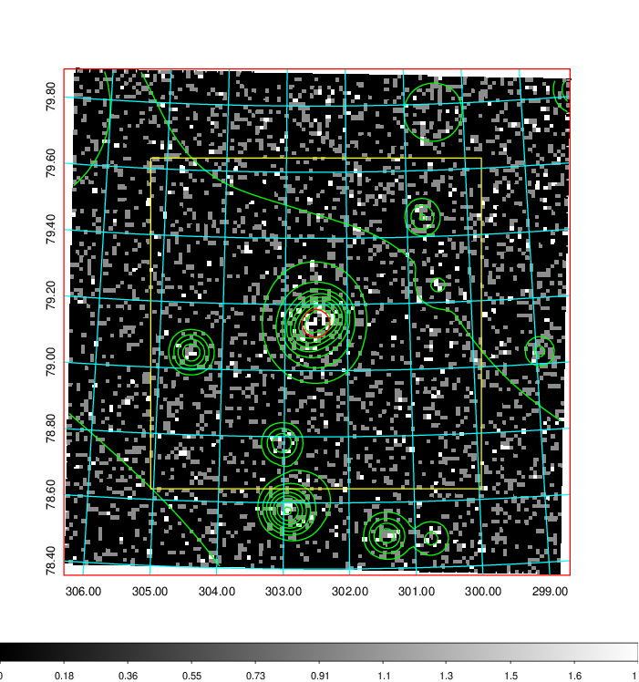  | 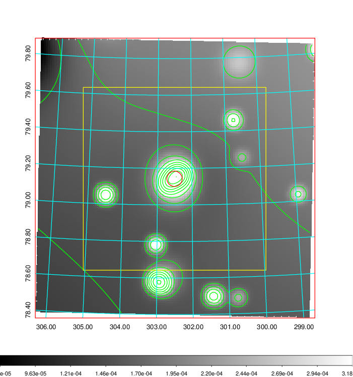   | 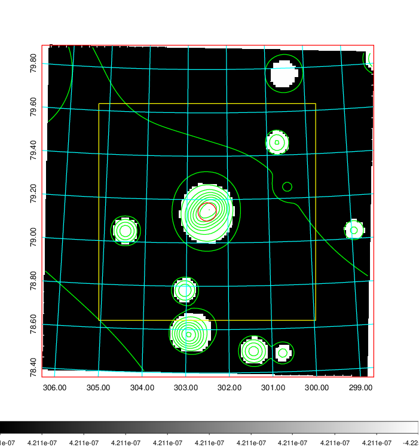  |

|[Exposure image](../image/814/814_mex.pdf)| [nH image](../image/814/814_nh.pdf)| [Planck image](../image/814/814_p.pdf)|
|-------------------|--------------------|-------------------|
|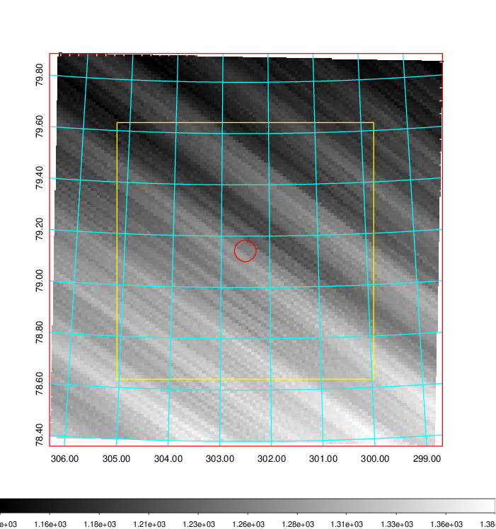   | 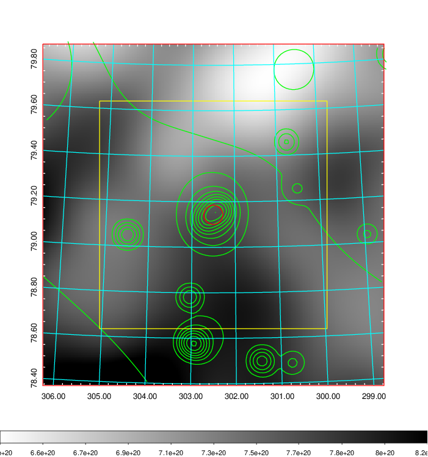    | 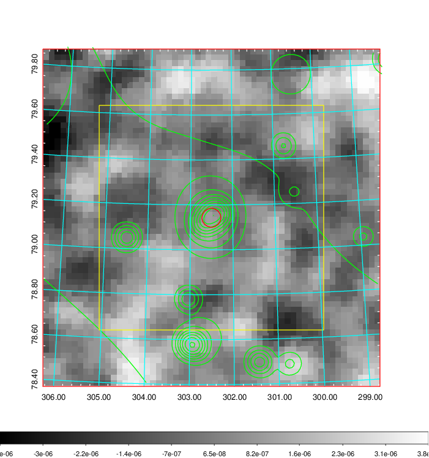 |

|[Redshift Histogram](../image/814/814_zg.pdf) | [DSS image(z1)](../image/814/814_dss_z1.pdf)      |  [DSS image(z2)](../image/814/814_dss_z2.pdf)    |
|-------------------|--------------------|-------------------|
|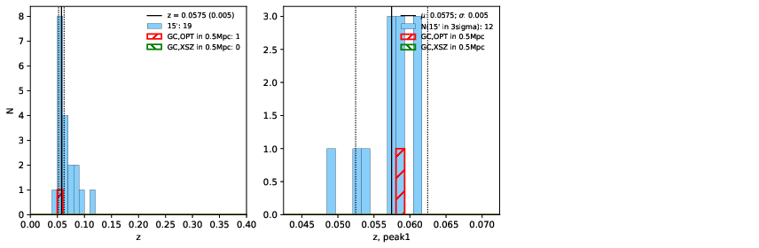 |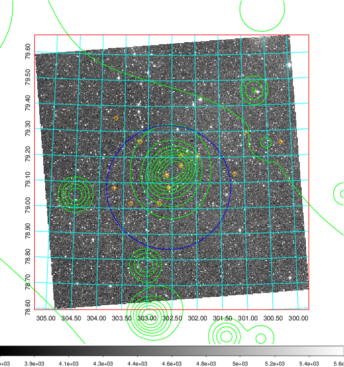  Blue circle for optical clusters;  Magenta circle for XSZ clusters;  all with r=1Mpc;  Only GC with Delta_z<0.01 are shown. | 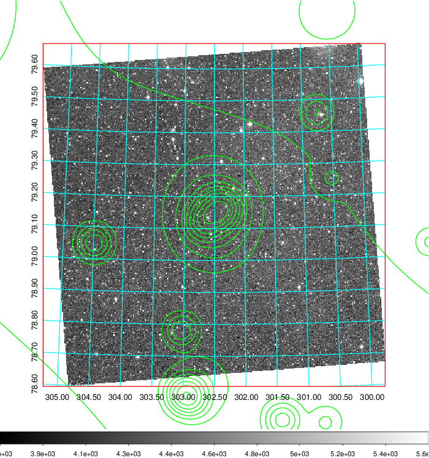 Blue circle for optical clusters;  Magenta circle for XSZ clusters;  all with r=1Mpc;  Only GC with Delta_z<0.01 are shown.  |

|[Previous-identified clusters](../image/814/814_gc.pdf) | [2MASS image](../image/814/814_2mass.pdf)      |
|-------------------|-------------------|
|  Green, magenta, and blue circles  for optical, X-ray and SZ clusters  respectively, with redshift of clusters  labelled. The radius of circles  are 1Mpc.|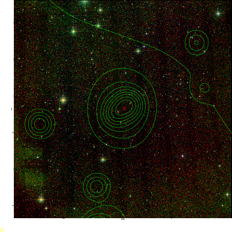  |

|[PS1 image](../image/814/814_ps1.pdf)            |
|-------------------|
| 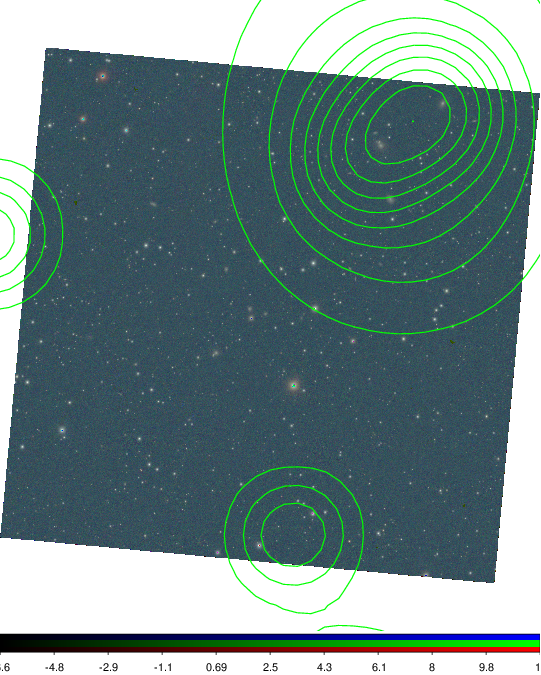  |
