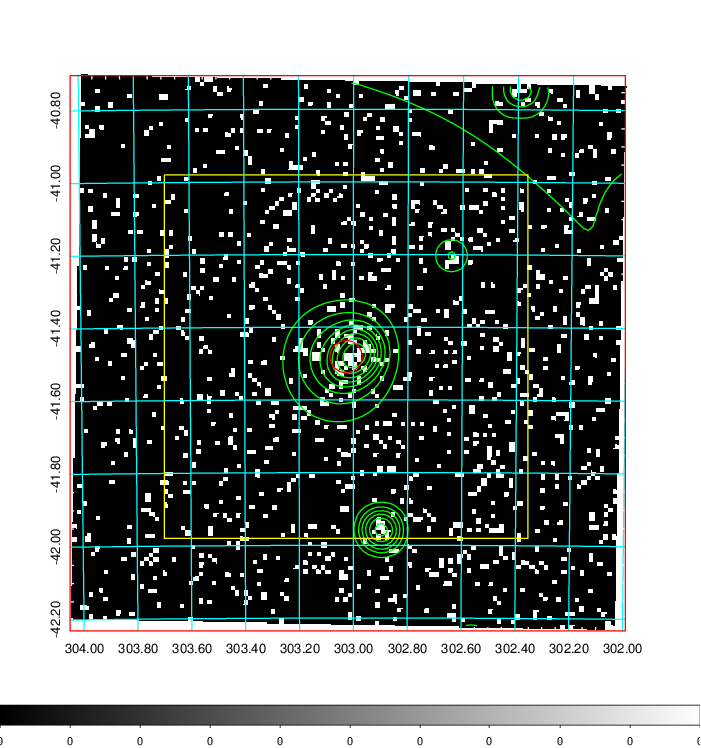
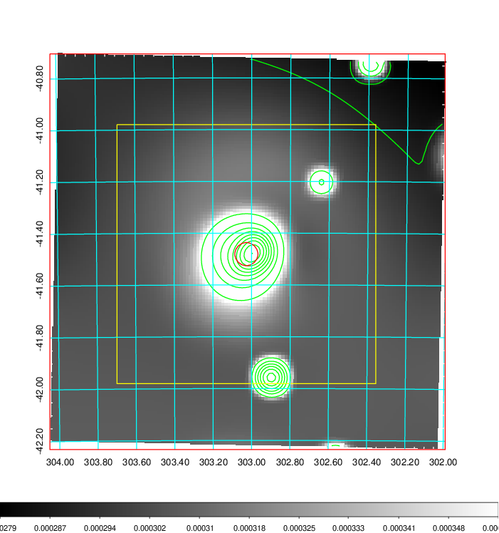
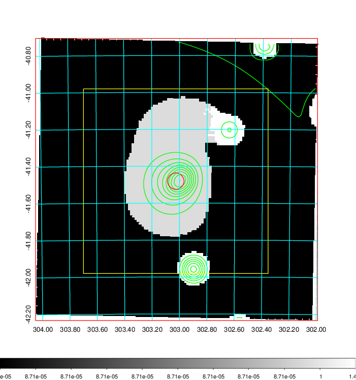
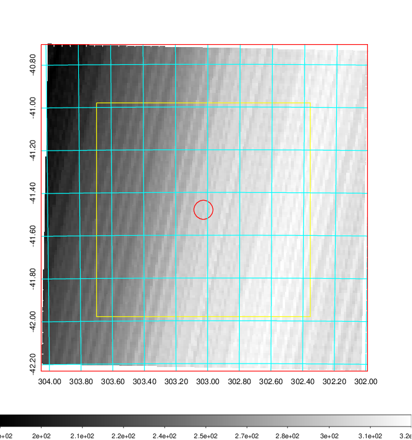
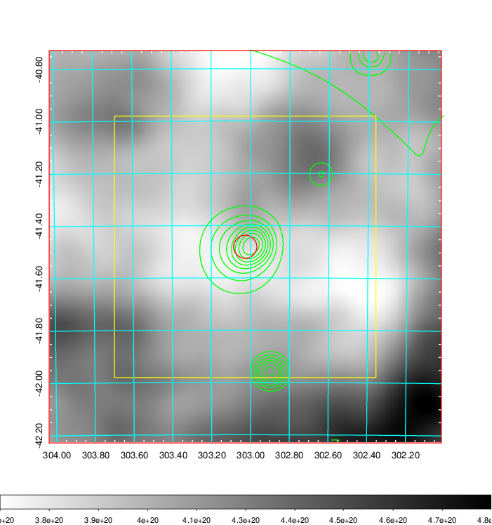
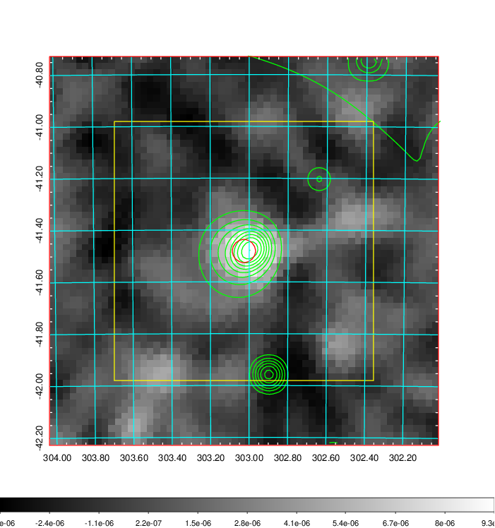
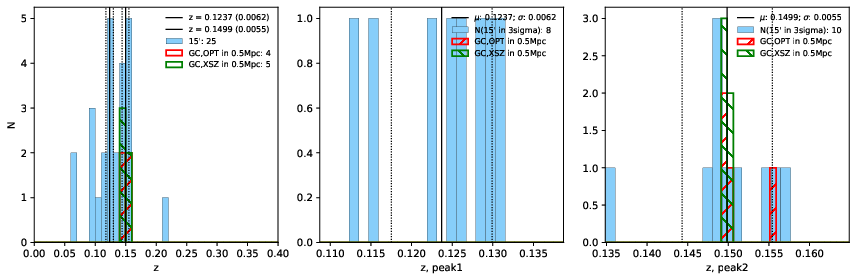
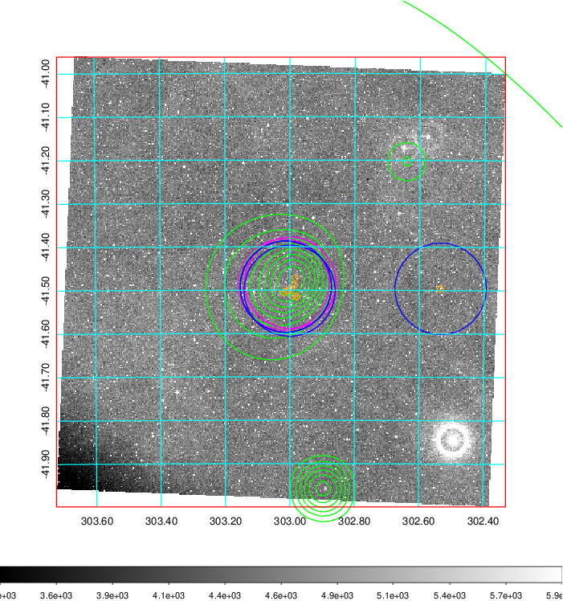
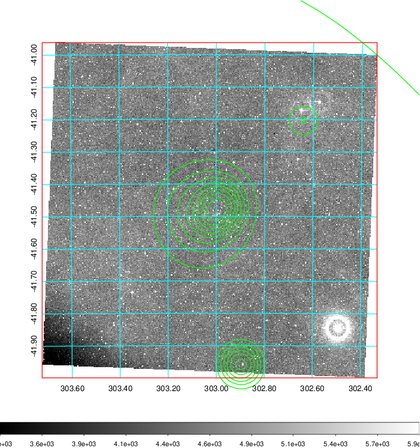
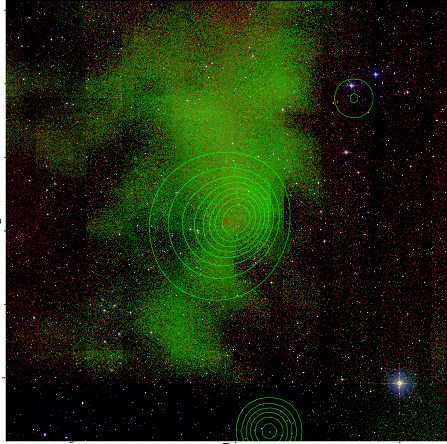

### 815

|Name|RAJ2000[deg]|DEJ2000[deg] |Ext[arcmin]| Ext,ml | z | z_src| C|GC(XSZ,Delta_z<0.01)| GC(OPT,Delta_z<0.01)|GC| R_sig[arcmin] | R500[arcmin] | R500[Mpc]| CRsig[c/s] | CR500[c/s] |L500[1E44 erg/s]|F500[1E-12 erg/s/cm^2]| M500[1E14 Msun]|Tx[keV]|Cnt_sig|Beta|Rc[arcmin]|Comment|Alias|
|---|---|---|---|---|---|------|---|--------|---------|----------|---|---|---|---|---|---|---|---|---|---|---|---|---|---|
|815| 303.027| -41.481| 2.67| 32.91| 0.1499(0.005)| z2, z_xsz| B| B15, MCXC, PSZ2, Tar| A, N, W| A, B15, MCXC, N, PSZ2, Tar, W| 28.650| 7.431| 1.165| 0.366(0.100)| 0.326(0.089)| 3.756(0.717)| 6.182(1.180)| 5.21(0.48)| 6.21(0.36)| 131.1| 0.522(-0.016+0.030)| 2.229(-0.337+0.468)| -| k334|

|[RASS image](../image/815/815_img.pdf)|[filtered image](../image/815/815_fil.pdf)|[Segment image](../image/815/815_seg.pdf)|
|-------------------|--------------------|-------------------|
|   |    |   |

|[Exposure image](../image/815/815_mex.pdf)| [nH image](../image/815/815_nh.pdf)| [Planck image](../image/815/815_p.pdf)|
|-------------------|--------------------|-------------------|
|   |     |  |

|[Redshift Histogram](../image/815/815_zg.pdf) | [DSS image(z1)](../image/815/815_dss_z1.pdf)      |  [DSS image(z2)](../image/815/815_dss_z2.pdf)    |
|-------------------|--------------------|-------------------|
| |  Blue circle for optical clusters;  Magenta circle for XSZ clusters;  all with r=1Mpc;  Only GC with Delta_z<0.01 are shown. |  Blue circle for optical clusters;  Magenta circle for XSZ clusters;  all with r=1Mpc;  Only GC with Delta_z<0.01 are shown.  |

|[known Abell/XSZ clusters](../image/815/815_gc.pdf) | [2MASS image](../image/815/815_2mass.pdf)      |
|-------------------|-------------------|
|  Magenta, blue and green circles  for optical, X-ray and SZ clusters  respectively, with redshift of clusters  labelled. The radius of circles  are 1Mpc.|  |

