

### 816

|Name|RAJ2000[deg]|DEJ2000[deg] |Ext[arcmin]| Ext,ml | z | z_src| C|GC(XSZ,Delta_z<0.01)| GC(OPT,Delta_z<0.01)|GC| R_sig[arcmin] | R500[arcmin] | R500[Mpc]| CRsig[c/s] | CR500[c/s] |L500[1E44 erg/s]|F500[1E-12 erg/s/cm^2]| M500[1E14 Msun]|Tx[keV]|Cnt_sig|Beta|Rc[arcmin]|Comment|Alias|
|---|---|---|---|---|---|------|---|--------|---------|----------|---|---|---|---|---|---|---|---|---|---|---|---|---|---|
|816| 303.089| -56.809| 5.80| 936.08| 0.0550(0.005)| z1, z_xsz| B| B15, MCXC, PSZ2, Tar, XB| A, N| A, B15, MCXC, N, PSZ2, Tar, W, XB| 36.640| 19.637| 1.259| 3.296(0.209)| 3.062(0.195)| 4.128(0.101)| 57.295(1.397)| 5.99(0.07)| 6.57(0.05)| 598.1| 0.733(-0.026+0.029)| 7.601(-0.492+0.534)| -| k535|

|[RASS image](../image/816/816_img.pdf)|[filtered image](../image/816/816_fil.pdf)|[Segment image](../image/816/816_seg.pdf)|
|-------------------|--------------------|-------------------|
| 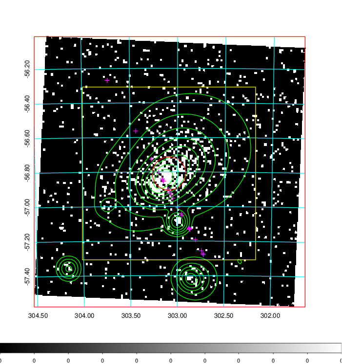  | 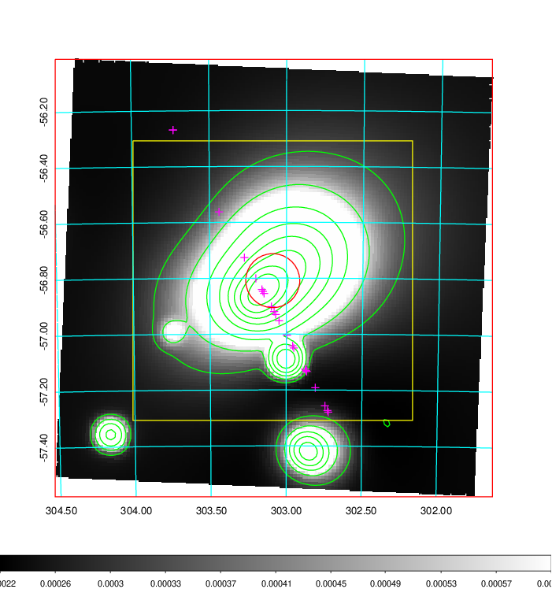   | 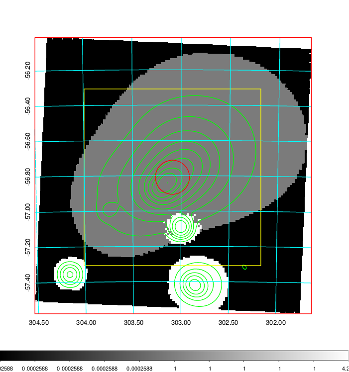  |

|[Exposure image](../image/816/816_mex.pdf)| [nH image](../image/816/816_nh.pdf)| [Planck image](../image/816/816_p.pdf)|
|-------------------|--------------------|-------------------|
|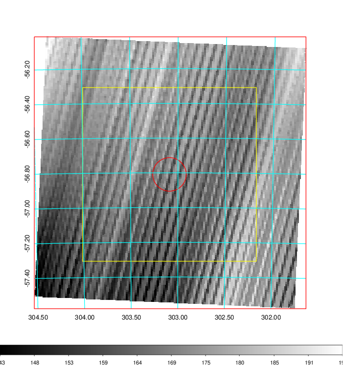   | 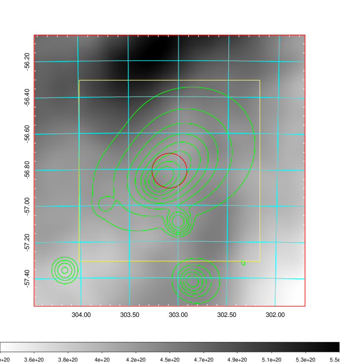    | 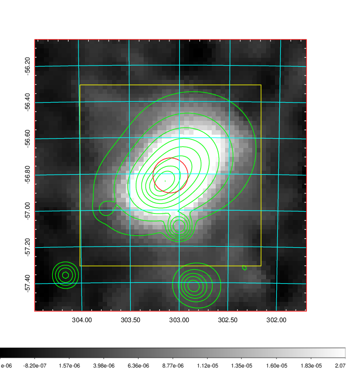 |

|[Redshift Histogram](../image/816/816_zg.pdf) | [DSS image(z1)](../image/816/816_dss_z1.pdf)      |  [DSS image(z2)](../image/816/816_dss_z2.pdf)    |
|-------------------|--------------------|-------------------|
|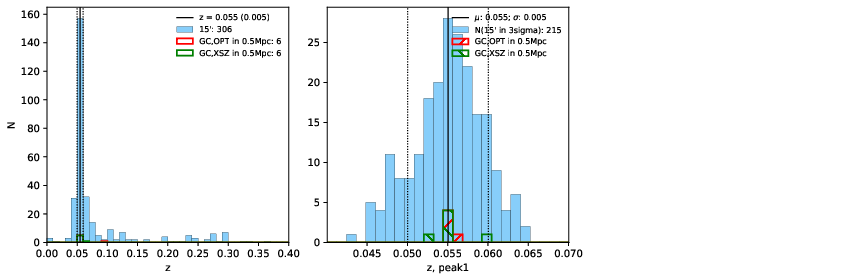 |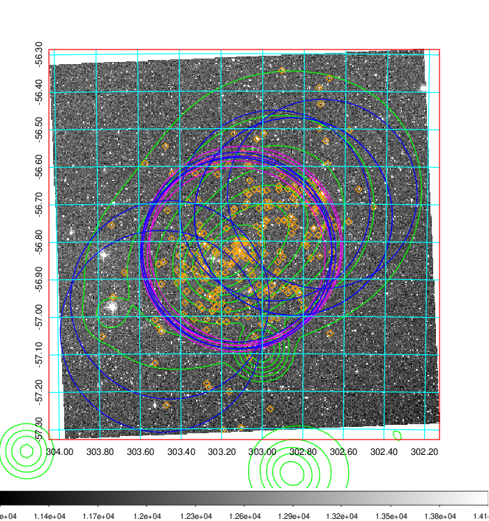  Blue circle for optical clusters;  Magenta circle for XSZ clusters;  all with r=1Mpc;  Only GC with Delta_z<0.01 are shown. | 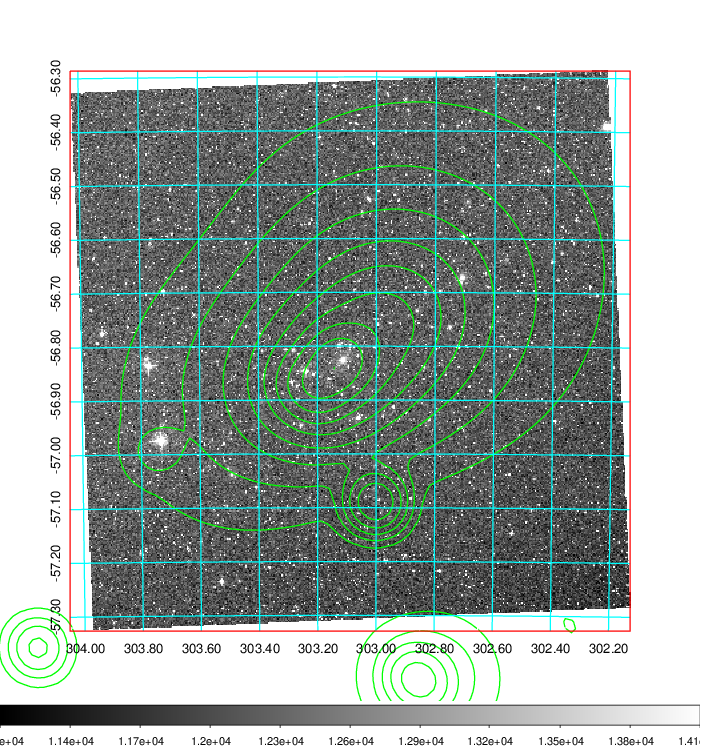 Blue circle for optical clusters;  Magenta circle for XSZ clusters;  all with r=1Mpc;  Only GC with Delta_z<0.01 are shown.  |

|[Previous-identified clusters](../image/816/816_gc.pdf) | [2MASS image](../image/816/816_2mass.pdf)      |
|-------------------|-------------------|
|  Green, magenta, and blue circles  for optical, X-ray and SZ clusters  respectively, with redshift of clusters  labelled. The radius of circles  are 1Mpc.|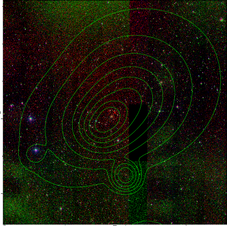  |

|[DES image](../image/816/816_des.pdf)   |
|-------------------|
| 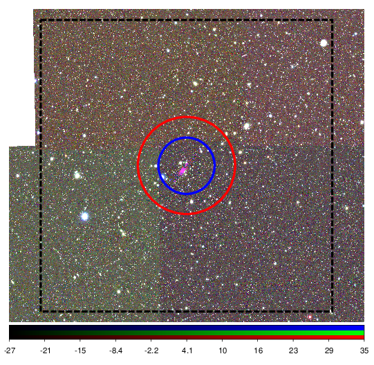  |
