

### 817

|Name|RAJ2000[deg]|DEJ2000[deg] |Ext[arcmin]| Ext,ml | z | z_src| C|GC(XSZ,Delta_z<0.01)| GC(OPT,Delta_z<0.01)|GC| R_sig[arcmin] | R500[arcmin] | R500[Mpc]| CRsig[c/s] | CR500[c/s] |L500[1E44 erg/s]|F500[1E-12 erg/s/cm^2]| M500[1E14 Msun]|Tx[keV]|Cnt_sig|Beta|Rc[arcmin]|Comment|Alias|
|---|---|---|---|---|---|------|---|--------|---------|----------|---|---|---|---|---|---|---|---|---|---|---|---|---|---|
|817| 303.642| -8.458| 3.88| 50.01| 0.0750(0.007)| z1,| G| -| -| Tar, W| 27.662| 9.186| 0.785| 0.200(0.058)| 0.180(0.052)| 0.445(0.084)| 3.226(0.609)| 1.48(0.14)| 2.79(0.17)| 198.5| 0.685(-0.112+0.176)| 3.281(-1.138+1.383)| An SZ cluster with  no $z$ and offset = 0.05 Mpc| t186|

|[RASS image](../image/817/817_img.pdf)|[filtered image](../image/817/817_fil.pdf)|[Segment image](../image/817/817_seg.pdf)|
|-------------------|--------------------|-------------------|
| 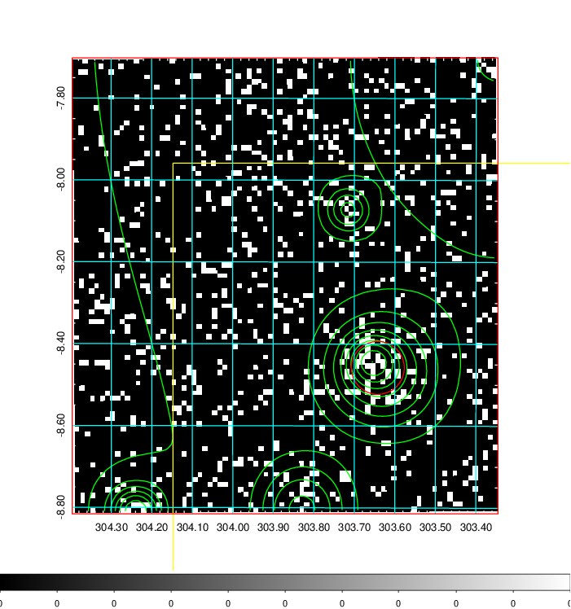  | 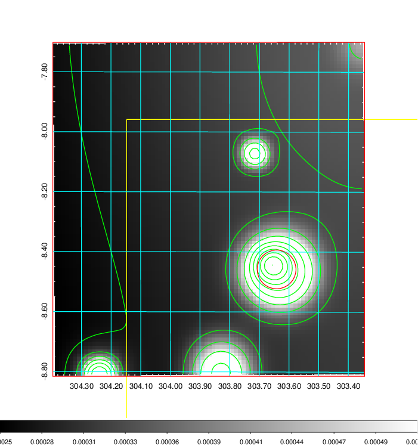   | 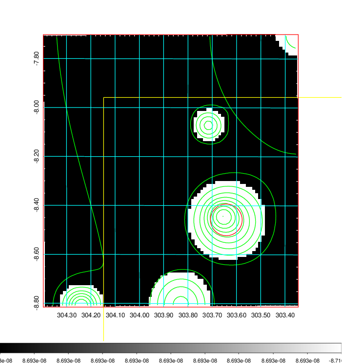  |

|[Exposure image](../image/817/817_mex.pdf)| [nH image](../image/817/817_nh.pdf)| [Planck image](../image/817/817_p.pdf)|
|-------------------|--------------------|-------------------|
|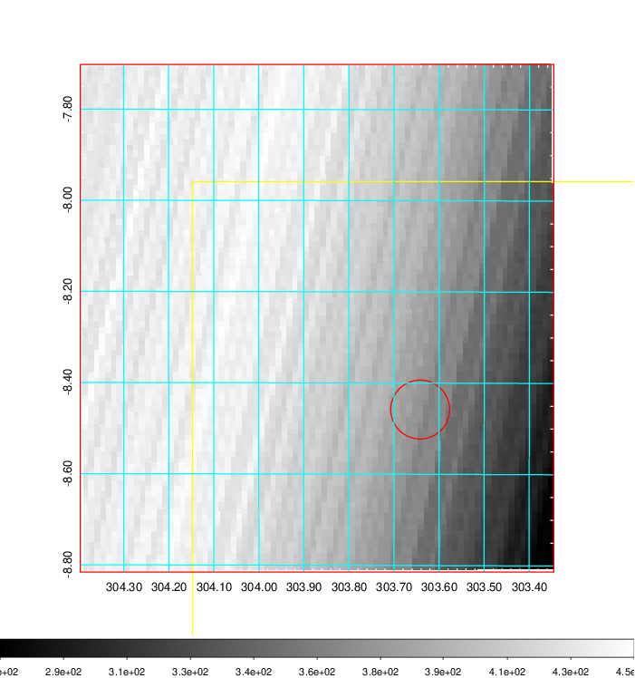   | 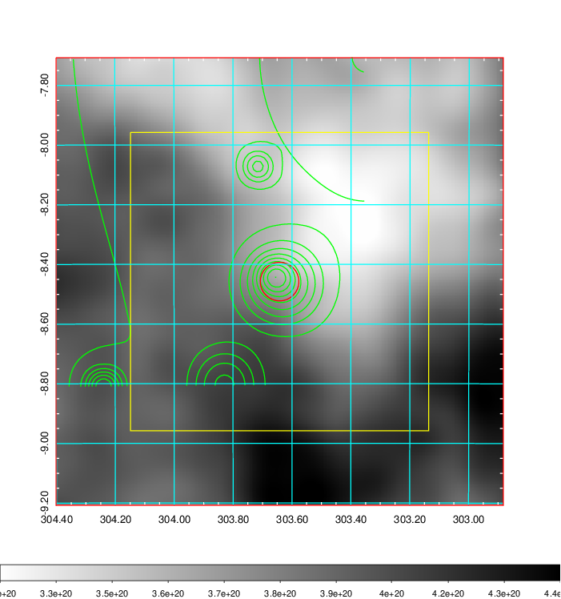    | 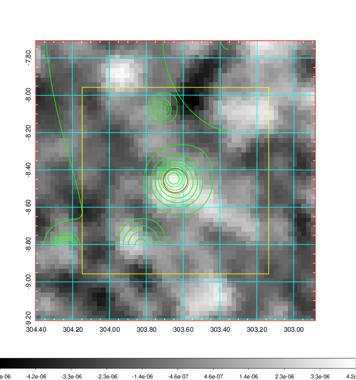 |

|[Redshift Histogram](../image/817/817_zg.pdf) | [DSS image(z1)](../image/817/817_dss_z1.pdf)      |  [DSS image(z2)](../image/817/817_dss_z2.pdf)    |
|-------------------|--------------------|-------------------|
|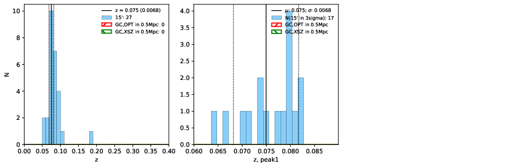 |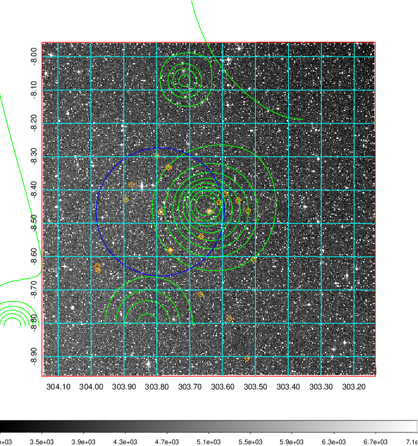  Blue circle for optical clusters;  Magenta circle for XSZ clusters;  all with r=1Mpc;  Only GC with Delta_z<0.01 are shown. | 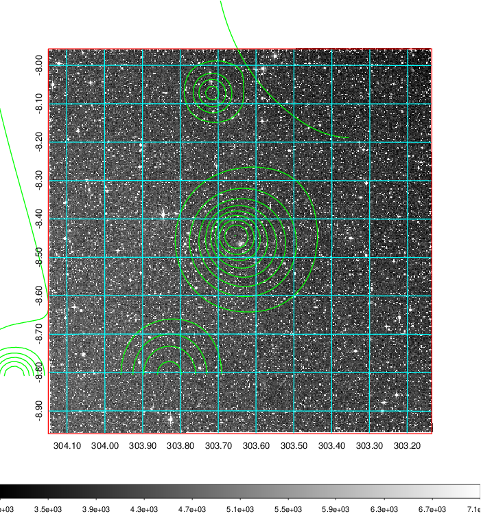 Blue circle for optical clusters;  Magenta circle for XSZ clusters;  all with r=1Mpc;  Only GC with Delta_z<0.01 are shown.  |

|[Previous-identified clusters](../image/817/817_gc.pdf) | [2MASS image](../image/817/817_2mass.pdf)      |
|-------------------|-------------------|
|  Green, magenta, and blue circles  for optical, X-ray and SZ clusters  respectively, with redshift of clusters  labelled. The radius of circles  are 1Mpc.|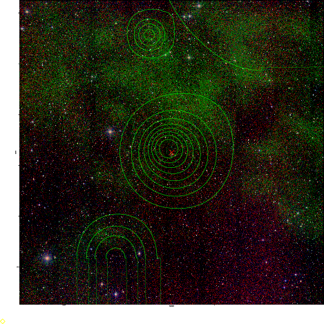  |

|[PS1 image](../image/817/817_ps1.pdf)            |
|-------------------|
| 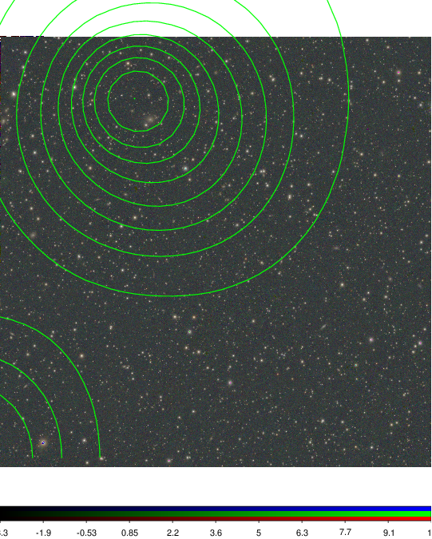  |
