

### 818

|Name|RAJ2000[deg]|DEJ2000[deg] |Ext[arcmin]| Ext,ml | z | z_src| C|GC(XSZ,Delta_z<0.01)| GC(OPT,Delta_z<0.01)|GC| R_sig[arcmin] | R500[arcmin] | R500[Mpc]| CRsig[c/s] | CR500[c/s] |L500[1E44 erg/s]|F500[1E-12 erg/s/cm^2]| M500[1E14 Msun]|Tx[keV]|Cnt_sig|Beta|Rc[arcmin]|Comment|Alias|
|---|---|---|---|---|---|------|---|--------|---------|----------|---|---|---|---|---|---|---|---|---|---|---|---|---|---|
|818| 303.709| -24.507| 1.12| 33.82| 0.1549(0.005)| z1, z_xsz| B| MCXC, PSZ2, Tar| N, W| MCXC, N, PSZ2, Tar, W, XCS| 4.412| 8.602| 1.386| 0.536(0.087)| 0.636(0.102)| 7.550(0.396)| 11.563(0.606)| 8.81(0.22)| 8.61(0.14)| 70.4| 0.933(-0.084+0.049)| 2.667(-0.376+0.304)| -| k046|

|[RASS image](../image/818/818_img.pdf)|[filtered image](../image/818/818_fil.pdf)|[Segment image](../image/818/818_seg.pdf)|
|-------------------|--------------------|-------------------|
| 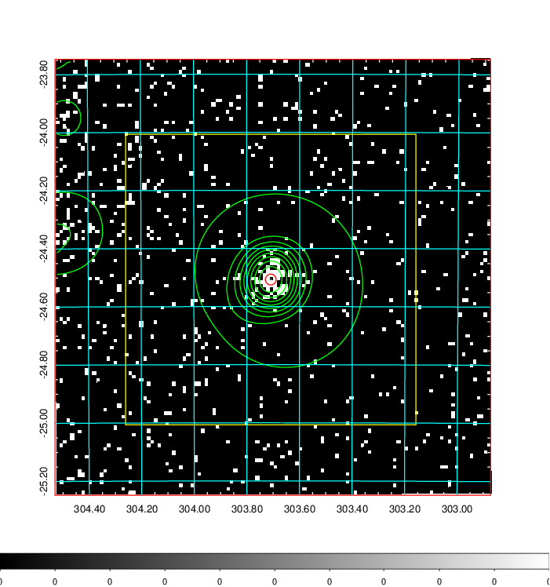  | 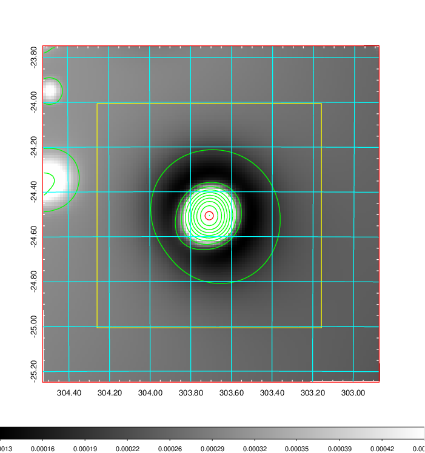   | 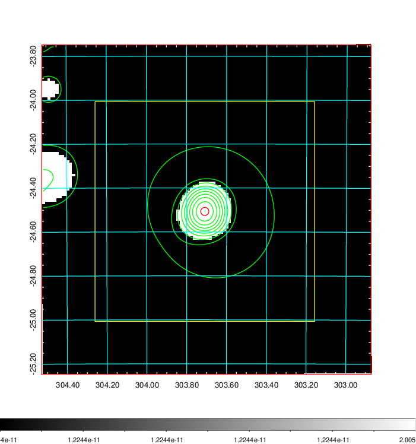  |

|[Exposure image](../image/818/818_mex.pdf)| [nH image](../image/818/818_nh.pdf)| [Planck image](../image/818/818_p.pdf)|
|-------------------|--------------------|-------------------|
|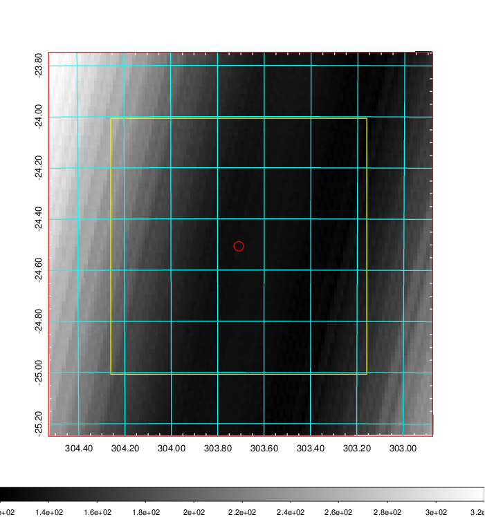   | 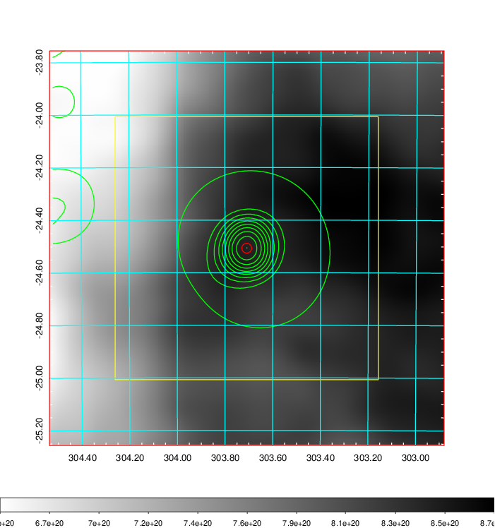    | 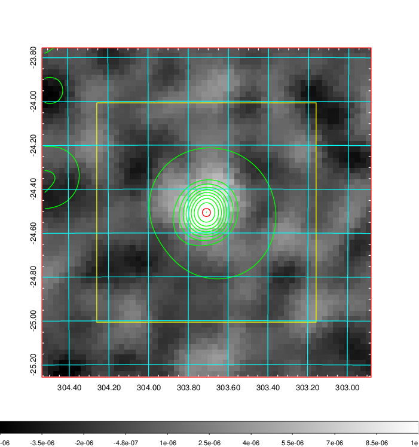 |

|[Redshift Histogram](../image/818/818_zg.pdf) | [DSS image(z1)](../image/818/818_dss_z1.pdf)      |  [DSS image(z2)](../image/818/818_dss_z2.pdf)    |
|-------------------|--------------------|-------------------|
|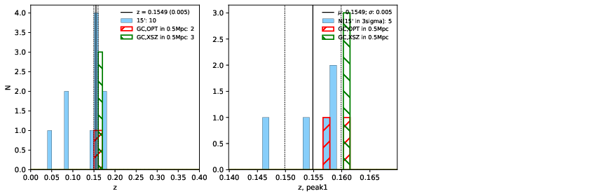 |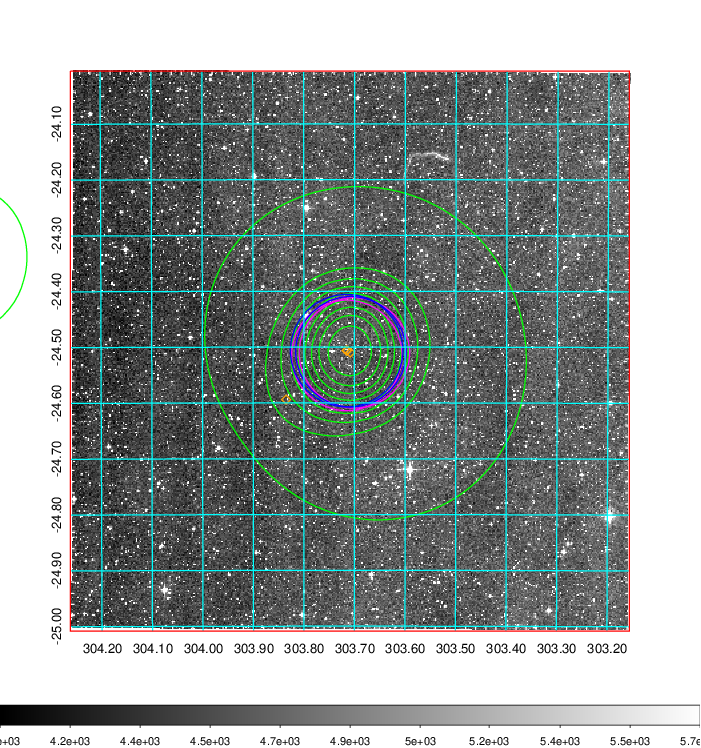  Blue circle for optical clusters;  Magenta circle for XSZ clusters;  all with r=1Mpc;  Only GC with Delta_z<0.01 are shown. | 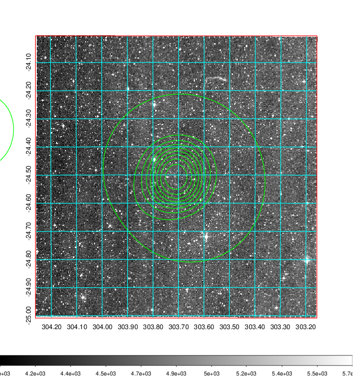 Blue circle for optical clusters;  Magenta circle for XSZ clusters;  all with r=1Mpc;  Only GC with Delta_z<0.01 are shown.  |

|[Previous-identified clusters](../image/818/818_gc.pdf) | [2MASS image](../image/818/818_2mass.pdf)      |
|-------------------|-------------------|
|  Green, magenta, and blue circles  for optical, X-ray and SZ clusters  respectively, with redshift of clusters  labelled. The radius of circles  are 1Mpc.|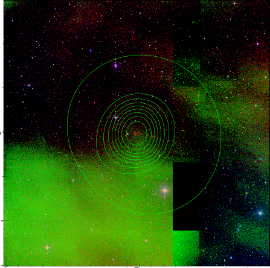  |

|[PS1 image](../image/818/818_ps1.pdf)            |
|-------------------|
| 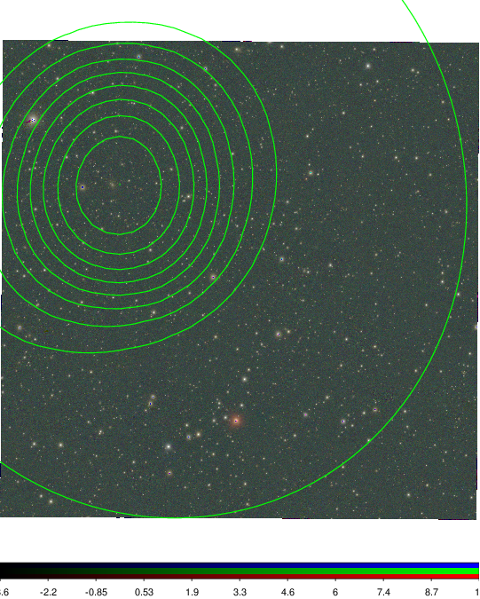  |
