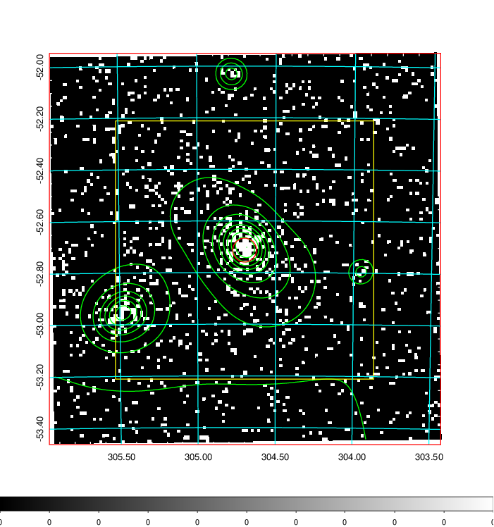
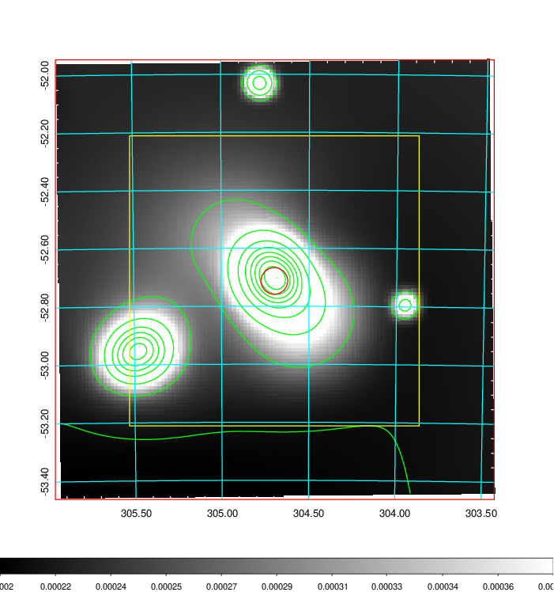
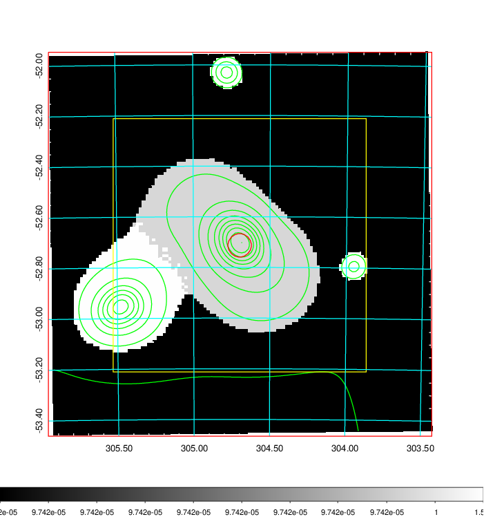
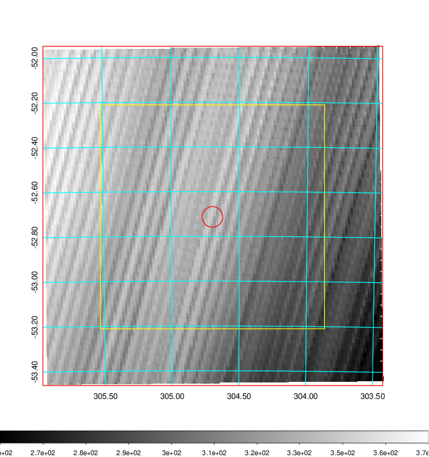
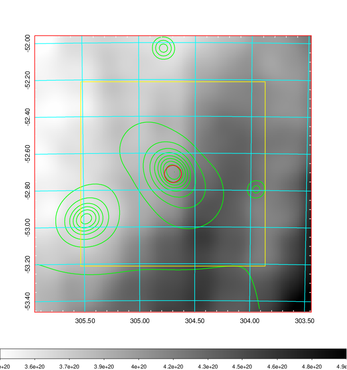
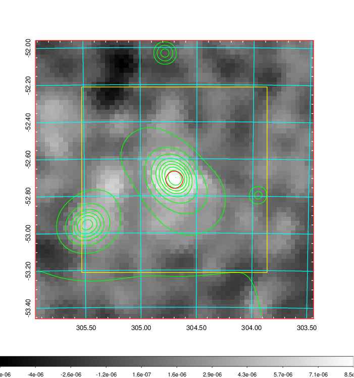
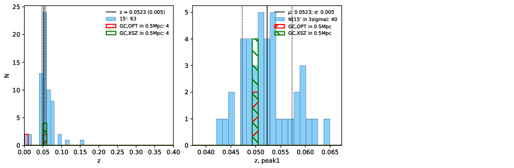
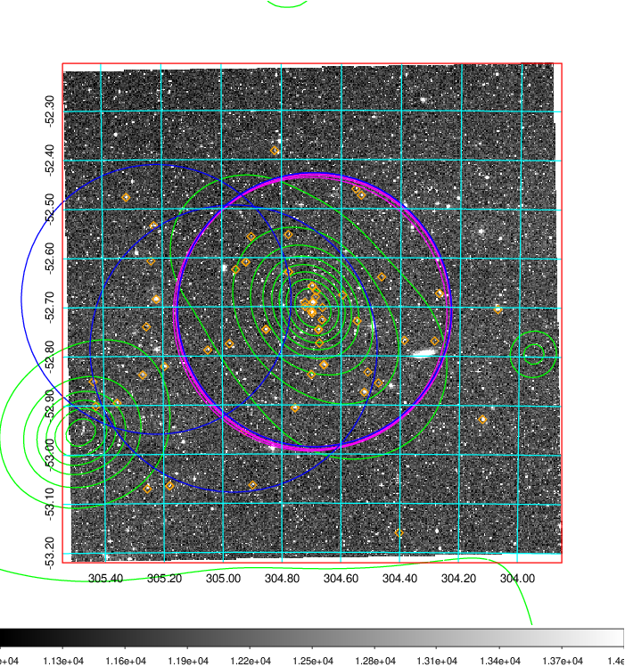
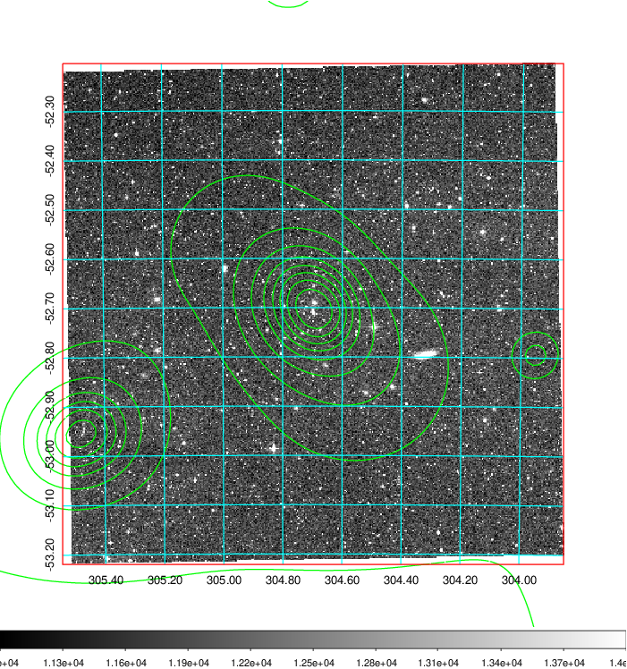
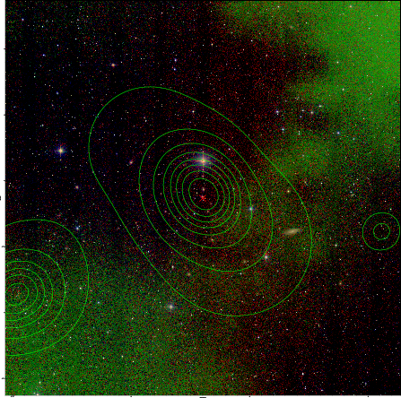

### 819

|Name|RAJ2000[deg]|DEJ2000[deg] |Ext[arcmin]| Ext,ml | z | z_src| C|GC(XSZ,Delta_z<0.01)| GC(OPT,Delta_z<0.01)|GC| R_sig[arcmin] | R500[arcmin] | R500[Mpc]| CRsig[c/s] | CR500[c/s] |L500[1E44 erg/s]|F500[1E-12 erg/s/cm^2]| M500[1E14 Msun]|Tx[keV]|Cnt_sig|Beta|Rc[arcmin]|Comment|Alias|
|---|---|---|---|---|---|------|---|--------|---------|----------|---|---|---|---|---|---|---|---|---|---|---|---|---|---|
|819| 304.698| -52.713| 2.78| 127.02| 0.0523(0.005)| z1, z_xsz| B| MCXC, PSZ2, Tar| A| A, MCXC, N, PSZ2, Tar| 23.712| 14.570| 0.891| 0.705(0.089)| 0.662(0.084)| 0.777(0.055)| 11.978(0.848)| 2.12(0.08)| 3.46(0.08)| 236.8| 0.546(-0.022+0.026)| 2.657(-0.390+0.434)| -| k350|

|[RASS image](../image/819/819_img.pdf)|[filtered image](../image/819/819_fil.pdf)|[Segment image](../image/819/819_seg.pdf)|
|-------------------|--------------------|-------------------|
|   |    |   |

|[Exposure image](../image/819/819_mex.pdf)| [nH image](../image/819/819_nh.pdf)| [Planck image](../image/819/819_p.pdf)|
|-------------------|--------------------|-------------------|
|   |     |  |

|[Redshift Histogram](../image/819/819_zg.pdf) | [DSS image(z1)](../image/819/819_dss_z1.pdf)      |  [DSS image(z2)](../image/819/819_dss_z2.pdf)    |
|-------------------|--------------------|-------------------|
| |  Blue circle for optical clusters;  Magenta circle for XSZ clusters;  all with r=1Mpc;  Only GC with Delta_z<0.01 are shown. |  Blue circle for optical clusters;  Magenta circle for XSZ clusters;  all with r=1Mpc;  Only GC with Delta_z<0.01 are shown.  |

|[known Abell/XSZ clusters](../image/819/819_gc.pdf) | [2MASS image](../image/819/819_2mass.pdf)      |
|-------------------|-------------------|
|  Magenta, blue and green circles  for optical, X-ray and SZ clusters  respectively, with redshift of clusters  labelled. The radius of circles  are 1Mpc.|  |

|[DES image](../image/819/819_des.pdf)   |
|-------------------|
|   |
