

### 82

|Name|RAJ2000[deg]|DEJ2000[deg] |Ext[arcmin]| Ext,ml | z | z_src| C|GC(XSZ,Delta_z<0.01)| GC(OPT,Delta_z<0.01)|GC| R_sig[arcmin] | R500[arcmin] | R500[Mpc]| CRsig[c/s] | CR500[c/s] |L500[1E44 erg/s]|F500[1E-12 erg/s/cm^2]| M500[1E14 Msun]|Tx[keV]|Cnt_sig|Beta|Rc[arcmin]|Comment|Alias|
|---|---|---|---|---|---|------|---|--------|---------|----------|---|---|---|---|---|---|---|---|---|---|---|---|---|---|
|82| 26.147| 5.804| 3.40| 33.84| 0.0731(0.006)| z1, z_xsz| B| F20, L03, SPI| A, W| A, F20, L03, N, SPI, W| 28.156| 10.077| 0.841| 0.288(0.060)| 0.260(0.054)| 0.607(0.114)| 4.651(0.876)| 1.81(0.17)| 3.16(0.19)| 129.4| 0.516(-0.012+0.026)| 4.150(-0.458+0.633)| -| t157|

|[RASS image](../image/82/82_img.pdf)|[filtered image](../image/82/82_fil.pdf)|[Segment image](../image/82/82_seg.pdf)|
|-------------------|--------------------|-------------------|
| 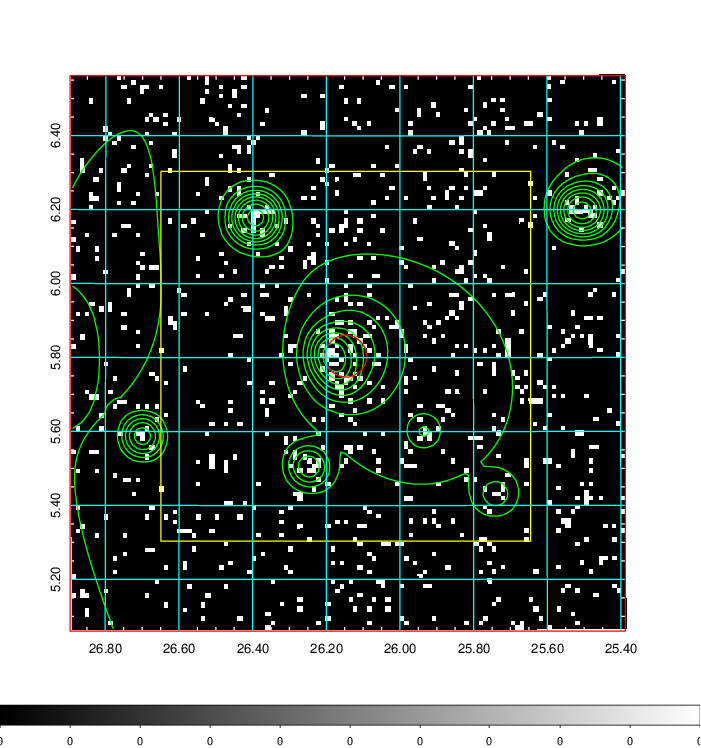  | 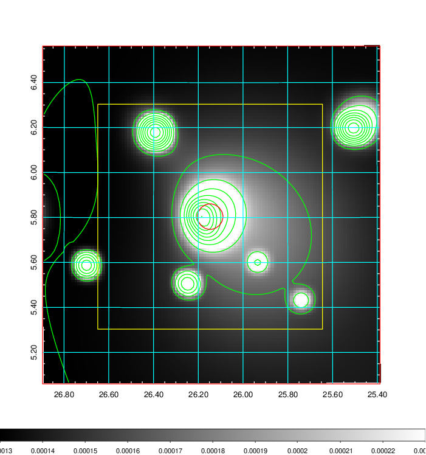   | 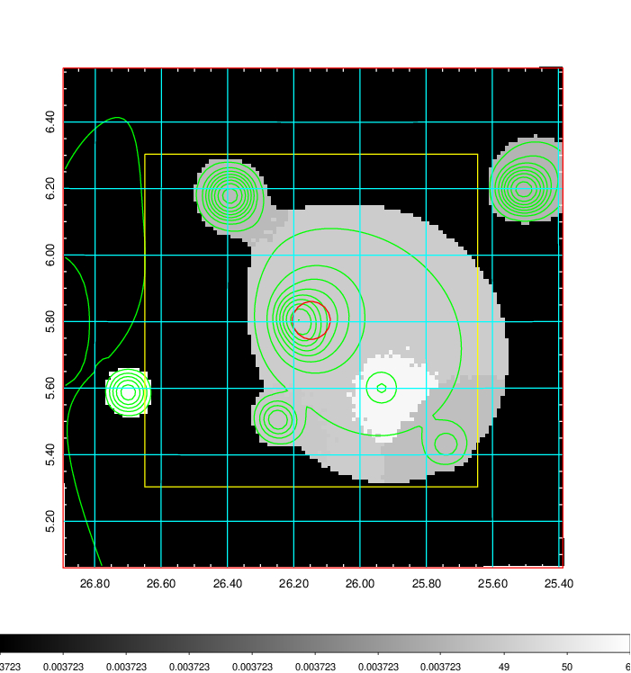  |

|[Exposure image](../image/82/82_mex.pdf)| [nH image](../image/82/82_nh.pdf)| [Planck image](../image/82/82_p.pdf)|
|-------------------|--------------------|-------------------|
|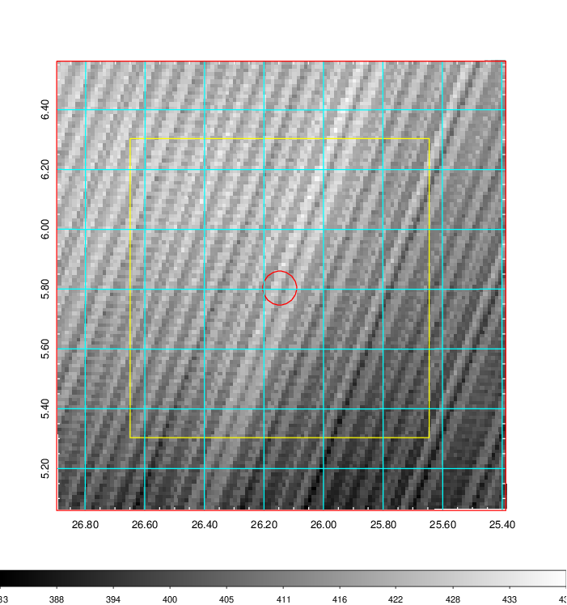   | 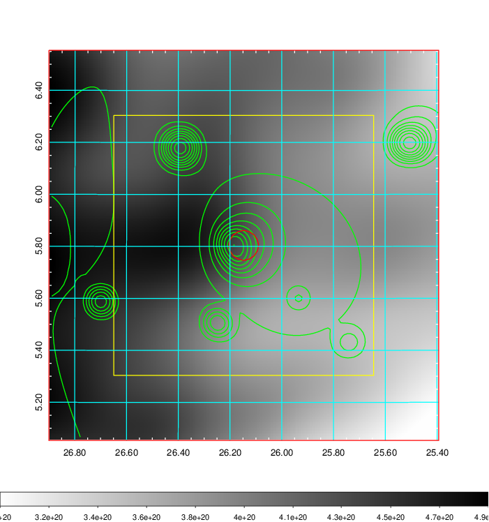    | 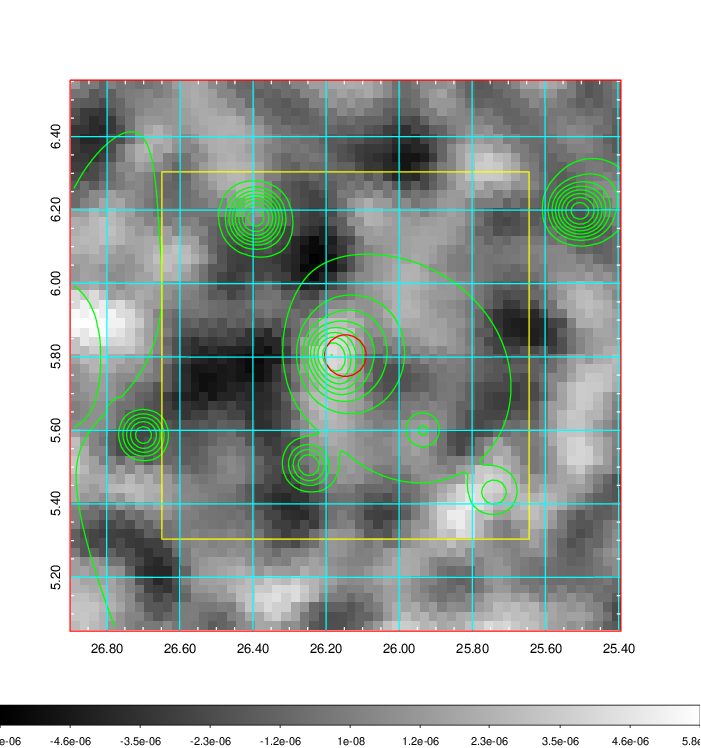 |

|[Redshift Histogram](../image/82/82_zg.pdf) | [DSS image(z1)](../image/82/82_dss_z1.pdf)      |  [DSS image(z2)](../image/82/82_dss_z2.pdf)    |
|-------------------|--------------------|-------------------|
|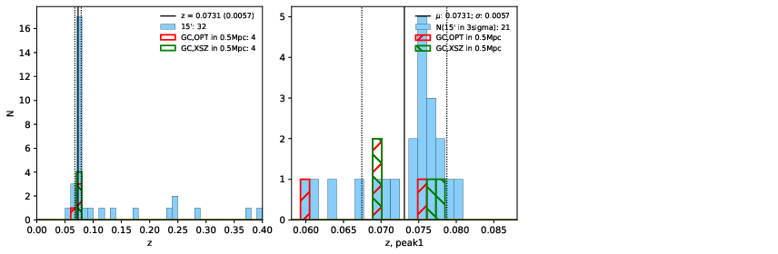 |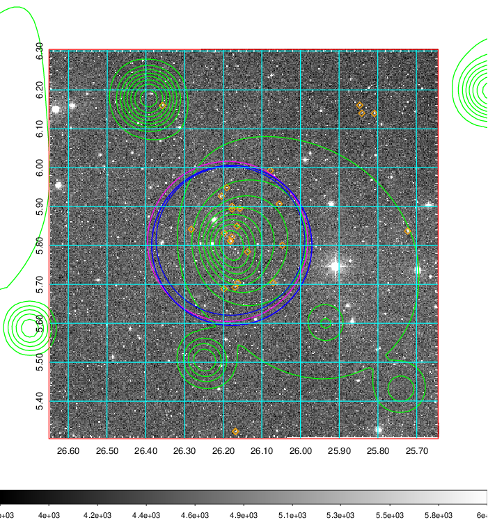  Blue circle for optical clusters;  Magenta circle for XSZ clusters;  all with r=1Mpc;  Only GC with Delta_z<0.01 are shown. | 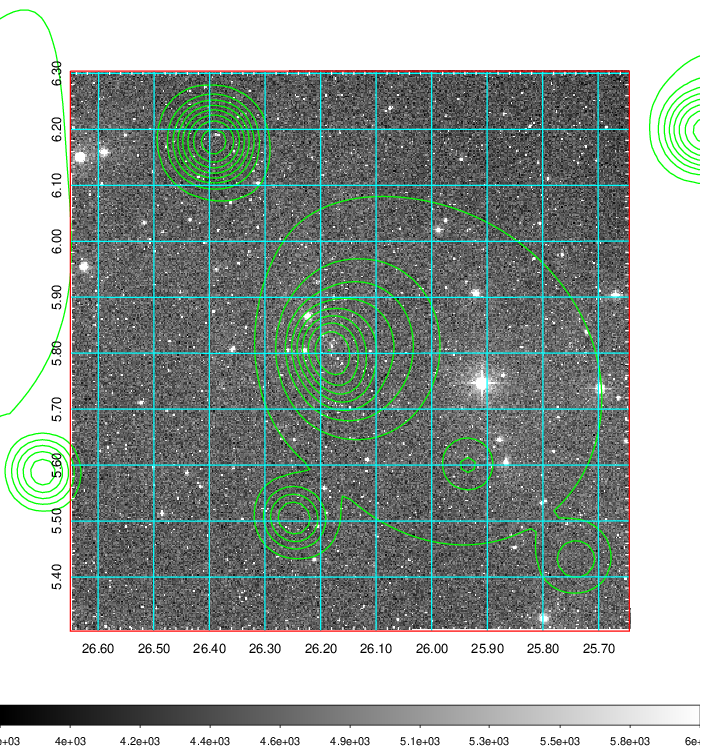 Blue circle for optical clusters;  Magenta circle for XSZ clusters;  all with r=1Mpc;  Only GC with Delta_z<0.01 are shown.  |

|[known Abell/XSZ clusters](../image/82/82_gc.pdf) | [2MASS image](../image/82/82_2mass.pdf)      |[SDSS image](../image/82/82_sdss.pdf)   |
|-------------------|-------------------|-------------------|
|  Magenta, blue and green circles  for optical, X-ray and SZ clusters  respectively, with redshift of clusters  labelled. The radius of circles  are 1Mpc.|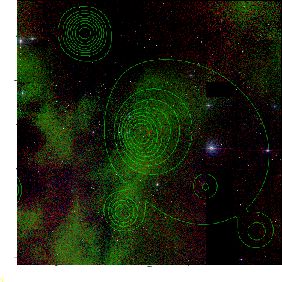  | 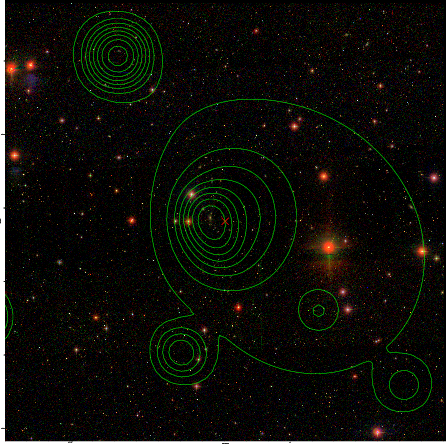  |

