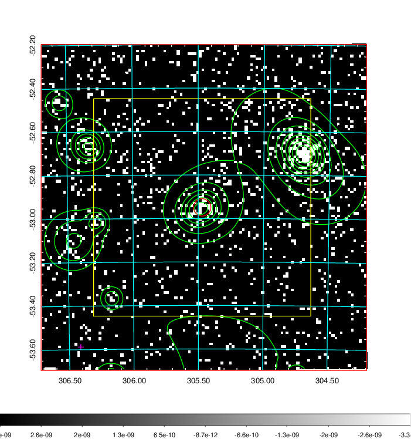
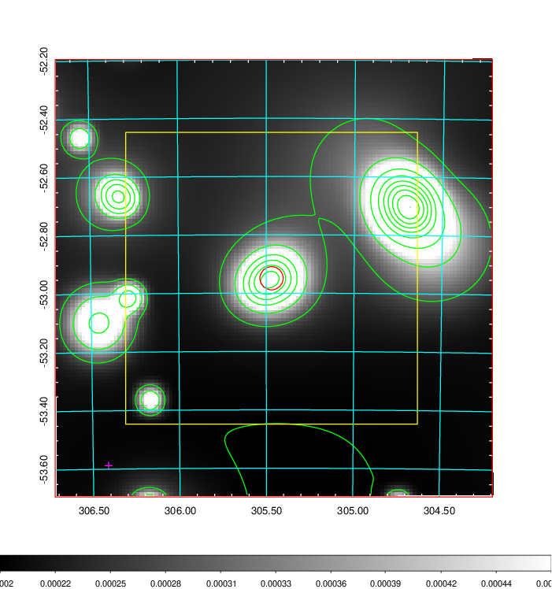
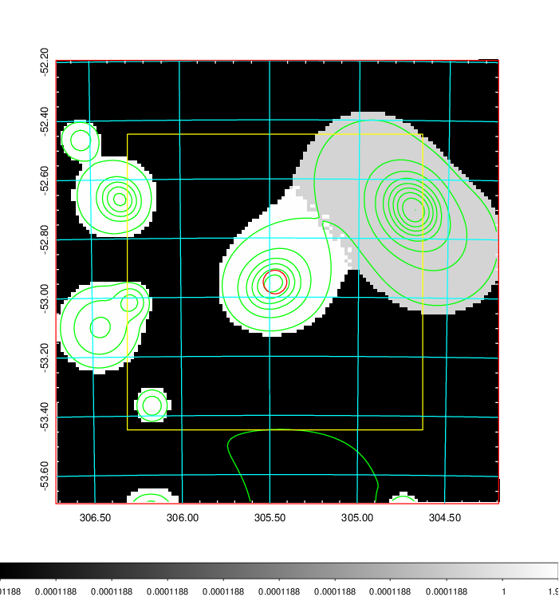
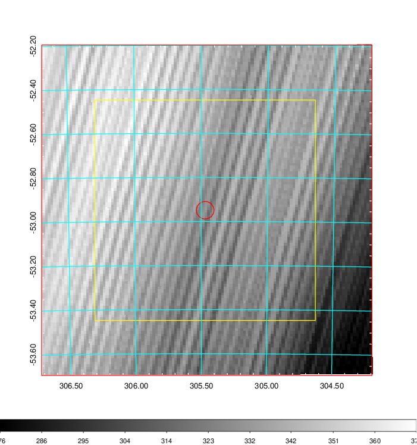
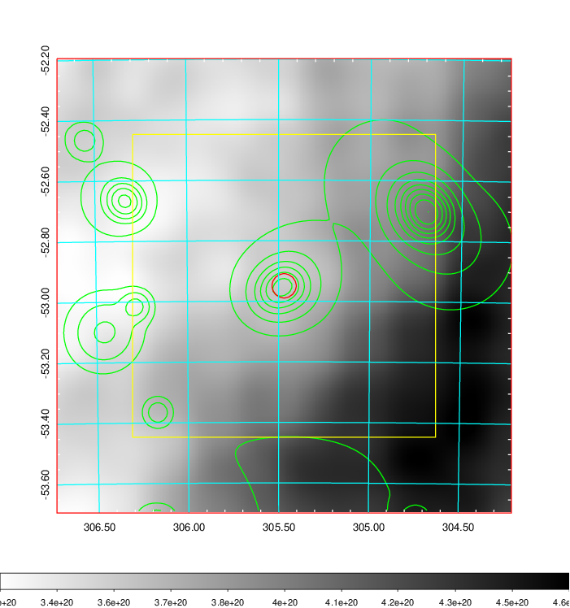
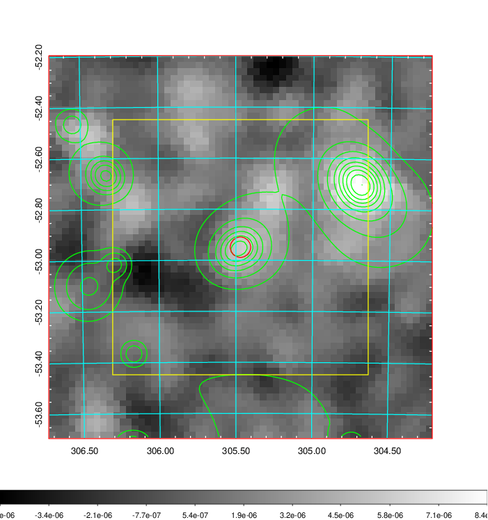
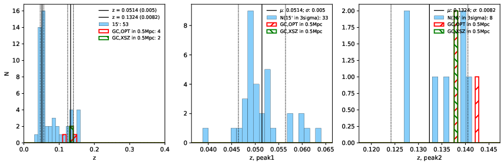
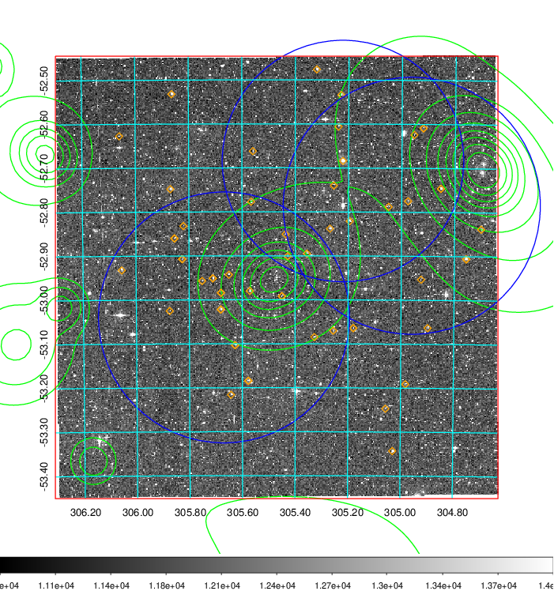
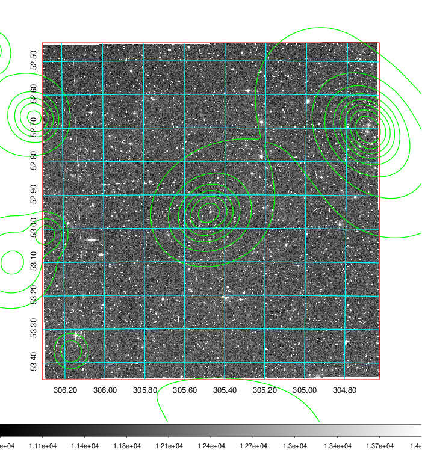
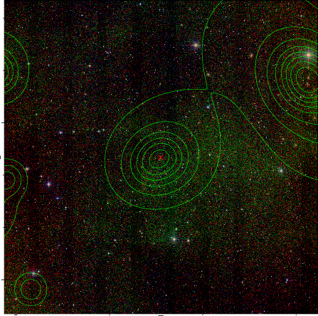

### 820

|Name|RAJ2000[deg]|DEJ2000[deg] |Ext[arcmin]| Ext,ml | z | z_src| C|GC(XSZ,Delta_z<0.01)| GC(OPT,Delta_z<0.01)|GC| R_sig[arcmin] | R500[arcmin] | R500[Mpc]| CRsig[c/s] | CR500[c/s] |L500[1E44 erg/s]|F500[1E-12 erg/s/cm^2]| M500[1E14 Msun]|Tx[keV]|Cnt_sig|Beta|Rc[arcmin]|Comment|Alias|
|---|---|---|---|---|---|------|---|--------|---------|----------|---|---|---|---|---|---|---|---|---|---|---|---|---|---|
|820| 305.470| -52.949| 2.40| 26.63| 0.1324(0.008)| z2, z_xsz| B| B15, MCXC| A, W| A, B15, MCXC, N, W| 10.262| 6.765| 0.955| 0.168(0.045)| 0.159(0.042)| 1.383(0.174)| 2.982(0.374)| 2.82(0.17)| 4.23(0.17)| 57.4| 0.834(-0.147+0.115)| 4.110(-1.048+0.822)| -| k281|

|[RASS image](../image/820/820_img.pdf)|[filtered image](../image/820/820_fil.pdf)|[Segment image](../image/820/820_seg.pdf)|
|-------------------|--------------------|-------------------|
|   |    |   |

|[Exposure image](../image/820/820_mex.pdf)| [nH image](../image/820/820_nh.pdf)| [Planck image](../image/820/820_p.pdf)|
|-------------------|--------------------|-------------------|
|   |     |  |

|[Redshift Histogram](../image/820/820_zg.pdf) | [DSS image(z1)](../image/820/820_dss_z1.pdf)      |  [DSS image(z2)](../image/820/820_dss_z2.pdf)    |
|-------------------|--------------------|-------------------|
| |  Blue circle for optical clusters;  Magenta circle for XSZ clusters;  all with r=1Mpc;  Only GC with Delta_z<0.01 are shown. |  Blue circle for optical clusters;  Magenta circle for XSZ clusters;  all with r=1Mpc;  Only GC with Delta_z<0.01 are shown.  |

|[known Abell/XSZ clusters](../image/820/820_gc.pdf) | [2MASS image](../image/820/820_2mass.pdf)      |
|-------------------|-------------------|
|  Magenta, blue and green circles  for optical, X-ray and SZ clusters  respectively, with redshift of clusters  labelled. The radius of circles  are 1Mpc.|  |

|[DES image](../image/820/820_des.pdf)   |
|-------------------|
|   |
