

### 821

|Name|RAJ2000[deg]|DEJ2000[deg] |Ext[arcmin]| Ext,ml | z | z_src| C|GC(XSZ,Delta_z<0.01)| GC(OPT,Delta_z<0.01)|GC| R_sig[arcmin] | R500[arcmin] | R500[Mpc]| CRsig[c/s] | CR500[c/s] |L500[1E44 erg/s]|F500[1E-12 erg/s/cm^2]| M500[1E14 Msun]|Tx[keV]|Cnt_sig|Beta|Rc[arcmin]|Comment|Alias|
|---|---|---|---|---|---|------|---|--------|---------|----------|---|---|---|---|---|---|---|---|---|---|---|---|---|---|
|821| 305.747| -20.962| 3.16| 35.06| 0.0554(0.008)| z1, z_xsz| B| MCXC| A| A, MCXC| 15.319| 11.459| 0.740| 0.249(0.133)| 0.239(0.128)| 0.303(0.066)| 4.140(0.897)| 1.21(0.13)| 2.46(0.17)| 59.7| 0.932(-0.087+0.049)| 4.267(-0.581+0.496)| -| k392|

|[RASS image](../image/821/821_img.pdf)|[filtered image](../image/821/821_fil.pdf)|[Segment image](../image/821/821_seg.pdf)|
|-------------------|--------------------|-------------------|
| 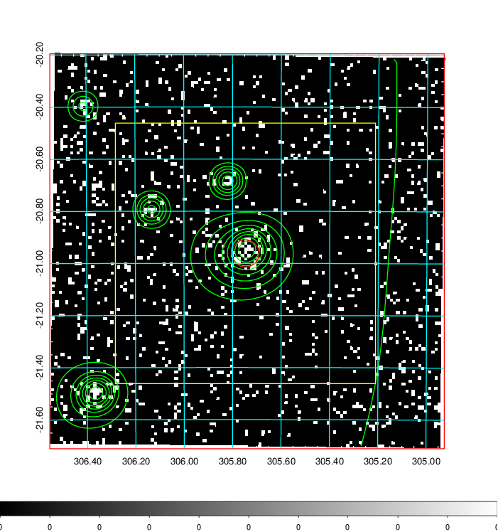  | 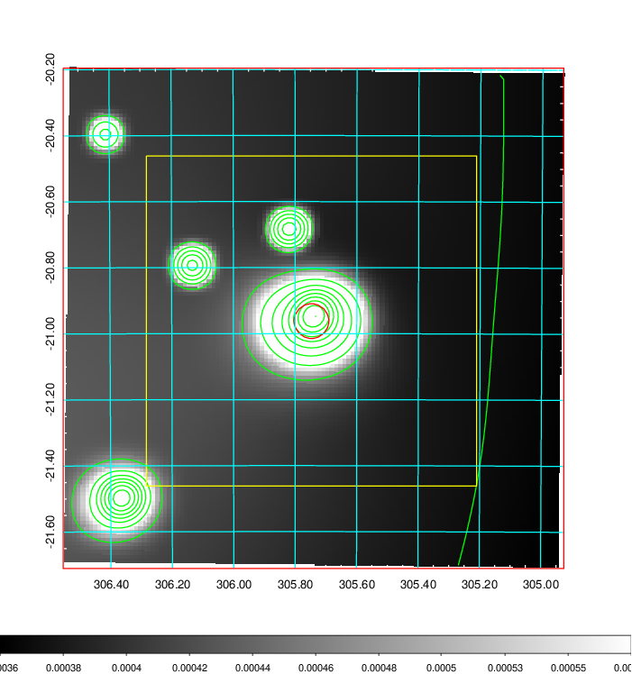   | 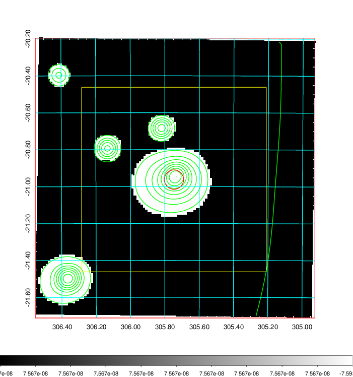  |

|[Exposure image](../image/821/821_mex.pdf)| [nH image](../image/821/821_nh.pdf)| [Planck image](../image/821/821_p.pdf)|
|-------------------|--------------------|-------------------|
|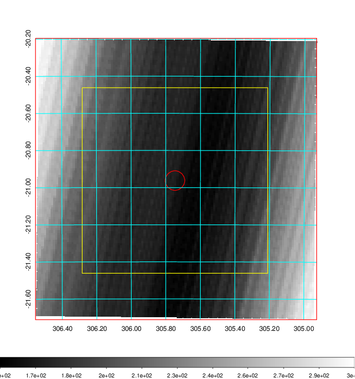   | 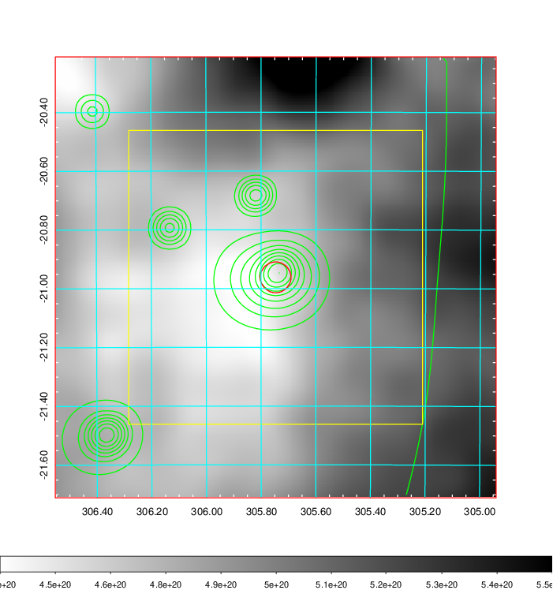    | 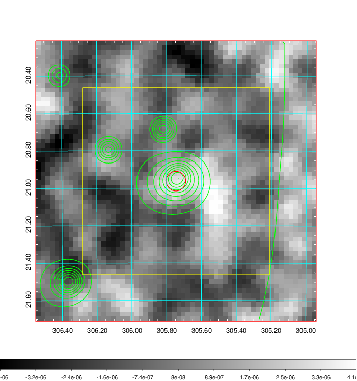 |

|[Redshift Histogram](../image/821/821_zg.pdf) | [DSS image(z1)](../image/821/821_dss_z1.pdf)      |  [DSS image(z2)](../image/821/821_dss_z2.pdf)    |
|-------------------|--------------------|-------------------|
|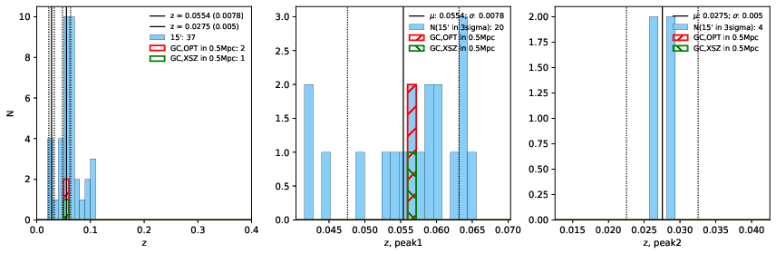 |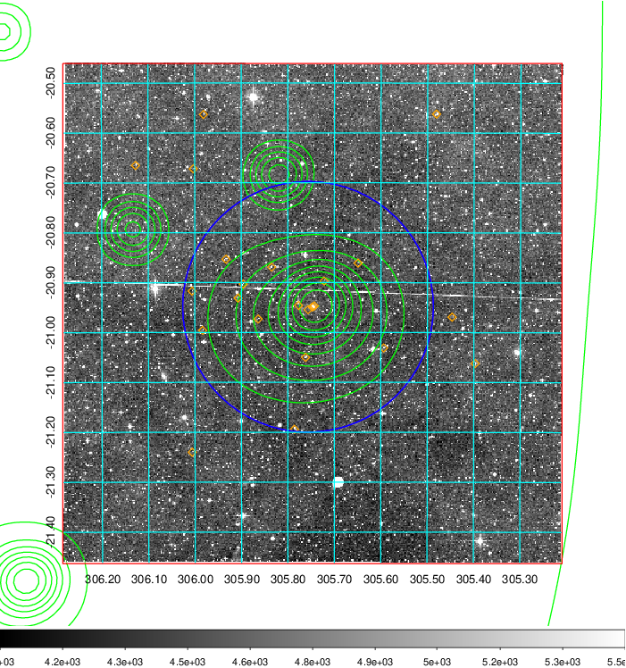  Blue circle for optical clusters;  Magenta circle for XSZ clusters;  all with r=1Mpc;  Only GC with Delta_z<0.01 are shown. | 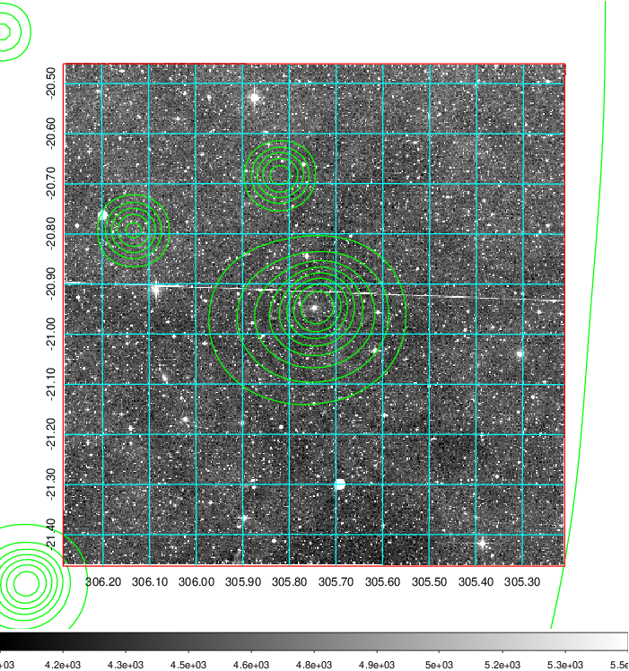 Blue circle for optical clusters;  Magenta circle for XSZ clusters;  all with r=1Mpc;  Only GC with Delta_z<0.01 are shown.  |

|[Previous-identified clusters](../image/821/821_gc.pdf) | [2MASS image](../image/821/821_2mass.pdf)      |[SDSS image](../image/821/821_sdss.pdf)   |
|-------------------|-------------------|-------------------|
|  Green, magenta, and blue circles  for optical, X-ray and SZ clusters  respectively, with redshift of clusters  labelled. The radius of circles  are 1Mpc.|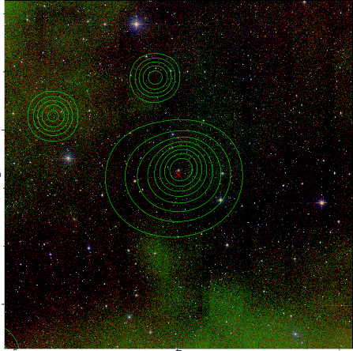  | 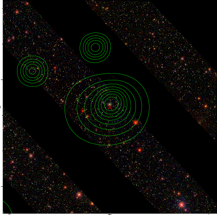  |

