

### 822

|Name|RAJ2000[deg]|DEJ2000[deg] |Ext[arcmin]| Ext,ml | z | z_src| C|GC(XSZ,Delta_z<0.01)| GC(OPT,Delta_z<0.01)|GC| R_sig[arcmin] | R500[arcmin] | R500[Mpc]| CRsig[c/s] | CR500[c/s] |L500[1E44 erg/s]|F500[1E-12 erg/s/cm^2]| M500[1E14 Msun]|Tx[keV]|Cnt_sig|Beta|Rc[arcmin]|Comment|Alias|
|---|---|---|---|---|---|------|---|--------|---------|----------|---|---|---|---|---|---|---|---|---|---|---|---|---|---|
|822| 306.264| 0.588| 3.40| 28.85| 0.2746(0.000)| z_xsz| B| Tar| -| N, PSZ2, Tar, W| 9.288| 4.071| 1.022| 0.061(0.029)| 0.056(0.026)| 2.360(0.958)| 1.003(0.407)| 4.02(0.77)| 5.53(0.68)| 36.1| 0.798(-0.177+0.142)| 5.222(-1.749+1.519)| -| k417|

|[RASS image](../image/822/822_img.pdf)|[filtered image](../image/822/822_fil.pdf)|[Segment image](../image/822/822_seg.pdf)|
|-------------------|--------------------|-------------------|
| 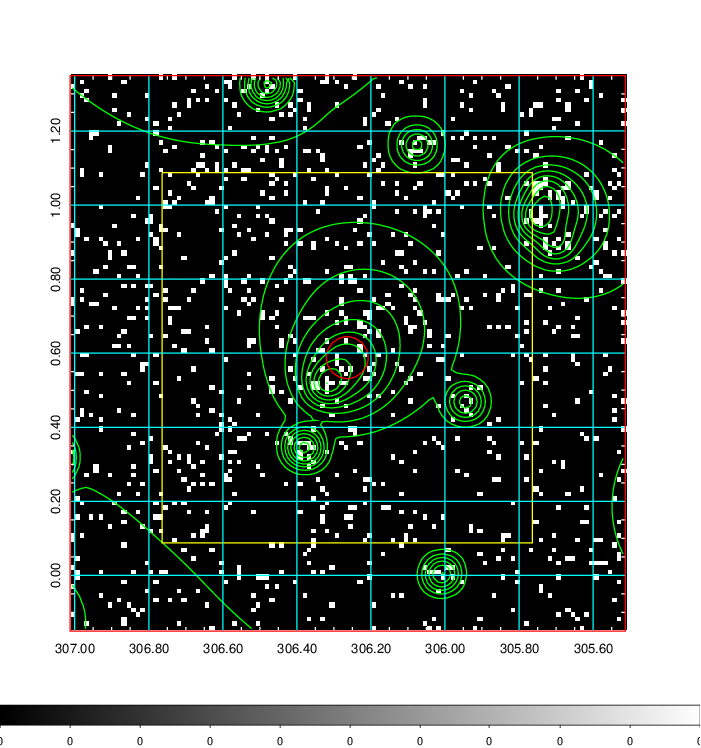  | 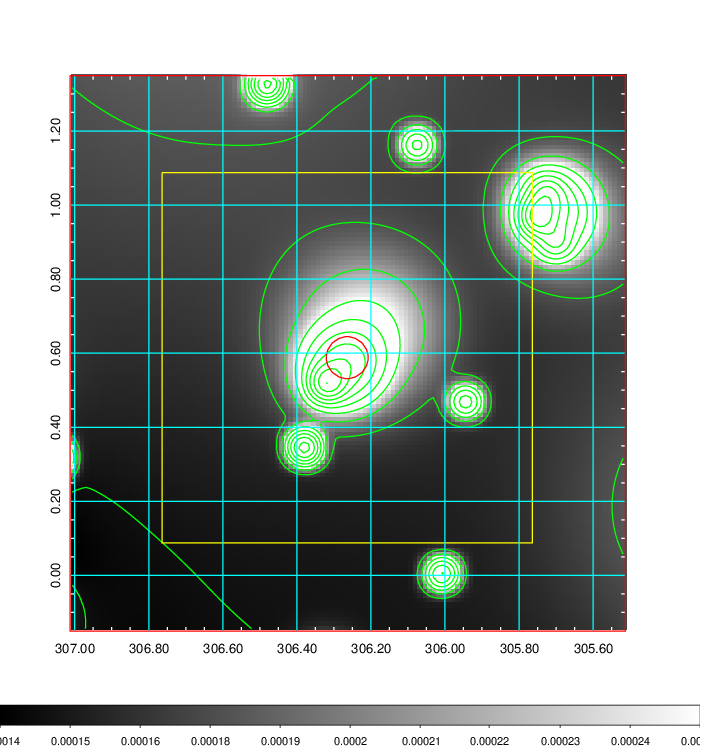   | 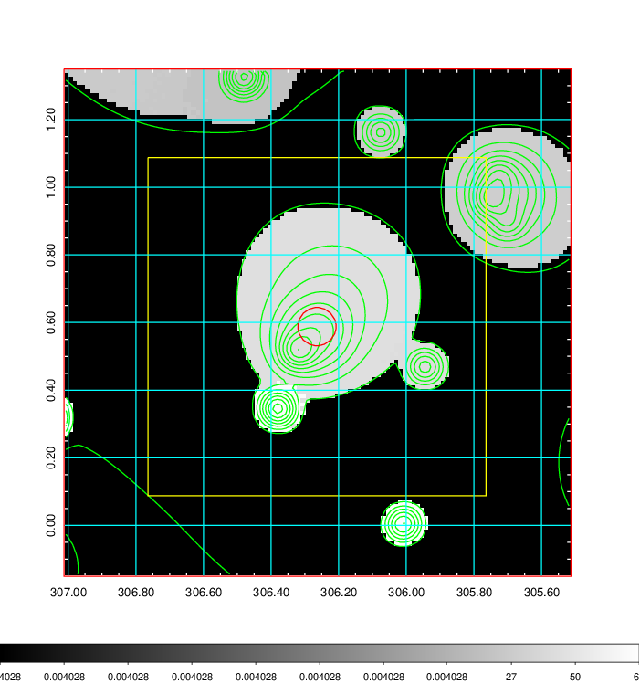  |

|[Exposure image](../image/822/822_mex.pdf)| [nH image](../image/822/822_nh.pdf)| [Planck image](../image/822/822_p.pdf)|
|-------------------|--------------------|-------------------|
|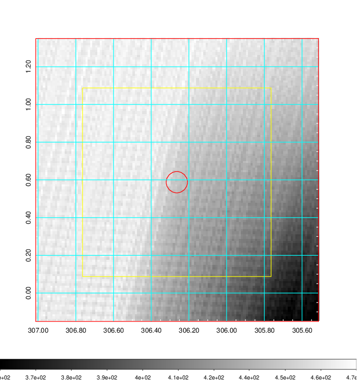   | 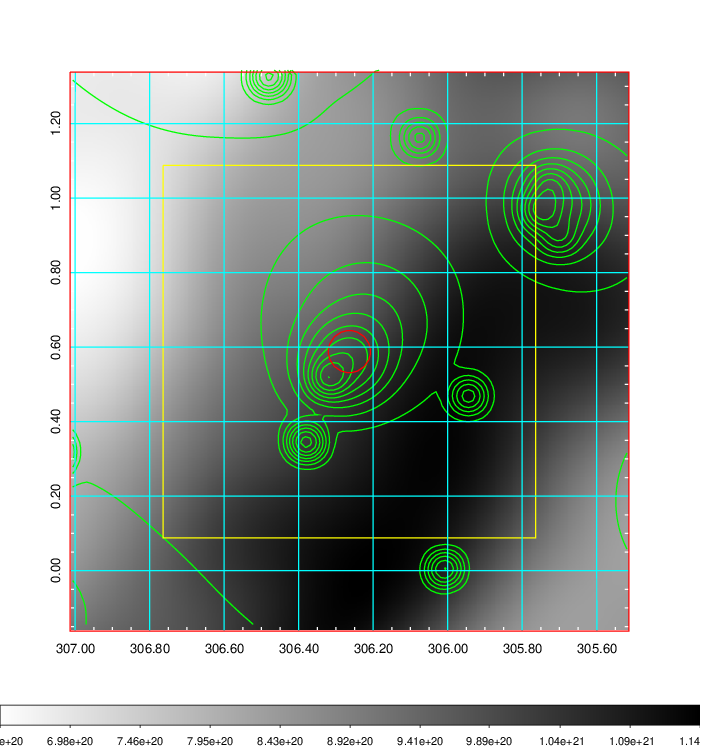    | 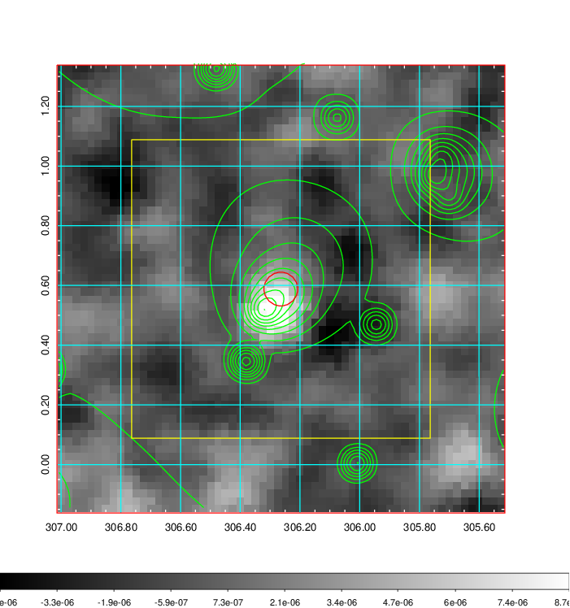 |

|[Redshift Histogram](../image/822/822_zg.pdf) | [DSS image(z1)](../image/822/822_dss_z1.pdf)      |  [DSS image(z2)](../image/822/822_dss_z2.pdf)    |
|-------------------|--------------------|-------------------|
|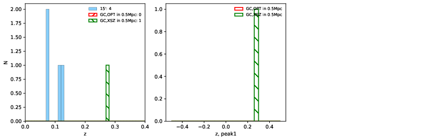 |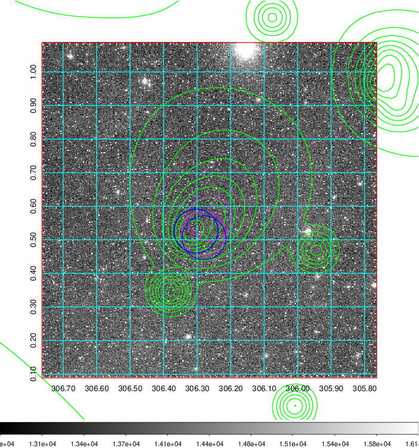  Blue circle for optical clusters;  Magenta circle for XSZ clusters;  all with r=1Mpc;  Only GC with Delta_z<0.01 are shown. | 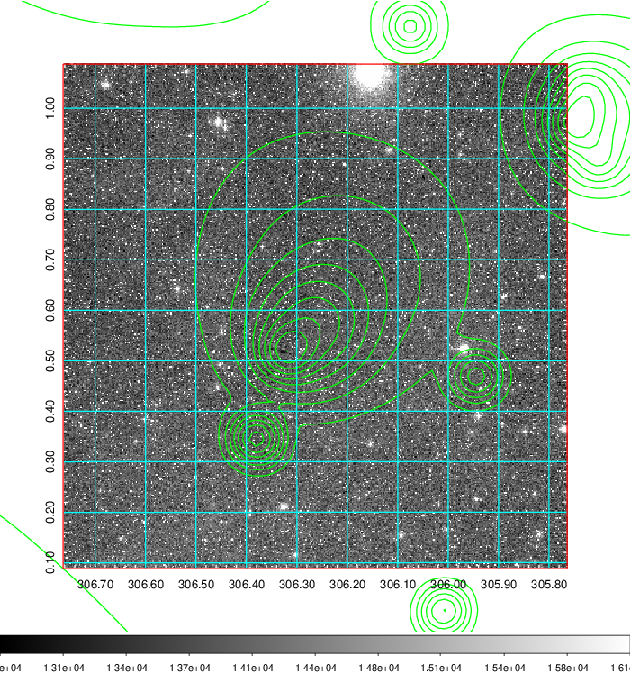 Blue circle for optical clusters;  Magenta circle for XSZ clusters;  all with r=1Mpc;  Only GC with Delta_z<0.01 are shown.  |

|[known Abell/XSZ clusters](../image/822/822_gc.pdf) | [2MASS image](../image/822/822_2mass.pdf)      |[SDSS image](../image/822/822_sdss.pdf)   |
|-------------------|-------------------|-------------------|
|  Magenta, blue and green circles  for optical, X-ray and SZ clusters  respectively, with redshift of clusters  labelled. The radius of circles  are 1Mpc.|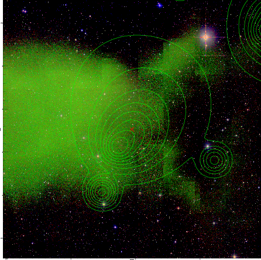  | 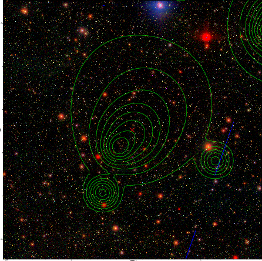  |

