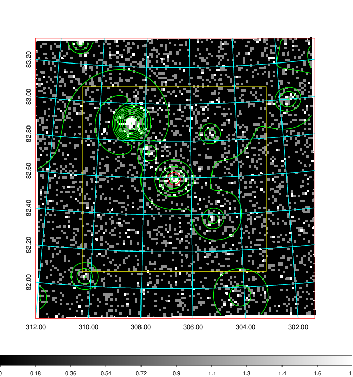
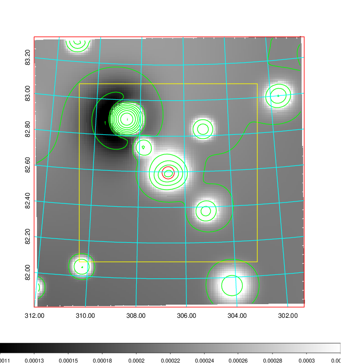
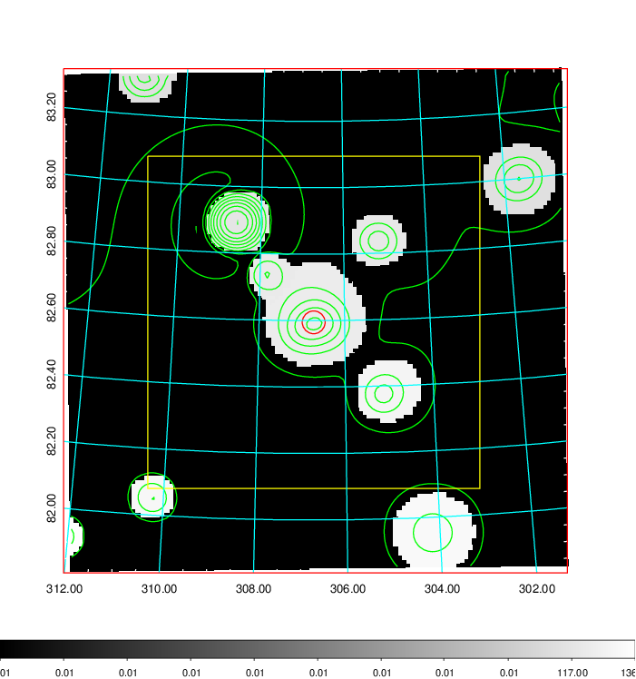
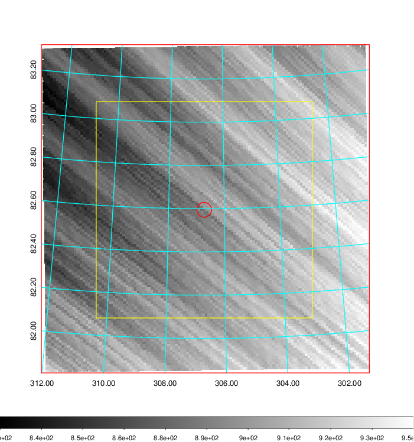
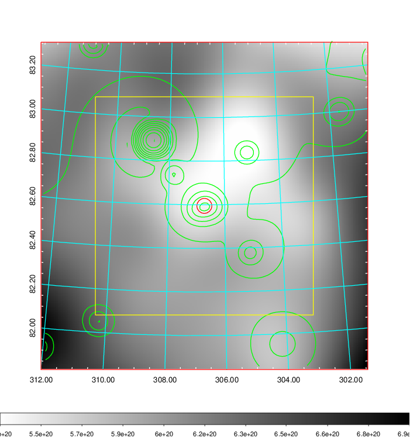
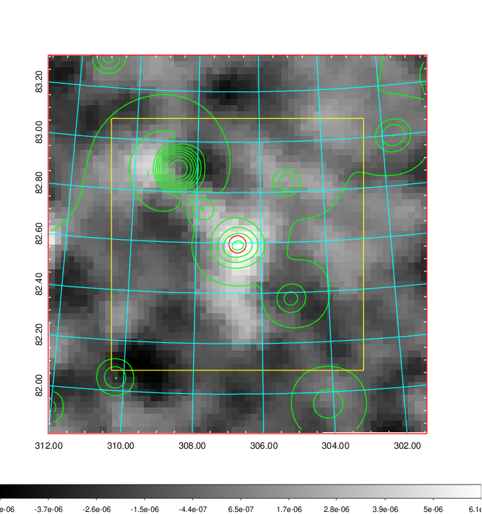
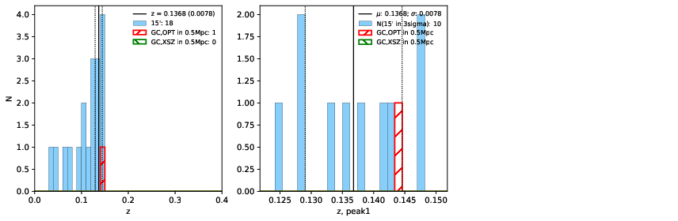
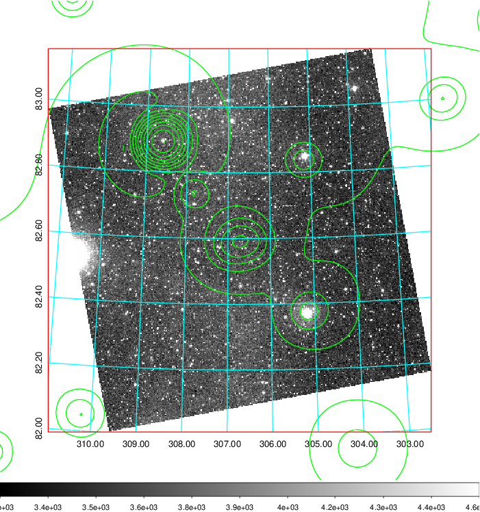
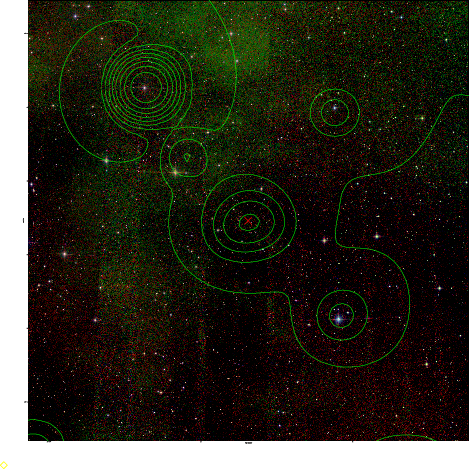

### 823

|Name|RAJ2000[deg]|DEJ2000[deg] |Ext[arcmin]| Ext,ml | z | z_src| C|GC(XSZ,Delta_z<0.01)| GC(OPT,Delta_z<0.01)|GC| R_sig[arcmin] | R500[arcmin] | R500[Mpc]| CRsig[c/s] | CR500[c/s] |L500[1E44 erg/s]|F500[1E-12 erg/s/cm^2]| M500[1E14 Msun]|Tx[keV]|Cnt_sig|Beta|Rc[arcmin]|Comment|Alias|
|---|---|---|---|---|---|------|---|--------|---------|----------|---|---|---|---|---|---|---|---|---|---|---|---|---|---|
|823| 306.723| 82.595| 2.06| 37.57| 0.1368(0.008)| z1, z_opt| S| -| W| A, Tar, W| 27.169| 7.075| 1.027| 0.229(0.048)| 0.204(0.043)| 1.859(0.317)| 3.734(0.638)| 3.52(0.29)| 4.86(0.26)| 479.0| 0.504(-0.003+0.007)| 2.837(-0.241+0.279)| An SZ cluster with no $z$ and offset = 0.20 Mpc| t065|

|[RASS image](../image/823/823_img.pdf)|[filtered image](../image/823/823_fil.pdf)|[Segment image](../image/823/823_seg.pdf)|
|-------------------|--------------------|-------------------|
|   |    |   |

|[Exposure image](../image/823/823_mex.pdf)| [nH image](../image/823/823_nh.pdf)| [Planck image](../image/823/823_p.pdf)|
|-------------------|--------------------|-------------------|
|   |     |  |

|[Redshift Histogram](../image/823/823_zg.pdf) | [DSS image(z1)](../image/823/823_dss_z1.pdf)      |  [DSS image(z2)](../image/823/823_dss_z2.pdf)    |
|-------------------|--------------------|-------------------|
| |  Blue circle for optical clusters;  Magenta circle for XSZ clusters;  all with r=1Mpc;  Only GC with Delta_z<0.01 are shown. |  Blue circle for optical clusters;  Magenta circle for XSZ clusters;  all with r=1Mpc;  Only GC with Delta_z<0.01 are shown.  |

|[known Abell/XSZ clusters](../image/823/823_gc.pdf) | [2MASS image](../image/823/823_2mass.pdf)      |
|-------------------|-------------------|
|  Magenta, blue and green circles  for optical, X-ray and SZ clusters  respectively, with redshift of clusters  labelled. The radius of circles  are 1Mpc.|  |

|[PS1 image](../image/823/823_ps1.pdf)            |
|-------------------|
|   |
