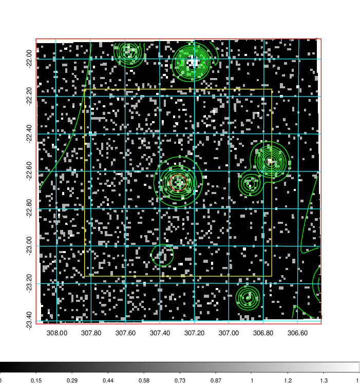
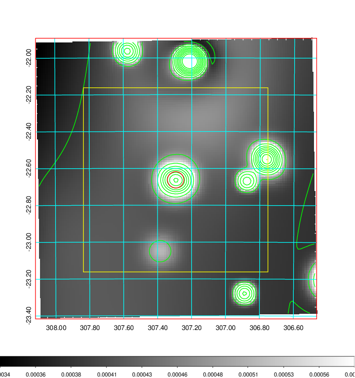
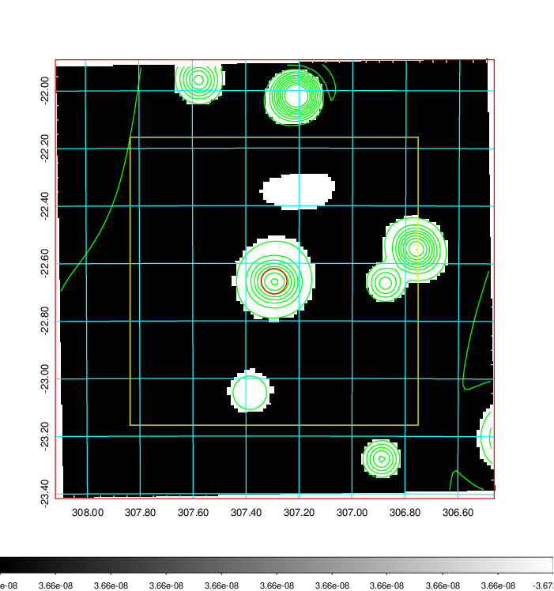
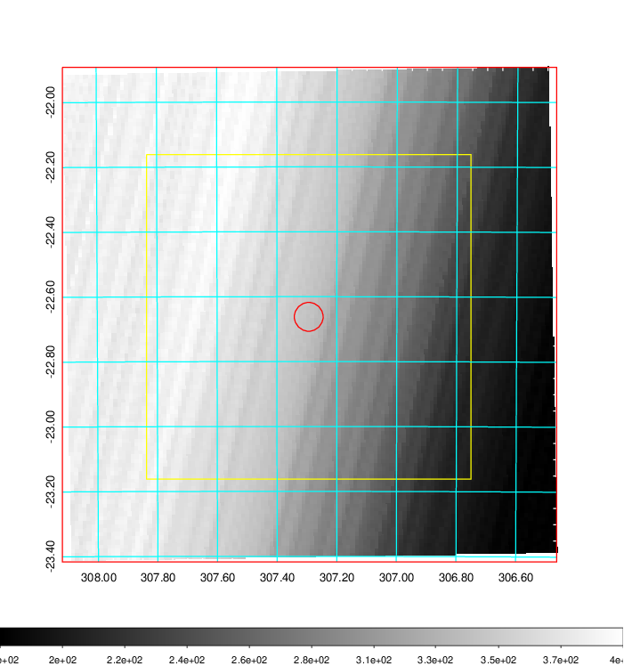
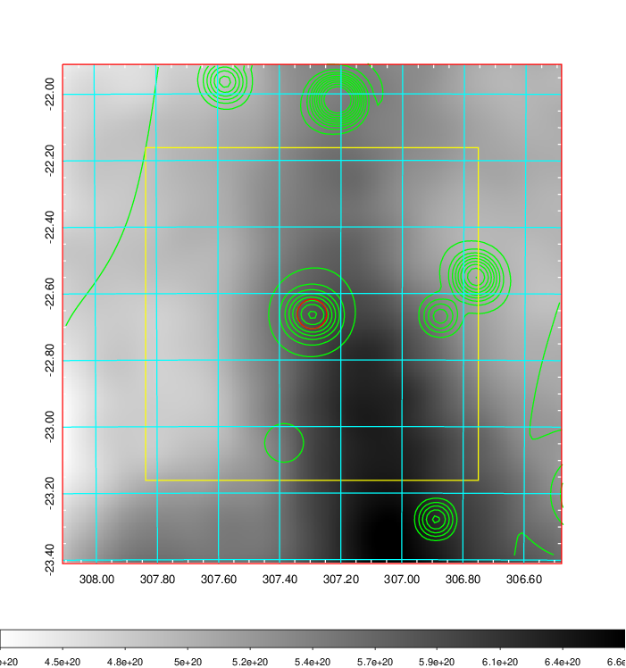
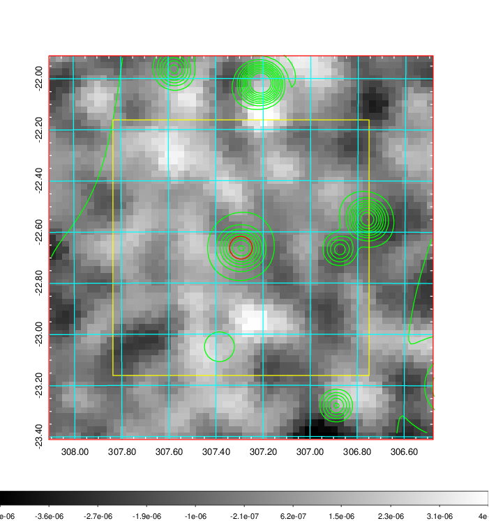
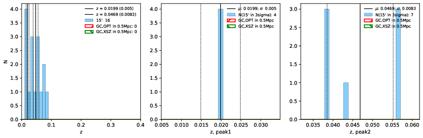
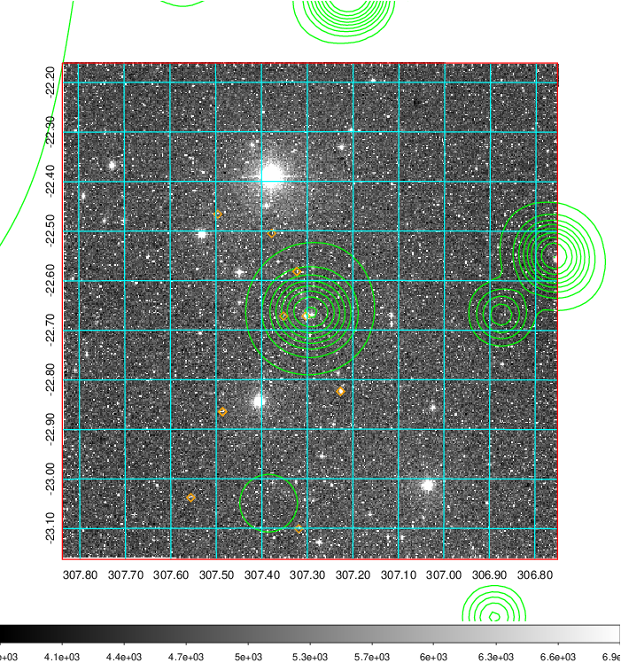
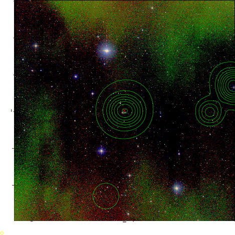
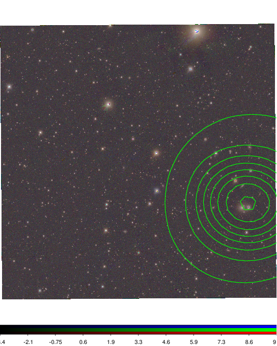

### 824

|Name|RAJ2000[deg]|DEJ2000[deg] |Ext[arcmin]| Ext,ml | z | z_src| C|GC(XSZ,Delta_z<0.01)| GC(OPT,Delta_z<0.01)|GC| R_sig[arcmin] | R500[arcmin] | R500[Mpc]| CRsig[c/s] | CR500[c/s] |L500[1E44 erg/s]|F500[1E-12 erg/s/cm^2]| M500[1E14 Msun]|Tx[keV]|Cnt_sig|Beta|Rc[arcmin]|Comment|Alias|
|---|---|---|---|---|---|------|---|--------|---------|----------|---|---|---|---|---|---|---|---|---|---|---|---|---|---|
|824| 307.294| -22.662| 2.67| 28.73| 0.0199(0.005)| z1,| G| -| -| -| 23.712| 19.156| 0.464| 0.204(0.103)| 0.198(0.100)| 0.023(0.013)| 2.512(1.471)| 0.29(0.09)| 1.00(0.19)| 233.8| 0.525(-0.020+0.078)| 1.001(-0.605+0.842)| -| t112|

|[RASS image](../image/824/824_img.pdf)|[filtered image](../image/824/824_fil.pdf)|[Segment image](../image/824/824_seg.pdf)|
|-------------------|--------------------|-------------------|
|   |    |   |

|[Exposure image](../image/824/824_mex.pdf)| [nH image](../image/824/824_nh.pdf)| [Planck image](../image/824/824_p.pdf)|
|-------------------|--------------------|-------------------|
|   |     |  |

|[Redshift Histogram](../image/824/824_zg.pdf) | [DSS image(z1)](../image/824/824_dss_z1.pdf)      |  [DSS image(z2)](../image/824/824_dss_z2.pdf)    |
|-------------------|--------------------|-------------------|
| |  Blue circle for optical clusters;  Magenta circle for XSZ clusters;  all with r=1Mpc;  Only GC with Delta_z<0.01 are shown. |  Blue circle for optical clusters;  Magenta circle for XSZ clusters;  all with r=1Mpc;  Only GC with Delta_z<0.01 are shown.  |

|[Previous-identified clusters](../image/824/824_gc.pdf) | [2MASS image](../image/824/824_2mass.pdf)      |
|-------------------|-------------------|
|  Green, magenta, and blue circles  for optical, X-ray and SZ clusters  respectively, with redshift of clusters  labelled. The radius of circles  are 1Mpc.|  |

|[PS1 image](../image/824/824_ps1.pdf)            |
|-------------------|
|   |
