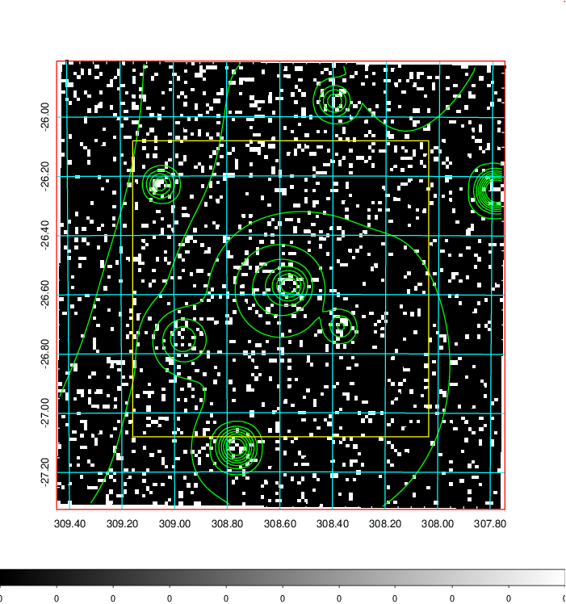
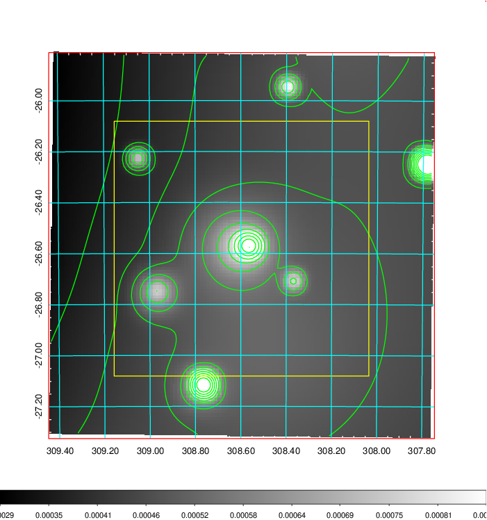
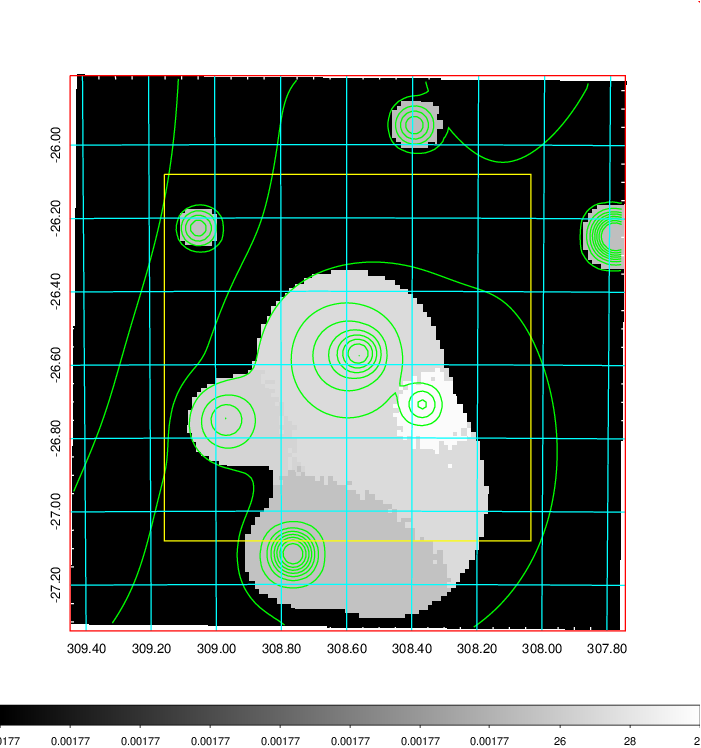
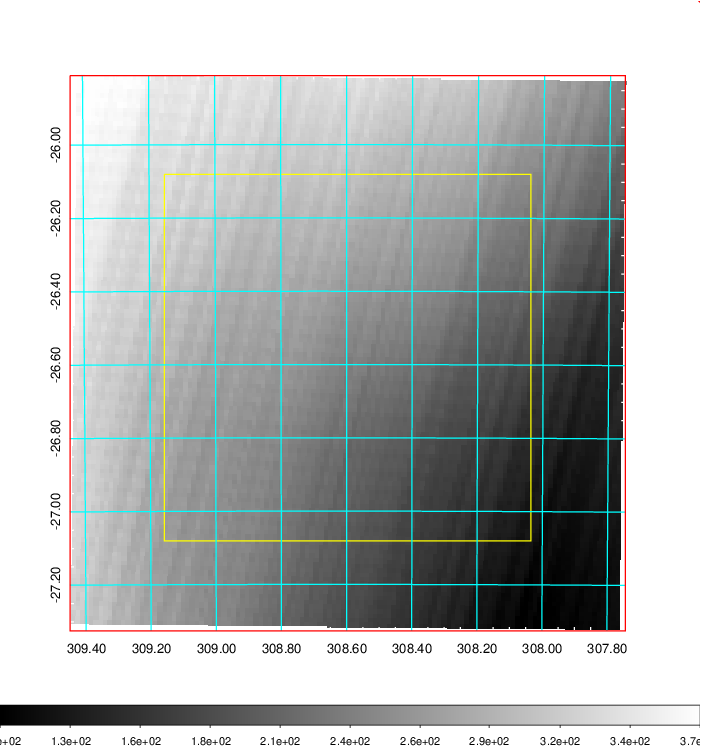
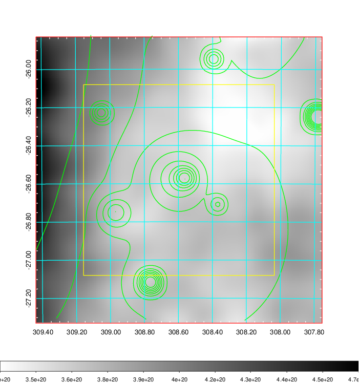
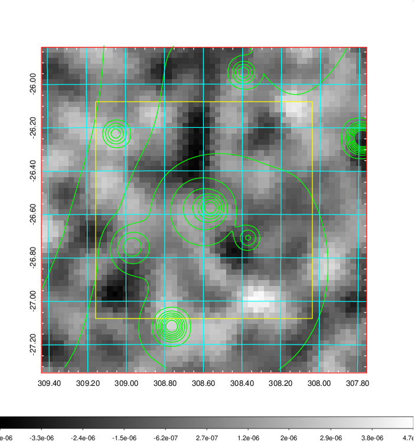
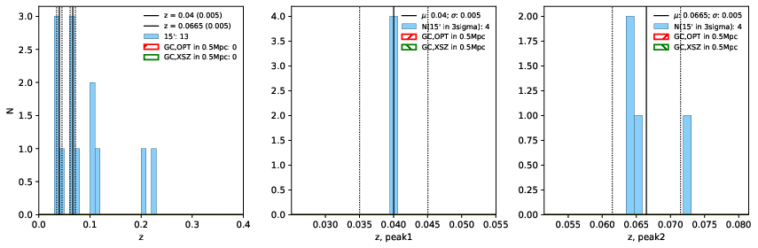
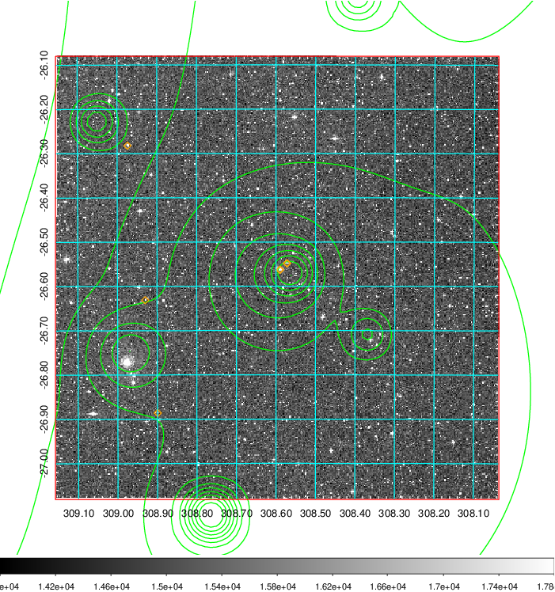
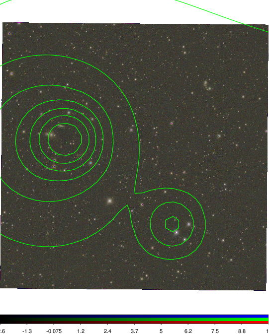

### 826

|Name|RAJ2000[deg]|DEJ2000[deg] |Ext[arcmin]| Ext,ml | z | z_src| C|GC(XSZ,Delta_z<0.01)| GC(OPT,Delta_z<0.01)|GC| R_sig[arcmin] | R500[arcmin] | R500[Mpc]| CRsig[c/s] | CR500[c/s] |L500[1E44 erg/s]|F500[1E-12 erg/s/cm^2]| M500[1E14 Msun]|Tx[keV]|Cnt_sig|Beta|Rc[arcmin]|Comment|Alias|
|---|---|---|---|---|---|------|---|--------|---------|----------|---|---|---|---|---|---|---|---|---|---|---|---|---|---|
|826| 308.597| -26.581| 81.96| 46.00| 0.0400(0.005)| z1,| G| -| -| N, W| 12.700| 11.645| 0.553| 0.122(0.067)| 0.121(0.066)| 0.068(0.031)| 1.812(0.832)| 0.50(0.12)| 1.41(0.21)| 54.6| 0.731(-0.162+0.179)| 5.288(-1.774+1.863)| -| t722|

|[RASS image](../image/826/826_img.pdf)|[filtered image](../image/826/826_fil.pdf)|[Segment image](../image/826/826_seg.pdf)|
|-------------------|--------------------|-------------------|
|   |    |   |

|[Exposure image](../image/826/826_mex.pdf)| [nH image](../image/826/826_nh.pdf)| [Planck image](../image/826/826_p.pdf)|
|-------------------|--------------------|-------------------|
|   |     |  |

|[Redshift Histogram](../image/826/826_zg.pdf) | [DSS image(z1)](../image/826/826_dss_z1.pdf)      |  [DSS image(z2)](../image/826/826_dss_z2.pdf)    |
|-------------------|--------------------|-------------------|
| |  Blue circle for optical clusters;  Magenta circle for XSZ clusters;  all with r=1Mpc;  Only GC with Delta_z<0.01 are shown. |  Blue circle for optical clusters;  Magenta circle for XSZ clusters;  all with r=1Mpc;  Only GC with Delta_z<0.01 are shown.  |

|[Previous-identified clusters](../image/826/826_gc.pdf) | [2MASS image](../image/826/826_2mass.pdf)      |
|-------------------|-------------------|
|  Green, magenta, and blue circles  for optical, X-ray and SZ clusters  respectively, with redshift of clusters  labelled. The radius of circles  are 1Mpc.|  |

|[PS1 image](../image/826/826_ps1.pdf)            |
|-------------------|
|   |
