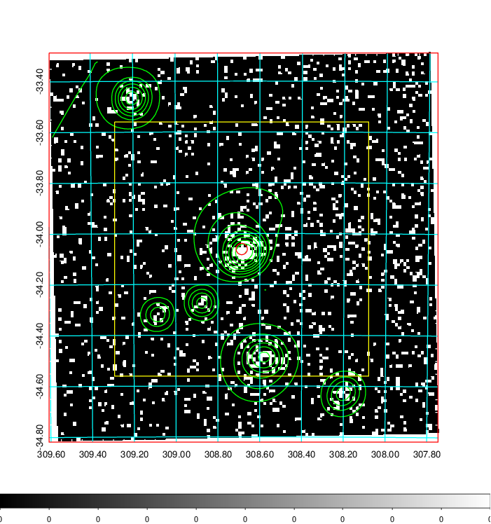
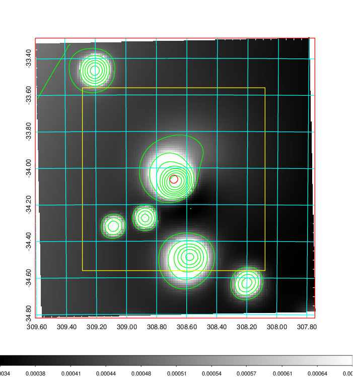
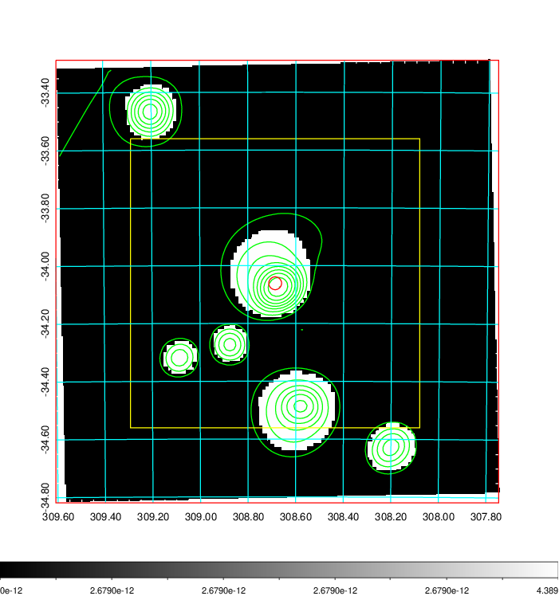
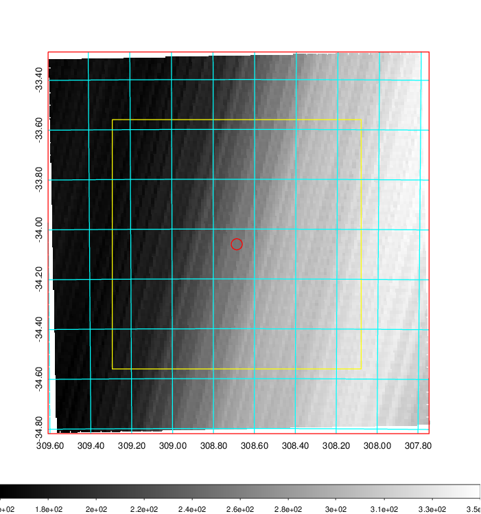
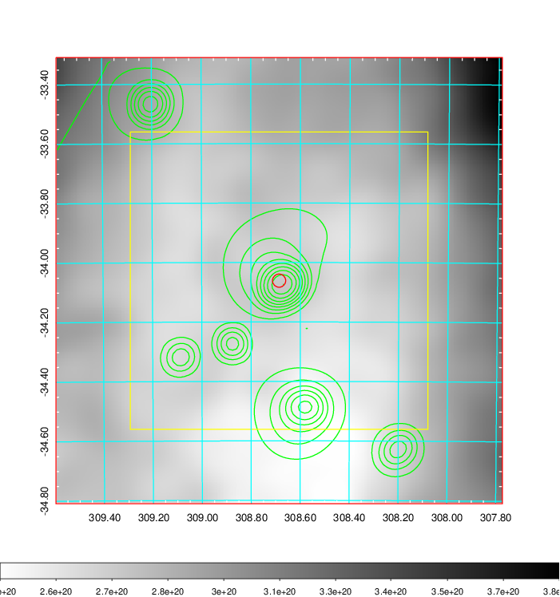
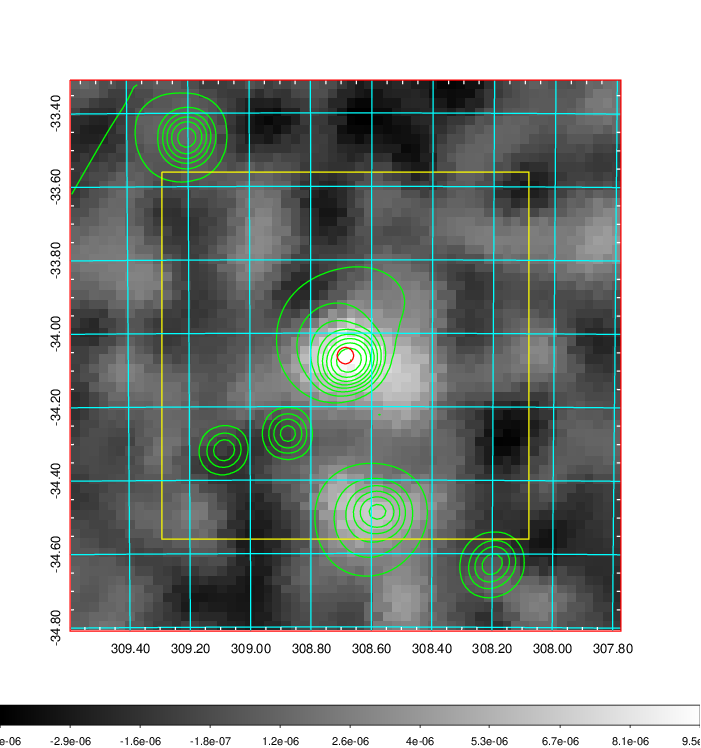
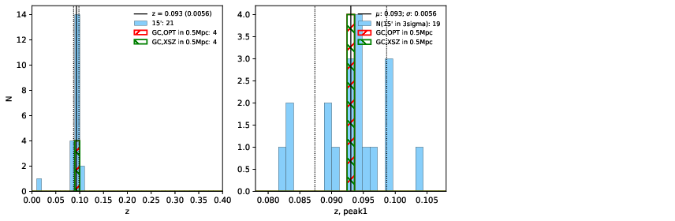
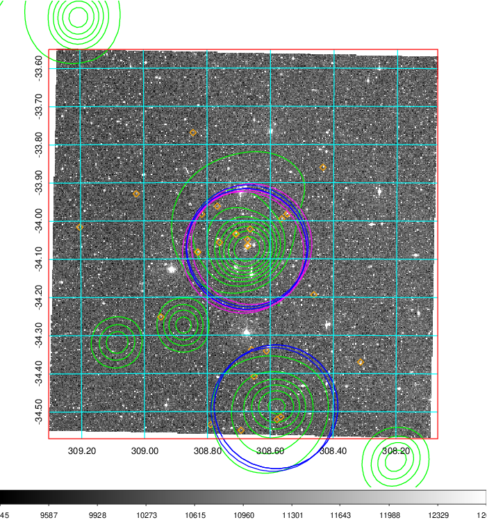
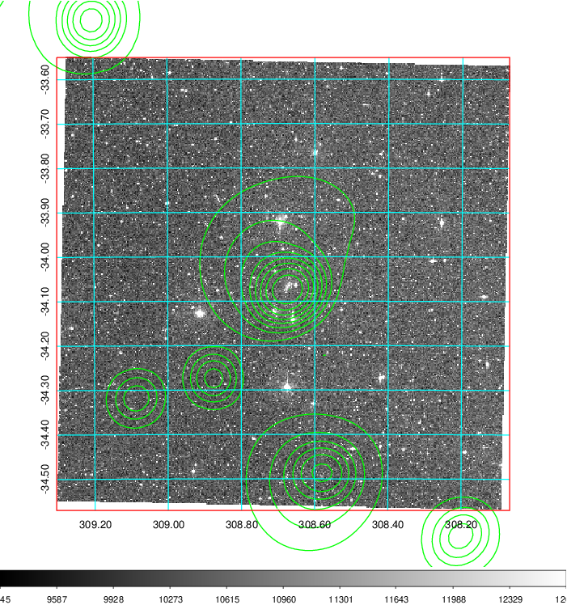
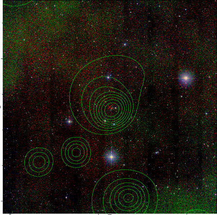

### 827

|Name|RAJ2000[deg]|DEJ2000[deg] |Ext[arcmin]| Ext,ml | z | z_src| C|GC(XSZ,Delta_z<0.01)| GC(OPT,Delta_z<0.01)|GC| R_sig[arcmin] | R500[arcmin] | R500[Mpc]| CRsig[c/s] | CR500[c/s] |L500[1E44 erg/s]|F500[1E-12 erg/s/cm^2]| M500[1E14 Msun]|Tx[keV]|Cnt_sig|Beta|Rc[arcmin]|Comment|Alias|
|---|---|---|---|---|---|------|---|--------|---------|----------|---|---|---|---|---|---|---|---|---|---|---|---|---|---|
|827| 308.686| -34.061| 1.33| 32.51| 0.0930(0.006)| z1, z_xsz| B| MCXC, PSZ2, Tar, XB| A, N, W| A, MCXC, N, PSZ2, Tar, W, XB| 26.675| 10.699| 1.110| 0.701(0.125)| 0.638(0.113)| 2.665(0.285)| 12.271(1.310)| 4.25(0.22)| 5.38(0.18)| 239.3| 0.511(-0.008+0.016)| 1.425(-0.190+0.247)| -| k082|

|[RASS image](../image/827/827_img.pdf)|[filtered image](../image/827/827_fil.pdf)|[Segment image](../image/827/827_seg.pdf)|
|-------------------|--------------------|-------------------|
|   |    |   |

|[Exposure image](../image/827/827_mex.pdf)| [nH image](../image/827/827_nh.pdf)| [Planck image](../image/827/827_p.pdf)|
|-------------------|--------------------|-------------------|
|   |     |  |

|[Redshift Histogram](../image/827/827_zg.pdf) | [DSS image(z1)](../image/827/827_dss_z1.pdf)      |  [DSS image(z2)](../image/827/827_dss_z2.pdf)    |
|-------------------|--------------------|-------------------|
| |  Blue circle for optical clusters;  Magenta circle for XSZ clusters;  all with r=1Mpc;  Only GC with Delta_z<0.01 are shown. |  Blue circle for optical clusters;  Magenta circle for XSZ clusters;  all with r=1Mpc;  Only GC with Delta_z<0.01 are shown.  |

|[Previous-identified clusters](../image/827/827_gc.pdf) | [2MASS image](../image/827/827_2mass.pdf)      |
|-------------------|-------------------|
|  Green, magenta, and blue circles  for optical, X-ray and SZ clusters  respectively, with redshift of clusters  labelled. The radius of circles  are 1Mpc.|  |

