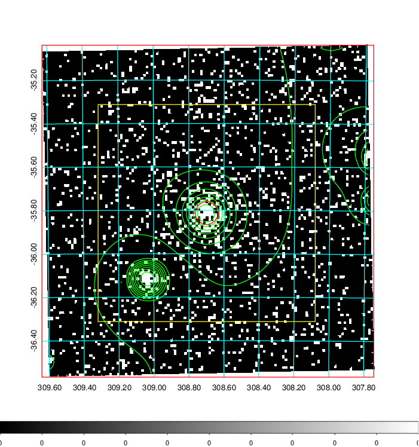
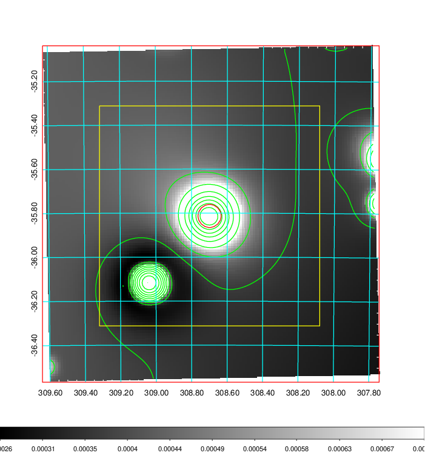
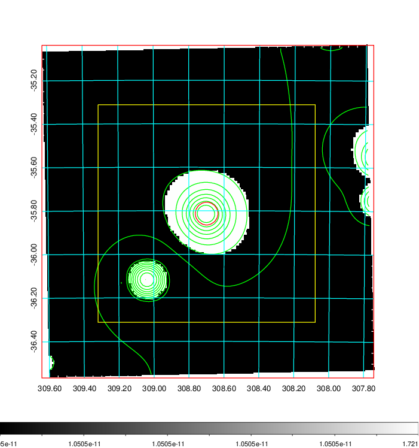
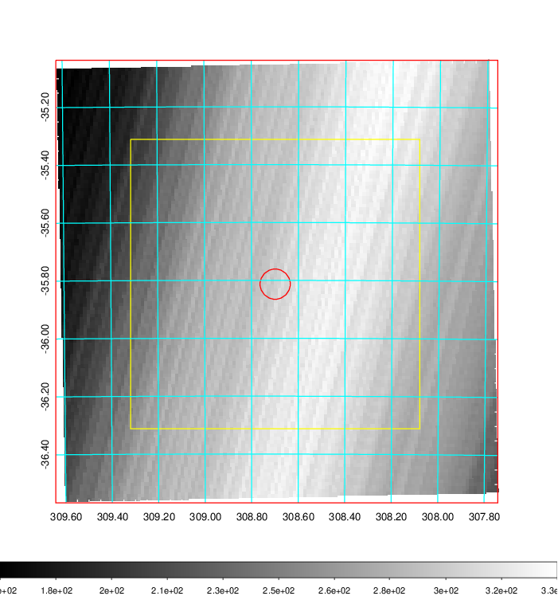
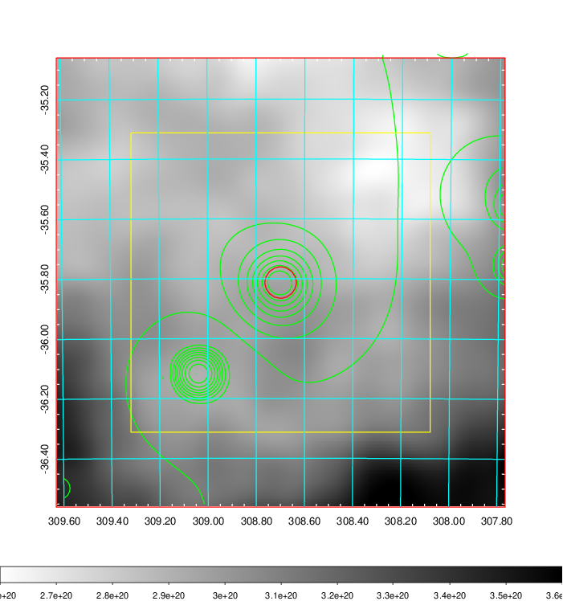
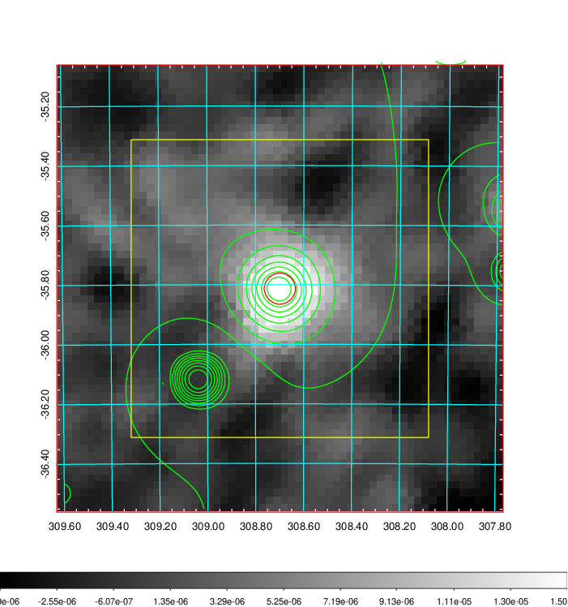
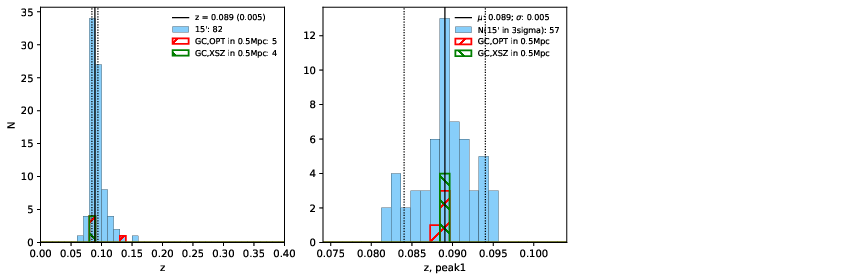
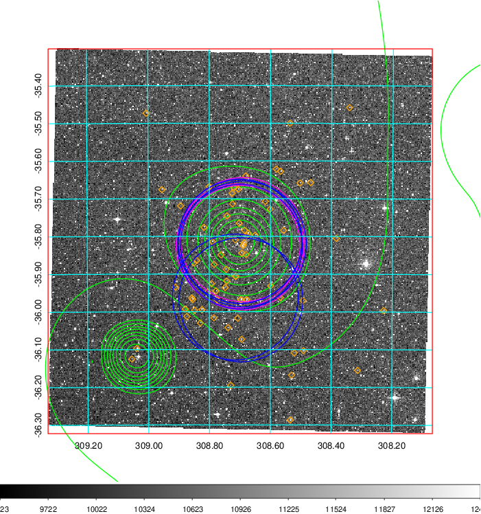
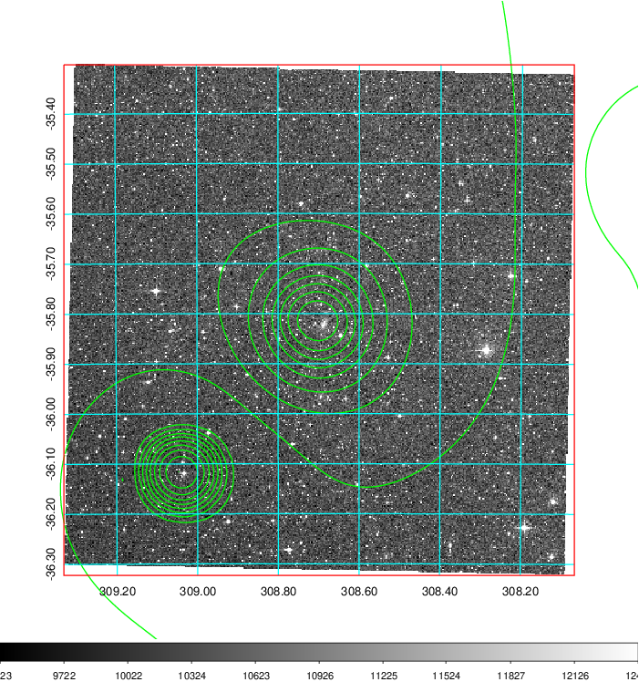
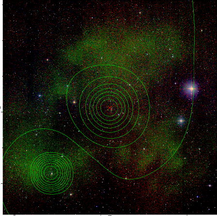

### 828

|Name|RAJ2000[deg]|DEJ2000[deg] |Ext[arcmin]| Ext,ml | z | z_src| C|GC(XSZ,Delta_z<0.01)| GC(OPT,Delta_z<0.01)|GC| R_sig[arcmin] | R500[arcmin] | R500[Mpc]| CRsig[c/s] | CR500[c/s] |L500[1E44 erg/s]|F500[1E-12 erg/s/cm^2]| M500[1E14 Msun]|Tx[keV]|Cnt_sig|Beta|Rc[arcmin]|Comment|Alias|
|---|---|---|---|---|---|------|---|--------|---------|----------|---|---|---|---|---|---|---|---|---|---|---|---|---|---|
|828| 308.699| -35.813| 3.14| 192.68| 0.0890(0.005)| z1, z_xsz| B| MCXC, PSZ2, Tar, XB| A, N| A, MCXC, N, PSZ2, Tar, W, XB| 28.650| 11.831| 1.180| 1.014(0.123)| 0.925(0.112)| 3.496(0.238)| 17.670(1.201)| 5.09(0.17)| 6.01(0.13)| 410.2| 0.572(-0.025+0.030)| 2.863(-0.377+0.424)| -| k389|

|[RASS image](../image/828/828_img.pdf)|[filtered image](../image/828/828_fil.pdf)|[Segment image](../image/828/828_seg.pdf)|
|-------------------|--------------------|-------------------|
|   |    |   |

|[Exposure image](../image/828/828_mex.pdf)| [nH image](../image/828/828_nh.pdf)| [Planck image](../image/828/828_p.pdf)|
|-------------------|--------------------|-------------------|
|   |     |  |

|[Redshift Histogram](../image/828/828_zg.pdf) | [DSS image(z1)](../image/828/828_dss_z1.pdf)      |  [DSS image(z2)](../image/828/828_dss_z2.pdf)    |
|-------------------|--------------------|-------------------|
| |  Blue circle for optical clusters;  Magenta circle for XSZ clusters;  all with r=1Mpc;  Only GC with Delta_z<0.01 are shown. |  Blue circle for optical clusters;  Magenta circle for XSZ clusters;  all with r=1Mpc;  Only GC with Delta_z<0.01 are shown.  |

|[known Abell/XSZ clusters](../image/828/828_gc.pdf) | [2MASS image](../image/828/828_2mass.pdf)      |
|-------------------|-------------------|
|  Magenta, blue and green circles  for optical, X-ray and SZ clusters  respectively, with redshift of clusters  labelled. The radius of circles  are 1Mpc.|  |

