

### 829

|Name|RAJ2000[deg]|DEJ2000[deg] |Ext[arcmin]| Ext,ml | z | z_src| C|GC(XSZ,Delta_z<0.01)| GC(OPT,Delta_z<0.01)|GC| R_sig[arcmin] | R500[arcmin] | R500[Mpc]| CRsig[c/s] | CR500[c/s] |L500[1E44 erg/s]|F500[1E-12 erg/s/cm^2]| M500[1E14 Msun]|Tx[keV]|Cnt_sig|Beta|Rc[arcmin]|Comment|Alias|
|---|---|---|---|---|---|------|---|--------|---------|----------|---|---|---|---|---|---|---|---|---|---|---|---|---|---|
|829| 308.946| -25.243| 10.16| 82.95| 0.0198(0.005)| z1, z_xsz| B| MCXC| A, N| A, MCXC, N, W| 16.112| 19.443| 0.468| 0.215(0.052)| 0.223(0.054)| 0.026(0.004)| 2.910(0.493)| 0.30(0.03)| 1.02(0.06)| 119.1| 0.783(-0.165+0.147)| 7.016(-1.810+1.543)| -| k570|

|[RASS image](../image/829/829_img.pdf)|[filtered image](../image/829/829_fil.pdf)|[Segment image](../image/829/829_seg.pdf)|
|-------------------|--------------------|-------------------|
| 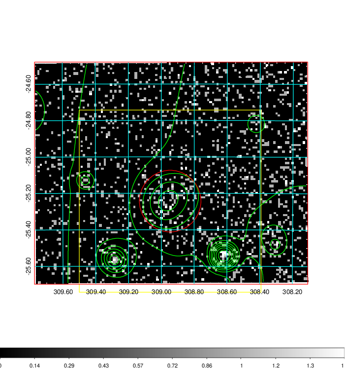  | 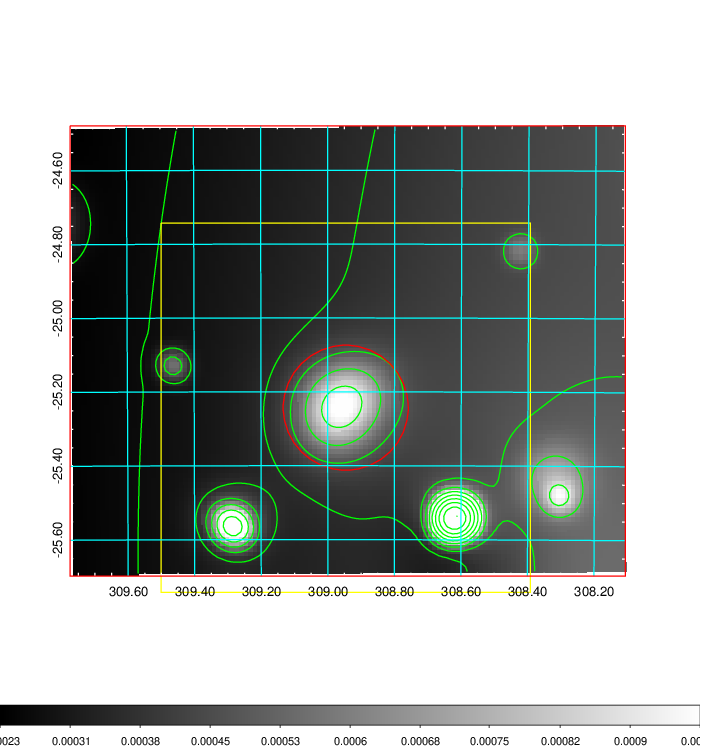   | 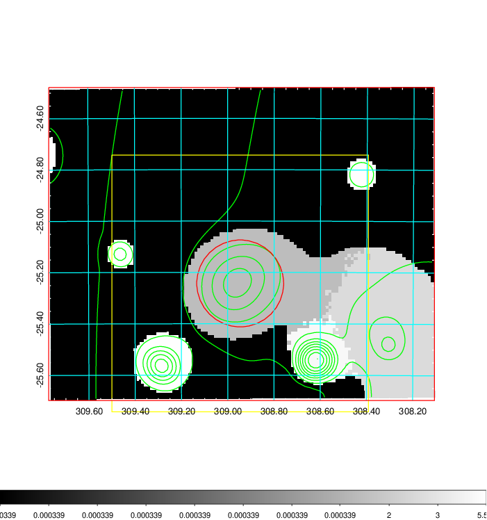  |

|[Exposure image](../image/829/829_mex.pdf)| [nH image](../image/829/829_nh.pdf)| [Planck image](../image/829/829_p.pdf)|
|-------------------|--------------------|-------------------|
|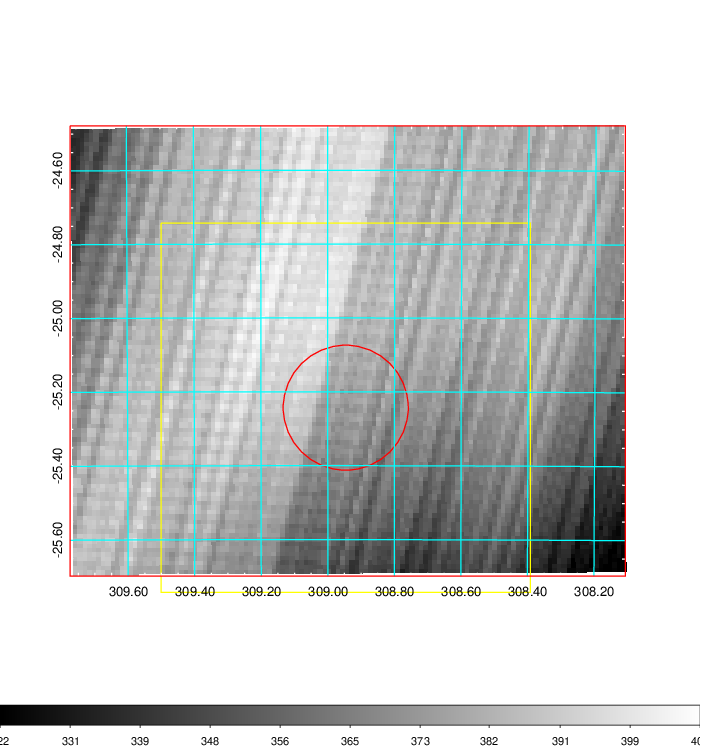   | 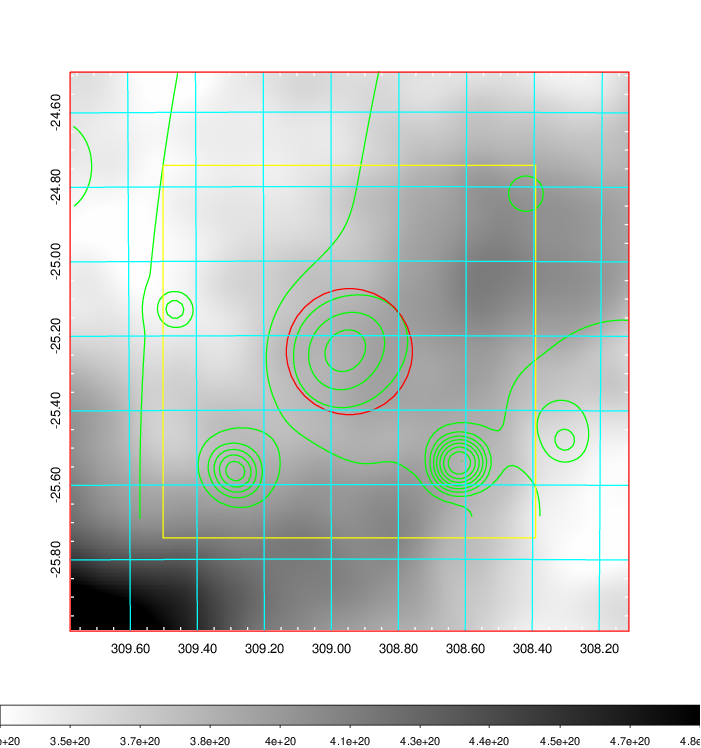    | 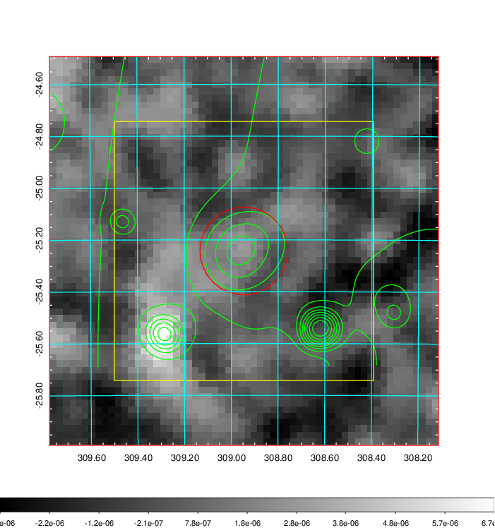 |

|[Redshift Histogram](../image/829/829_zg.pdf) | [DSS image(z1)](../image/829/829_dss_z1.pdf)      |  [DSS image(z2)](../image/829/829_dss_z2.pdf)    |
|-------------------|--------------------|-------------------|
|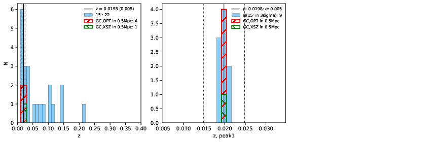 |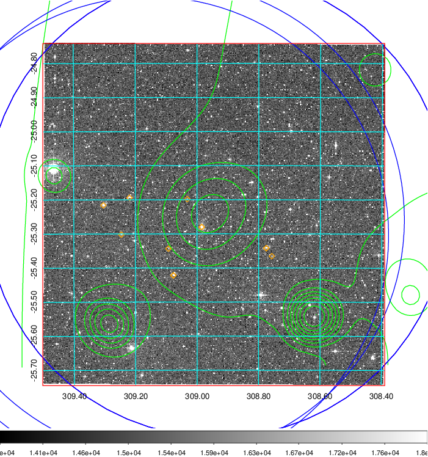  Blue circle for optical clusters;  Magenta circle for XSZ clusters;  all with r=1Mpc;  Only GC with Delta_z<0.01 are shown. | 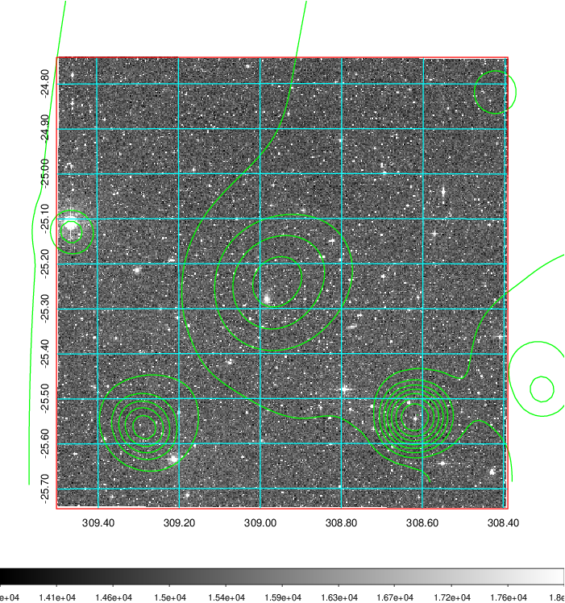 Blue circle for optical clusters;  Magenta circle for XSZ clusters;  all with r=1Mpc;  Only GC with Delta_z<0.01 are shown.  |

|[Previous-identified clusters](../image/829/829_gc.pdf) | [2MASS image](../image/829/829_2mass.pdf)      |
|-------------------|-------------------|
|  Green, magenta, and blue circles  for optical, X-ray and SZ clusters  respectively, with redshift of clusters  labelled. The radius of circles  are 1Mpc.|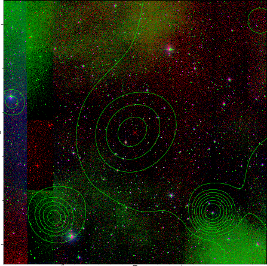  |

|[PS1 image](../image/829/829_ps1.pdf)            |
|-------------------|
| 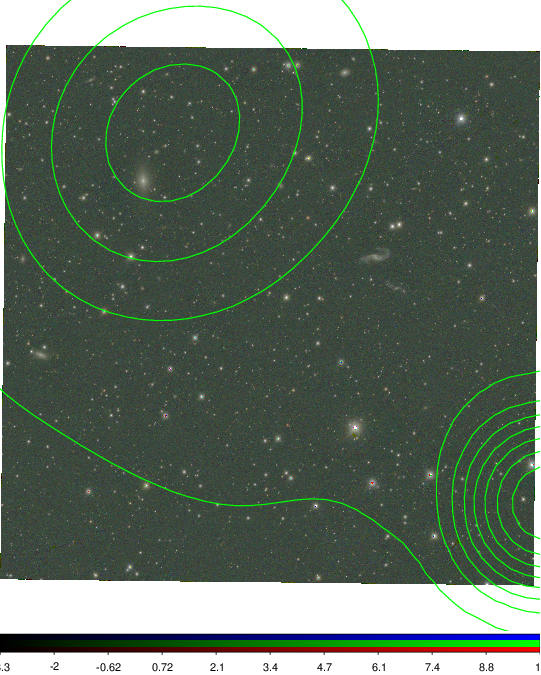  |
