

### 83

|Name|RAJ2000[deg]|DEJ2000[deg] |Ext[arcmin]| Ext,ml | z | z_src| C|GC(XSZ,Delta_z<0.01)| GC(OPT,Delta_z<0.01)|GC| R_sig[arcmin] | R500[arcmin] | R500[Mpc]| CRsig[c/s] | CR500[c/s] |L500[1E44 erg/s]|F500[1E-12 erg/s/cm^2]| M500[1E14 Msun]|Tx[keV]|Cnt_sig|Beta|Rc[arcmin]|Comment|Alias|
|---|---|---|---|---|---|------|---|--------|---------|----------|---|---|---|---|---|---|---|---|---|---|---|---|---|---|
|83| 26.279| -53.031| 1.98| 56.91| 0.1125(0.007)| z1, z_xsz| B| B15, H13, MCXC, PSZ2, Tar| A, N| A, B15, H13, MCXC, N, PSZ2, Tar, W, XB| 6.850| 8.155| 1.001| 0.266(0.048)| 0.275(0.049)| 1.725(0.132)| 5.287(0.405)| 3.18(0.12)| 4.53(0.11)| 71.3| 0.939(-0.079+0.044)| 3.794(-0.447+0.371)| -| k216|

|[RASS image](../image/83/83_img.pdf)|[filtered image](../image/83/83_fil.pdf)|[Segment image](../image/83/83_seg.pdf)|
|-------------------|--------------------|-------------------|
| 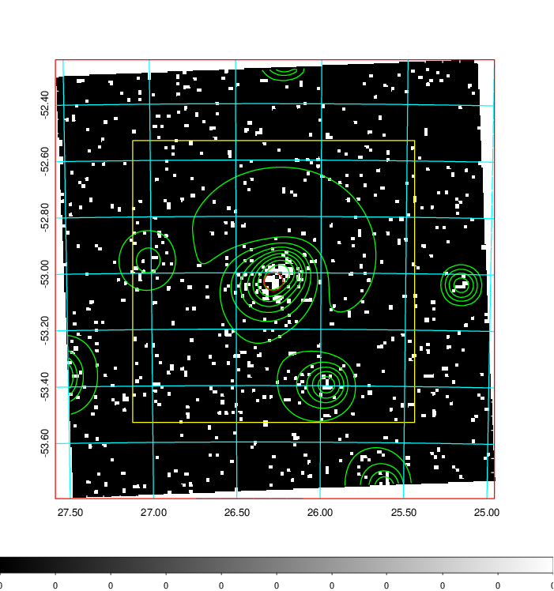  | 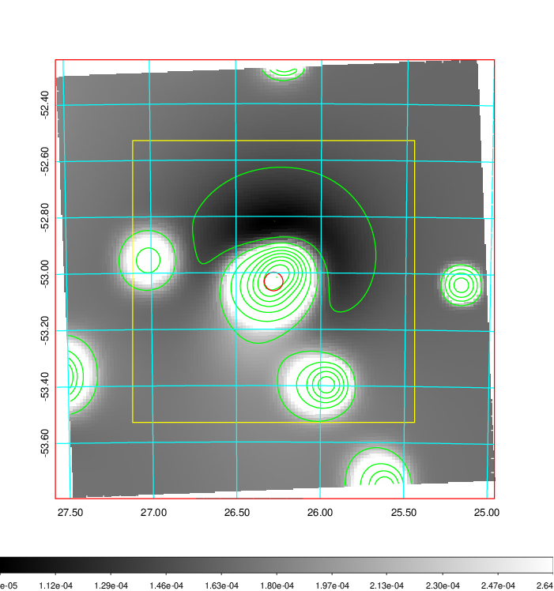   | 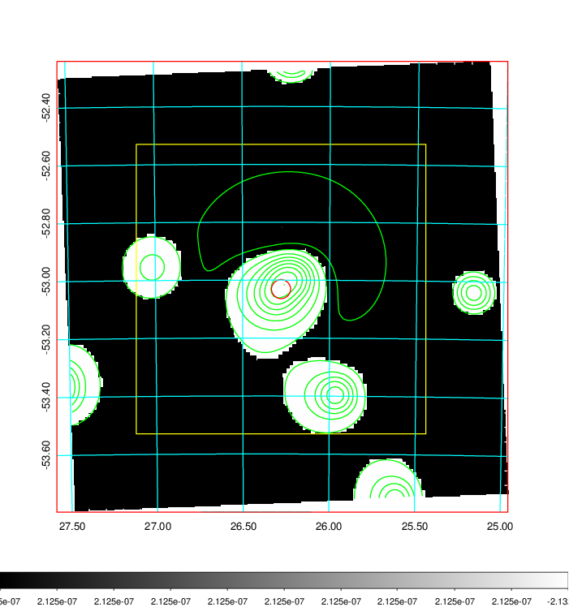  |

|[Exposure image](../image/83/83_mex.pdf)| [nH image](../image/83/83_nh.pdf)| [Planck image](../image/83/83_p.pdf)|
|-------------------|--------------------|-------------------|
|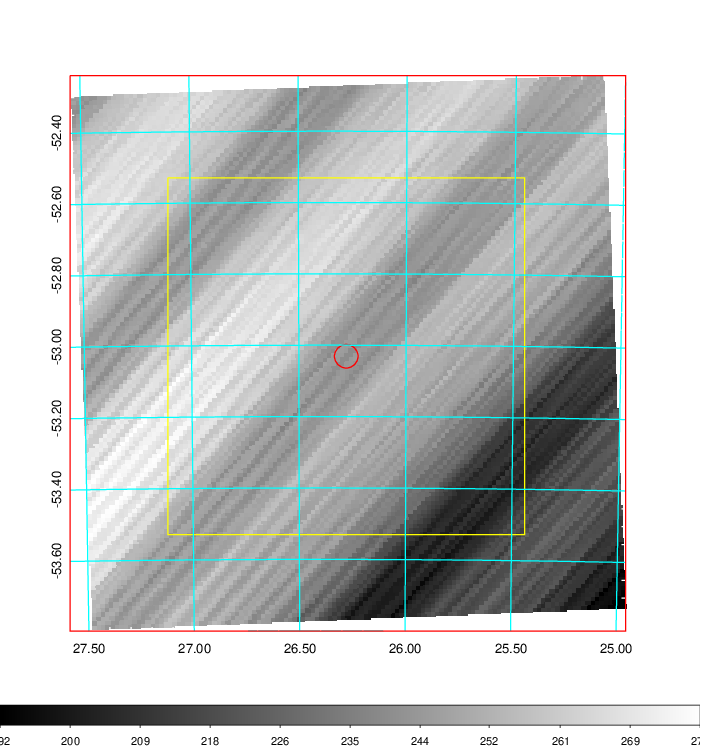   | 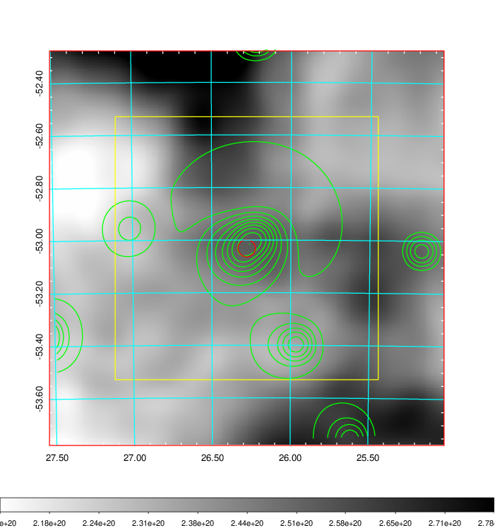    | 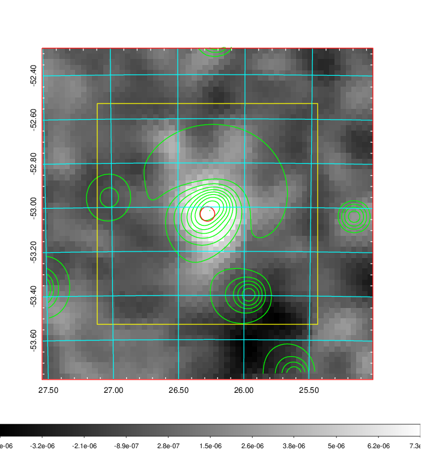 |

|[Redshift Histogram](../image/83/83_zg.pdf) | [DSS image(z1)](../image/83/83_dss_z1.pdf)      |  [DSS image(z2)](../image/83/83_dss_z2.pdf)    |
|-------------------|--------------------|-------------------|
|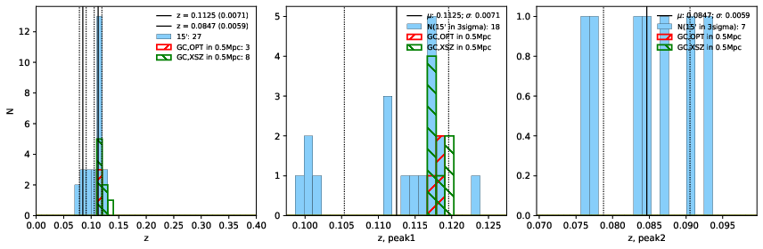 |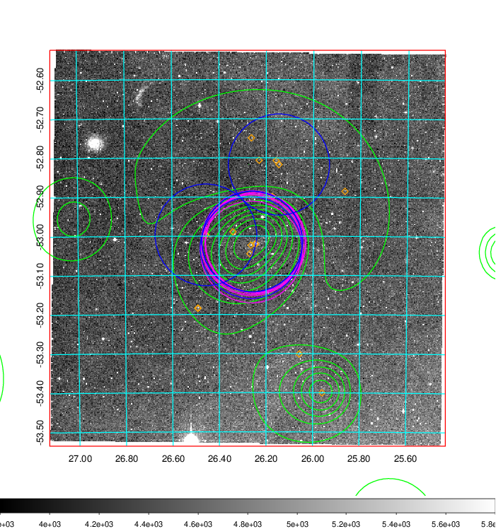  Blue circle for optical clusters;  Magenta circle for XSZ clusters;  all with r=1Mpc;  Only GC with Delta_z<0.01 are shown. | 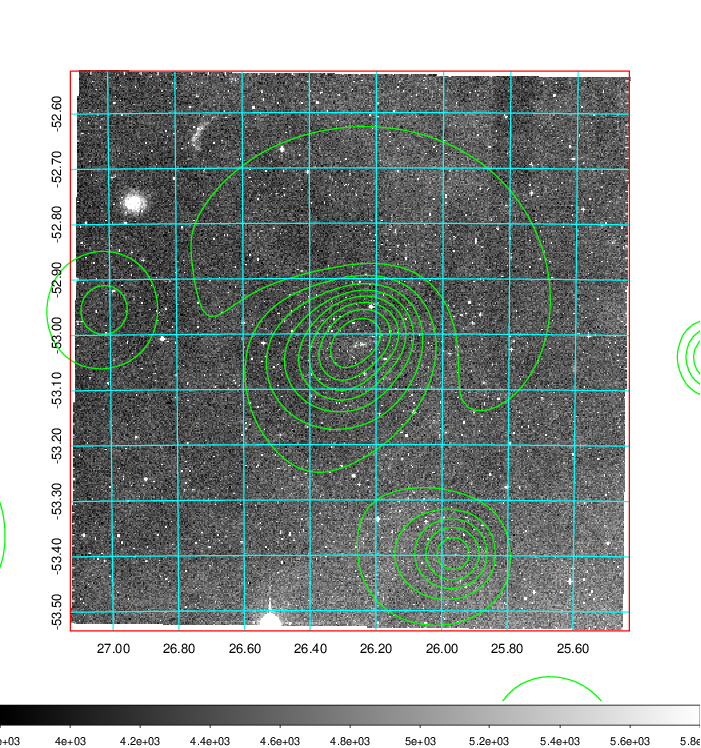 Blue circle for optical clusters;  Magenta circle for XSZ clusters;  all with r=1Mpc;  Only GC with Delta_z<0.01 are shown.  |

|[Previous-identified clusters](../image/83/83_gc.pdf) | [2MASS image](../image/83/83_2mass.pdf)      |
|-------------------|-------------------|
|  Green, magenta, and blue circles  for optical, X-ray and SZ clusters  respectively, with redshift of clusters  labelled. The radius of circles  are 1Mpc.|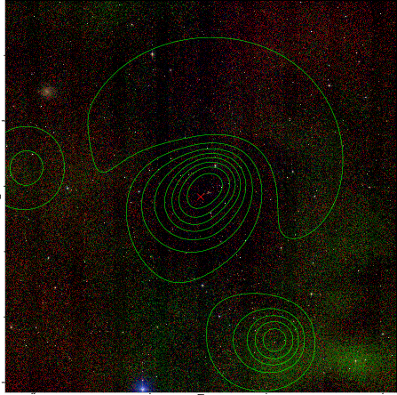  |

|[DES image](../image/83/83_des.pdf)   |
|-------------------|
| 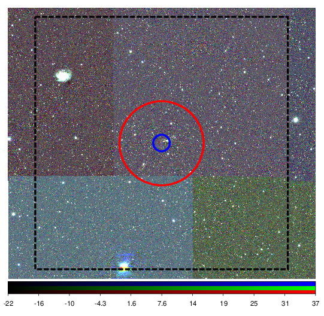  |
