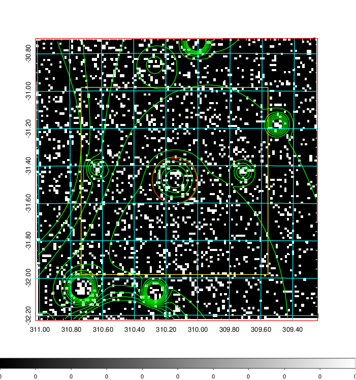
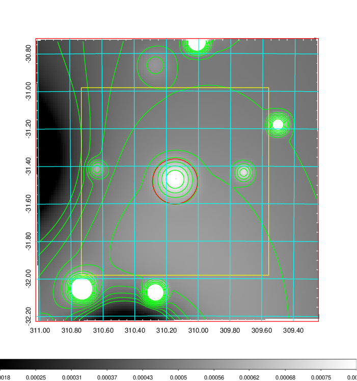
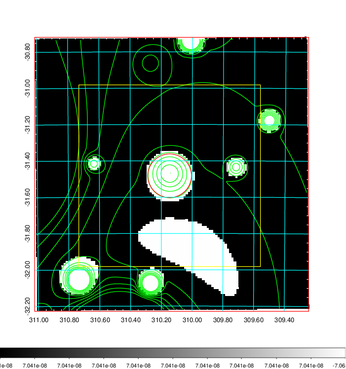
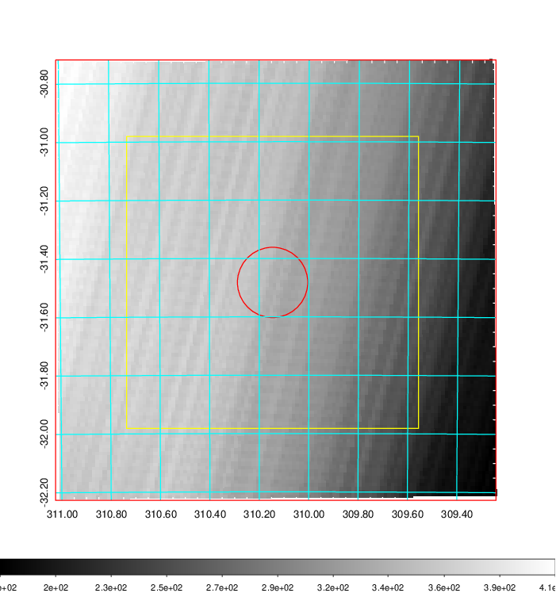
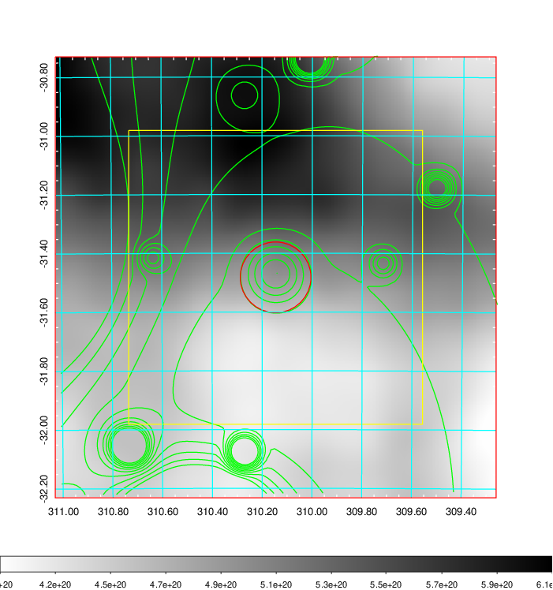
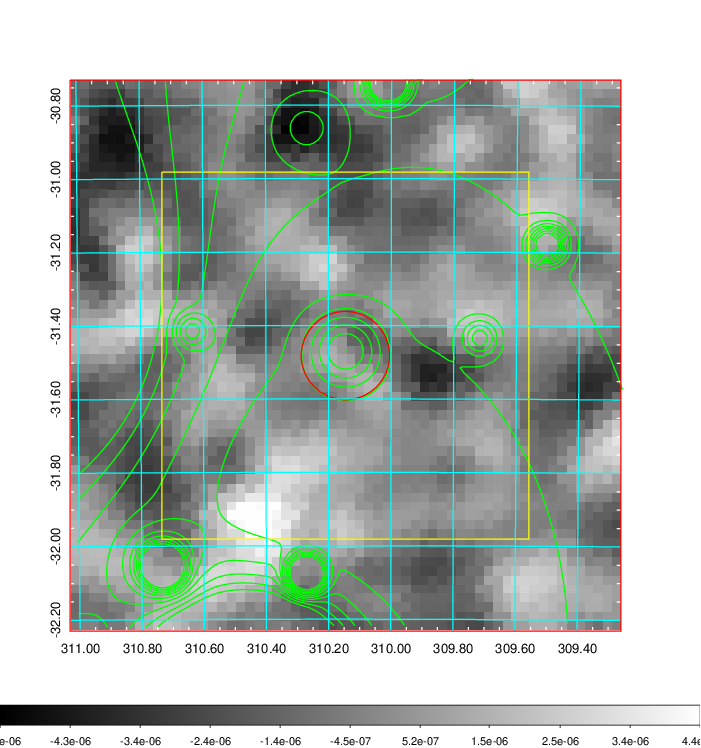
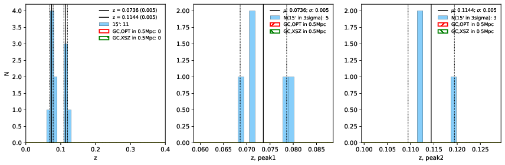
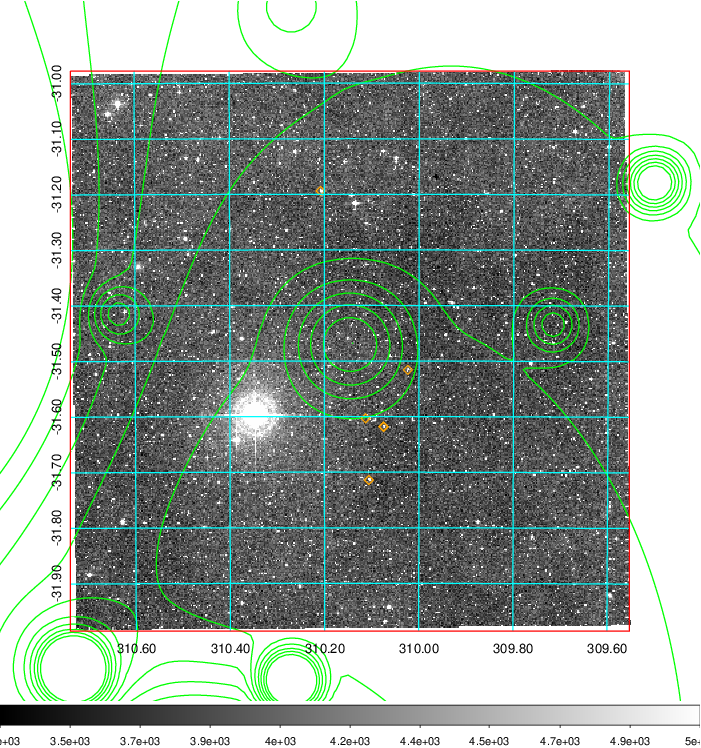
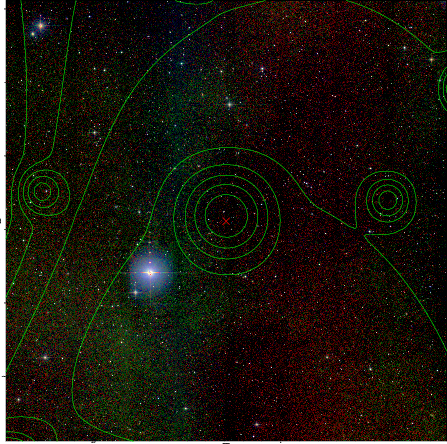
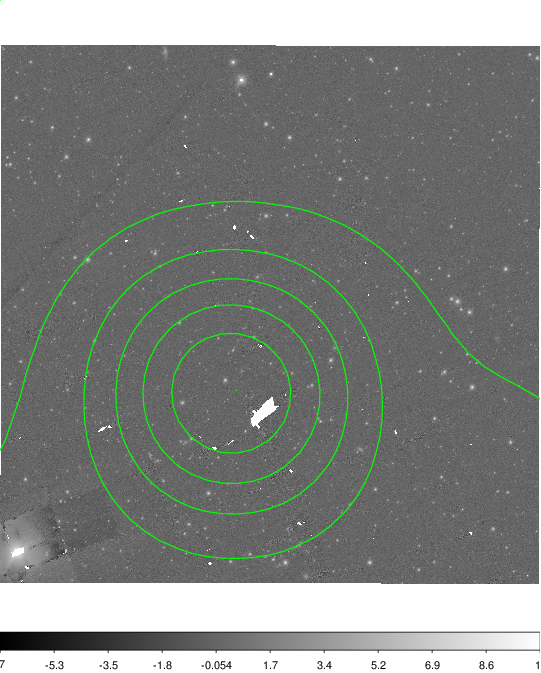

### 830

|Name|RAJ2000[deg]|DEJ2000[deg] |Ext[arcmin]| Ext,ml | z | z_src| C|GC(XSZ,Delta_z<0.01)| GC(OPT,Delta_z<0.01)|GC| R_sig[arcmin] | R500[arcmin] | R500[Mpc]| CRsig[c/s] | CR500[c/s] |L500[1E44 erg/s]|F500[1E-12 erg/s/cm^2]| M500[1E14 Msun]|Tx[keV]|Cnt_sig|Beta|Rc[arcmin]|Comment|Alias|
|---|---|---|---|---|---|------|---|--------|---------|----------|---|---|---|---|---|---|---|---|---|---|---|---|---|---|
|830| 310.146| -31.482| 7.23| 34.07| 0.0736(0.005)| z1,| G| -| -| A, W| 10.262| 7.275| 0.611| 0.057(0.053)| 0.054(0.051)| 0.117(0.056)| 0.885(0.420)| 0.70(0.17)| 1.75(0.27)| 57.8| 0.832(-0.171+0.118)| 4.418(-1.250+1.265)| An Abell cluster with no $z$ and offset = 0.58 Mpc(6.86 arcmin)| t361|

|[RASS image](../image/830/830_img.pdf)|[filtered image](../image/830/830_fil.pdf)|[Segment image](../image/830/830_seg.pdf)|
|-------------------|--------------------|-------------------|
|   |    |   |

|[Exposure image](../image/830/830_mex.pdf)| [nH image](../image/830/830_nh.pdf)| [Planck image](../image/830/830_p.pdf)|
|-------------------|--------------------|-------------------|
|   |     |  |

|[Redshift Histogram](../image/830/830_zg.pdf) | [DSS image(z1)](../image/830/830_dss_z1.pdf)      |  [DSS image(z2)](../image/830/830_dss_z2.pdf)    |
|-------------------|--------------------|-------------------|
| |  Blue circle for optical clusters;  Magenta circle for XSZ clusters;  all with r=1Mpc;  Only GC with Delta_z<0.01 are shown. |  Blue circle for optical clusters;  Magenta circle for XSZ clusters;  all with r=1Mpc;  Only GC with Delta_z<0.01 are shown.  |

|[Previous-identified clusters](../image/830/830_gc.pdf) | [2MASS image](../image/830/830_2mass.pdf)      |
|-------------------|-------------------|
|  Green, magenta, and blue circles  for optical, X-ray and SZ clusters  respectively, with redshift of clusters  labelled. The radius of circles  are 1Mpc.|  |

|[PS1 image](../image/830/830_ps1.pdf)            |
|-------------------|
|   |
