

### 831

|Name|RAJ2000[deg]|DEJ2000[deg] |Ext[arcmin]| Ext,ml | z | z_src| C|GC(XSZ,Delta_z<0.01)| GC(OPT,Delta_z<0.01)|GC| R_sig[arcmin] | R500[arcmin] | R500[Mpc]| CRsig[c/s] | CR500[c/s] |L500[1E44 erg/s]|F500[1E-12 erg/s/cm^2]| M500[1E14 Msun]|Tx[keV]|Cnt_sig|Beta|Rc[arcmin]|Comment|Alias|
|---|---|---|---|---|---|------|---|--------|---------|----------|---|---|---|---|---|---|---|---|---|---|---|---|---|---|
|831| 310.858| -26.464| 4.50| 56.73| 0.0424(0.005)| z1, z_xsz| B| MCXC, Tar| A, N| A, MCXC, N, Tar, W| 8.800| 12.631| 0.634| 0.181(0.041)| 0.195(0.044)| 0.128(0.015)| 3.042(0.347)| 0.75(0.04)| 1.82(0.07)| 54.1| 0.935(-0.087+0.048)| 8.578(-0.856+0.762)| -| k504|

|[RASS image](../image/831/831_img.pdf)|[filtered image](../image/831/831_fil.pdf)|[Segment image](../image/831/831_seg.pdf)|
|-------------------|--------------------|-------------------|
| 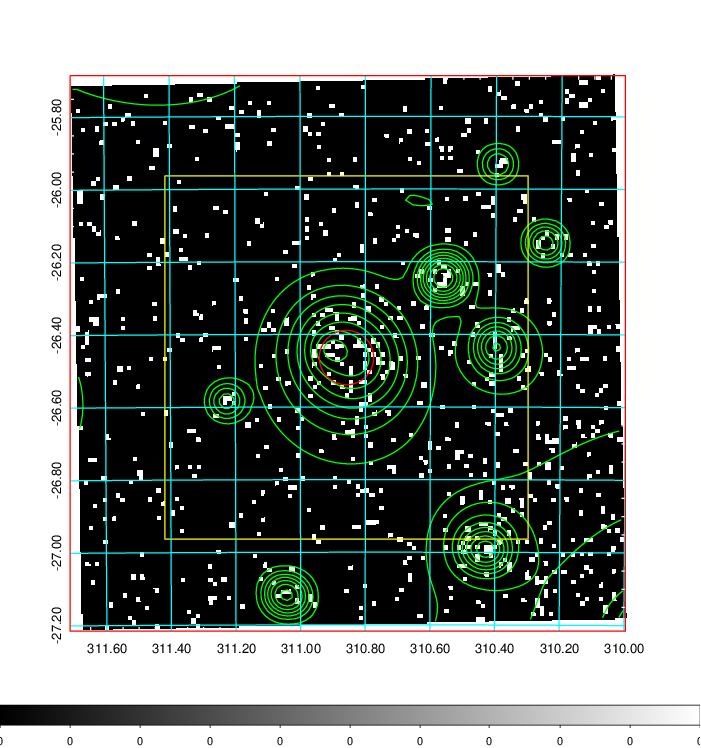  | 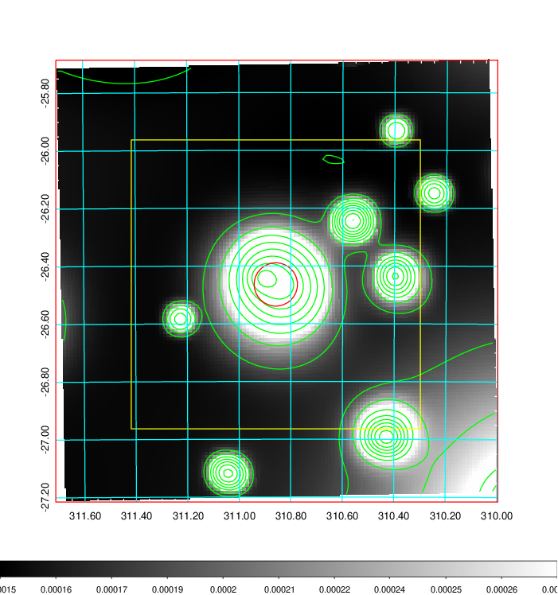   | 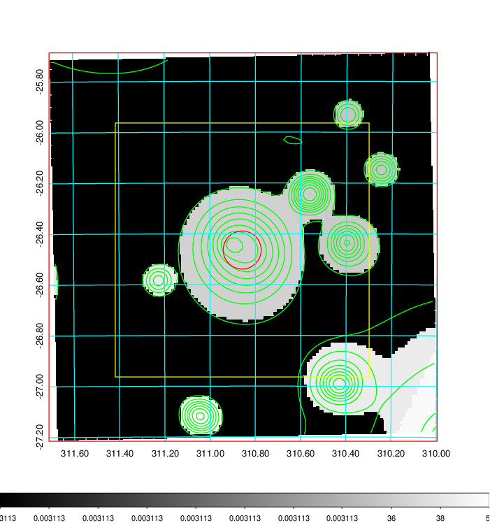  |

|[Exposure image](../image/831/831_mex.pdf)| [nH image](../image/831/831_nh.pdf)| [Planck image](../image/831/831_p.pdf)|
|-------------------|--------------------|-------------------|
|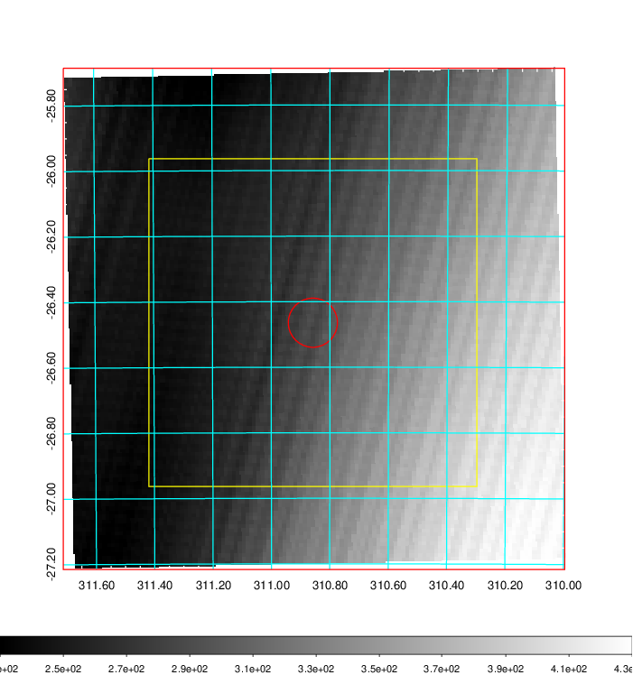   | 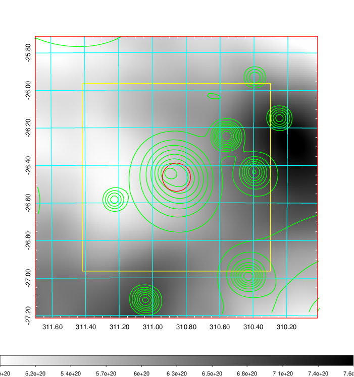    | 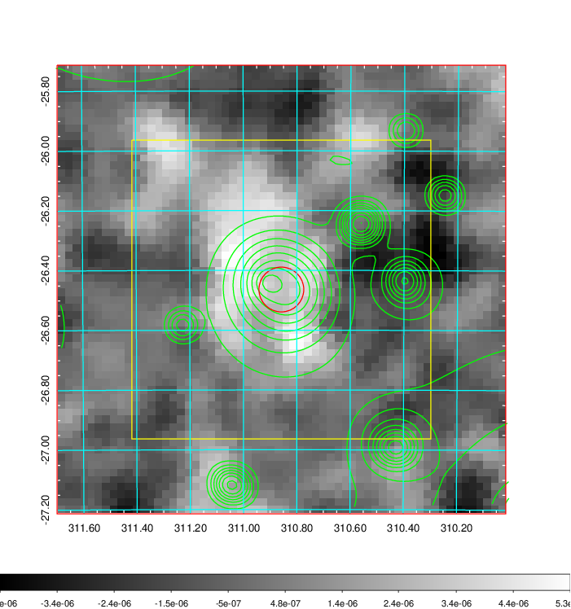 |

|[Redshift Histogram](../image/831/831_zg.pdf) | [DSS image(z1)](../image/831/831_dss_z1.pdf)      |  [DSS image(z2)](../image/831/831_dss_z2.pdf)    |
|-------------------|--------------------|-------------------|
|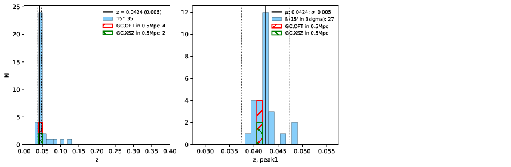 |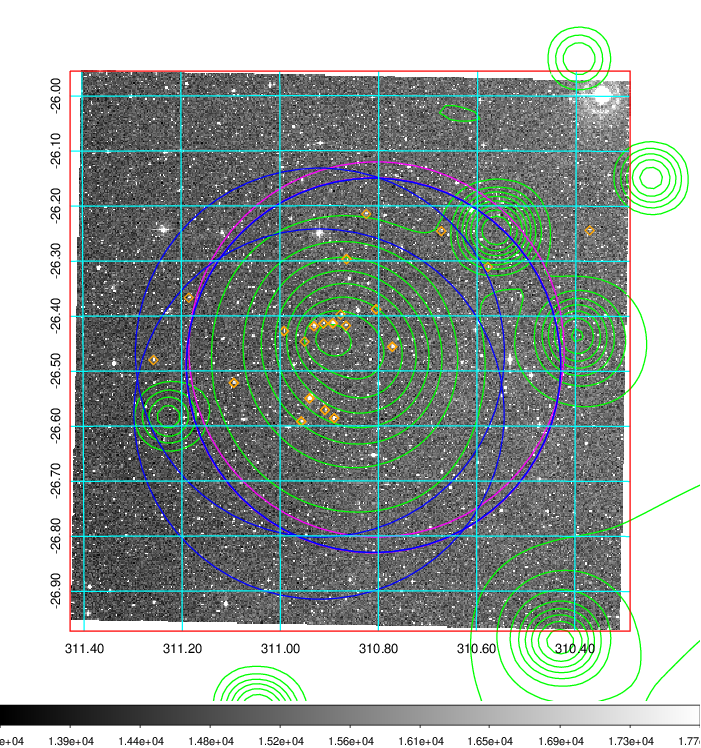  Blue circle for optical clusters;  Magenta circle for XSZ clusters;  all with r=1Mpc;  Only GC with Delta_z<0.01 are shown. | 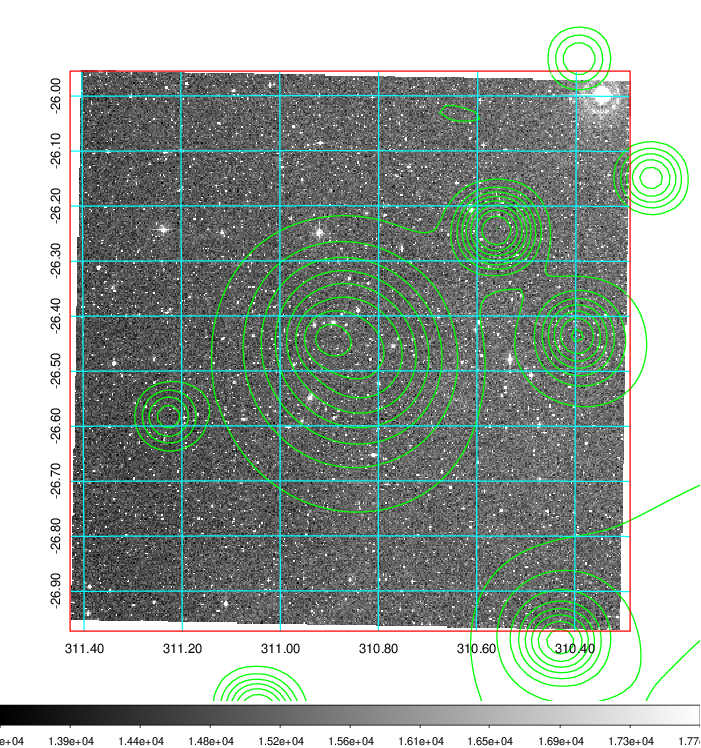 Blue circle for optical clusters;  Magenta circle for XSZ clusters;  all with r=1Mpc;  Only GC with Delta_z<0.01 are shown.  |

|[Previous-identified clusters](../image/831/831_gc.pdf) | [2MASS image](../image/831/831_2mass.pdf)      |
|-------------------|-------------------|
|  Green, magenta, and blue circles  for optical, X-ray and SZ clusters  respectively, with redshift of clusters  labelled. The radius of circles  are 1Mpc.|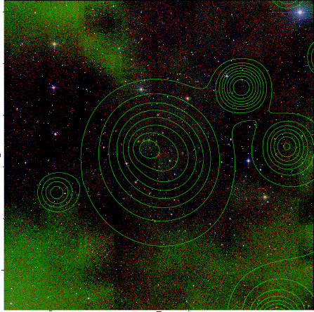  |

|[PS1 image](../image/831/831_ps1.pdf)            |
|-------------------|
| 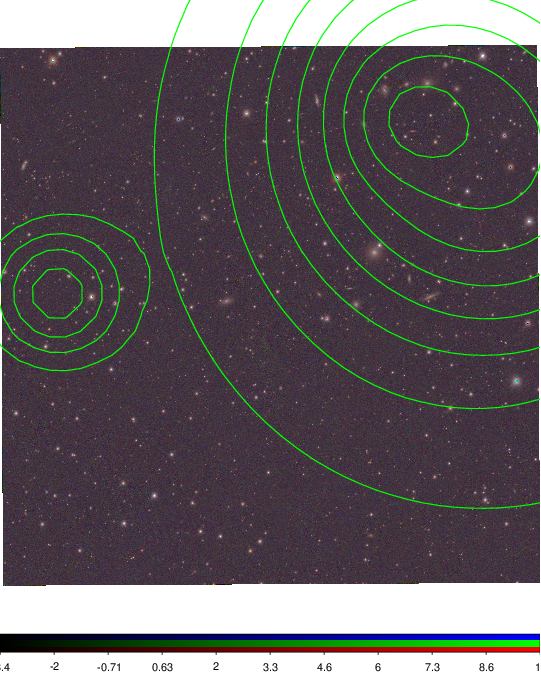  |
