

### 832

|Name|RAJ2000[deg]|DEJ2000[deg] |Ext[arcmin]| Ext,ml | z | z_src| C|GC(XSZ,Delta_z<0.01)| GC(OPT,Delta_z<0.01)|GC| R_sig[arcmin] | R500[arcmin] | R500[Mpc]| CRsig[c/s] | CR500[c/s] |L500[1E44 erg/s]|F500[1E-12 erg/s/cm^2]| M500[1E14 Msun]|Tx[keV]|Cnt_sig|Beta|Rc[arcmin]|Comment|Alias|
|---|---|---|---|---|---|------|---|--------|---------|----------|---|---|---|---|---|---|---|---|---|---|---|---|---|---|
|832| 312.060| -17.835| 1.82| 39.35| 0.1408(0.007)| z1, z_xsz| B| MCXC, PSZ2, Tar| A, N, W| A, MCXC, N, PSZ2, Tar, W| 20.750| 7.764| 1.155| 0.380(0.086)| 0.345(0.078)| 3.438(0.393)| 6.487(0.741)| 5.03(0.28)| 6.06(0.21)| 92.1| 0.661(-0.072+0.107)| 2.780(-0.831+0.980)| -| k174|

|[RASS image](../image/832/832_img.pdf)|[filtered image](../image/832/832_fil.pdf)|[Segment image](../image/832/832_seg.pdf)|
|-------------------|--------------------|-------------------|
| 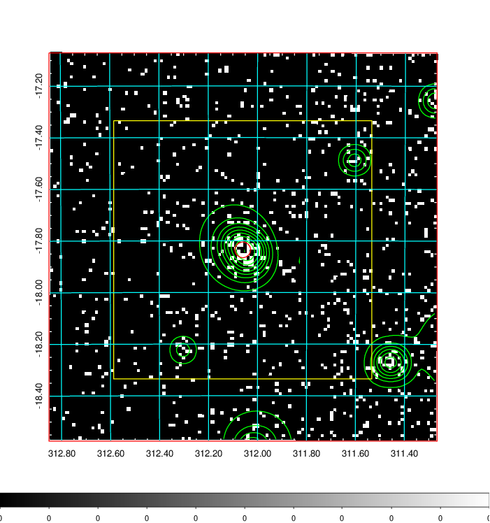  | 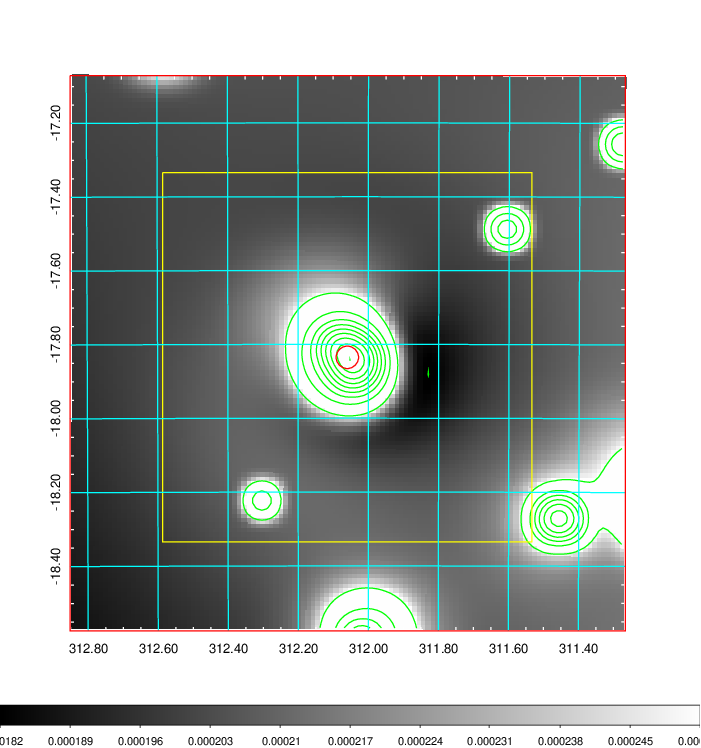   | 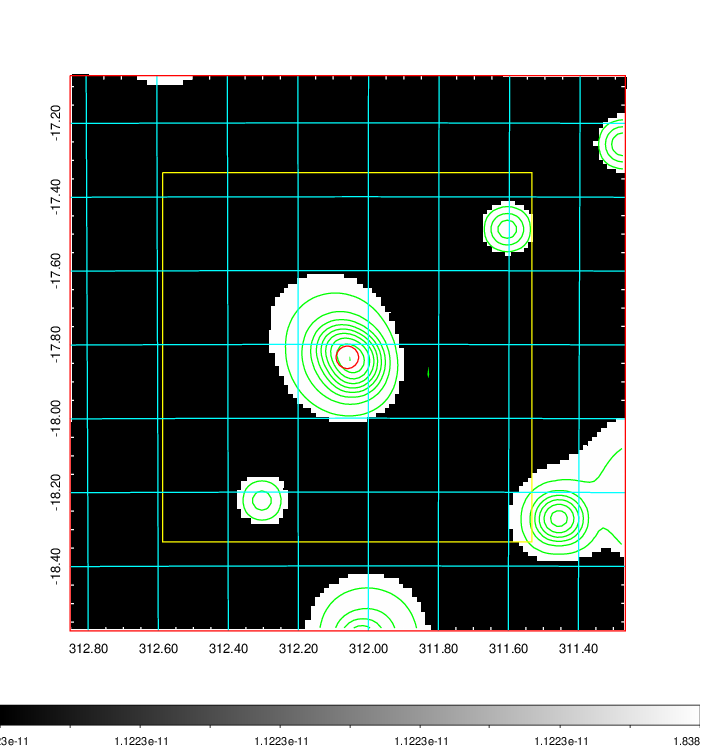  |

|[Exposure image](../image/832/832_mex.pdf)| [nH image](../image/832/832_nh.pdf)| [Planck image](../image/832/832_p.pdf)|
|-------------------|--------------------|-------------------|
|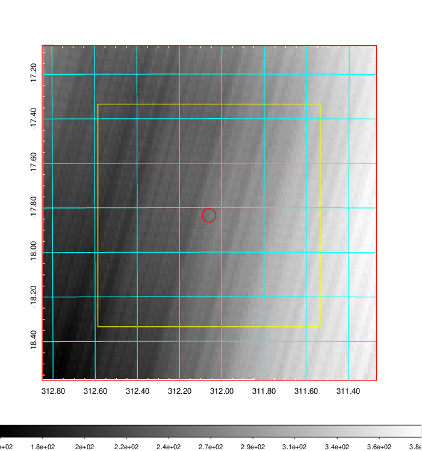   | 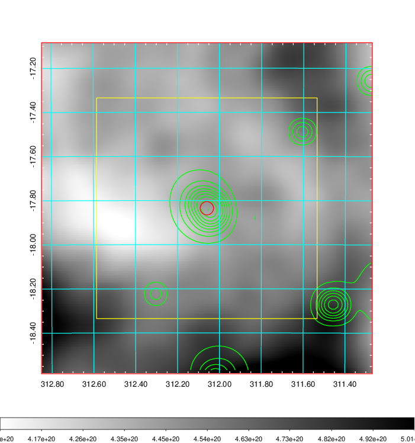    | 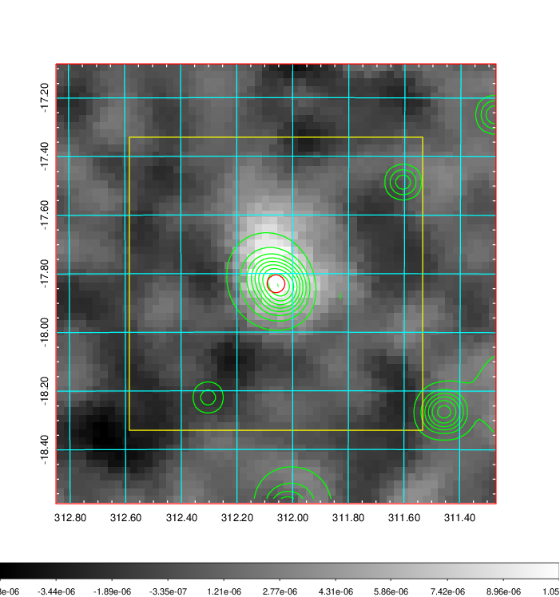 |

|[Redshift Histogram](../image/832/832_zg.pdf) | [DSS image(z1)](../image/832/832_dss_z1.pdf)      |  [DSS image(z2)](../image/832/832_dss_z2.pdf)    |
|-------------------|--------------------|-------------------|
|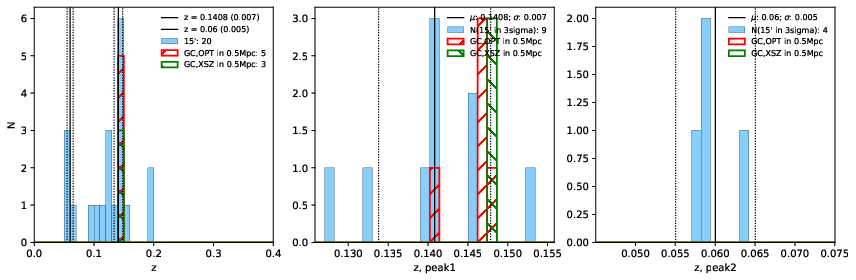 |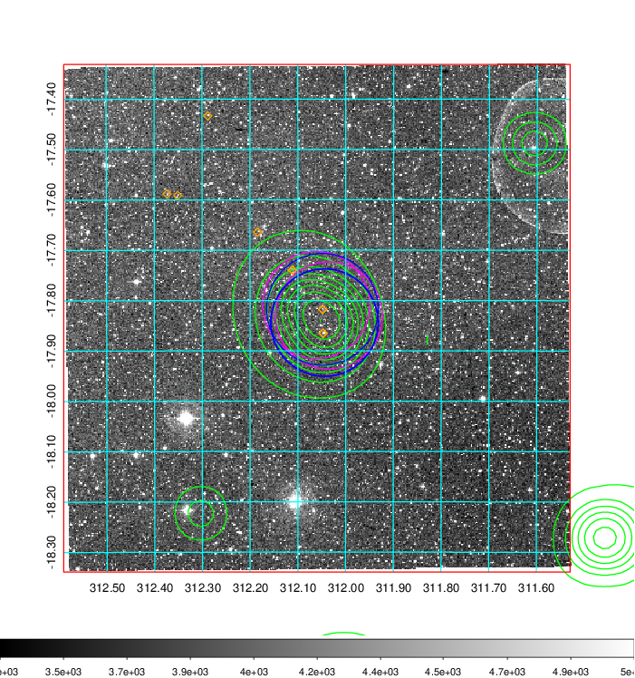  Blue circle for optical clusters;  Magenta circle for XSZ clusters;  all with r=1Mpc;  Only GC with Delta_z<0.01 are shown. | 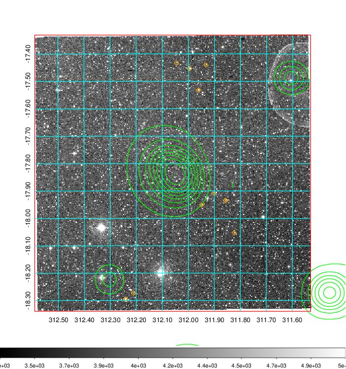 Blue circle for optical clusters;  Magenta circle for XSZ clusters;  all with r=1Mpc;  Only GC with Delta_z<0.01 are shown.  |

|[Previous-identified clusters](../image/832/832_gc.pdf) | [2MASS image](../image/832/832_2mass.pdf)      |
|-------------------|-------------------|
|  Green, magenta, and blue circles  for optical, X-ray and SZ clusters  respectively, with redshift of clusters  labelled. The radius of circles  are 1Mpc.|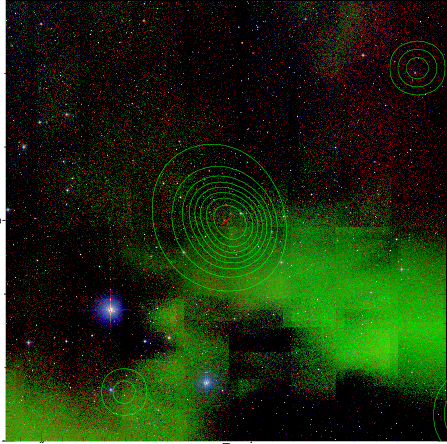  |

|[PS1 image](../image/832/832_ps1.pdf)            |
|-------------------|
| 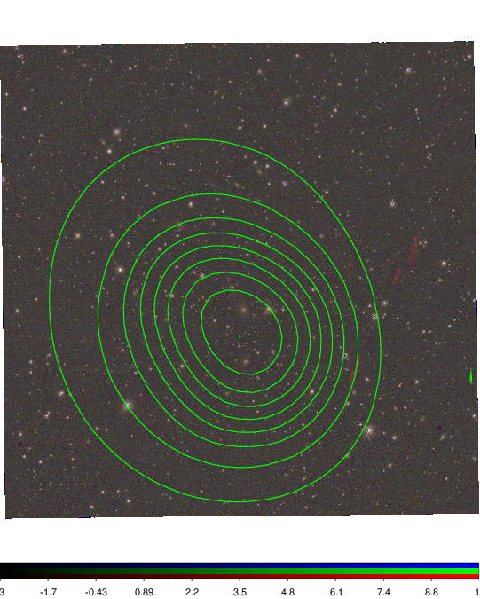  |
