

### 835

|Name|RAJ2000[deg]|DEJ2000[deg] |Ext[arcmin]| Ext,ml | z | z_src| C|GC(XSZ,Delta_z<0.01)| GC(OPT,Delta_z<0.01)|GC| R_sig[arcmin] | R500[arcmin] | R500[Mpc]| CRsig[c/s] | CR500[c/s] |L500[1E44 erg/s]|F500[1E-12 erg/s/cm^2]| M500[1E14 Msun]|Tx[keV]|Cnt_sig|Beta|Rc[arcmin]|Comment|Alias|
|---|---|---|---|---|---|------|---|--------|---------|----------|---|---|---|---|---|---|---|---|---|---|---|---|---|---|
|835| 315.429| -28.034| 6.27| 135.17| 0.0387(0.005)| z1, z_xsz| B| MCXC, XB| A, N| A, MCXC, N, XB| 19.762| 15.379| 0.708| 0.379(0.061)| 0.365(0.059)| 0.208(0.018)| 5.974(0.518)| 1.05(0.05)| 2.23(0.06)| 159.9| 0.959(-0.055+0.030)| 10.561(-0.677+0.512)| -| k546|

|[RASS image](../image/835/835_img.pdf)|[filtered image](../image/835/835_fil.pdf)|[Segment image](../image/835/835_seg.pdf)|
|-------------------|--------------------|-------------------|
| 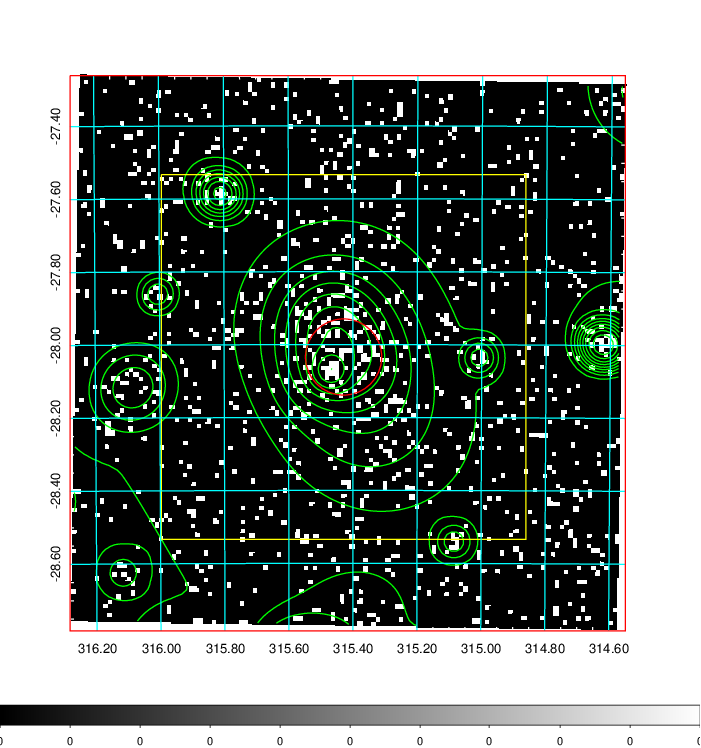  | 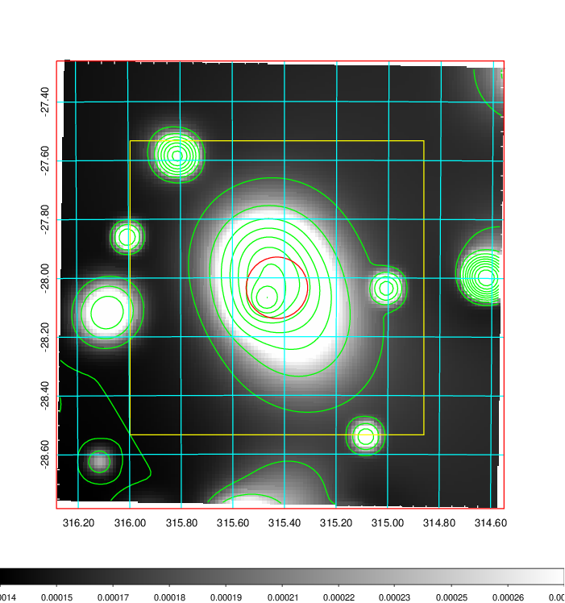   | 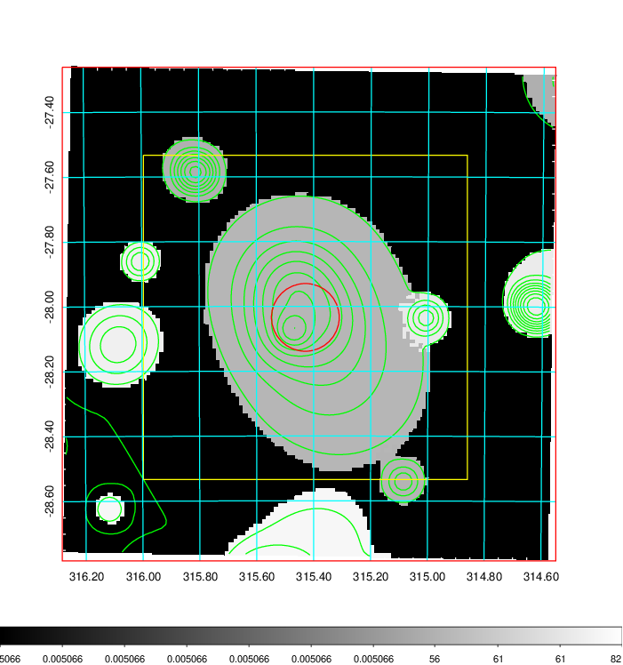  |

|[Exposure image](../image/835/835_mex.pdf)| [nH image](../image/835/835_nh.pdf)| [Planck image](../image/835/835_p.pdf)|
|-------------------|--------------------|-------------------|
|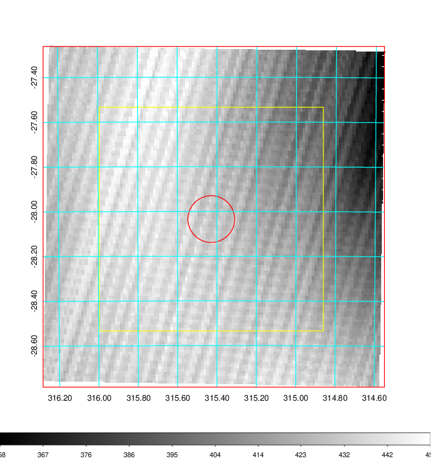   | 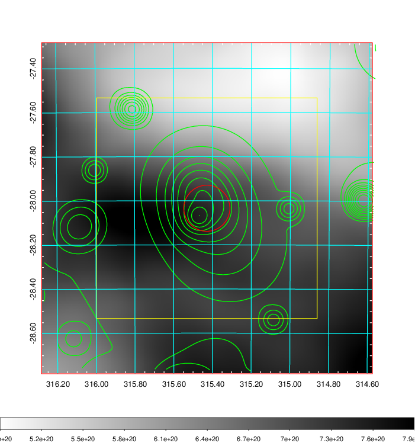    | 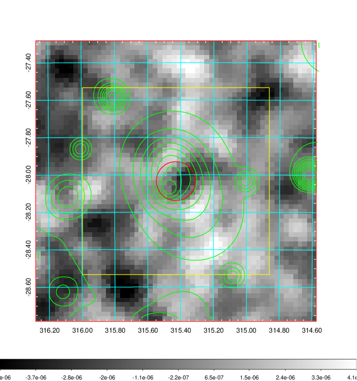 |

|[Redshift Histogram](../image/835/835_zg.pdf) | [DSS image(z1)](../image/835/835_dss_z1.pdf)      |  [DSS image(z2)](../image/835/835_dss_z2.pdf)    |
|-------------------|--------------------|-------------------|
|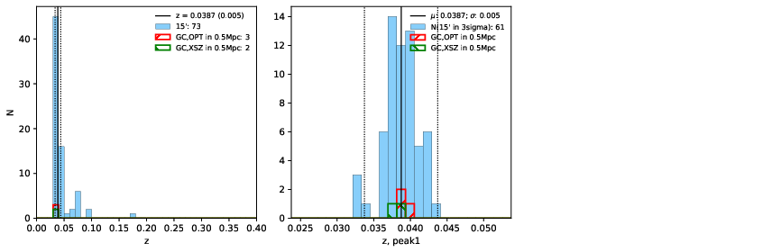 |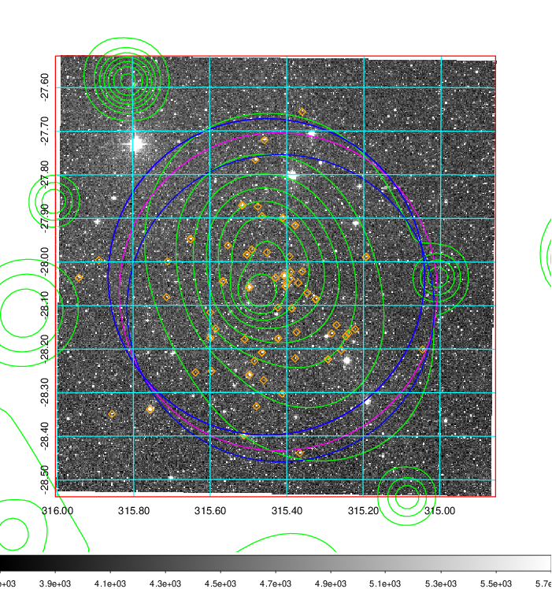  Blue circle for optical clusters;  Magenta circle for XSZ clusters;  all with r=1Mpc;  Only GC with Delta_z<0.01 are shown. | 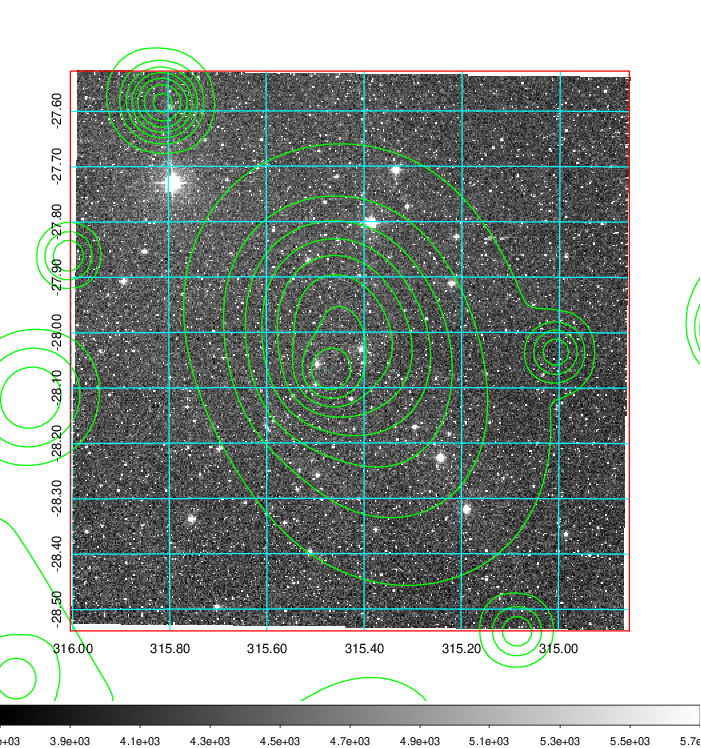 Blue circle for optical clusters;  Magenta circle for XSZ clusters;  all with r=1Mpc;  Only GC with Delta_z<0.01 are shown.  |

|[Previous-identified clusters](../image/835/835_gc.pdf) | [2MASS image](../image/835/835_2mass.pdf)      |
|-------------------|-------------------|
|  Green, magenta, and blue circles  for optical, X-ray and SZ clusters  respectively, with redshift of clusters  labelled. The radius of circles  are 1Mpc.|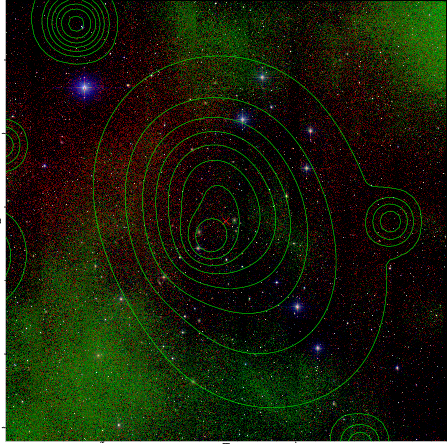  |

|[PS1 image](../image/835/835_ps1.pdf)            |
|-------------------|
| 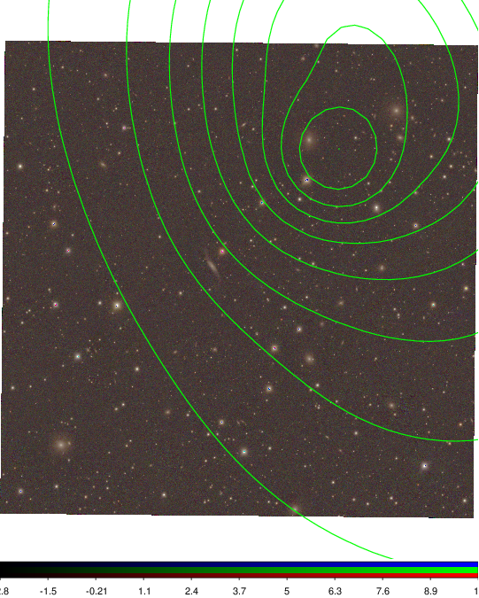  |
