

### 836

|Name|RAJ2000[deg]|DEJ2000[deg] |Ext[arcmin]| Ext,ml | z | z_src| C|GC(XSZ,Delta_z<0.01)| GC(OPT,Delta_z<0.01)|GC| R_sig[arcmin] | R500[arcmin] | R500[Mpc]| CRsig[c/s] | CR500[c/s] |L500[1E44 erg/s]|F500[1E-12 erg/s/cm^2]| M500[1E14 Msun]|Tx[keV]|Cnt_sig|Beta|Rc[arcmin]|Comment|Alias|
|---|---|---|---|---|---|------|---|--------|---------|----------|---|---|---|---|---|---|---|---|---|---|---|---|---|---|
|836| 315.877| -43.338| 3.05| 33.77| 0.0494(0.000)| z_xsz| B| MCXC, PSZ2, Tar| A, N| A, MCXC, N, PSZ2, Tar, W| 12.212| 11.127| 0.645| 0.163(0.049)| 0.160(0.048)| 0.165(0.044)| 2.859(0.767)| 0.80(0.11)| 1.90(0.16)| 64.3| 0.812(-0.158+0.129)| 4.413(-1.145+0.940)| -| k384|

|[RASS image](../image/836/836_img.pdf)|[filtered image](../image/836/836_fil.pdf)|[Segment image](../image/836/836_seg.pdf)|
|-------------------|--------------------|-------------------|
| 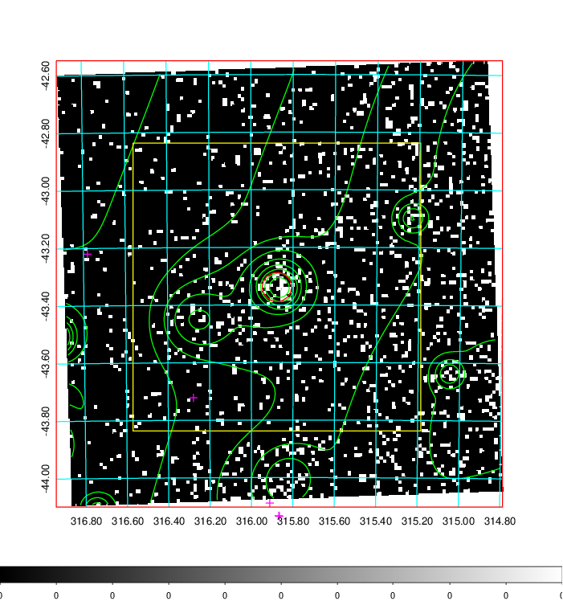  | 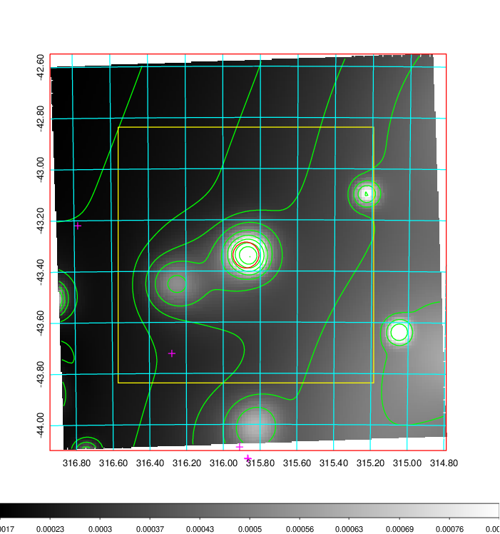   | 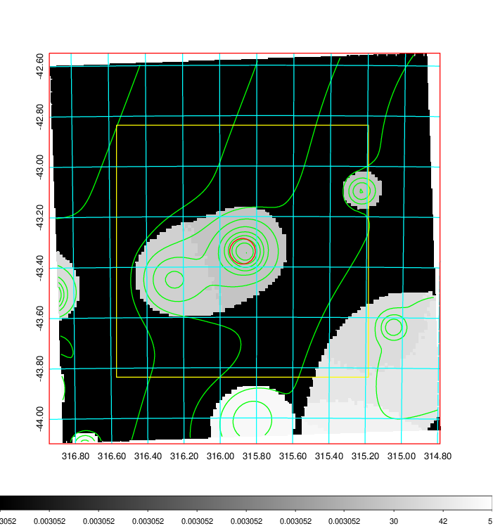  |

|[Exposure image](../image/836/836_mex.pdf)| [nH image](../image/836/836_nh.pdf)| [Planck image](../image/836/836_p.pdf)|
|-------------------|--------------------|-------------------|
|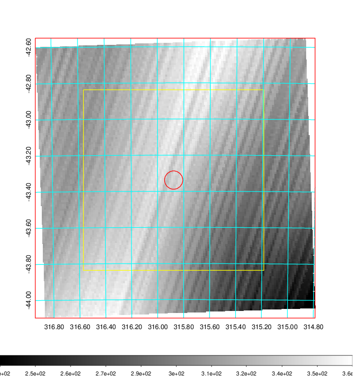   | 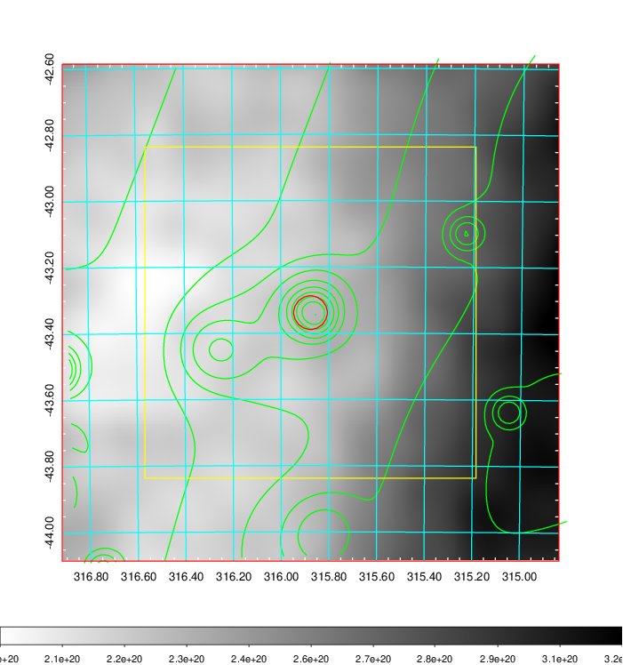    | 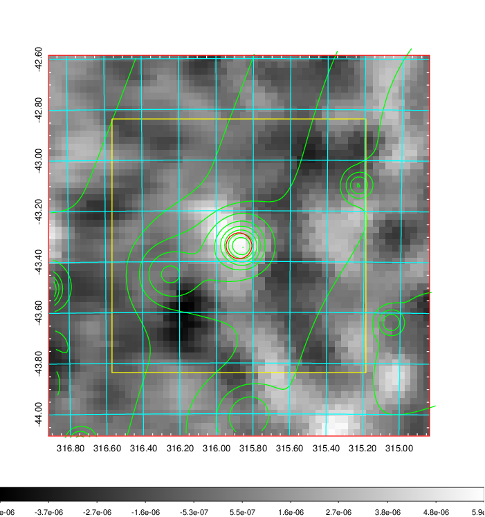 |

|[Redshift Histogram](../image/836/836_zg.pdf) | [DSS image(z1)](../image/836/836_dss_z1.pdf)      |  [DSS image(z2)](../image/836/836_dss_z2.pdf)    |
|-------------------|--------------------|-------------------|
|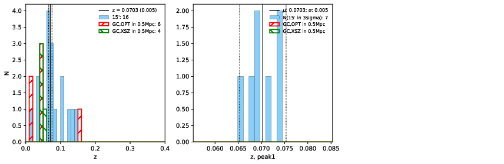 |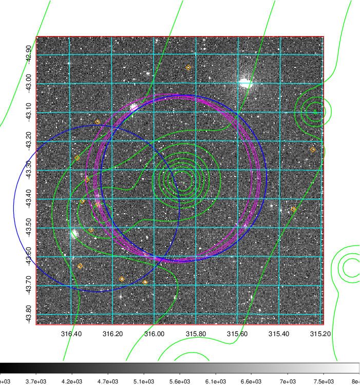  Blue circle for optical clusters;  Magenta circle for XSZ clusters;  all with r=1Mpc;  Only GC with Delta_z<0.01 are shown. | 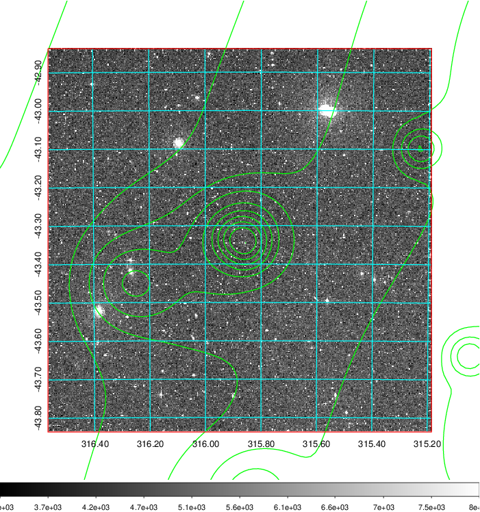 Blue circle for optical clusters;  Magenta circle for XSZ clusters;  all with r=1Mpc;  Only GC with Delta_z<0.01 are shown.  |

|[Previous-identified clusters](../image/836/836_gc.pdf) | [2MASS image](../image/836/836_2mass.pdf)      |
|-------------------|-------------------|
|  Green, magenta, and blue circles  for optical, X-ray and SZ clusters  respectively, with redshift of clusters  labelled. The radius of circles  are 1Mpc.|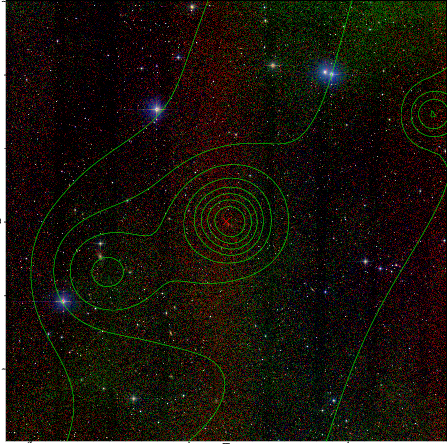  |

|[DES image](../image/836/836_des.pdf)   |
|-------------------|
| 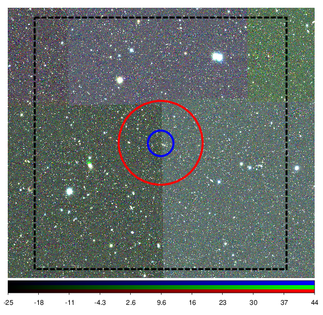  |
