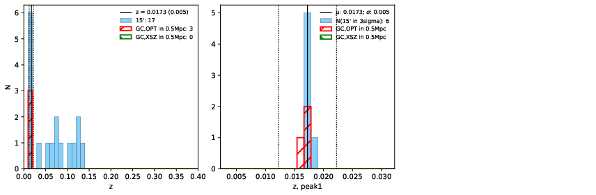

### 837

|Name|RAJ2000[deg]|DEJ2000[deg] |Ext[arcmin]| Ext,ml | z | z_src| C|GC(XSZ,Delta_z<0.01)| GC(OPT,Delta_z<0.01)|GC| R_sig[arcmin] | R500[arcmin] | R500[Mpc]| CRsig[c/s] | CR500[c/s] |L500[1E44 erg/s]|F500[1E-12 erg/s/cm^2]| M500[1E14 Msun]|Tx[keV]|Cnt_sig|Beta|Rc[arcmin]|Comment|Alias|
|---|---|---|---|---|---|------|---|--------|---------|----------|---|---|---|---|---|---|---|---|---|---|---|---|---|---|
|837| 316.165| -47.695| 4.46| 34.78| 0.0173(0.005)| z1, z_opt| S| -| N| N| 45.055| 25.906| 0.547| 0.655(0.141)| 0.612(0.132)| 0.061(0.027)| 9.025(4.049)| 0.47(0.11)| 1.36(0.20)| 432.3| 0.503(-0.003+0.005)| 9.652(-0.360+0.320)| -| t230|

|[RASS image](../image/837/837_img.pdf)|[filtered image](../image/837/837_fil.pdf)|[Segment image](../image/837/837_seg.pdf)|
|-------------------|--------------------|-------------------|
|   |    |   |

|[Exposure image](../image/837/837_mex.pdf)| [nH image](../image/837/837_nh.pdf)| [Planck image](../image/837/837_p.pdf)|
|-------------------|--------------------|-------------------|
|   |     |  |

|[Redshift Histogram](../image/837/837_zg.pdf) | [DSS image(z1)](../image/837/837_dss_z1.pdf)      |  [DSS image(z2)](../image/837/837_dss_z2.pdf)    |
|-------------------|--------------------|-------------------|
| |  Blue circle for optical clusters;  Magenta circle for XSZ clusters;  all with r=1Mpc;  Only GC with Delta_z<0.01 are shown. |  Blue circle for optical clusters;  Magenta circle for XSZ clusters;  all with r=1Mpc;  Only GC with Delta_z<0.01 are shown.  |

|[Previous-identified clusters](../image/837/837_gc.pdf) | [2MASS image](../image/837/837_2mass.pdf)      |
|-------------------|-------------------|
|  Green, magenta, and blue circles  for optical, X-ray and SZ clusters  respectively, with redshift of clusters  labelled. The radius of circles  are 1Mpc.|  |

|[DES image](../image/837/837_des.pdf)   |
|-------------------|
|   |
