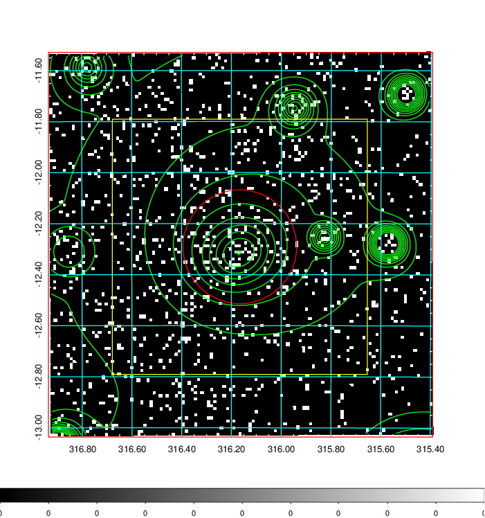
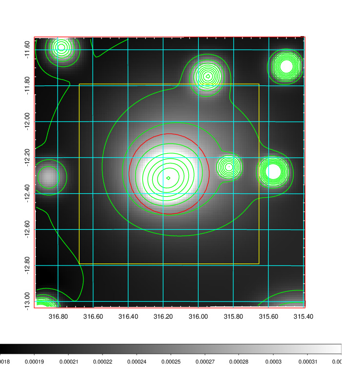
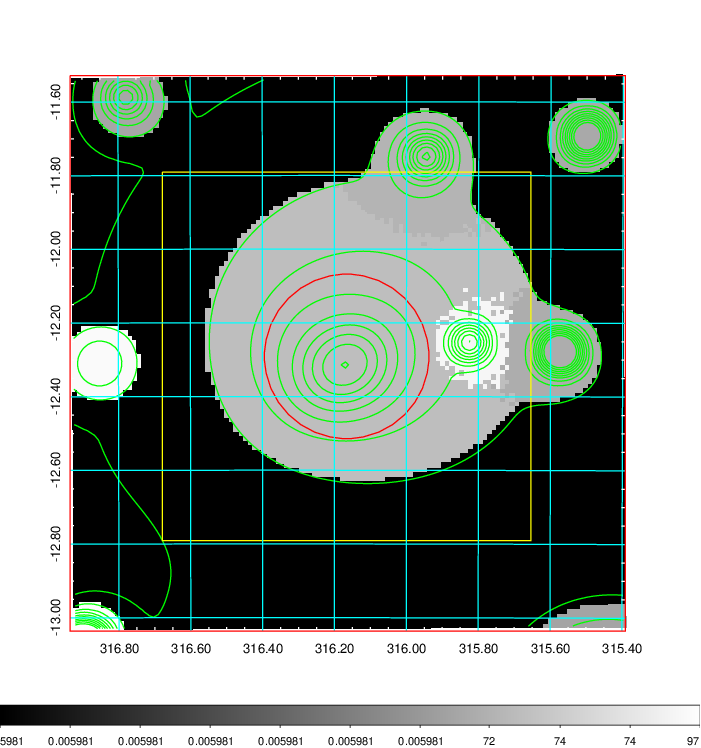
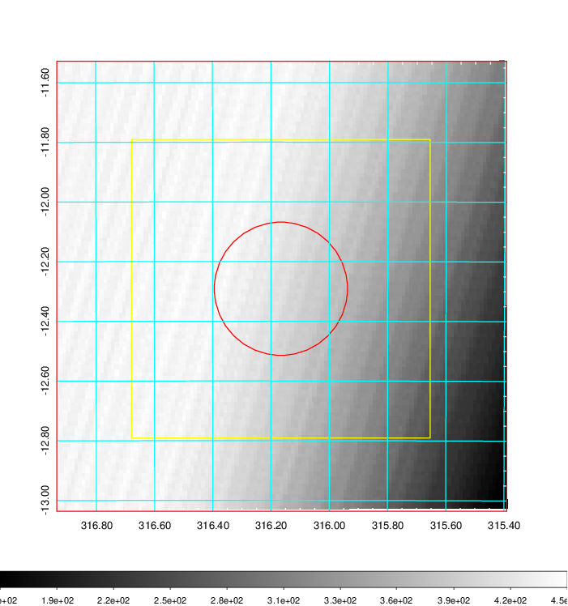
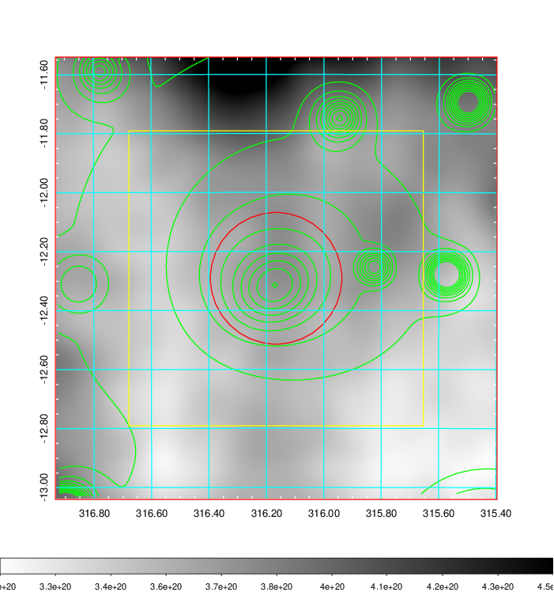
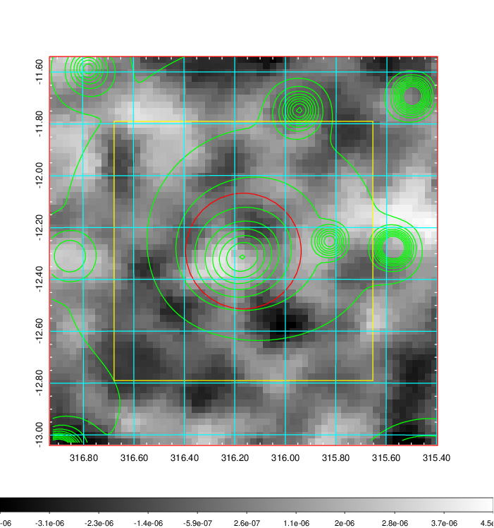
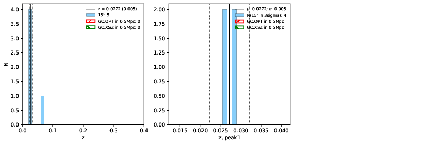
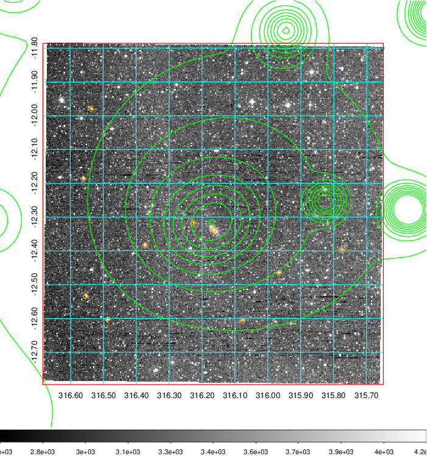
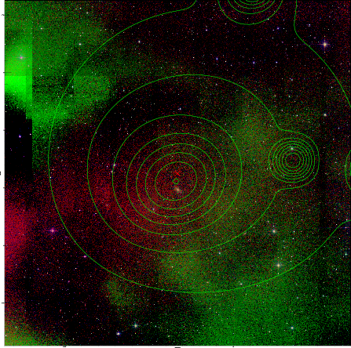
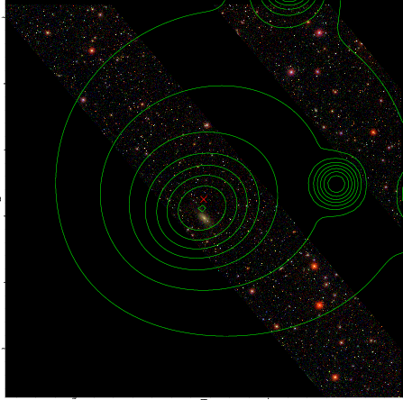

### 838

|Name|RAJ2000[deg]|DEJ2000[deg] |Ext[arcmin]| Ext,ml | z | z_src| C|GC(XSZ,Delta_z<0.01)| GC(OPT,Delta_z<0.01)|GC| R_sig[arcmin] | R500[arcmin] | R500[Mpc]| CRsig[c/s] | CR500[c/s] |L500[1E44 erg/s]|F500[1E-12 erg/s/cm^2]| M500[1E14 Msun]|Tx[keV]|Cnt_sig|Beta|Rc[arcmin]|Comment|Alias|
|---|---|---|---|---|---|------|---|--------|---------|----------|---|---|---|---|---|---|---|---|---|---|---|---|---|---|
|838| 316.166| -12.291| 13.39| 60.71| 0.0272(0.005)| z1,| G| -| -| -| 12.212| 14.119| 0.463| 0.110(0.037)| 0.113(0.038)| 0.025(0.006)| 1.470(0.340)| 0.29(0.03)| 1.00(0.08)| 58.4| 0.766(-0.171+0.161)| 6.647(-2.023+1.784)| -| t512|

|[RASS image](../image/838/838_img.pdf)|[filtered image](../image/838/838_fil.pdf)|[Segment image](../image/838/838_seg.pdf)|
|-------------------|--------------------|-------------------|
|   |    |   |

|[Exposure image](../image/838/838_mex.pdf)| [nH image](../image/838/838_nh.pdf)| [Planck image](../image/838/838_p.pdf)|
|-------------------|--------------------|-------------------|
|   |     |  |

|[Redshift Histogram](../image/838/838_zg.pdf) | [DSS image(z1)](../image/838/838_dss_z1.pdf)      |  [DSS image(z2)](../image/838/838_dss_z2.pdf)    |
|-------------------|--------------------|-------------------|
| |  Blue circle for optical clusters;  Magenta circle for XSZ clusters;  all with r=1Mpc;  Only GC with Delta_z<0.01 are shown. |  Blue circle for optical clusters;  Magenta circle for XSZ clusters;  all with r=1Mpc;  Only GC with Delta_z<0.01 are shown.  |

|[known Abell/XSZ clusters](../image/838/838_gc.pdf) | [2MASS image](../image/838/838_2mass.pdf)      |[SDSS image](../image/838/838_sdss.pdf)   |
|-------------------|-------------------|-------------------|
|  Magenta, blue and green circles  for optical, X-ray and SZ clusters  respectively, with redshift of clusters  labelled. The radius of circles  are 1Mpc.|  |   |

