

### 839

|Name|RAJ2000[deg]|DEJ2000[deg] |Ext[arcmin]| Ext,ml | z | z_src| C|GC(XSZ,Delta_z<0.01)| GC(OPT,Delta_z<0.01)|GC| R_sig[arcmin] | R500[arcmin] | R500[Mpc]| CRsig[c/s] | CR500[c/s] |L500[1E44 erg/s]|F500[1E-12 erg/s/cm^2]| M500[1E14 Msun]|Tx[keV]|Cnt_sig|Beta|Rc[arcmin]|Comment|Alias|
|---|---|---|---|---|---|------|---|--------|---------|----------|---|---|---|---|---|---|---|---|---|---|---|---|---|---|
|839| 316.218| -51.827| 1.29| 44.40| 0.0496(0.005)| z1, z_xsz| B| MCXC| N| MCXC, N| 30.700| 13.555| 0.789| 0.460(0.146)| 0.421(0.133)| 0.454(0.085)| 7.799(1.465)| 1.46(0.14)| 2.75(0.17)| 139.3| 0.938(-0.073+0.045)| 3.276(-0.372+0.293)| -| k074|

|[RASS image](../image/839/839_img.pdf)|[filtered image](../image/839/839_fil.pdf)|[Segment image](../image/839/839_seg.pdf)|
|-------------------|--------------------|-------------------|
| 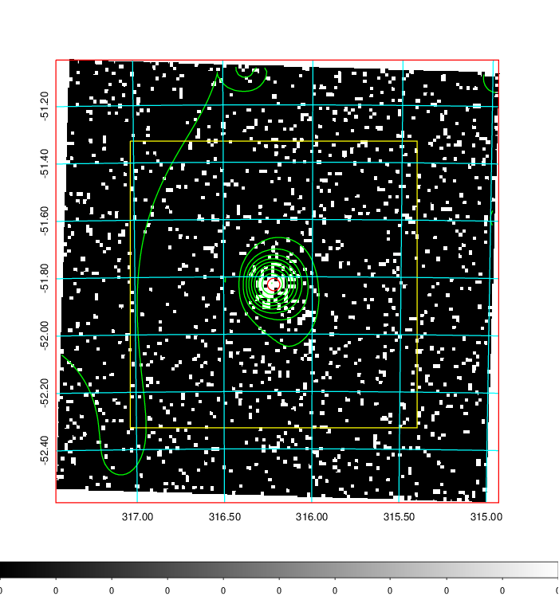  | 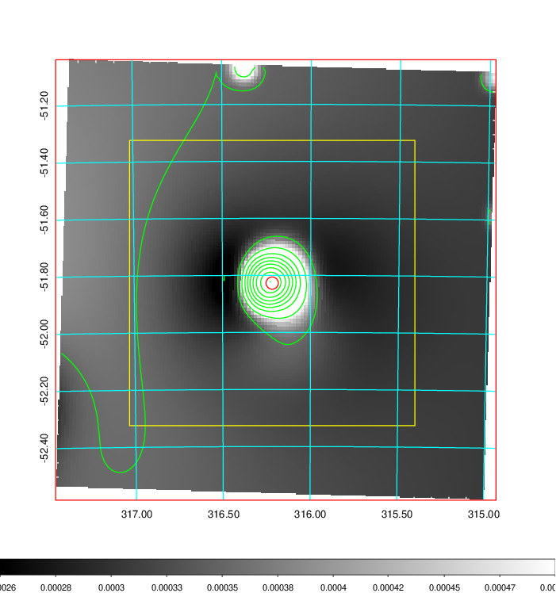   | 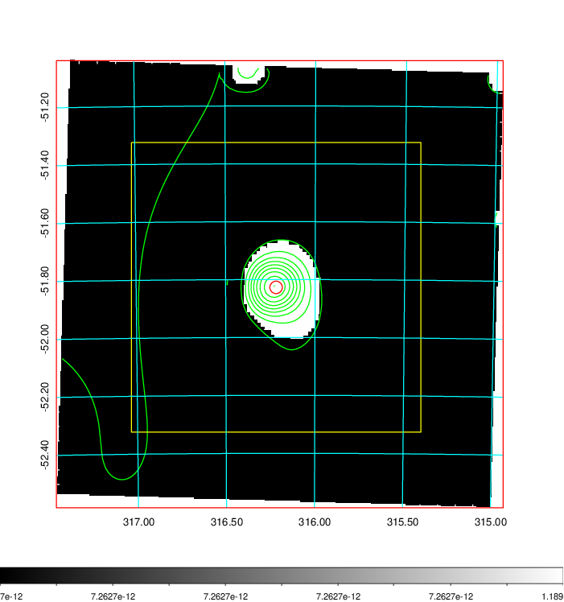  |

|[Exposure image](../image/839/839_mex.pdf)| [nH image](../image/839/839_nh.pdf)| [Planck image](../image/839/839_p.pdf)|
|-------------------|--------------------|-------------------|
|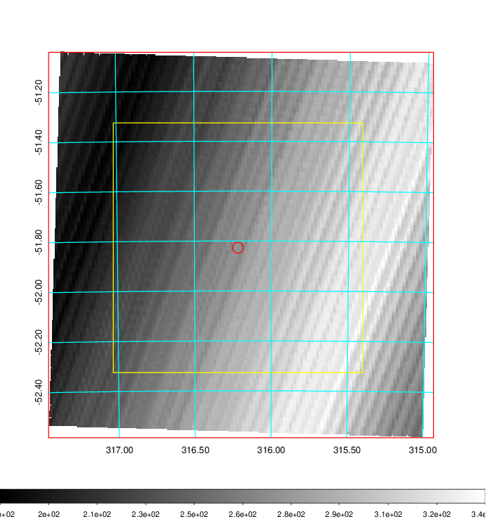   | 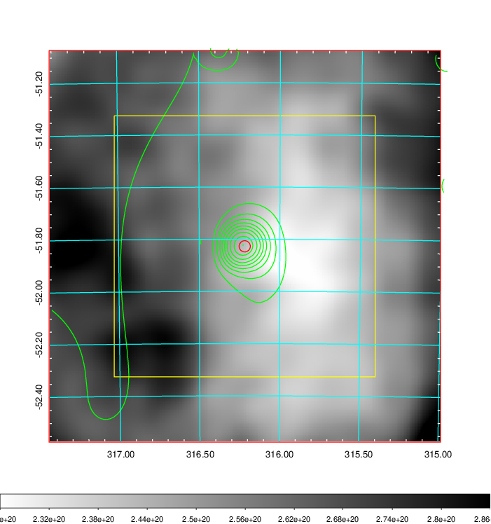    | 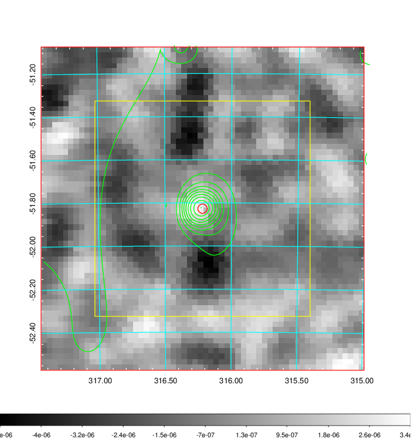 |

|[Redshift Histogram](../image/839/839_zg.pdf) | [DSS image(z1)](../image/839/839_dss_z1.pdf)      |  [DSS image(z2)](../image/839/839_dss_z2.pdf)    |
|-------------------|--------------------|-------------------|
|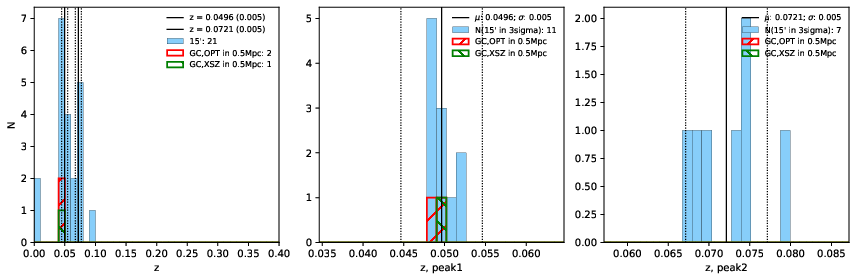 |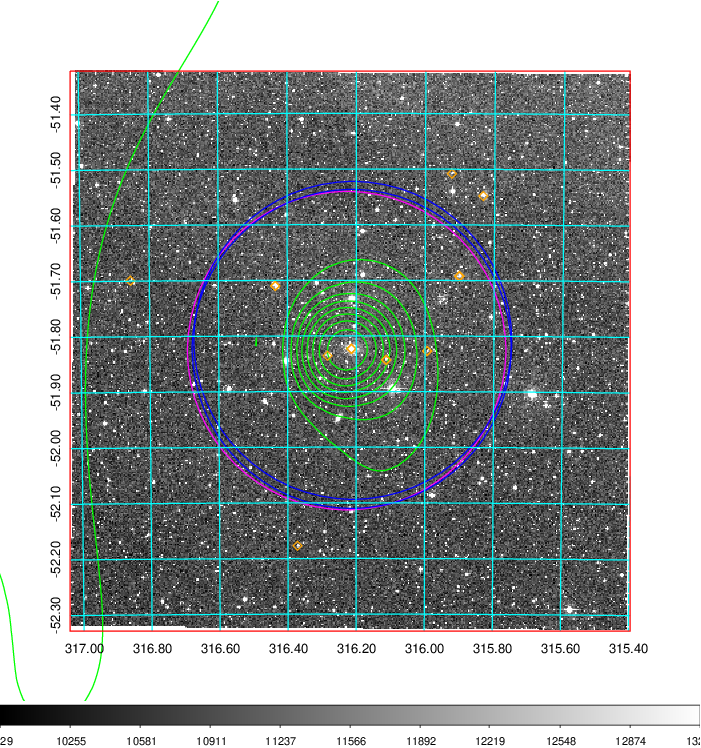  Blue circle for optical clusters;  Magenta circle for XSZ clusters;  all with r=1Mpc;  Only GC with Delta_z<0.01 are shown. | 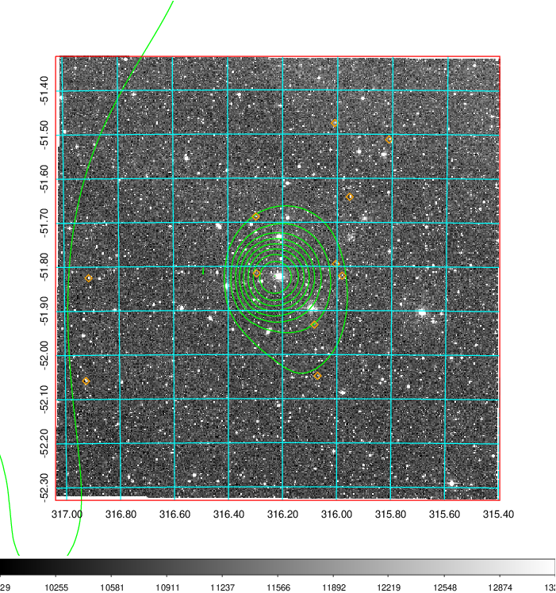 Blue circle for optical clusters;  Magenta circle for XSZ clusters;  all with r=1Mpc;  Only GC with Delta_z<0.01 are shown.  |

|[Previous-identified clusters](../image/839/839_gc.pdf) | [2MASS image](../image/839/839_2mass.pdf)      |
|-------------------|-------------------|
|  Green, magenta, and blue circles  for optical, X-ray and SZ clusters  respectively, with redshift of clusters  labelled. The radius of circles  are 1Mpc.|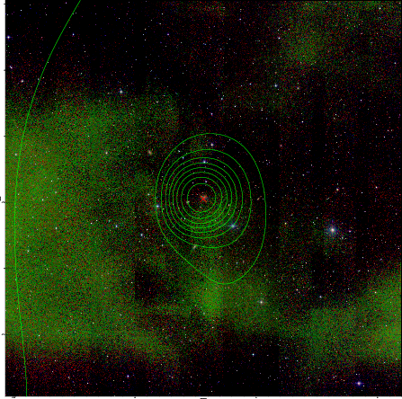  |

|[DES image](../image/839/839_des.pdf)   |
|-------------------|
| 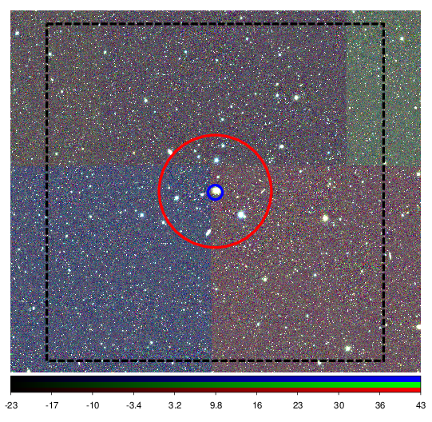  |
