

### 84

|Name|RAJ2000[deg]|DEJ2000[deg] |Ext[arcmin]| Ext,ml | z | z_src| C|GC(XSZ,Delta_z<0.01)| GC(OPT,Delta_z<0.01)|GC| R_sig[arcmin] | R500[arcmin] | R500[Mpc]| CRsig[c/s] | CR500[c/s] |L500[1E44 erg/s]|F500[1E-12 erg/s/cm^2]| M500[1E14 Msun]|Tx[keV]|Cnt_sig|Beta|Rc[arcmin]|Comment|Alias|
|---|---|---|---|---|---|------|---|--------|---------|----------|---|---|---|---|---|---|---|---|---|---|---|---|---|---|
|84| 26.990| -62.876| 1.82| 25.76| 0.0899(0.005)| z1, z_opt| S| -| A, W| A, Tar, W| 11.725| 7.425| 0.747| 0.107(0.031)| 0.101(0.029)| 0.373(0.065)| 1.844(0.321)| 1.29(0.11)| 2.58(0.14)| 57.5| 0.790(-0.171+0.144)| 2.974(-1.119+0.833)| An SZ cluster with no $z$ and offset = 0.02 Mpc| t049|

|[RASS image](../image/84/84_img.pdf)|[filtered image](../image/84/84_fil.pdf)|[Segment image](../image/84/84_seg.pdf)|
|-------------------|--------------------|-------------------|
| 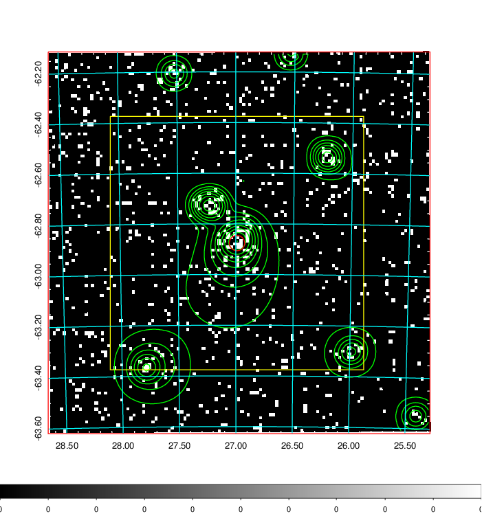  | 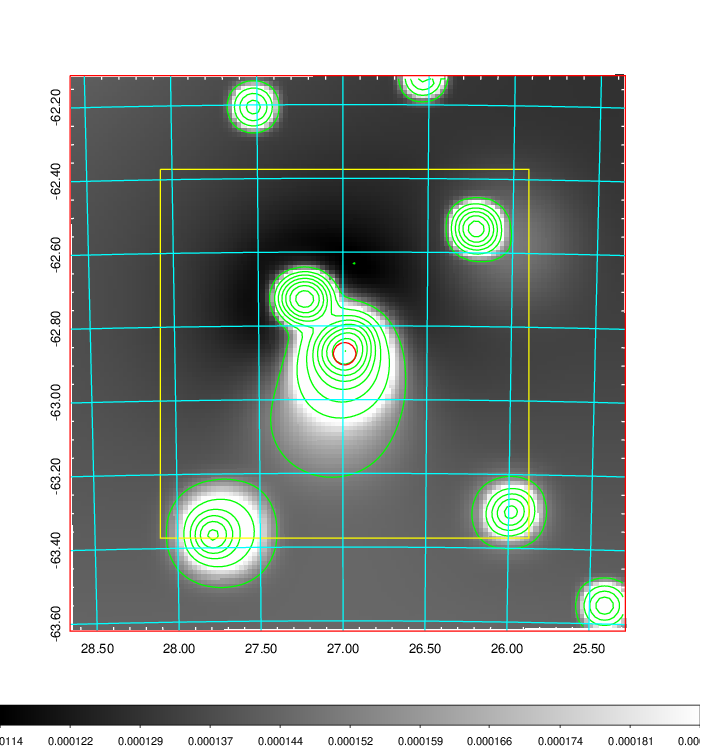   | 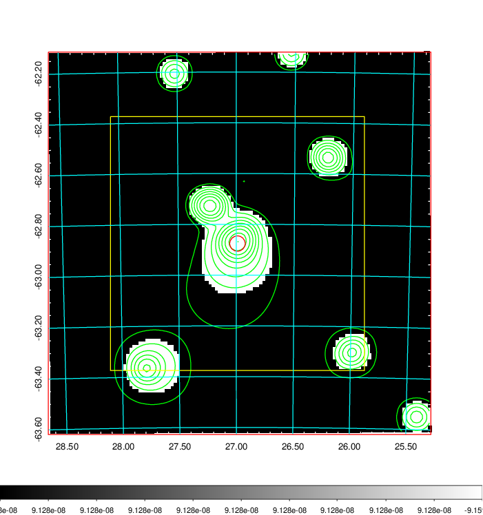  |

|[Exposure image](../image/84/84_mex.pdf)| [nH image](../image/84/84_nh.pdf)| [Planck image](../image/84/84_p.pdf)|
|-------------------|--------------------|-------------------|
|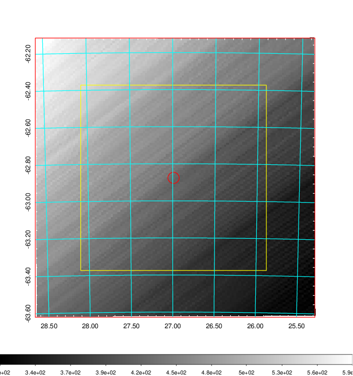   | 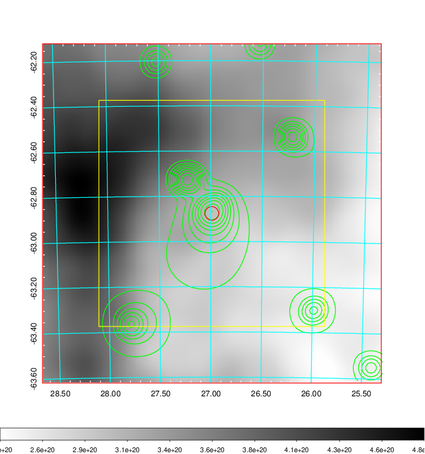    | 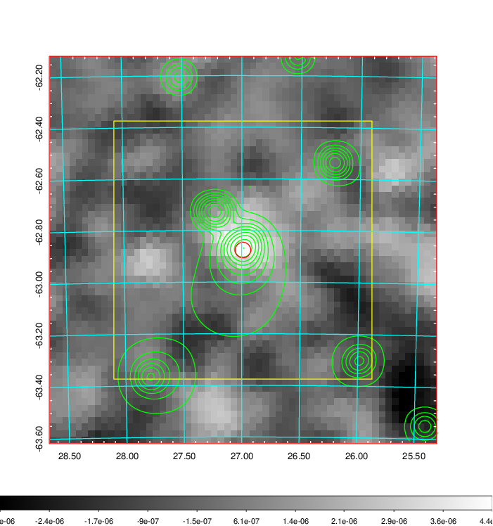 |

|[Redshift Histogram](../image/84/84_zg.pdf) | [DSS image(z1)](../image/84/84_dss_z1.pdf)      |  [DSS image(z2)](../image/84/84_dss_z2.pdf)    |
|-------------------|--------------------|-------------------|
|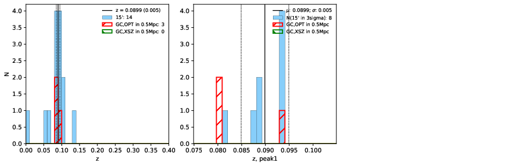 |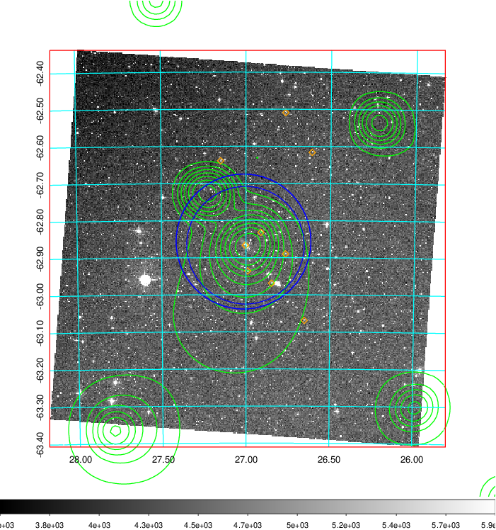  Blue circle for optical clusters;  Magenta circle for XSZ clusters;  all with r=1Mpc;  Only GC with Delta_z<0.01 are shown. | 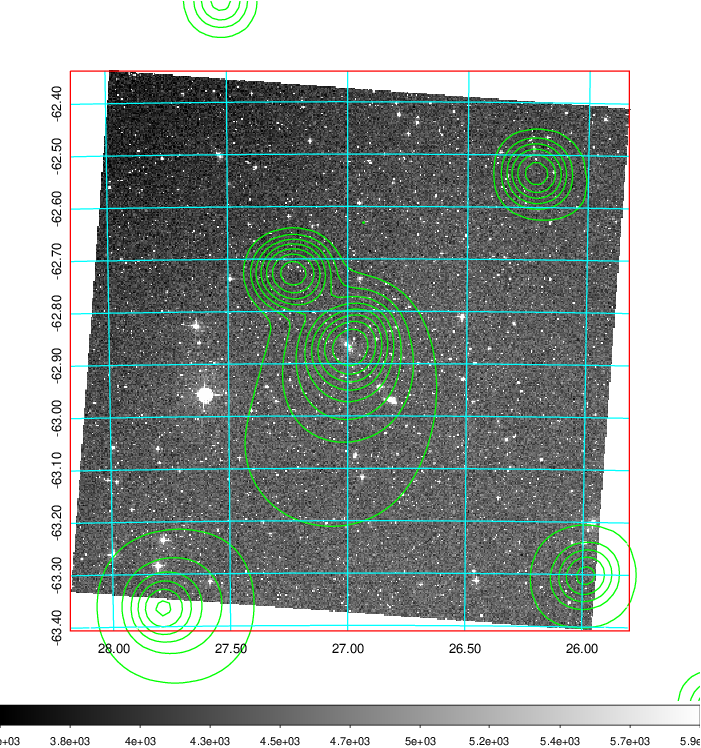 Blue circle for optical clusters;  Magenta circle for XSZ clusters;  all with r=1Mpc;  Only GC with Delta_z<0.01 are shown.  |

|[Previous-identified clusters](../image/84/84_gc.pdf) | [2MASS image](../image/84/84_2mass.pdf)      |
|-------------------|-------------------|
|  Green, magenta, and blue circles  for optical, X-ray and SZ clusters  respectively, with redshift of clusters  labelled. The radius of circles  are 1Mpc.|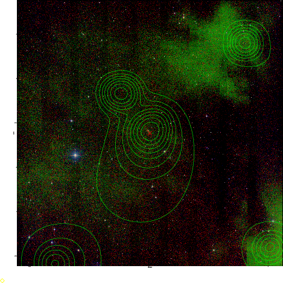  |

|[DES image](../image/84/84_des.pdf)   |
|-------------------|
| 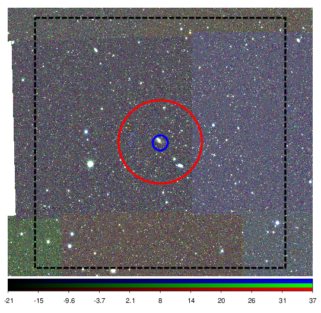  |
