

### 840

|Name|RAJ2000[deg]|DEJ2000[deg] |Ext[arcmin]| Ext,ml | z | z_src| C|GC(XSZ,Delta_z<0.01)| GC(OPT,Delta_z<0.01)|GC| R_sig[arcmin] | R500[arcmin] | R500[Mpc]| CRsig[c/s] | CR500[c/s] |L500[1E44 erg/s]|F500[1E-12 erg/s/cm^2]| M500[1E14 Msun]|Tx[keV]|Cnt_sig|Beta|Rc[arcmin]|Comment|Alias|
|---|---|---|---|---|---|------|---|--------|---------|----------|---|---|---|---|---|---|---|---|---|---|---|---|---|---|
|840| 316.822| -25.436| 3.84| 89.22| 0.0382(0.005)| z1, z_xsz| B| MCXC| A, N| A, MCXC, N| 22.231| 14.952| 0.679| 0.340(0.058)| 0.323(0.055)| 0.188(0.021)| 5.533(0.615)| 0.93(0.05)| 2.07(0.07)| 152.8| 0.618(-0.044+0.058)| 4.264(-0.683+0.856)| -| k463|

|[RASS image](../image/840/840_img.pdf)|[filtered image](../image/840/840_fil.pdf)|[Segment image](../image/840/840_seg.pdf)|
|-------------------|--------------------|-------------------|
| 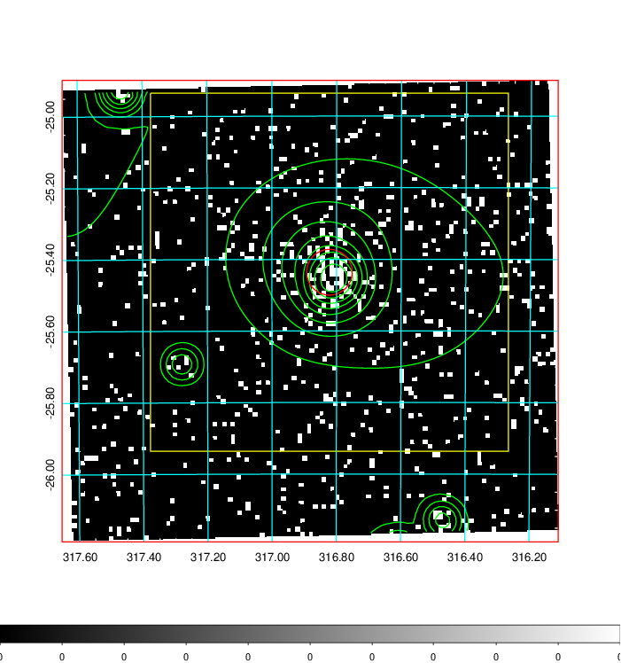  | 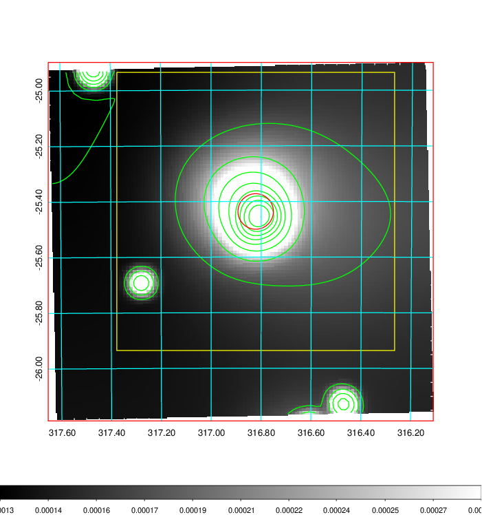   | 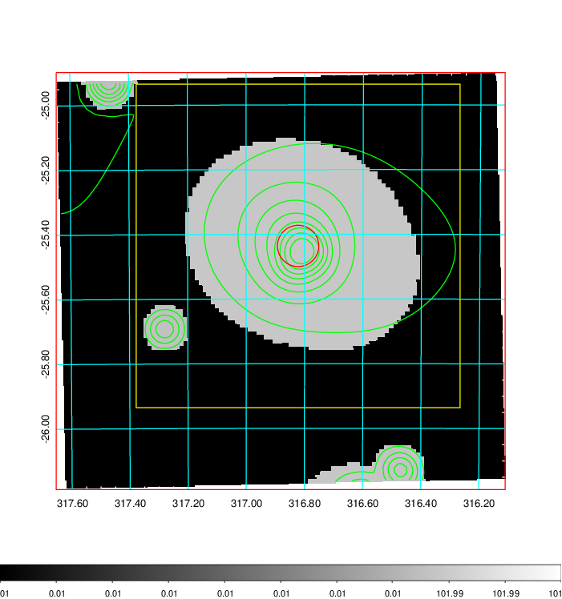  |

|[Exposure image](../image/840/840_mex.pdf)| [nH image](../image/840/840_nh.pdf)| [Planck image](../image/840/840_p.pdf)|
|-------------------|--------------------|-------------------|
|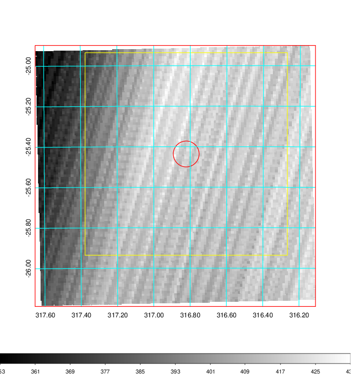   | 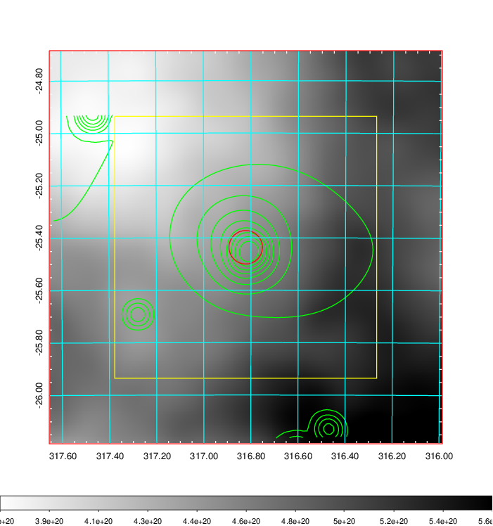    | 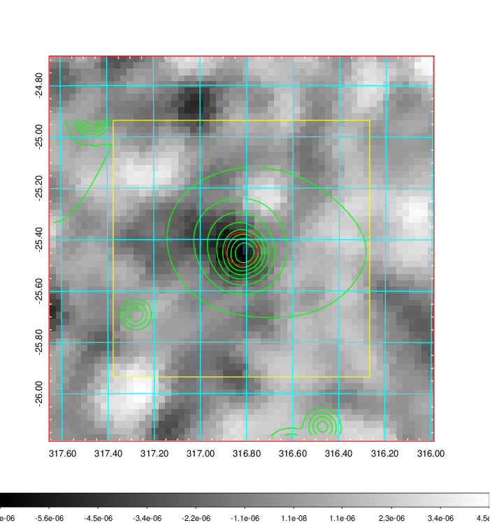 |

|[Redshift Histogram](../image/840/840_zg.pdf) | [DSS image(z1)](../image/840/840_dss_z1.pdf)      |  [DSS image(z2)](../image/840/840_dss_z2.pdf)    |
|-------------------|--------------------|-------------------|
|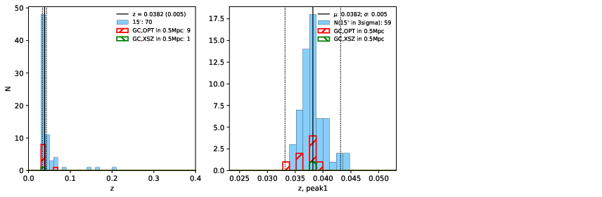 |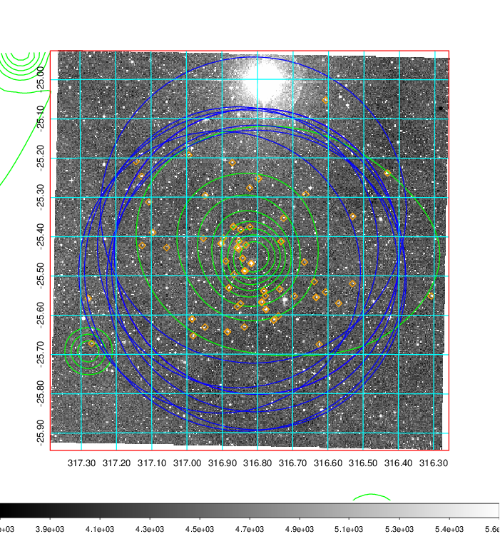  Blue circle for optical clusters;  Magenta circle for XSZ clusters;  all with r=1Mpc;  Only GC with Delta_z<0.01 are shown. | 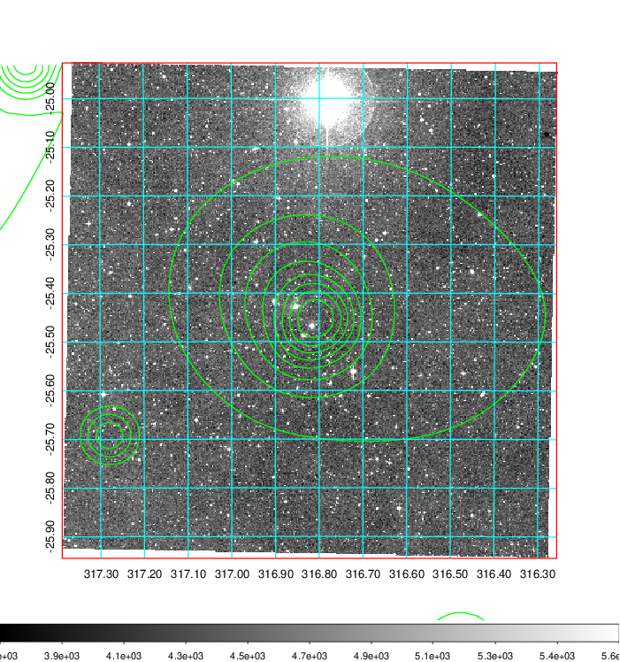 Blue circle for optical clusters;  Magenta circle for XSZ clusters;  all with r=1Mpc;  Only GC with Delta_z<0.01 are shown.  |

|[Previous-identified clusters](../image/840/840_gc.pdf) | [2MASS image](../image/840/840_2mass.pdf)      |
|-------------------|-------------------|
|  Green, magenta, and blue circles  for optical, X-ray and SZ clusters  respectively, with redshift of clusters  labelled. The radius of circles  are 1Mpc.|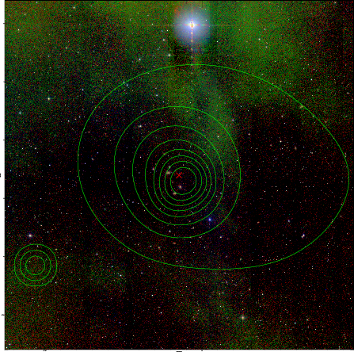  |

|[PS1 image](../image/840/840_ps1.pdf)            |
|-------------------|
| 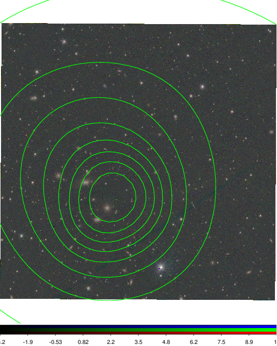  |
