

### 841

|Name|RAJ2000[deg]|DEJ2000[deg] |Ext[arcmin]| Ext,ml | z | z_src| C|GC(XSZ,Delta_z<0.01)| GC(OPT,Delta_z<0.01)|GC| R_sig[arcmin] | R500[arcmin] | R500[Mpc]| CRsig[c/s] | CR500[c/s] |L500[1E44 erg/s]|F500[1E-12 erg/s/cm^2]| M500[1E14 Msun]|Tx[keV]|Cnt_sig|Beta|Rc[arcmin]|Comment|Alias|
|---|---|---|---|---|---|------|---|--------|---------|----------|---|---|---|---|---|---|---|---|---|---|---|---|---|---|
|841| 316.826| -47.169| 21.51| 94.27| 0.0155(0.005)| z1, z_opt| S| -| A, N| A, N, W| 24.700| 22.529| 0.427| 0.237(0.094)| 0.233(0.092)| 0.016(0.005)| 2.982(0.968)| 0.22(0.04)| 0.86(0.09)| 246.6| 0.744(-0.141+0.159)| 11.977(-2.674+2.515)| -| t594|

|[RASS image](../image/841/841_img.pdf)|[filtered image](../image/841/841_fil.pdf)|[Segment image](../image/841/841_seg.pdf)|
|-------------------|--------------------|-------------------|
| 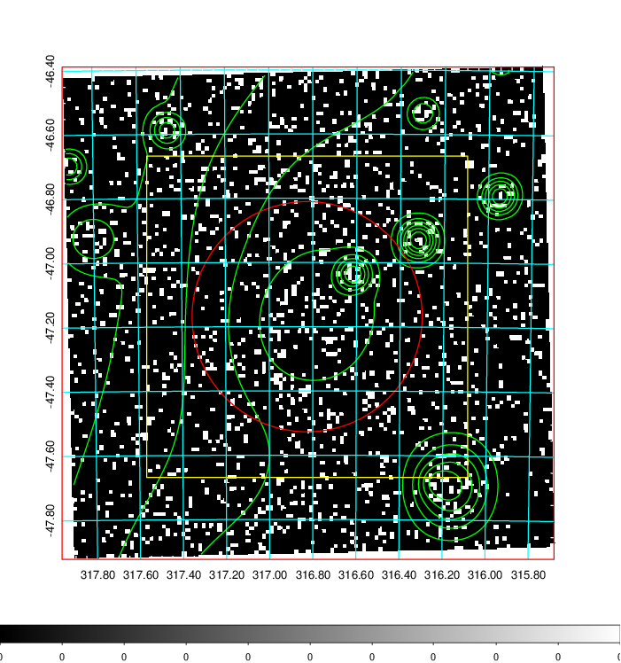  | 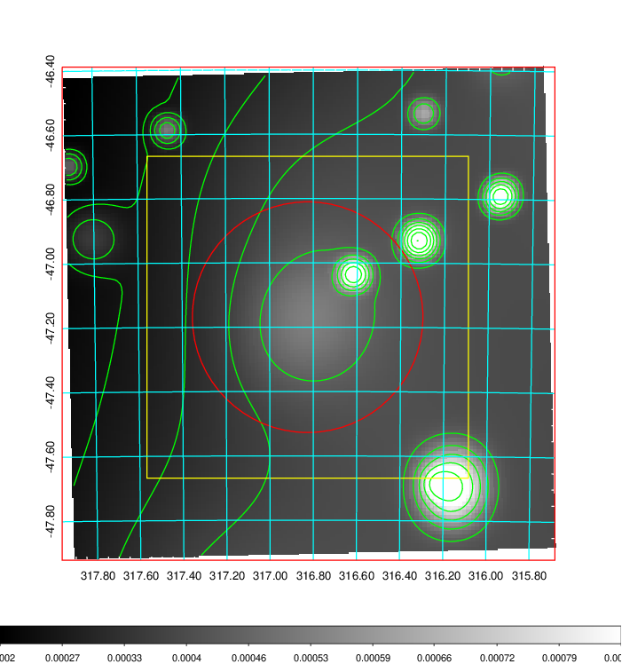   | 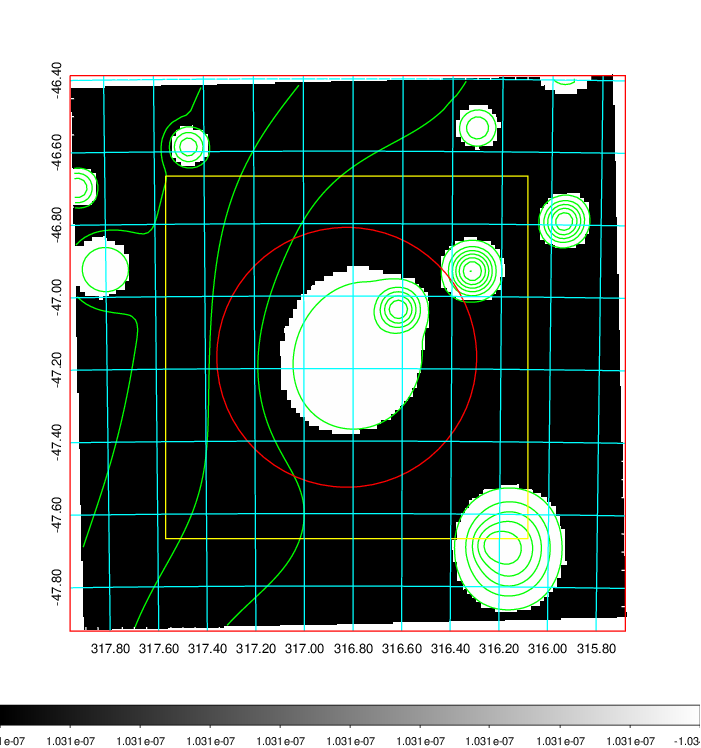  |

|[Exposure image](../image/841/841_mex.pdf)| [nH image](../image/841/841_nh.pdf)| [Planck image](../image/841/841_p.pdf)|
|-------------------|--------------------|-------------------|
|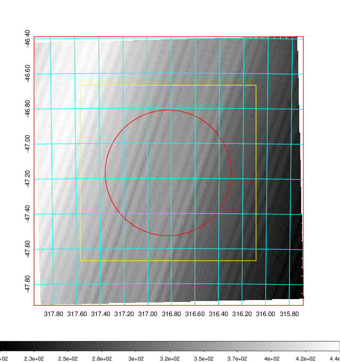   | 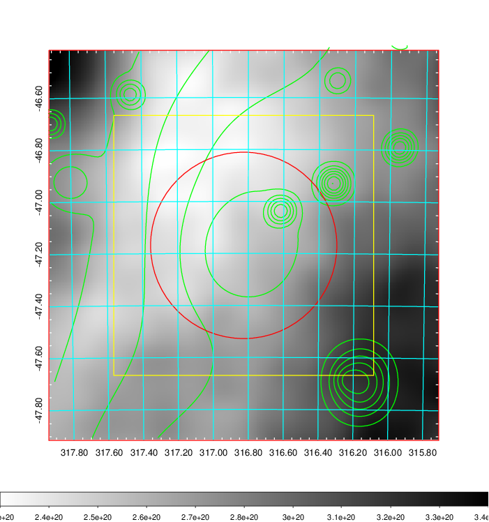    | 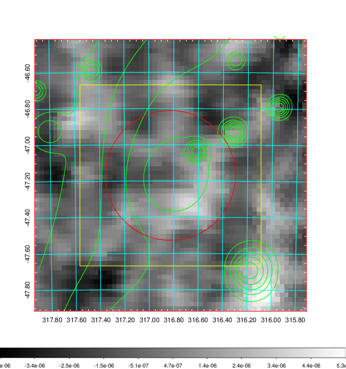 |

|[Redshift Histogram](../image/841/841_zg.pdf) | [DSS image(z1)](../image/841/841_dss_z1.pdf)      |  [DSS image(z2)](../image/841/841_dss_z2.pdf)    |
|-------------------|--------------------|-------------------|
|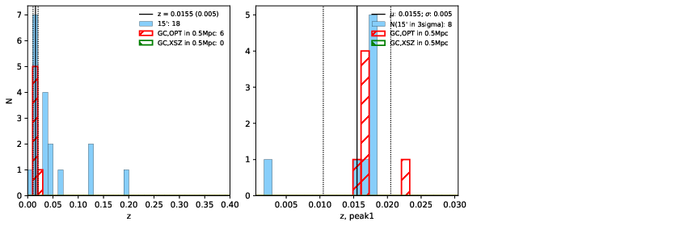 |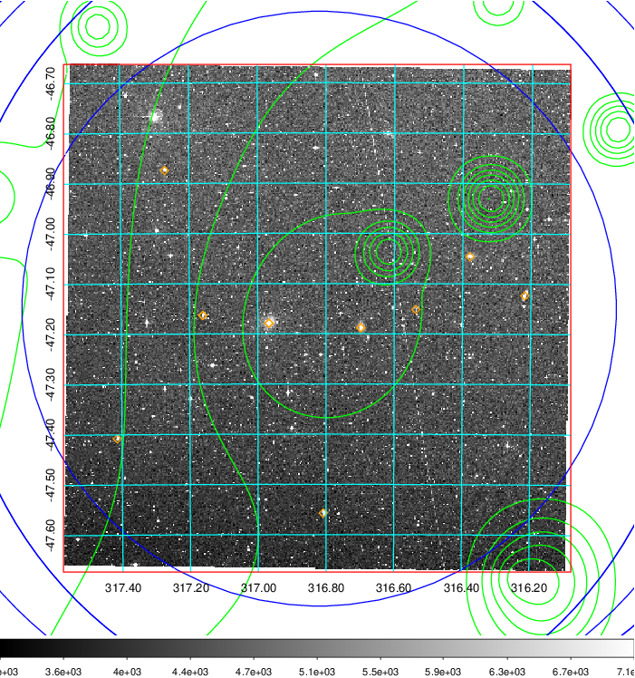  Blue circle for optical clusters;  Magenta circle for XSZ clusters;  all with r=1Mpc;  Only GC with Delta_z<0.01 are shown. | 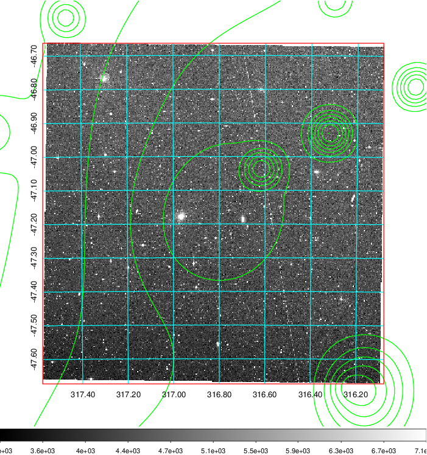 Blue circle for optical clusters;  Magenta circle for XSZ clusters;  all with r=1Mpc;  Only GC with Delta_z<0.01 are shown.  |

|[Previous-identified clusters](../image/841/841_gc.pdf) | [2MASS image](../image/841/841_2mass.pdf)      |
|-------------------|-------------------|
|  Green, magenta, and blue circles  for optical, X-ray and SZ clusters  respectively, with redshift of clusters  labelled. The radius of circles  are 1Mpc.|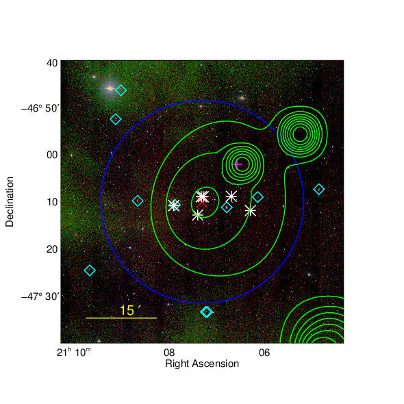  |

|[DES image](../image/841/841_des.pdf)   |
|-------------------|
| 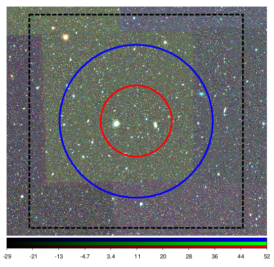  |
