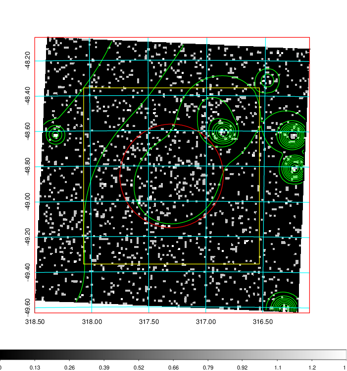
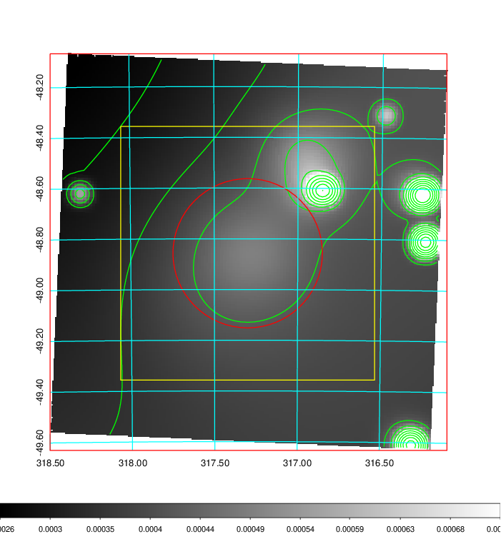
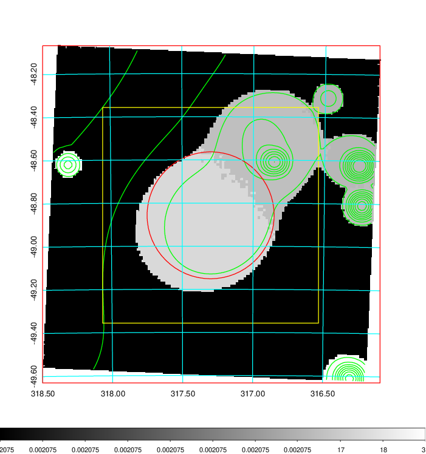
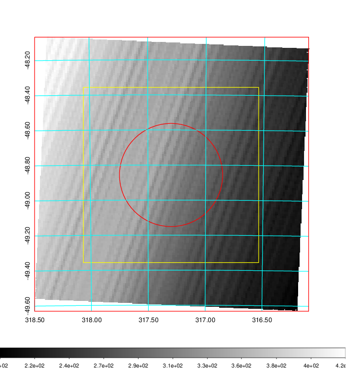
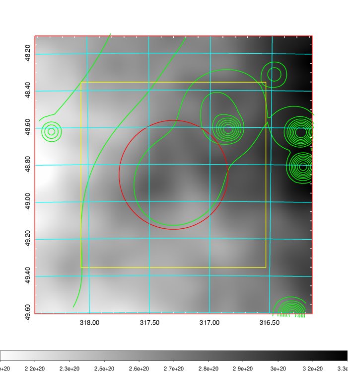
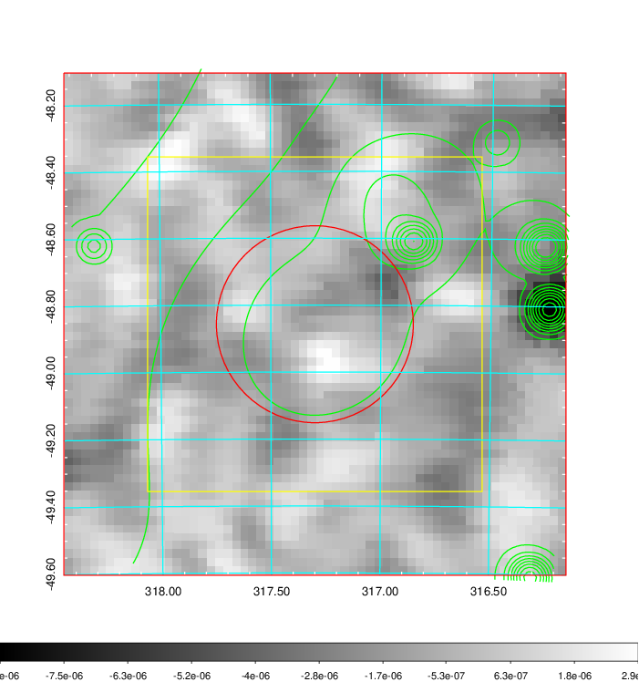
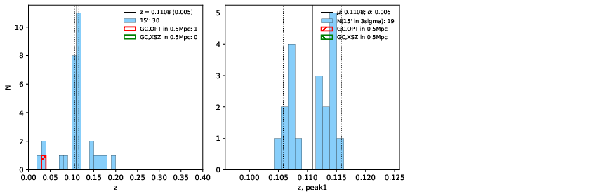
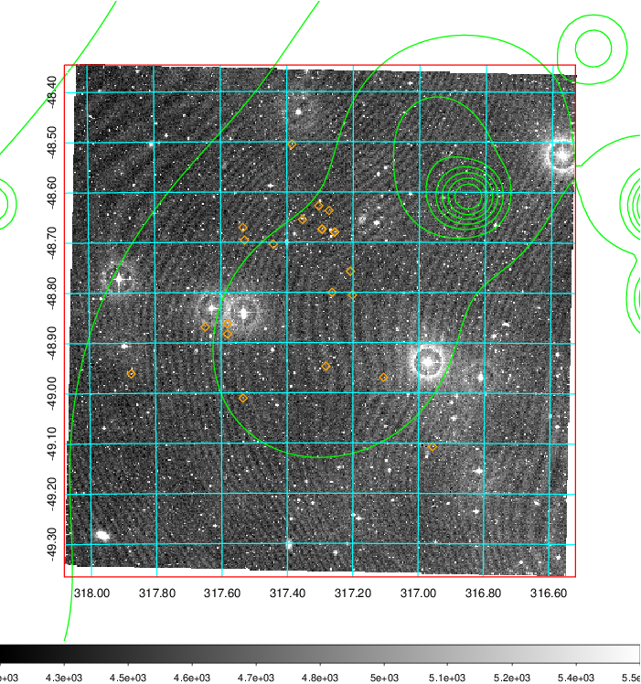
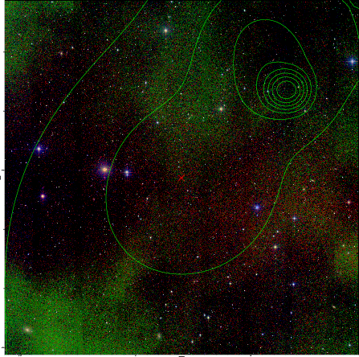

### 842

|Name|RAJ2000[deg]|DEJ2000[deg] |Ext[arcmin]| Ext,ml | z | z_src| C|GC(XSZ,Delta_z<0.01)| GC(OPT,Delta_z<0.01)|GC| R_sig[arcmin] | R500[arcmin] | R500[Mpc]| CRsig[c/s] | CR500[c/s] |L500[1E44 erg/s]|F500[1E-12 erg/s/cm^2]| M500[1E14 Msun]|Tx[keV]|Cnt_sig|Beta|Rc[arcmin]|Comment|Alias|
|---|---|---|---|---|---|------|---|--------|---------|----------|---|---|---|---|---|---|---|---|---|---|---|---|---|---|
|842| 317.300| -48.857| 17.66| 43.96| 0.1108(0.005)| z1,| G| -| -| N| 14.650| 7.516| 0.910| 0.192(0.056)| 0.178(0.052)| 1.068(0.350)| 3.382(1.107)| 2.39(0.39)| 3.79(0.39)| 66.8| 0.728(-0.161+0.182)| 10.782(-2.424+2.371)| -| t564|

|[RASS image](../image/842/842_img.pdf)|[filtered image](../image/842/842_fil.pdf)|[Segment image](../image/842/842_seg.pdf)|
|-------------------|--------------------|-------------------|
|   |    |   |

|[Exposure image](../image/842/842_mex.pdf)| [nH image](../image/842/842_nh.pdf)| [Planck image](../image/842/842_p.pdf)|
|-------------------|--------------------|-------------------|
|   |     |  |

|[Redshift Histogram](../image/842/842_zg.pdf) | [DSS image(z1)](../image/842/842_dss_z1.pdf)      |  [DSS image(z2)](../image/842/842_dss_z2.pdf)    |
|-------------------|--------------------|-------------------|
| |  Blue circle for optical clusters;  Magenta circle for XSZ clusters;  all with r=1Mpc;  Only GC with Delta_z<0.01 are shown. |  Blue circle for optical clusters;  Magenta circle for XSZ clusters;  all with r=1Mpc;  Only GC with Delta_z<0.01 are shown.  |

|[known Abell/XSZ clusters](../image/842/842_gc.pdf) | [2MASS image](../image/842/842_2mass.pdf)      |
|-------------------|-------------------|
|  Magenta, blue and green circles  for optical, X-ray and SZ clusters  respectively, with redshift of clusters  labelled. The radius of circles  are 1Mpc.|  |

|[DES image](../image/842/842_des.pdf)   |
|-------------------|
|   |
