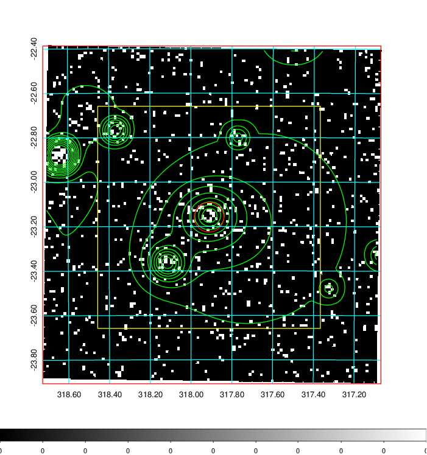
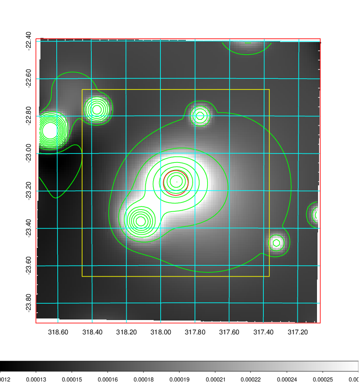
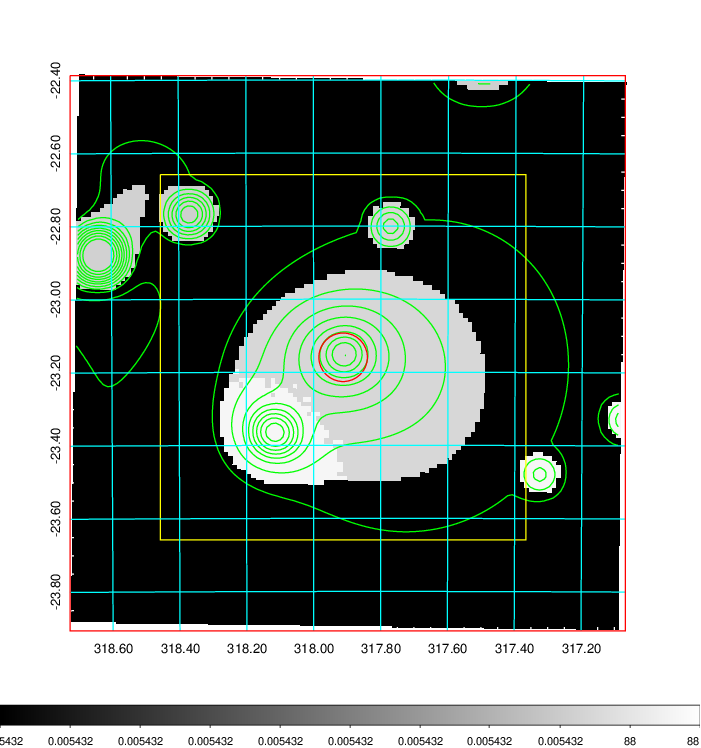
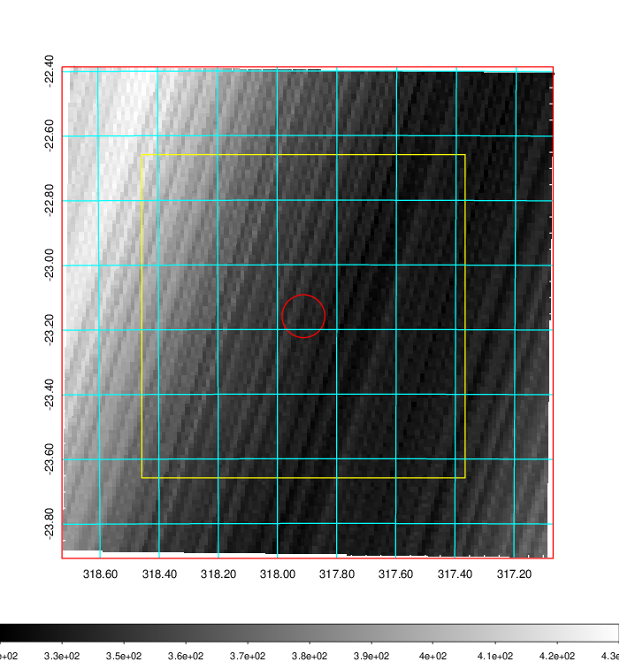
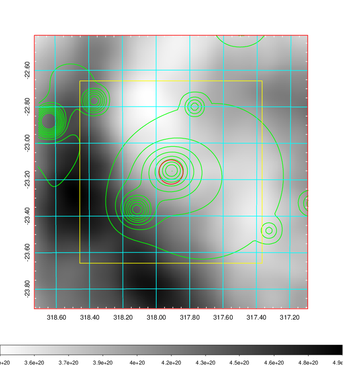
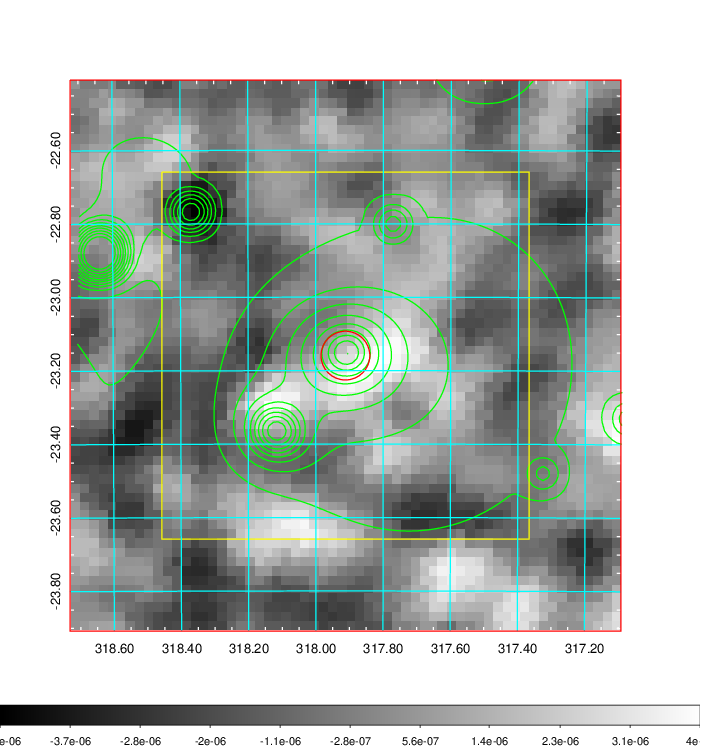
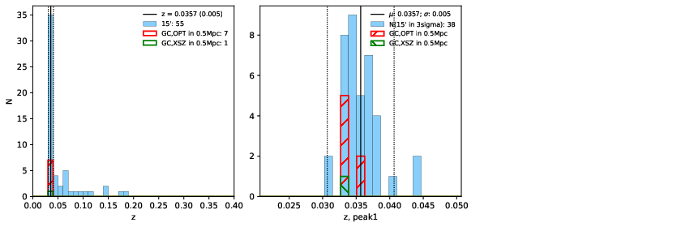
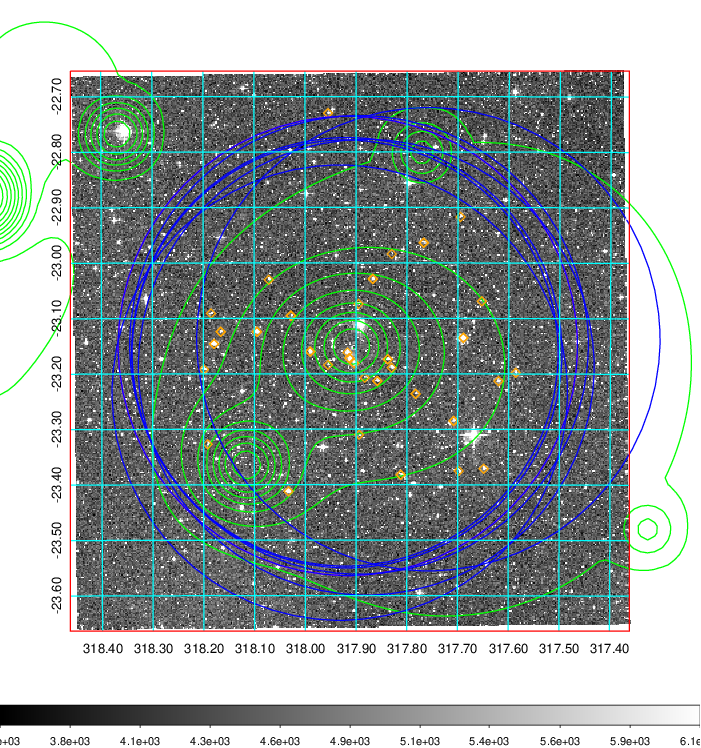
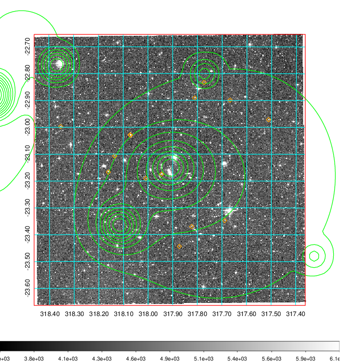
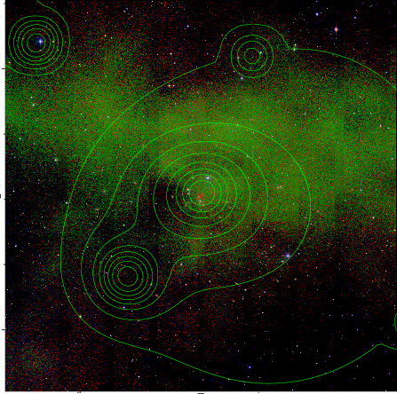

### 843

|Name|RAJ2000[deg]|DEJ2000[deg] |Ext[arcmin]| Ext,ml | z | z_src| C|GC(XSZ,Delta_z<0.01)| GC(OPT,Delta_z<0.01)|GC| R_sig[arcmin] | R500[arcmin] | R500[Mpc]| CRsig[c/s] | CR500[c/s] |L500[1E44 erg/s]|F500[1E-12 erg/s/cm^2]| M500[1E14 Msun]|Tx[keV]|Cnt_sig|Beta|Rc[arcmin]|Comment|Alias|
|---|---|---|---|---|---|------|---|--------|---------|----------|---|---|---|---|---|---|---|---|---|---|---|---|---|---|
|843| 317.912| -23.159| 3.99| 26.48| 0.0357(0.005)| z1, z_xsz| B| MCXC| N| MCXC, N, W| 32.106| 15.201| 0.647| 0.328(0.069)| 0.302(0.064)| 0.151(0.033)| 5.104(1.104)| 0.80(0.09)| 1.88(0.13)| 88.5| 0.533(-0.024+0.051)| 4.583(-0.669+1.132)| -| k476|

|[RASS image](../image/843/843_img.pdf)|[filtered image](../image/843/843_fil.pdf)|[Segment image](../image/843/843_seg.pdf)|
|-------------------|--------------------|-------------------|
|   |    |   |

|[Exposure image](../image/843/843_mex.pdf)| [nH image](../image/843/843_nh.pdf)| [Planck image](../image/843/843_p.pdf)|
|-------------------|--------------------|-------------------|
|   |     |  |

|[Redshift Histogram](../image/843/843_zg.pdf) | [DSS image(z1)](../image/843/843_dss_z1.pdf)      |  [DSS image(z2)](../image/843/843_dss_z2.pdf)    |
|-------------------|--------------------|-------------------|
| |  Blue circle for optical clusters;  Magenta circle for XSZ clusters;  all with r=1Mpc;  Only GC with Delta_z<0.01 are shown. |  Blue circle for optical clusters;  Magenta circle for XSZ clusters;  all with r=1Mpc;  Only GC with Delta_z<0.01 are shown.  |

|[known Abell/XSZ clusters](../image/843/843_gc.pdf) | [2MASS image](../image/843/843_2mass.pdf)      |
|-------------------|-------------------|
|  Magenta, blue and green circles  for optical, X-ray and SZ clusters  respectively, with redshift of clusters  labelled. The radius of circles  are 1Mpc.|  |

|[PS1 image](../image/843/843_ps1.pdf)            |
|-------------------|
|   |
