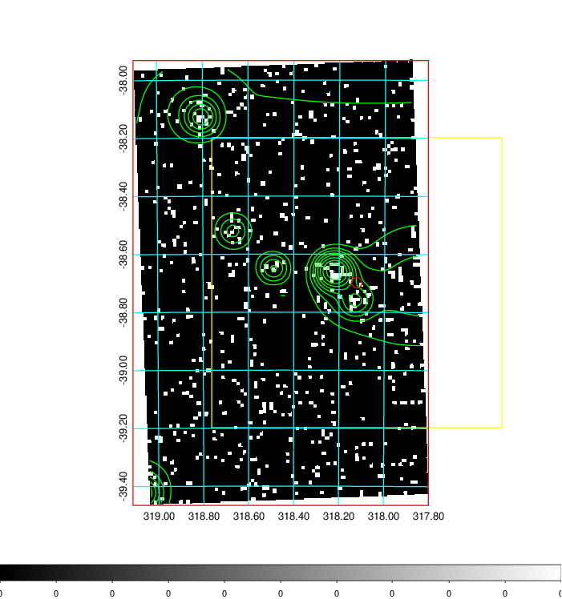
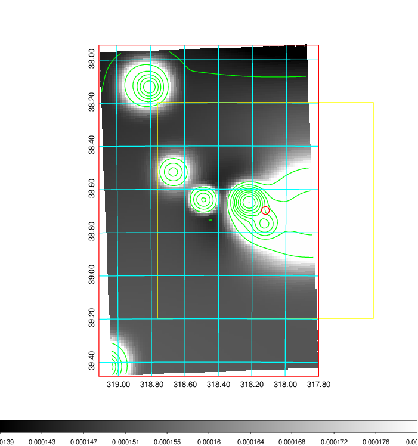
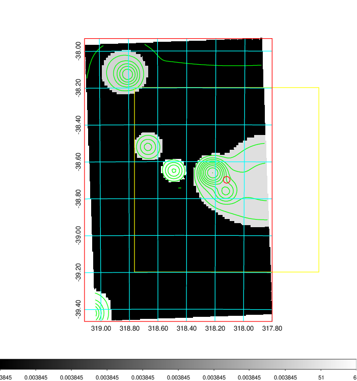
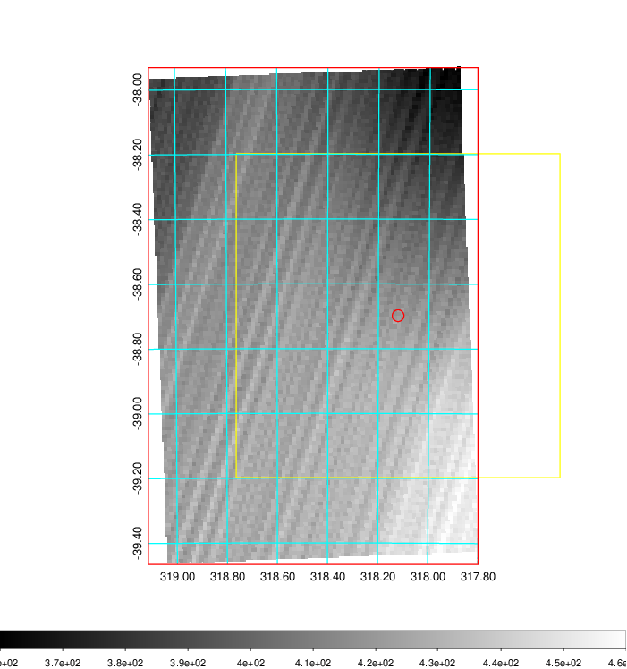
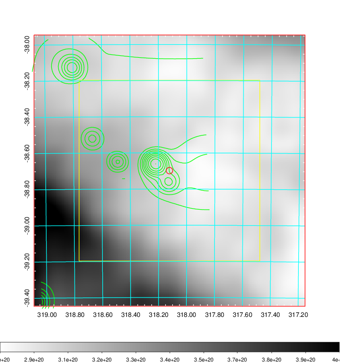
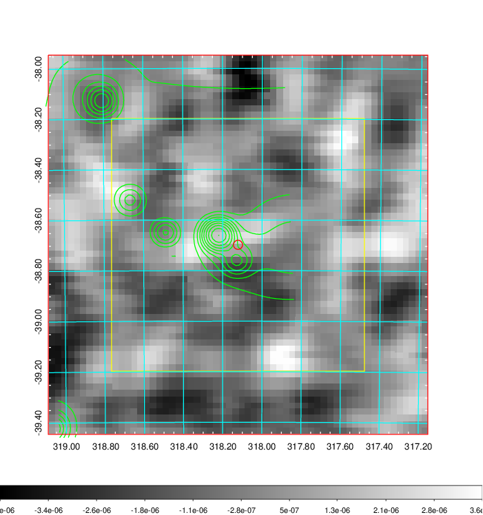
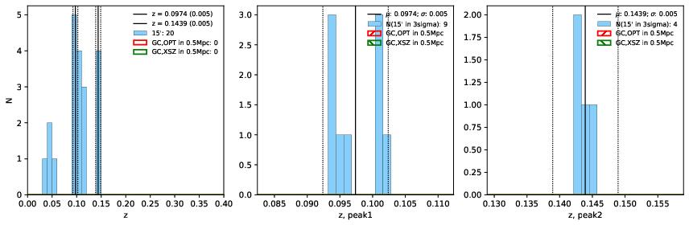
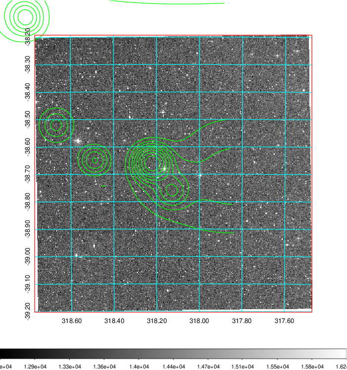
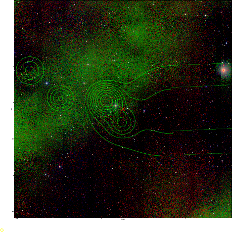

### 844

|Name|RAJ2000[deg]|DEJ2000[deg] |Ext[arcmin]| Ext,ml | z | z_src| C|GC(XSZ,Delta_z<0.01)| GC(OPT,Delta_z<0.01)|GC| R_sig[arcmin] | R500[arcmin] | R500[Mpc]| CRsig[c/s] | CR500[c/s] |L500[1E44 erg/s]|F500[1E-12 erg/s/cm^2]| M500[1E14 Msun]|Tx[keV]|Cnt_sig|Beta|Rc[arcmin]|Comment|Alias|
|---|---|---|---|---|---|------|---|--------|---------|----------|---|---|---|---|---|---|---|---|---|---|---|---|---|---|
|844| 318.122| -38.698| 1.08| 28.29| 0.0974(0.005)| z1,| G| -| -| N| 12.212| 5.626| 0.608| 0.036(0.028)| 0.033(0.025)| 0.134(0.062)| 0.558(0.259)| 0.70(0.17)| 1.77(0.27)| 46.8| 0.868(-0.150+0.095)| 5.764(-1.099+0.800)| -| t013|

|[RASS image](../image/844/844_img.pdf)|[filtered image](../image/844/844_fil.pdf)|[Segment image](../image/844/844_seg.pdf)|
|-------------------|--------------------|-------------------|
|   |    |   |

|[Exposure image](../image/844/844_mex.pdf)| [nH image](../image/844/844_nh.pdf)| [Planck image](../image/844/844_p.pdf)|
|-------------------|--------------------|-------------------|
|   |     |  |

|[Redshift Histogram](../image/844/844_zg.pdf) | [DSS image(z1)](../image/844/844_dss_z1.pdf)      |  [DSS image(z2)](../image/844/844_dss_z2.pdf)    |
|-------------------|--------------------|-------------------|
| |  Blue circle for optical clusters;  Magenta circle for XSZ clusters;  all with r=1Mpc;  Only GC with Delta_z<0.01 are shown. |  Blue circle for optical clusters;  Magenta circle for XSZ clusters;  all with r=1Mpc;  Only GC with Delta_z<0.01 are shown.  |

|[Previous-identified clusters](../image/844/844_gc.pdf) | [2MASS image](../image/844/844_2mass.pdf)      |
|-------------------|-------------------|
|  Green, magenta, and blue circles  for optical, X-ray and SZ clusters  respectively, with redshift of clusters  labelled. The radius of circles  are 1Mpc.|  |

