

### 845

|Name|RAJ2000[deg]|DEJ2000[deg] |Ext[arcmin]| Ext,ml | z | z_src| C|GC(XSZ,Delta_z<0.01)| GC(OPT,Delta_z<0.01)|GC| R_sig[arcmin] | R500[arcmin] | R500[Mpc]| CRsig[c/s] | CR500[c/s] |L500[1E44 erg/s]|F500[1E-12 erg/s/cm^2]| M500[1E14 Msun]|Tx[keV]|Cnt_sig|Beta|Rc[arcmin]|Comment|Alias|
|---|---|---|---|---|---|------|---|--------|---------|----------|---|---|---|---|---|---|---|---|---|---|---|---|---|---|
|845| 318.505| 2.548| 4.60| 417.34| 0.0488(0.005)| z1, z_xsz| B| MCXC, PSZ2, Tar| N| C, F20, MCXC, N, PSZ2, SPI, Tar, W| 22.725| 15.356| 0.880| 0.726(0.064)| 0.689(0.061)| 0.688(0.033)| 12.246(0.590)| 2.03(0.05)| 3.37(0.05)| 384.9| 0.635(-0.030+0.036)| 4.843(-0.503+0.566)| -| k509|

|[RASS image](../image/845/845_img.pdf)|[filtered image](../image/845/845_fil.pdf)|[Segment image](../image/845/845_seg.pdf)|
|-------------------|--------------------|-------------------|
| 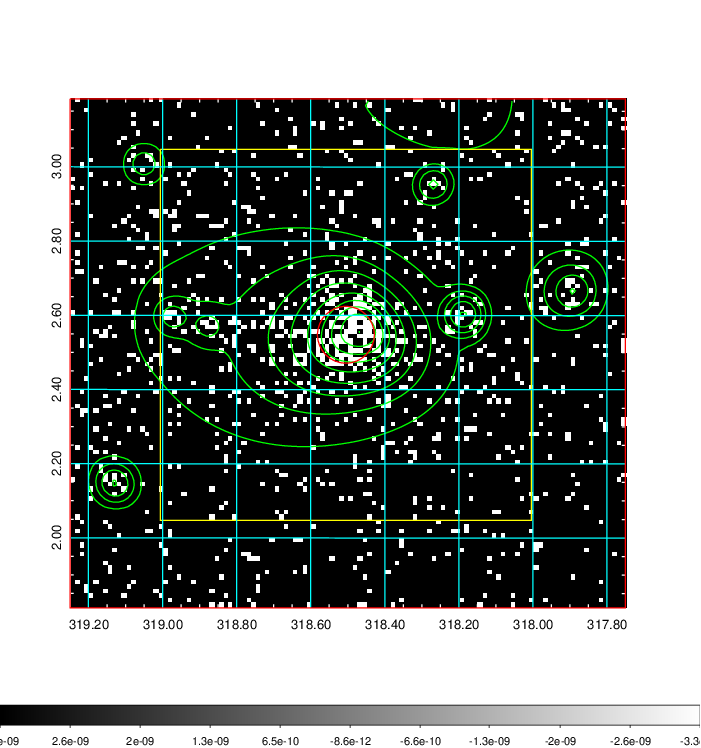  | 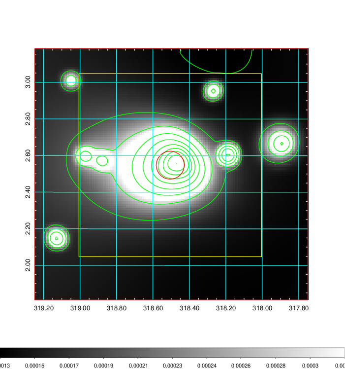   | 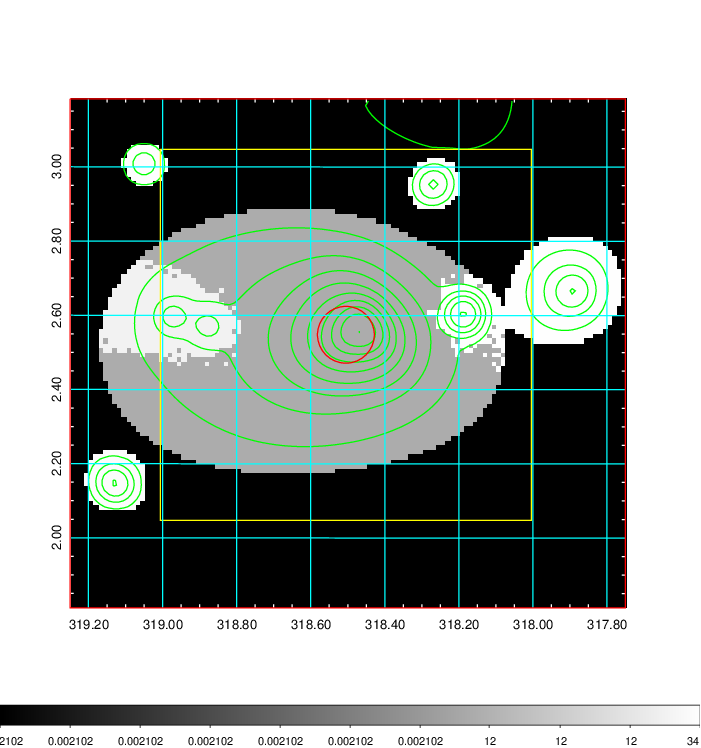  |

|[Exposure image](../image/845/845_mex.pdf)| [nH image](../image/845/845_nh.pdf)| [Planck image](../image/845/845_p.pdf)|
|-------------------|--------------------|-------------------|
|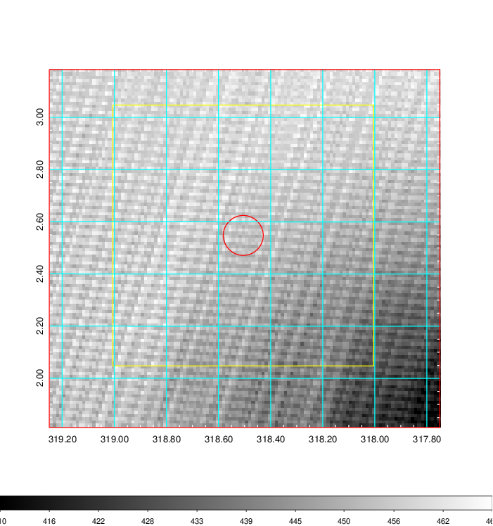   | 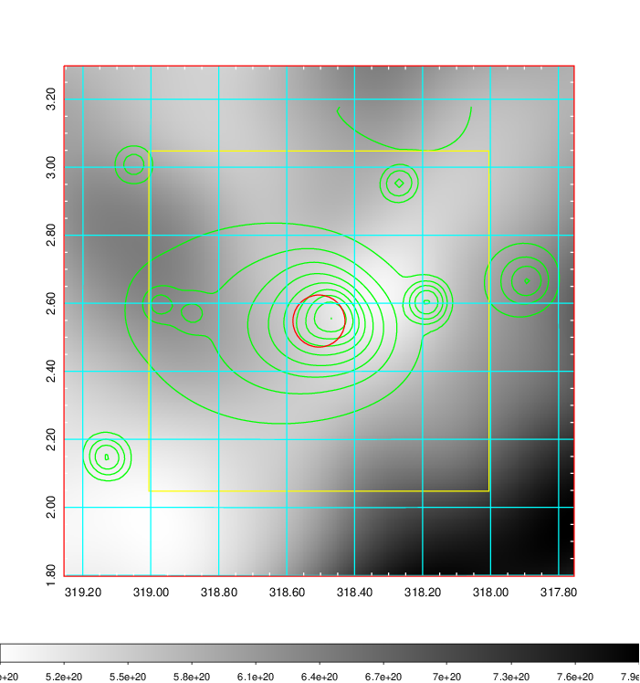    | 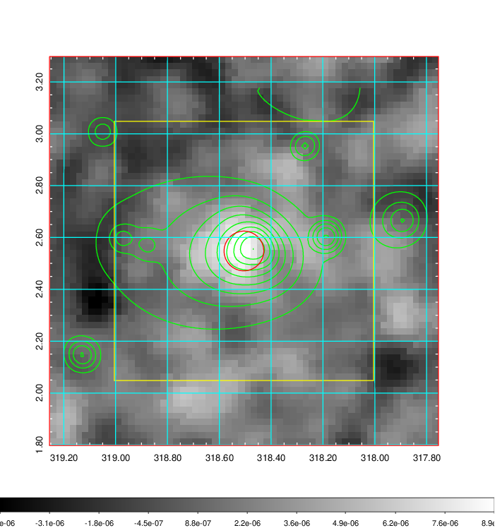 |

|[Redshift Histogram](../image/845/845_zg.pdf) | [DSS image(z1)](../image/845/845_dss_z1.pdf)      |  [DSS image(z2)](../image/845/845_dss_z2.pdf)    |
|-------------------|--------------------|-------------------|
|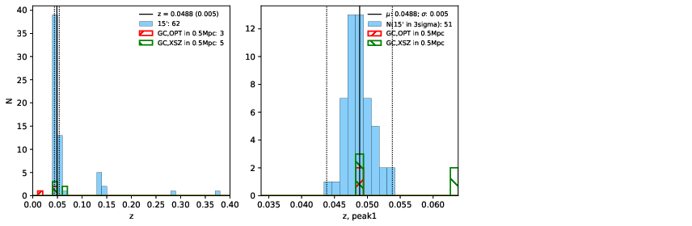 |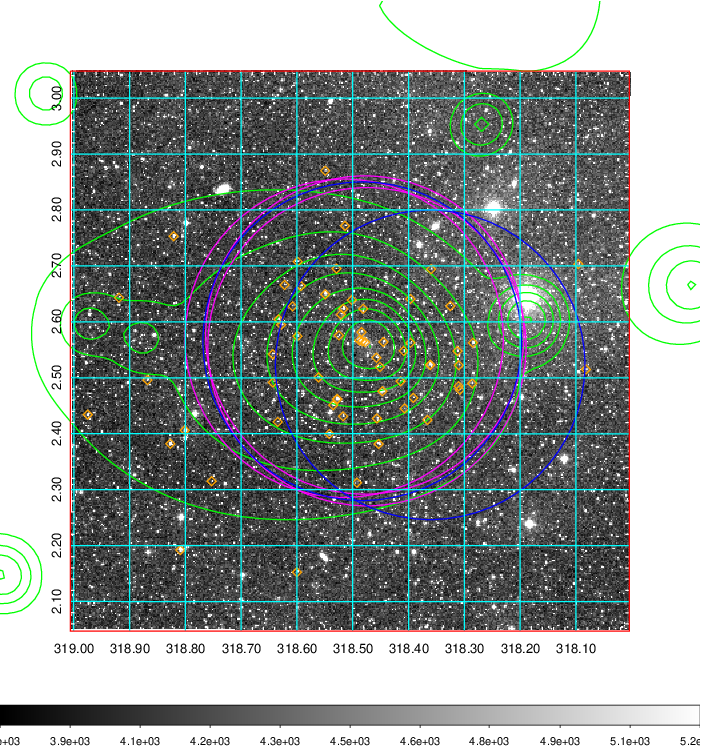  Blue circle for optical clusters;  Magenta circle for XSZ clusters;  all with r=1Mpc;  Only GC with Delta_z<0.01 are shown. | 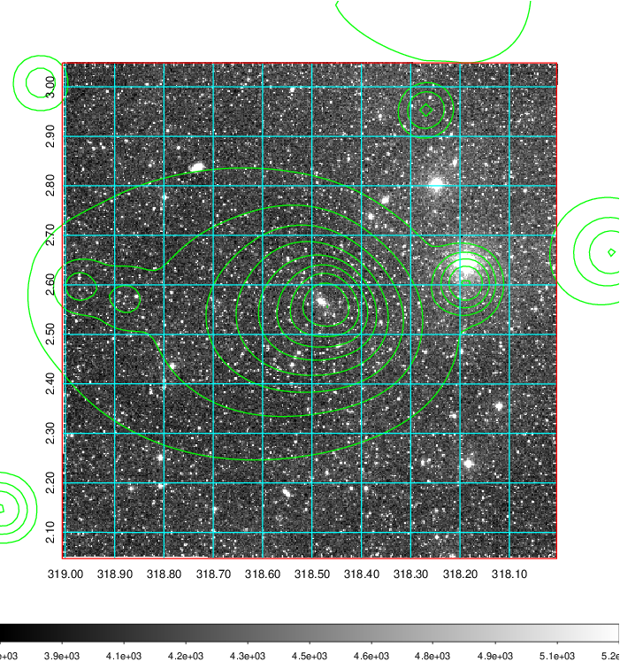 Blue circle for optical clusters;  Magenta circle for XSZ clusters;  all with r=1Mpc;  Only GC with Delta_z<0.01 are shown.  |

|[Previous-identified clusters](../image/845/845_gc.pdf) | [2MASS image](../image/845/845_2mass.pdf)      |[SDSS image](../image/845/845_sdss.pdf)   |
|-------------------|-------------------|-------------------|
|  Green, magenta, and blue circles  for optical, X-ray and SZ clusters  respectively, with redshift of clusters  labelled. The radius of circles  are 1Mpc.|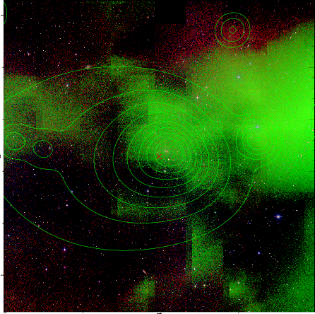  | 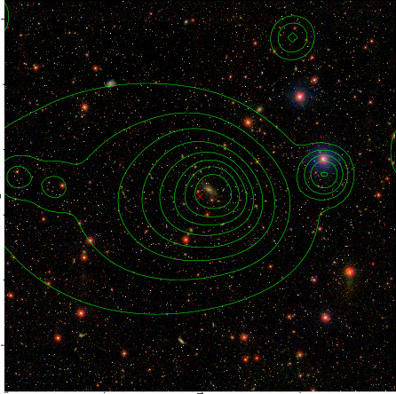  |

