

### 846

|Name|RAJ2000[deg]|DEJ2000[deg] |Ext[arcmin]| Ext,ml | z | z_src| C|GC(XSZ,Delta_z<0.01)| GC(OPT,Delta_z<0.01)|GC| R_sig[arcmin] | R500[arcmin] | R500[Mpc]| CRsig[c/s] | CR500[c/s] |L500[1E44 erg/s]|F500[1E-12 erg/s/cm^2]| M500[1E14 Msun]|Tx[keV]|Cnt_sig|Beta|Rc[arcmin]|Comment|Alias|
|---|---|---|---|---|---|------|---|--------|---------|----------|---|---|---|---|---|---|---|---|---|---|---|---|---|---|
|846| 319.238| -59.499| 3.43| 50.20| 0.0577(0.005)| z1, z_xsz| B| MCXC, Tar| A, W| A, MCXC, N, Tar, W| 12.700| 11.865| 0.796| 0.324(0.064)| 0.320(0.063)| 0.458(0.055)| 5.749(0.692)| 1.51(0.09)| 2.82(0.11)| 74.8| 0.779(-0.150+0.146)| 5.097(-1.378+1.185)| -| k418|

|[RASS image](../image/846/846_img.pdf)|[filtered image](../image/846/846_fil.pdf)|[Segment image](../image/846/846_seg.pdf)|
|-------------------|--------------------|-------------------|
| 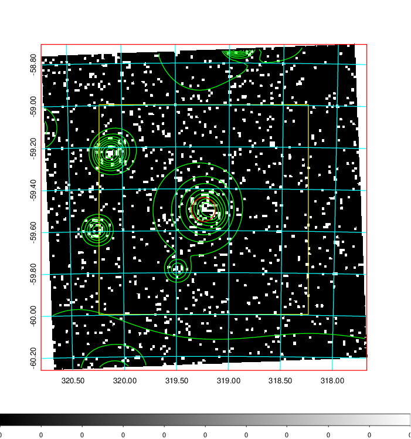  | 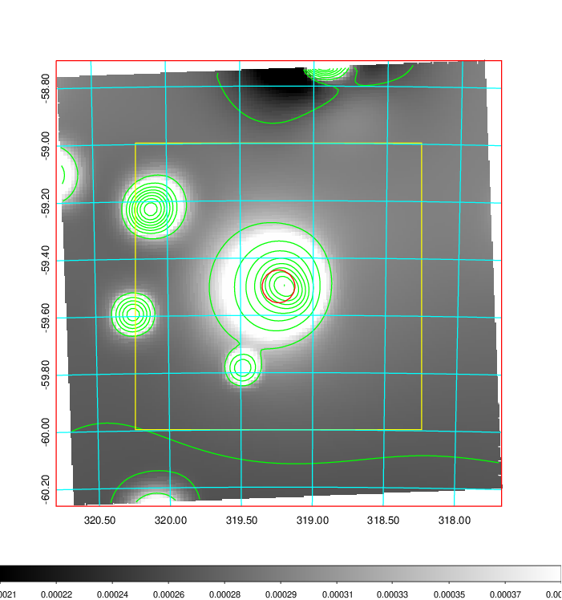   | 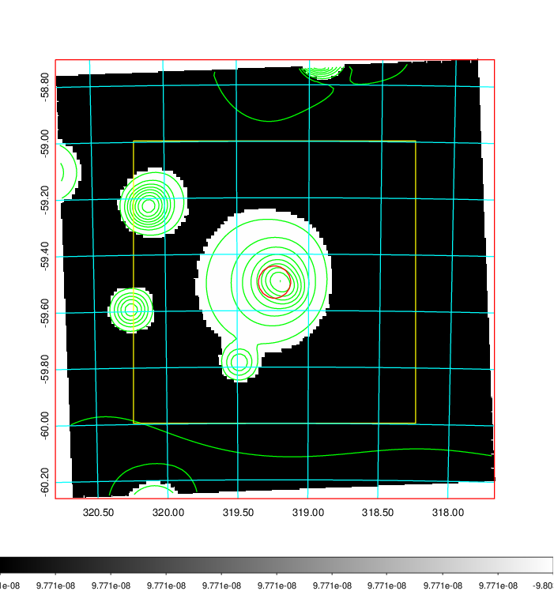  |

|[Exposure image](../image/846/846_mex.pdf)| [nH image](../image/846/846_nh.pdf)| [Planck image](../image/846/846_p.pdf)|
|-------------------|--------------------|-------------------|
|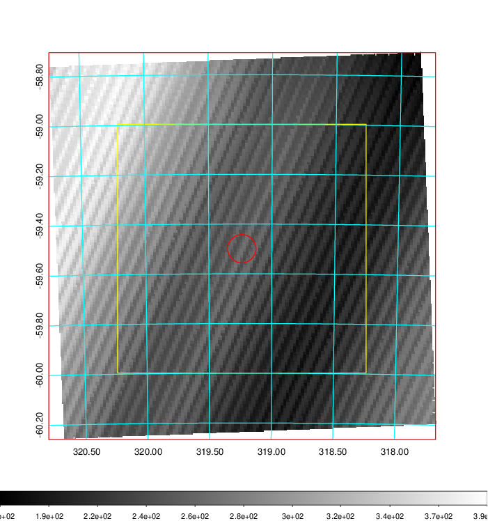   | 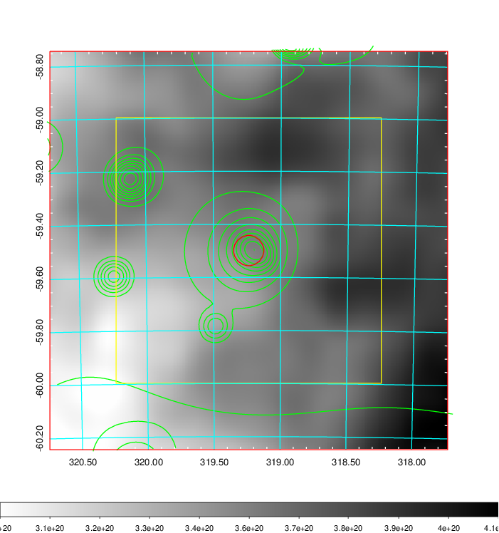    | 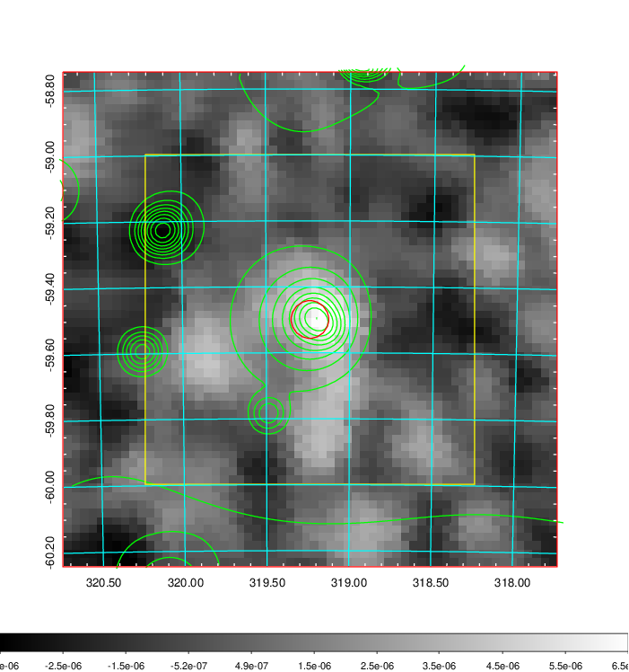 |

|[Redshift Histogram](../image/846/846_zg.pdf) | [DSS image(z1)](../image/846/846_dss_z1.pdf)      |  [DSS image(z2)](../image/846/846_dss_z2.pdf)    |
|-------------------|--------------------|-------------------|
|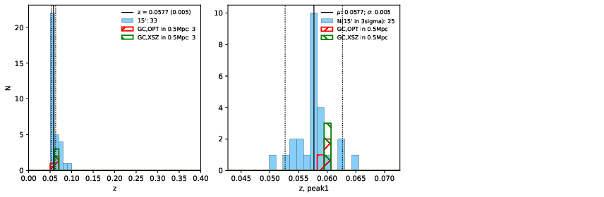 |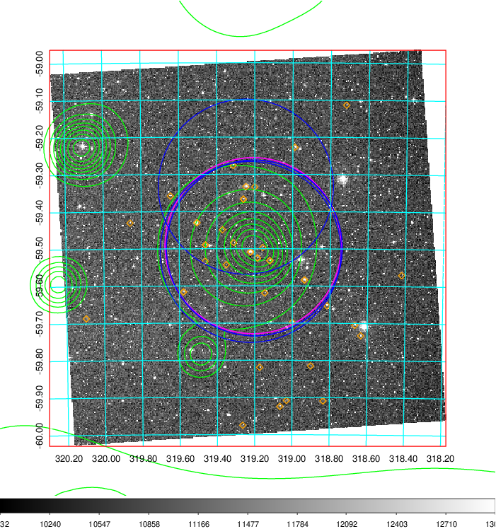  Blue circle for optical clusters;  Magenta circle for XSZ clusters;  all with r=1Mpc;  Only GC with Delta_z<0.01 are shown. | 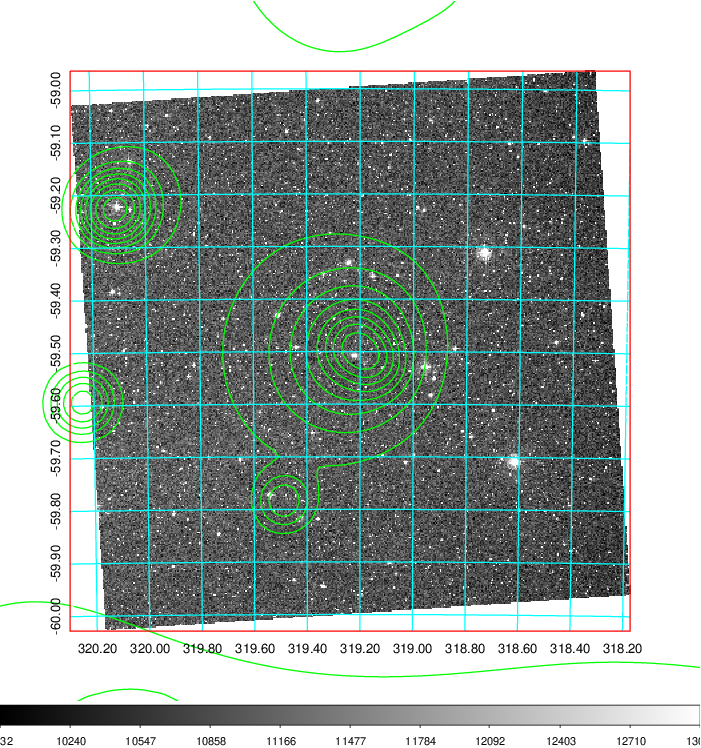 Blue circle for optical clusters;  Magenta circle for XSZ clusters;  all with r=1Mpc;  Only GC with Delta_z<0.01 are shown.  |

|[Previous-identified clusters](../image/846/846_gc.pdf) | [2MASS image](../image/846/846_2mass.pdf)      |
|-------------------|-------------------|
|  Green, magenta, and blue circles  for optical, X-ray and SZ clusters  respectively, with redshift of clusters  labelled. The radius of circles  are 1Mpc.|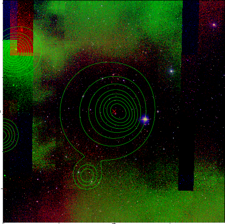  |

|[DES image](../image/846/846_des.pdf)   |
|-------------------|
| 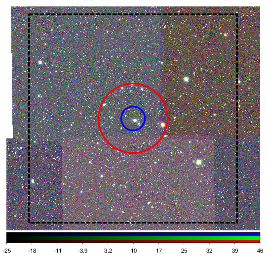  |
