

### 847

|Name|RAJ2000[deg]|DEJ2000[deg] |Ext[arcmin]| Ext,ml | z | z_src| C|GC(XSZ,Delta_z<0.01)| GC(OPT,Delta_z<0.01)|GC| R_sig[arcmin] | R500[arcmin] | R500[Mpc]| CRsig[c/s] | CR500[c/s] |L500[1E44 erg/s]|F500[1E-12 erg/s/cm^2]| M500[1E14 Msun]|Tx[keV]|Cnt_sig|Beta|Rc[arcmin]|Comment|Alias|
|---|---|---|---|---|---|------|---|--------|---------|----------|---|---|---|---|---|---|---|---|---|---|---|---|---|---|
|847| 319.985| 1.343| 2.79| 36.51| 0.1346(0.005)| z1, z_xsz| B| F20, SPI| C, N, W| C, F20, N, SPI, Tar, W| 6.362| 6.153| 0.881| 0.102(0.029)| 0.102(0.029)| 0.889(0.123)| 1.850(0.256)| 2.22(0.15)| 3.65(0.16)| 47.9| 0.886(-0.128+0.082)| 4.341(-0.828+0.667)| An SZ cluster with no $z$ and offset = 0.07 Mpc| t120|

|[RASS image](../image/847/847_img.pdf)|[filtered image](../image/847/847_fil.pdf)|[Segment image](../image/847/847_seg.pdf)|
|-------------------|--------------------|-------------------|
| 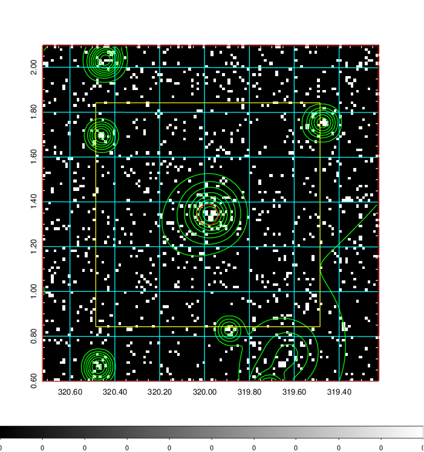  | 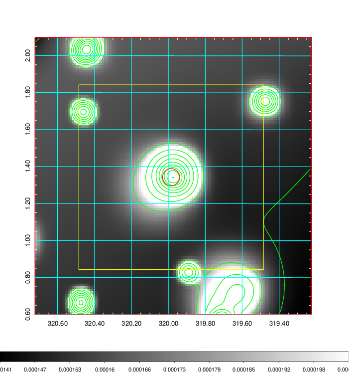   | 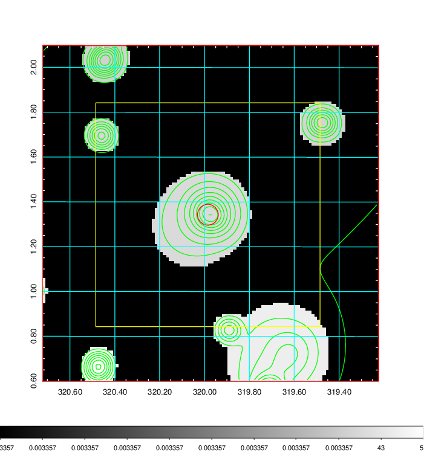  |

|[Exposure image](../image/847/847_mex.pdf)| [nH image](../image/847/847_nh.pdf)| [Planck image](../image/847/847_p.pdf)|
|-------------------|--------------------|-------------------|
|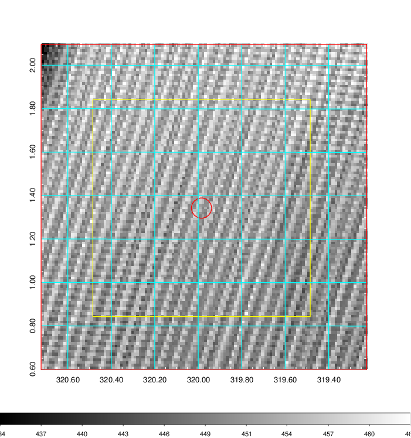   | 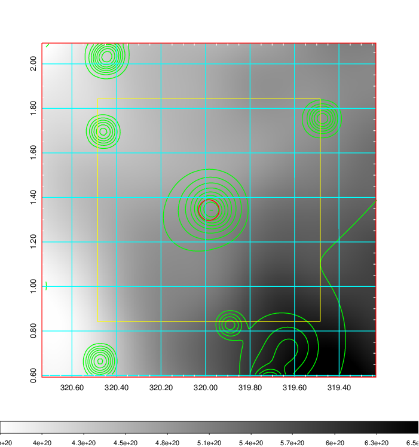    | 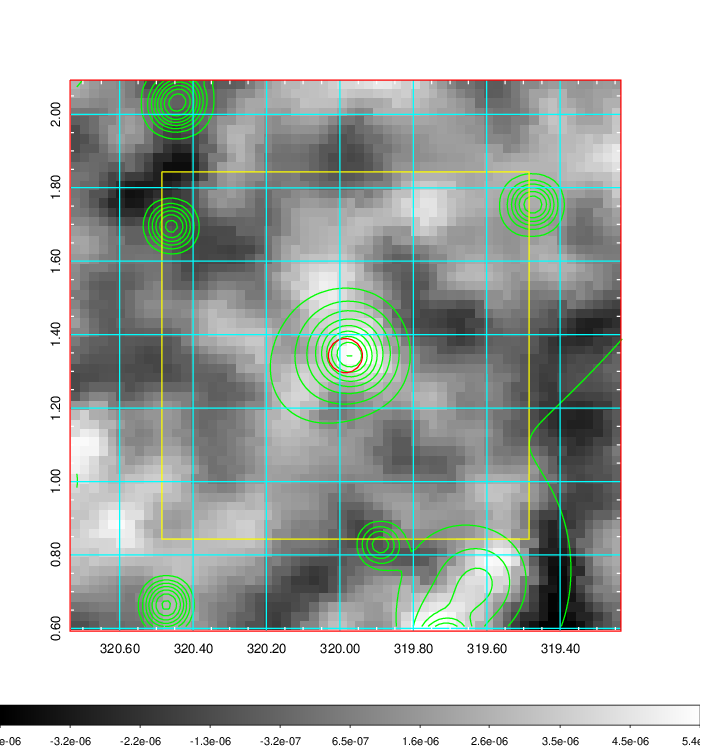 |

|[Redshift Histogram](../image/847/847_zg.pdf) | [DSS image(z1)](../image/847/847_dss_z1.pdf)      |  [DSS image(z2)](../image/847/847_dss_z2.pdf)    |
|-------------------|--------------------|-------------------|
|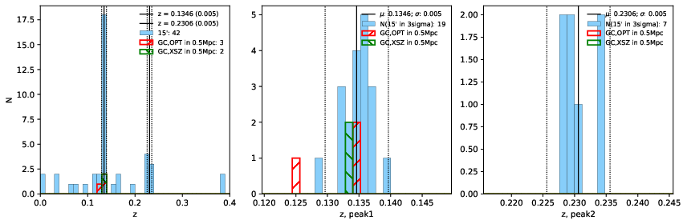 |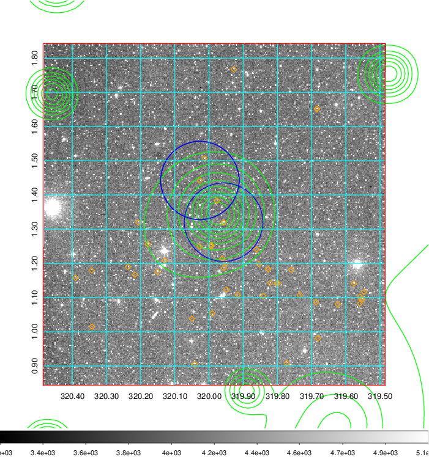  Blue circle for optical clusters;  Magenta circle for XSZ clusters;  all with r=1Mpc;  Only GC with Delta_z<0.01 are shown. | 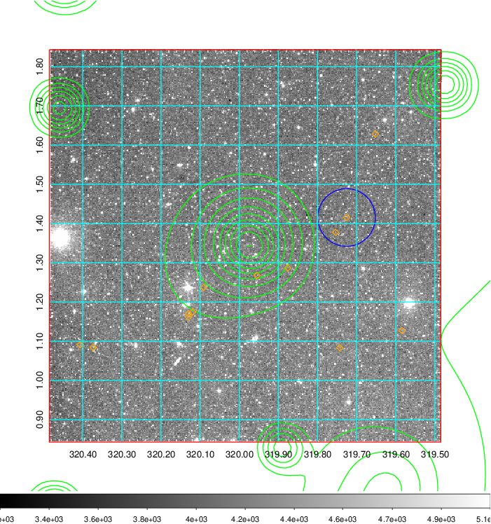 Blue circle for optical clusters;  Magenta circle for XSZ clusters;  all with r=1Mpc;  Only GC with Delta_z<0.01 are shown.  |

|[known Abell/XSZ clusters](../image/847/847_gc.pdf) | [2MASS image](../image/847/847_2mass.pdf)      |[SDSS image](../image/847/847_sdss.pdf)   |
|-------------------|-------------------|-------------------|
|  Magenta, blue and green circles  for optical, X-ray and SZ clusters  respectively, with redshift of clusters  labelled. The radius of circles  are 1Mpc.|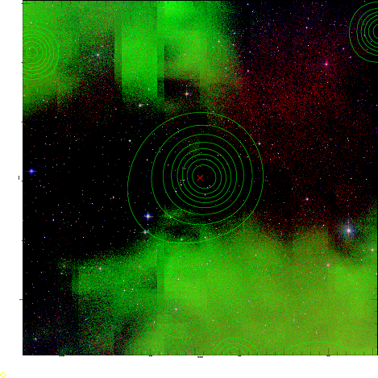  | 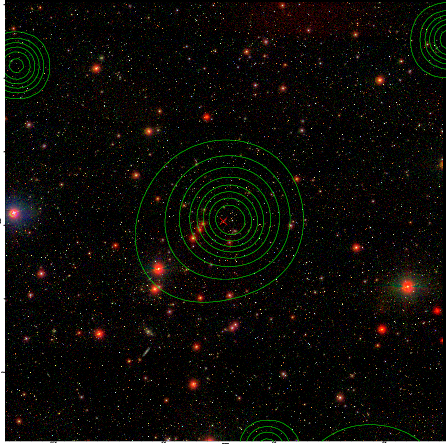  |

|[DES image](../image/847/847_des.pdf)   |
|-------------------|
|   |
