

### 848

|Name|RAJ2000[deg]|DEJ2000[deg] |Ext[arcmin]| Ext,ml | z | z_src| C|GC(XSZ,Delta_z<0.01)| GC(OPT,Delta_z<0.01)|GC| R_sig[arcmin] | R500[arcmin] | R500[Mpc]| CRsig[c/s] | CR500[c/s] |L500[1E44 erg/s]|F500[1E-12 erg/s/cm^2]| M500[1E14 Msun]|Tx[keV]|Cnt_sig|Beta|Rc[arcmin]|Comment|Alias|
|---|---|---|---|---|---|------|---|--------|---------|----------|---|---|---|---|---|---|---|---|---|---|---|---|---|---|
|848| 321.729| -12.160| 3.00| 75.50| 0.1779(0.005)| z1, z_xsz| B| PSZ2, Tar, XB| N| A, MCXC, N, PSZ2, Tar, W, XB| 9.288| 6.280| 1.133| 0.221(0.038)| 0.210(0.037)| 3.521(0.300)| 3.975(0.339)| 4.93(0.20)| 6.06(0.16)| 104.8| 0.936(-0.082+0.047)| 6.779(-0.669+0.548)| -| k377|

|[RASS image](../image/848/848_img.pdf)|[filtered image](../image/848/848_fil.pdf)|[Segment image](../image/848/848_seg.pdf)|
|-------------------|--------------------|-------------------|
| 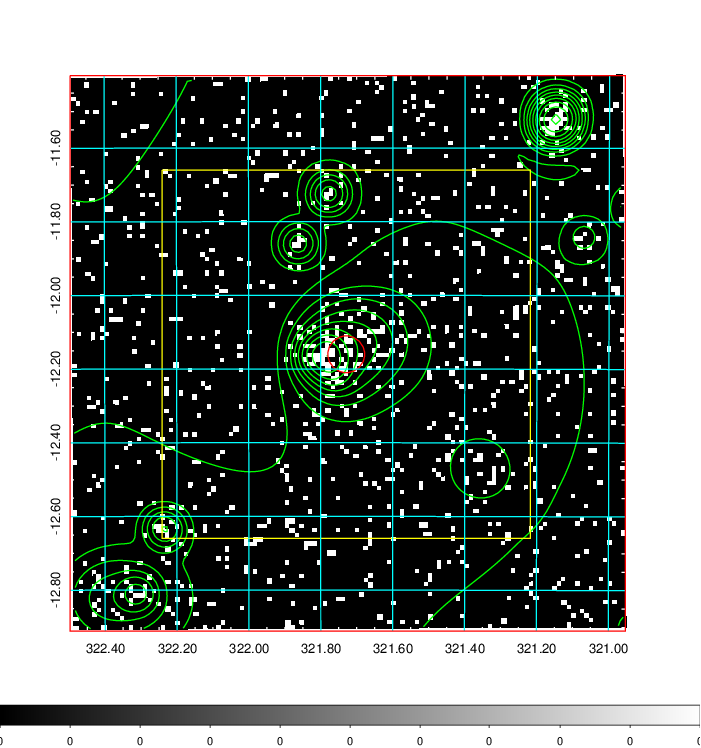  | 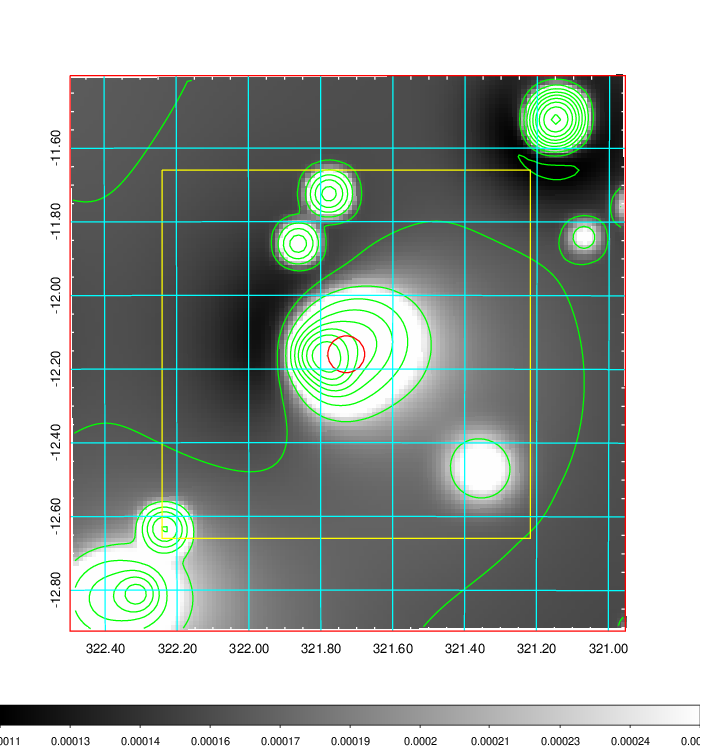   | 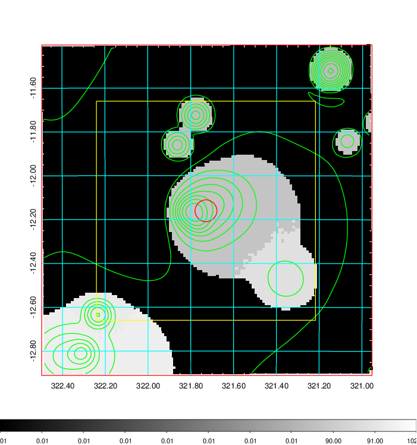  |

|[Exposure image](../image/848/848_mex.pdf)| [nH image](../image/848/848_nh.pdf)| [Planck image](../image/848/848_p.pdf)|
|-------------------|--------------------|-------------------|
|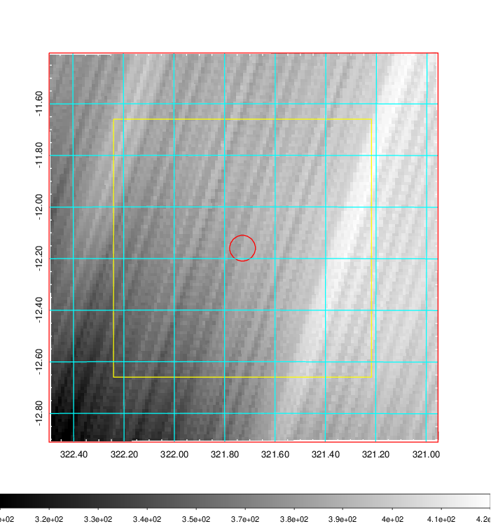   | 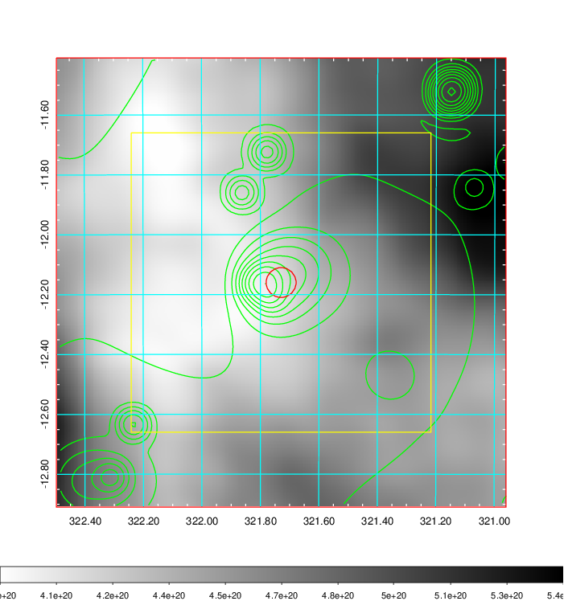    | 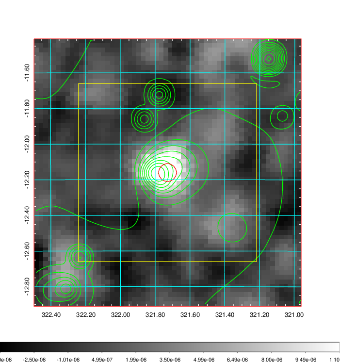 |

|[Redshift Histogram](../image/848/848_zg.pdf) | [DSS image(z1)](../image/848/848_dss_z1.pdf)      |  [DSS image(z2)](../image/848/848_dss_z2.pdf)    |
|-------------------|--------------------|-------------------|
|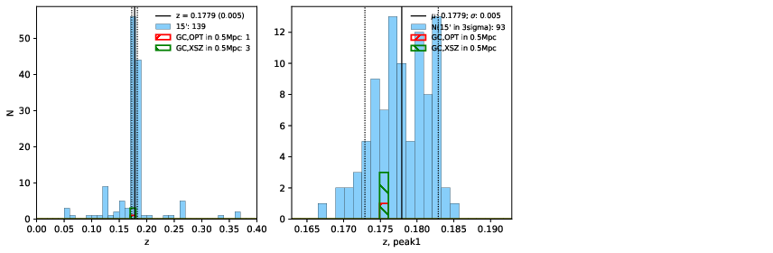 |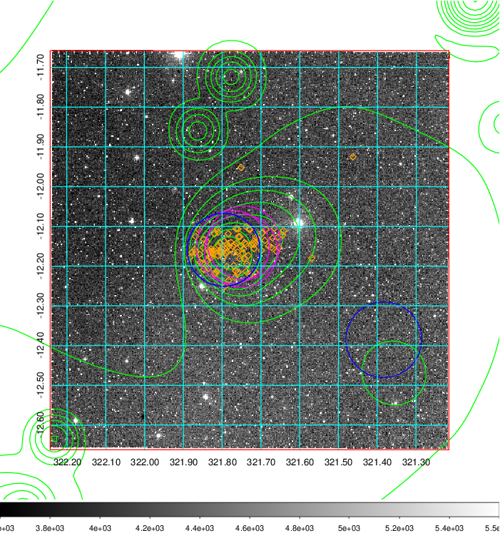  Blue circle for optical clusters;  Magenta circle for XSZ clusters;  all with r=1Mpc;  Only GC with Delta_z<0.01 are shown. | 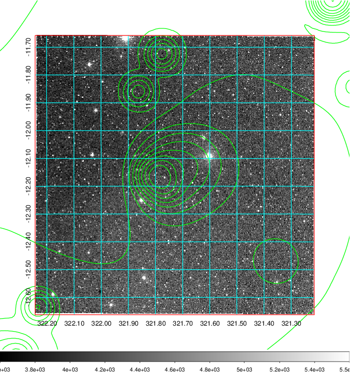 Blue circle for optical clusters;  Magenta circle for XSZ clusters;  all with r=1Mpc;  Only GC with Delta_z<0.01 are shown.  |

|[Previous-identified clusters](../image/848/848_gc.pdf) | [2MASS image](../image/848/848_2mass.pdf)      |
|-------------------|-------------------|
|  Green, magenta, and blue circles  for optical, X-ray and SZ clusters  respectively, with redshift of clusters  labelled. The radius of circles  are 1Mpc.|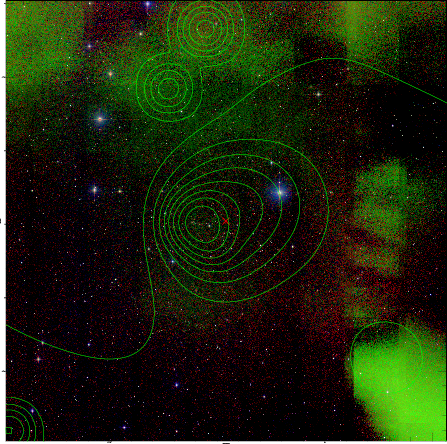  |

|[PS1 image](../image/848/848_ps1.pdf)            |
|-------------------|
| 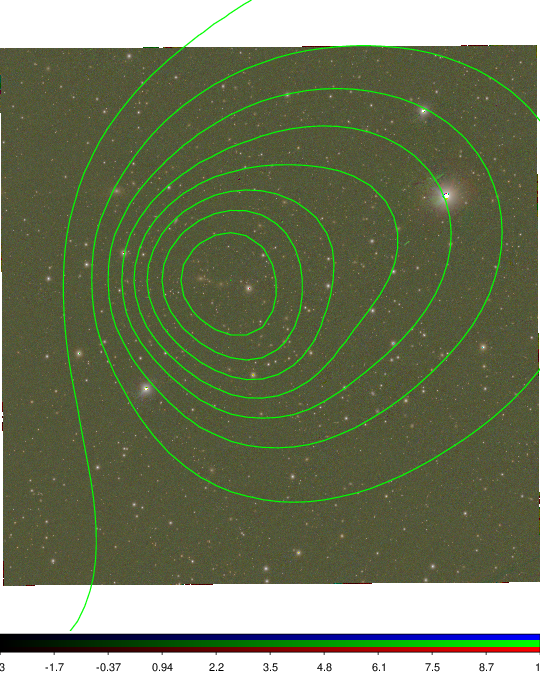  |
