

### 85

|Name|RAJ2000[deg]|DEJ2000[deg] |Ext[arcmin]| Ext,ml | z | z_src| C|GC(XSZ,Delta_z<0.01)| GC(OPT,Delta_z<0.01)|GC| R_sig[arcmin] | R500[arcmin] | R500[Mpc]| CRsig[c/s] | CR500[c/s] |L500[1E44 erg/s]|F500[1E-12 erg/s/cm^2]| M500[1E14 Msun]|Tx[keV]|Cnt_sig|Beta|Rc[arcmin]|Comment|Alias|
|---|---|---|---|---|---|------|---|--------|---------|----------|---|---|---|---|---|---|---|---|---|---|---|---|---|---|
|85| 27.085| -31.912| 3.14| 50.09| 0.1496(0.005)| z1, z_xsz| B| Tar| A, W| A, Tar, W| 13.188| 6.200| 0.970| 0.156(0.032)| 0.143(0.029)| 1.724(0.268)| 2.850(0.443)| 3.01(0.23)| 4.43(0.21)| 76.9| 0.737(-0.139+0.163)| 4.459(-1.288+1.251)| -| t139|

|[RASS image](../image/85/85_img.pdf)|[filtered image](../image/85/85_fil.pdf)|[Segment image](../image/85/85_seg.pdf)|
|-------------------|--------------------|-------------------|
| 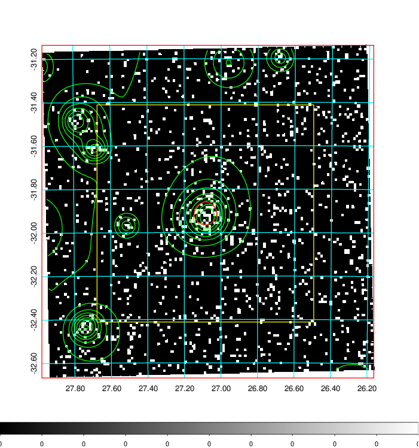  | 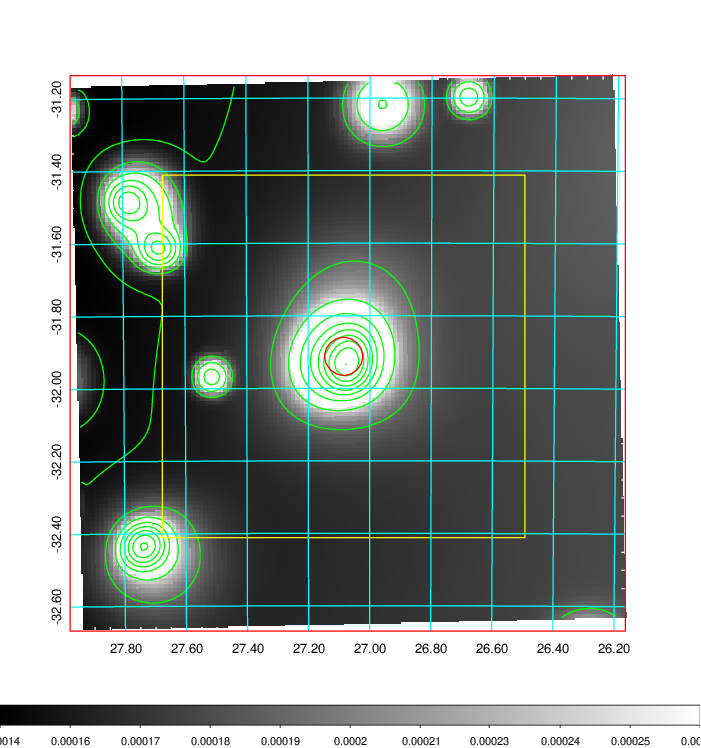   | 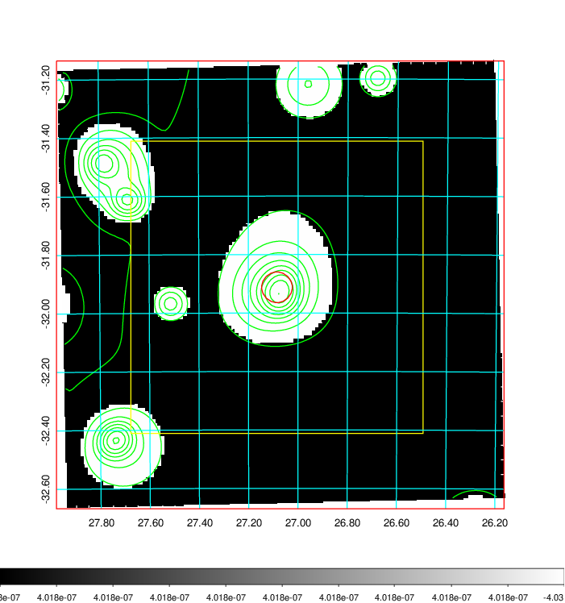  |

|[Exposure image](../image/85/85_mex.pdf)| [nH image](../image/85/85_nh.pdf)| [Planck image](../image/85/85_p.pdf)|
|-------------------|--------------------|-------------------|
|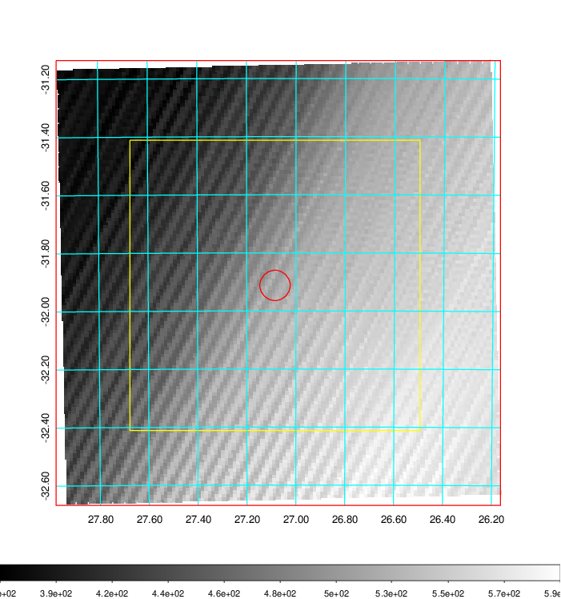   | 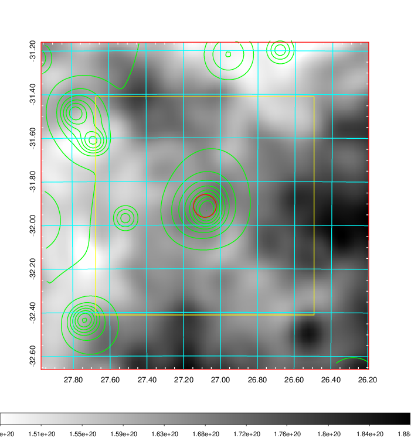    | 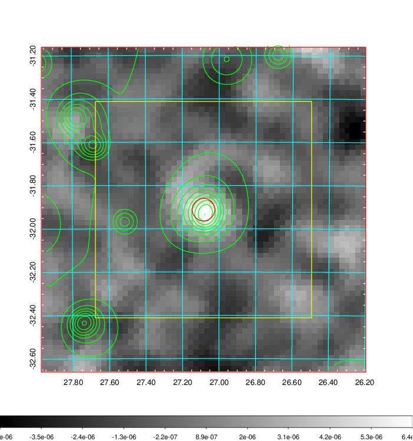 |

|[Redshift Histogram](../image/85/85_zg.pdf) | [DSS image(z1)](../image/85/85_dss_z1.pdf)      |  [DSS image(z2)](../image/85/85_dss_z2.pdf)    |
|-------------------|--------------------|-------------------|
|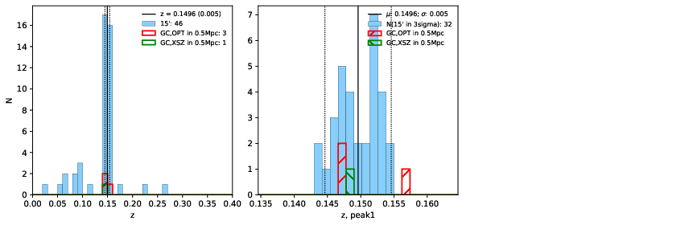 |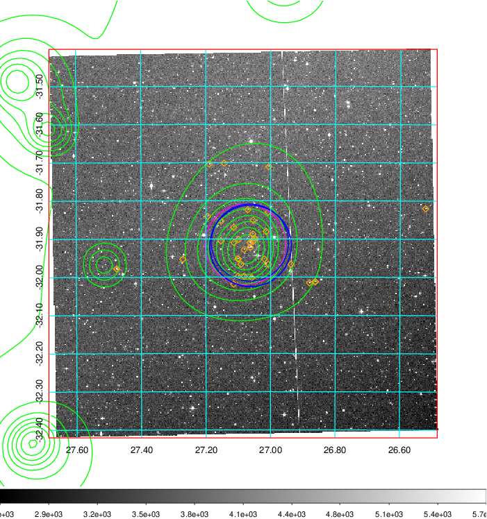  Blue circle for optical clusters;  Magenta circle for XSZ clusters;  all with r=1Mpc;  Only GC with Delta_z<0.01 are shown. | 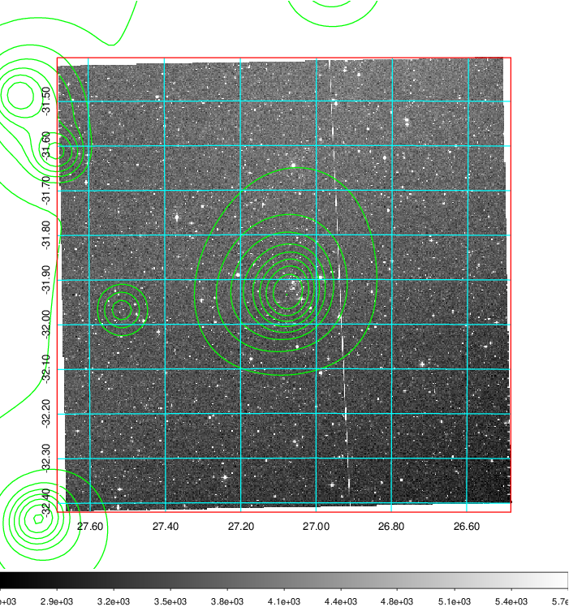 Blue circle for optical clusters;  Magenta circle for XSZ clusters;  all with r=1Mpc;  Only GC with Delta_z<0.01 are shown.  |

|[Previous-identified clusters](../image/85/85_gc.pdf) | [2MASS image](../image/85/85_2mass.pdf)      |
|-------------------|-------------------|
|  Green, magenta, and blue circles  for optical, X-ray and SZ clusters  respectively, with redshift of clusters  labelled. The radius of circles  are 1Mpc.|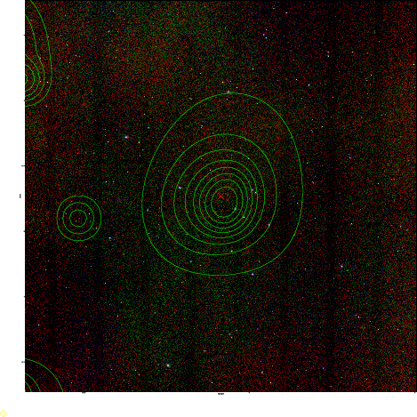  |

|[DES image](../image/85/85_des.pdf)   |[ATLAS image](../image/85/85_s.pdf)        |
|-------------------|-------------------|
| 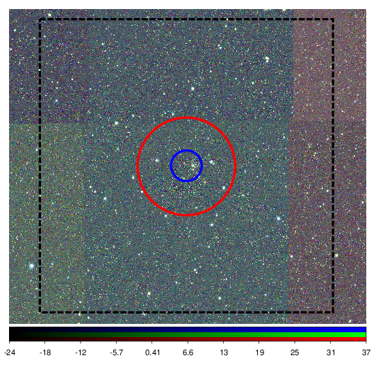  | 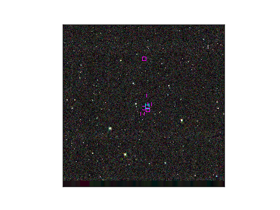  |
