

### 851

|Name|RAJ2000[deg]|DEJ2000[deg] |Ext[arcmin]| Ext,ml | z | z_src| C|GC(XSZ,Delta_z<0.01)| GC(OPT,Delta_z<0.01)|GC| R_sig[arcmin] | R500[arcmin] | R500[Mpc]| CRsig[c/s] | CR500[c/s] |L500[1E44 erg/s]|F500[1E-12 erg/s/cm^2]| M500[1E14 Msun]|Tx[keV]|Cnt_sig|Beta|Rc[arcmin]|Comment|Alias|
|---|---|---|---|---|---|------|---|--------|---------|----------|---|---|---|---|---|---|---|---|---|---|---|---|---|---|
|851| 323.218| 4.432| 3.89| 26.57| 0.0831(0.005)| z1, z_xsz| B| F20, SPI| N, RM, W| C, F20, N, SPI, W| 7.338| 7.259| 0.681| 0.074(0.030)| 0.073(0.030)| 0.221(0.053)| 1.290(0.311)| 0.97(0.12)| 2.16(0.17)| 33.3| 0.817(-0.174+0.129)| 5.309(-1.420+1.331)| -| t187|

|[RASS image](../image/851/851_img.pdf)|[filtered image](../image/851/851_fil.pdf)|[Segment image](../image/851/851_seg.pdf)|
|-------------------|--------------------|-------------------|
| 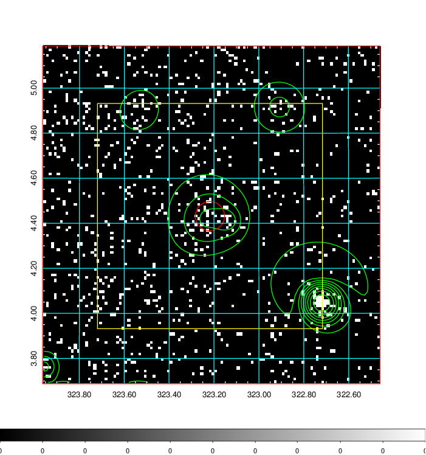  | 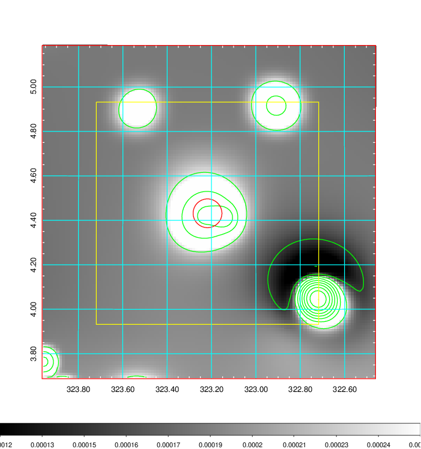   | 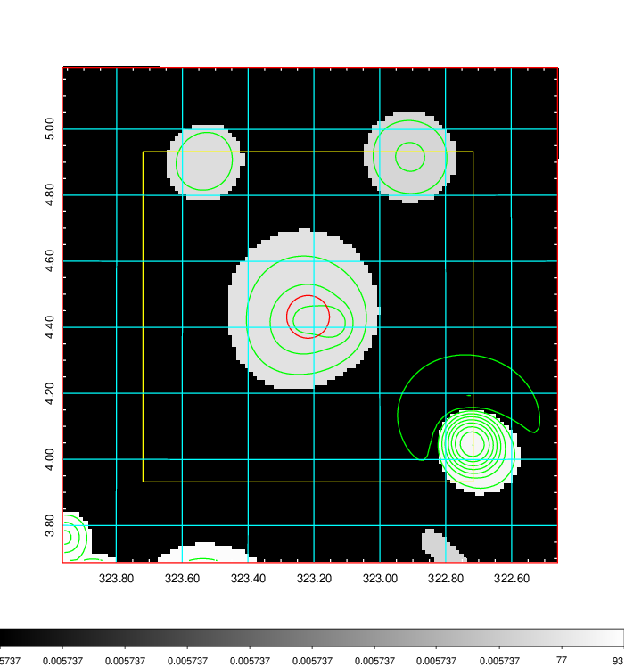  |

|[Exposure image](../image/851/851_mex.pdf)| [nH image](../image/851/851_nh.pdf)| [Planck image](../image/851/851_p.pdf)|
|-------------------|--------------------|-------------------|
|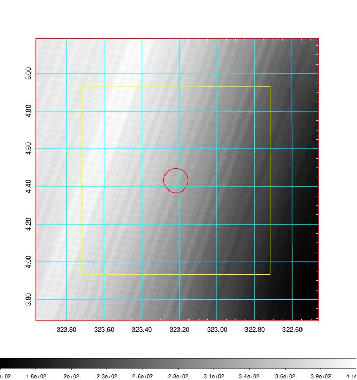   | 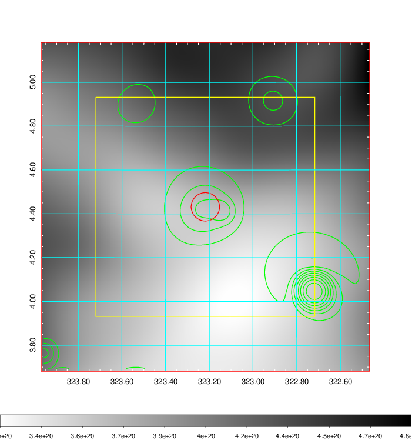    | 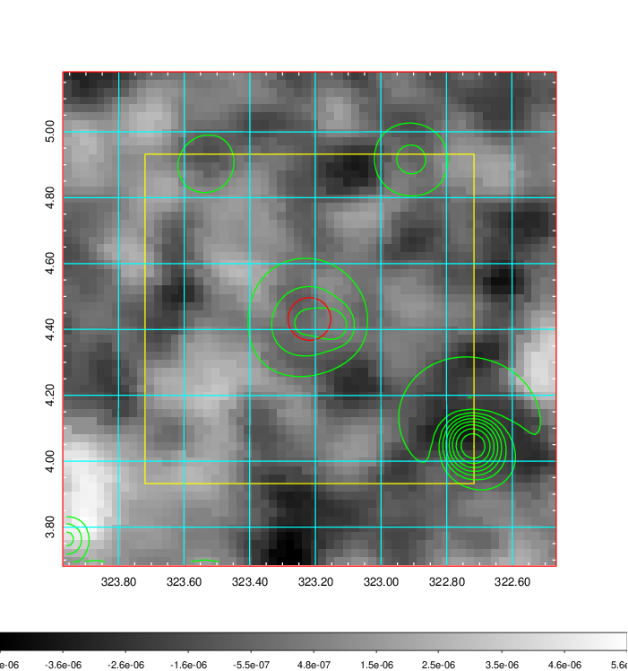 |

|[Redshift Histogram](../image/851/851_zg.pdf) | [DSS image(z1)](../image/851/851_dss_z1.pdf)      |  [DSS image(z2)](../image/851/851_dss_z2.pdf)    |
|-------------------|--------------------|-------------------|
|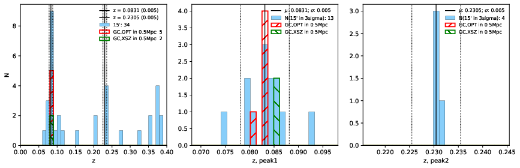 |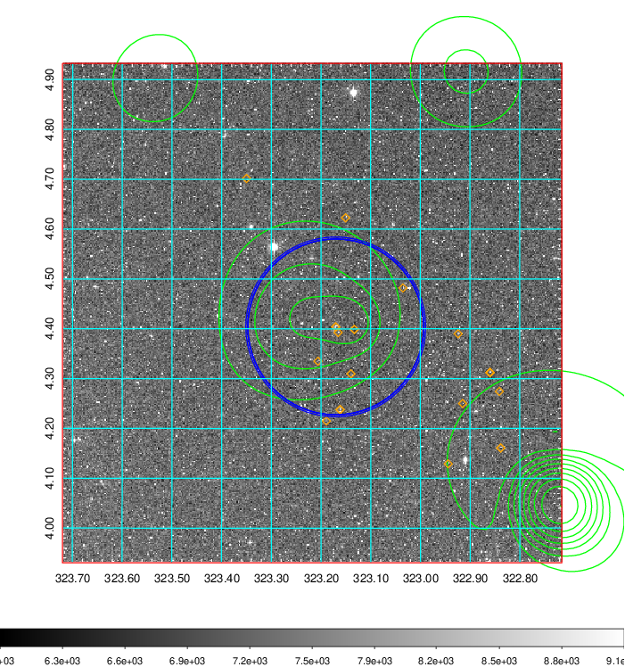  Blue circle for optical clusters;  Magenta circle for XSZ clusters;  all with r=1Mpc;  Only GC with Delta_z<0.01 are shown. | 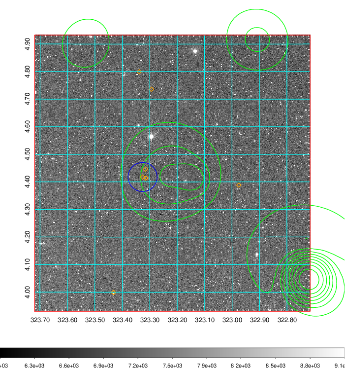 Blue circle for optical clusters;  Magenta circle for XSZ clusters;  all with r=1Mpc;  Only GC with Delta_z<0.01 are shown.  |

|[Previous-identified clusters](../image/851/851_gc.pdf) | [2MASS image](../image/851/851_2mass.pdf)      |[SDSS image](../image/851/851_sdss.pdf)   |
|-------------------|-------------------|-------------------|
|  Green, magenta, and blue circles  for optical, X-ray and SZ clusters  respectively, with redshift of clusters  labelled. The radius of circles  are 1Mpc.|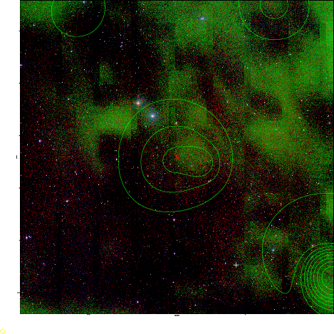  | 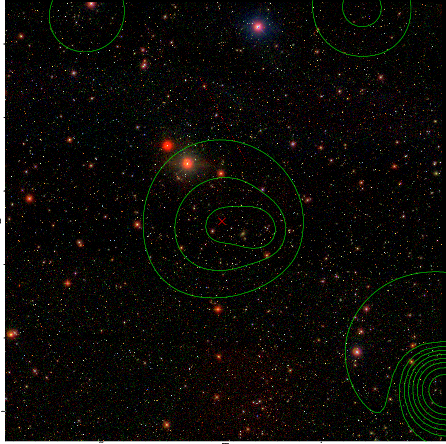  |

