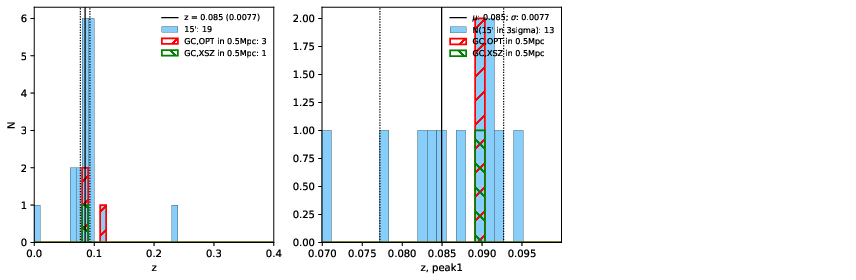

### 852

|Name|RAJ2000[deg]|DEJ2000[deg] |Ext[arcmin]| Ext,ml | z | z_src| C|GC(XSZ,Delta_z<0.01)| GC(OPT,Delta_z<0.01)|GC| R_sig[arcmin] | R500[arcmin] | R500[Mpc]| CRsig[c/s] | CR500[c/s] |L500[1E44 erg/s]|F500[1E-12 erg/s/cm^2]| M500[1E14 Msun]|Tx[keV]|Cnt_sig|Beta|Rc[arcmin]|Comment|Alias|
|---|---|---|---|---|---|------|---|--------|---------|----------|---|---|---|---|---|---|---|---|---|---|---|---|---|---|
|852| 323.540| -13.478| 1.59| 42.46| 0.0850(0.008)| z1, z_xsz| B| MCXC| A| A, MCXC, N, W| 4.900| 10.455| 1.000| 0.357(0.060)| 0.439(0.073)| 1.429(0.113)| 7.963(0.631)| 3.09(0.12)| 4.41(0.11)| 66.2| 0.946(-0.073+0.040)| 3.696(-0.407+0.343)| -| k135|

|[RASS image](../image/852/852_img.pdf)|[filtered image](../image/852/852_fil.pdf)|[Segment image](../image/852/852_seg.pdf)|
|-------------------|--------------------|-------------------|
|   |    |   |

|[Exposure image](../image/852/852_mex.pdf)| [nH image](../image/852/852_nh.pdf)| [Planck image](../image/852/852_p.pdf)|
|-------------------|--------------------|-------------------|
|   |     |  |

|[Redshift Histogram](../image/852/852_zg.pdf) | [DSS image(z1)](../image/852/852_dss_z1.pdf)      |  [DSS image(z2)](../image/852/852_dss_z2.pdf)    |
|-------------------|--------------------|-------------------|
| |  Blue circle for optical clusters;  Magenta circle for XSZ clusters;  all with r=1Mpc;  Only GC with Delta_z<0.01 are shown. |  Blue circle for optical clusters;  Magenta circle for XSZ clusters;  all with r=1Mpc;  Only GC with Delta_z<0.01 are shown.  |

|[Previous-identified clusters](../image/852/852_gc.pdf) | [2MASS image](../image/852/852_2mass.pdf)      |
|-------------------|-------------------|
|  Green, magenta, and blue circles  for optical, X-ray and SZ clusters  respectively, with redshift of clusters  labelled. The radius of circles  are 1Mpc.|  |

|[ATLAS image](../image/852/852_s.pdf)        |
|-------------------|
|   |
