

### 853

|Name|RAJ2000[deg]|DEJ2000[deg] |Ext[arcmin]| Ext,ml | z | z_src| C|GC(XSZ,Delta_z<0.01)| GC(OPT,Delta_z<0.01)|GC| R_sig[arcmin] | R500[arcmin] | R500[Mpc]| CRsig[c/s] | CR500[c/s] |L500[1E44 erg/s]|F500[1E-12 erg/s/cm^2]| M500[1E14 Msun]|Tx[keV]|Cnt_sig|Beta|Rc[arcmin]|Comment|Alias|
|---|---|---|---|---|---|------|---|--------|---------|----------|---|---|---|---|---|---|---|---|---|---|---|---|---|---|
|853| 323.832| 1.401| 2.44| 50.99| 0.2324(0.005)| z1, z_xsz| B| F20, H18, PSZ2, SPI, Tar| RM, W| A, C, F20, H18, MCXC, N, PSZ2, SPI, Tar, W| 24.206| 5.226| 1.161| 0.170(0.066)| 0.151(0.059)| 4.666(0.701)| 2.898(0.435)| 5.62(0.40)| 6.70(0.30)| 124.6| 0.942(-0.073+0.042)| 4.337(-0.461+0.387)| -| k290|

|[RASS image](../image/853/853_img.pdf)|[filtered image](../image/853/853_fil.pdf)|[Segment image](../image/853/853_seg.pdf)|
|-------------------|--------------------|-------------------|
| 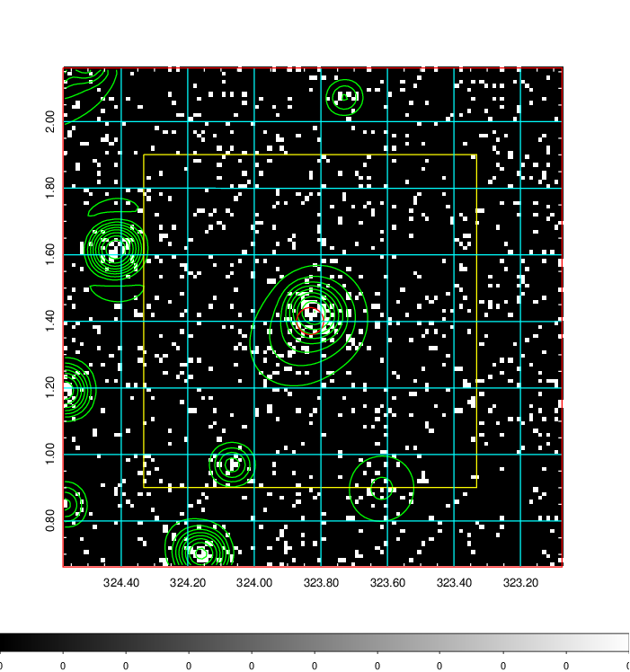  | 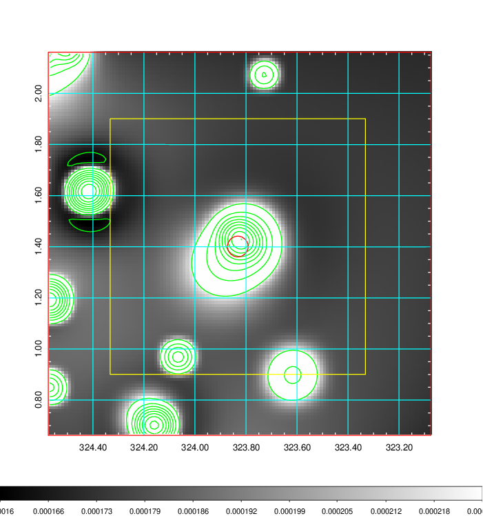   | 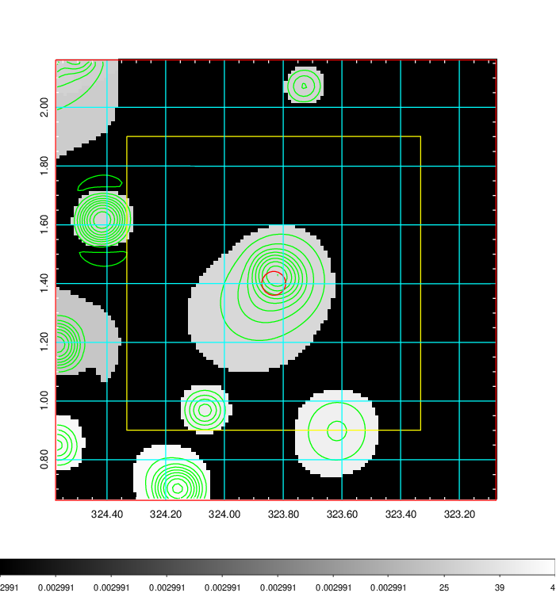  |

|[Exposure image](../image/853/853_mex.pdf)| [nH image](../image/853/853_nh.pdf)| [Planck image](../image/853/853_p.pdf)|
|-------------------|--------------------|-------------------|
|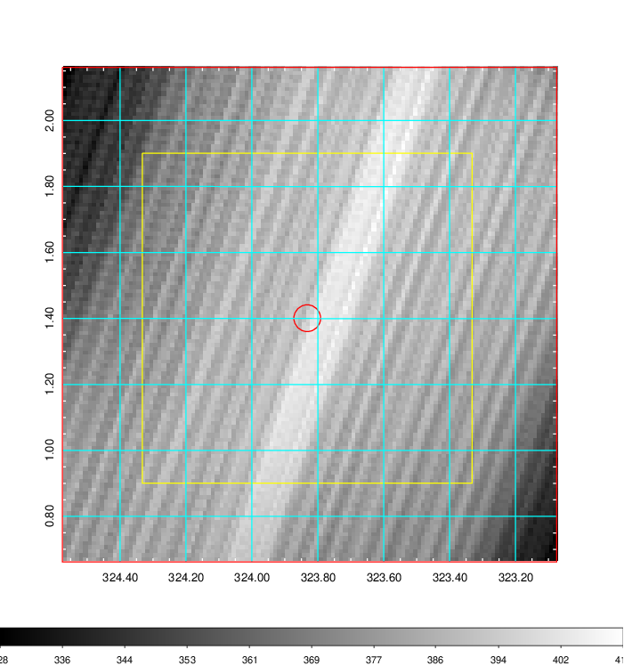   | 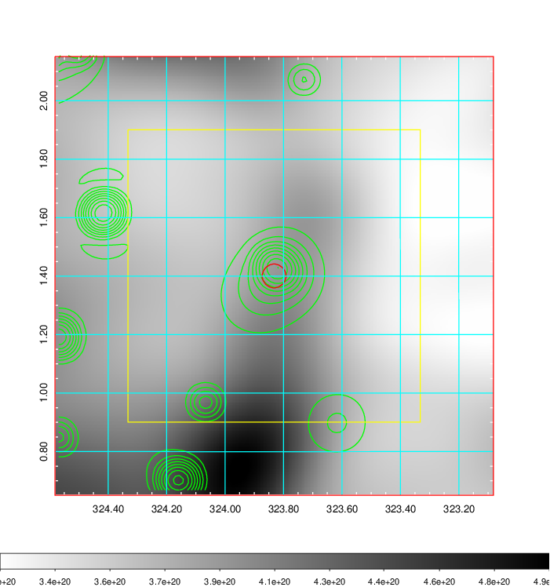    | 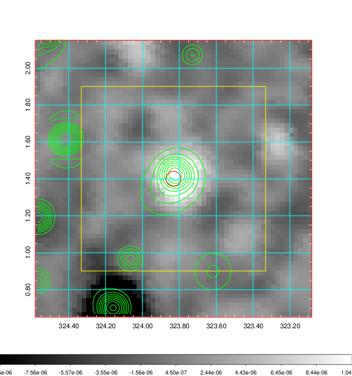 |

|[Redshift Histogram](../image/853/853_zg.pdf) | [DSS image(z1)](../image/853/853_dss_z1.pdf)      |  [DSS image(z2)](../image/853/853_dss_z2.pdf)    |
|-------------------|--------------------|-------------------|
|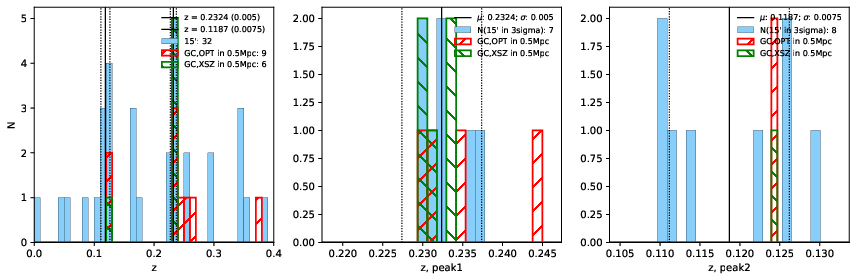 |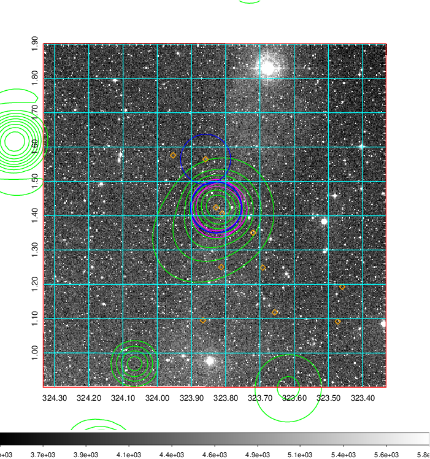  Blue circle for optical clusters;  Magenta circle for XSZ clusters;  all with r=1Mpc;  Only GC with Delta_z<0.01 are shown. | 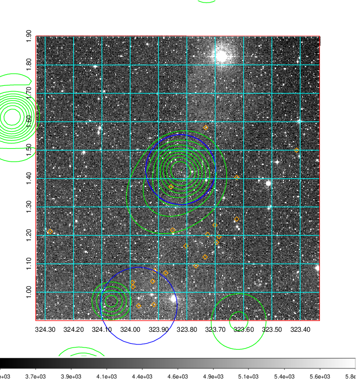 Blue circle for optical clusters;  Magenta circle for XSZ clusters;  all with r=1Mpc;  Only GC with Delta_z<0.01 are shown.  |

|[Previous-identified clusters](../image/853/853_gc.pdf) | [2MASS image](../image/853/853_2mass.pdf)      |[SDSS image](../image/853/853_sdss.pdf)   |
|-------------------|-------------------|-------------------|
|  Green, magenta, and blue circles  for optical, X-ray and SZ clusters  respectively, with redshift of clusters  labelled. The radius of circles  are 1Mpc.|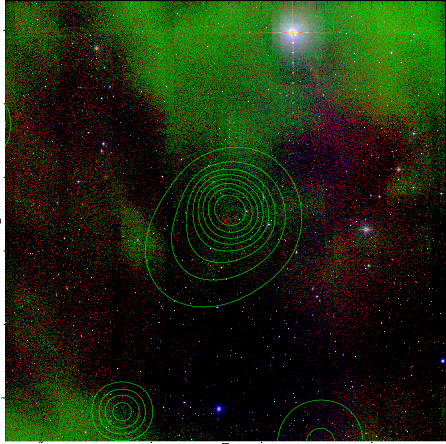  | 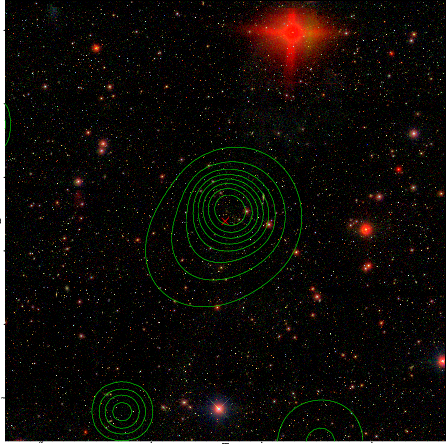  |

|[DES image](../image/853/853_des.pdf)   |
|-------------------|
| 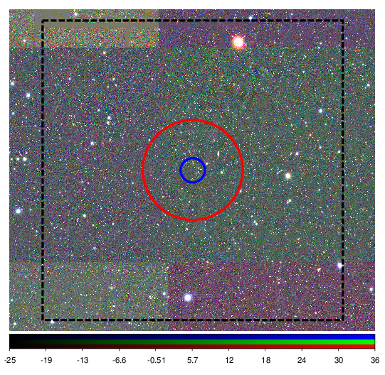  |
