

### 854

|Name|RAJ2000[deg]|DEJ2000[deg] |Ext[arcmin]| Ext,ml | z | z_src| C|GC(XSZ,Delta_z<0.01)| GC(OPT,Delta_z<0.01)|GC| R_sig[arcmin] | R500[arcmin] | R500[Mpc]| CRsig[c/s] | CR500[c/s] |L500[1E44 erg/s]|F500[1E-12 erg/s/cm^2]| M500[1E14 Msun]|Tx[keV]|Cnt_sig|Beta|Rc[arcmin]|Comment|Alias|
|---|---|---|---|---|---|------|---|--------|---------|----------|---|---|---|---|---|---|---|---|---|---|---|---|---|---|
|854| 323.966| 83.139| 9.46| 44.27| 0.1402(0.000)| -| G| -| -| A| 16.112| 6.185| 0.917| 0.125(0.027)| 0.113(0.025)| 1.081(0.312)| 2.058(0.593)| 2.51(0.36)| 3.95(0.36)| 103.3| 0.574(-0.056+0.141)| 6.060(-0.826+1.661)| -| t426|

|[RASS image](../image/854/854_img.pdf)|[filtered image](../image/854/854_fil.pdf)|[Segment image](../image/854/854_seg.pdf)|
|-------------------|--------------------|-------------------|
| 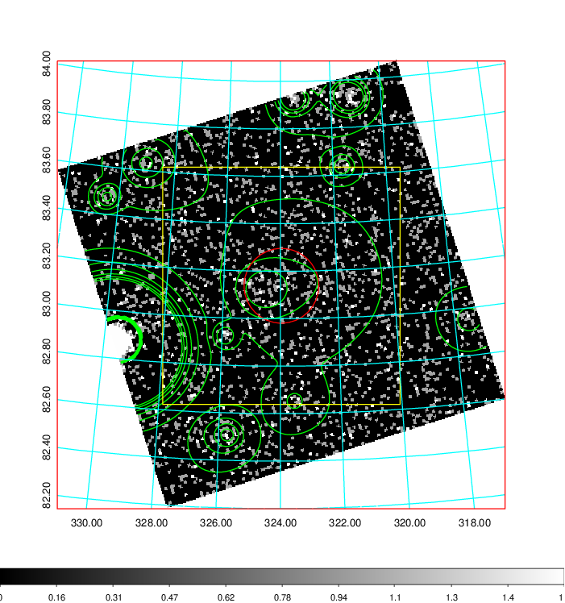  | 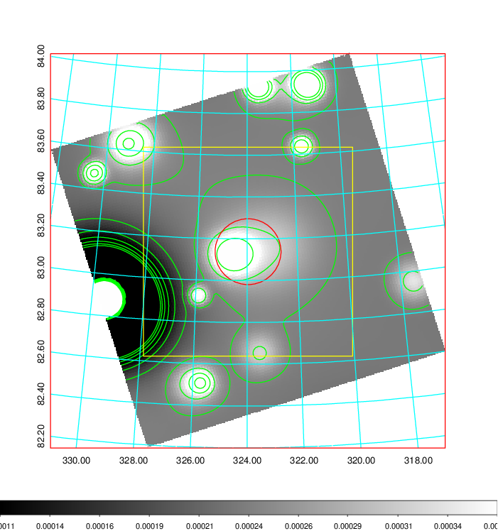   | 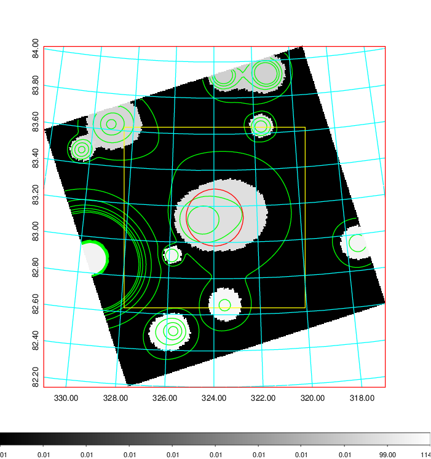  |

|[Exposure image](../image/854/854_mex.pdf)| [nH image](../image/854/854_nh.pdf)| [Planck image](../image/854/854_p.pdf)|
|-------------------|--------------------|-------------------|
|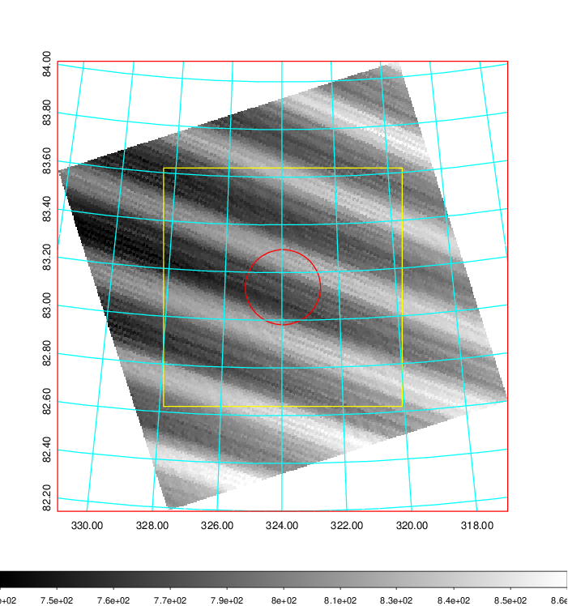   | 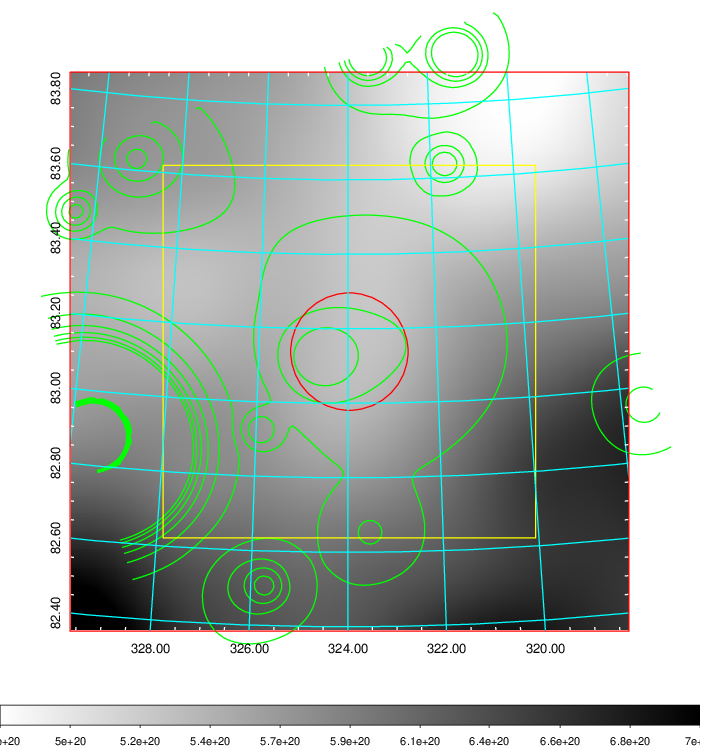    | 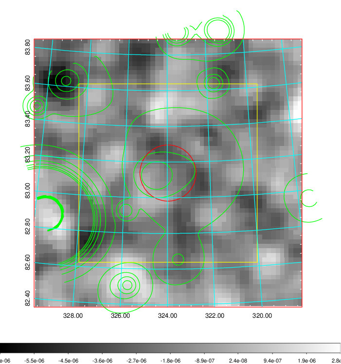 |

|[Redshift Histogram](../image/854/854_zg.pdf) | [DSS image(z1)](../image/854/854_dss_z1.pdf)      |  [DSS image(z2)](../image/854/854_dss_z2.pdf)    |
|-------------------|--------------------|-------------------|
|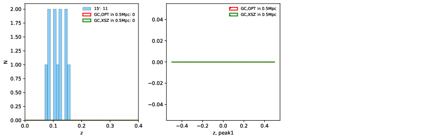 |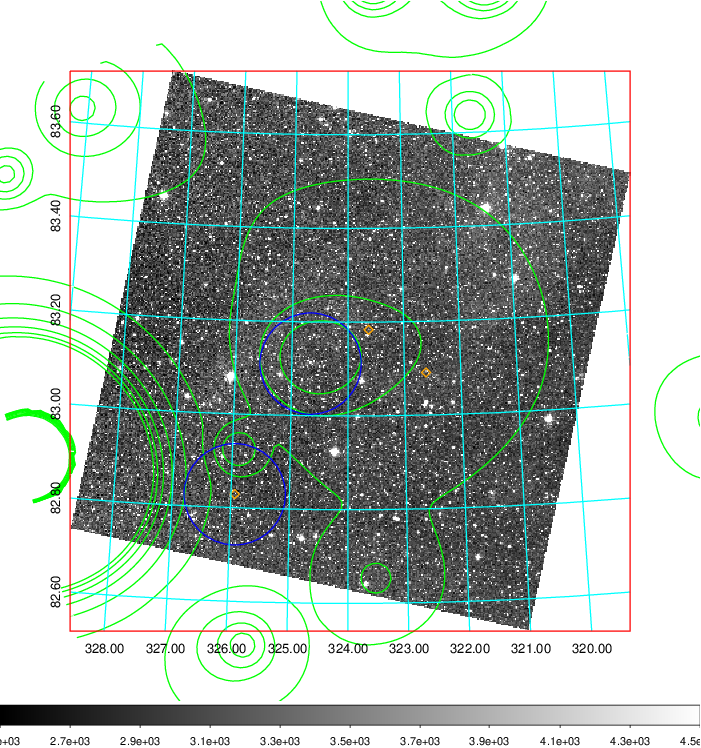  Blue circle for optical clusters;  Magenta circle for XSZ clusters;  all with r=1Mpc;  Only GC with Delta_z<0.01 are shown. | 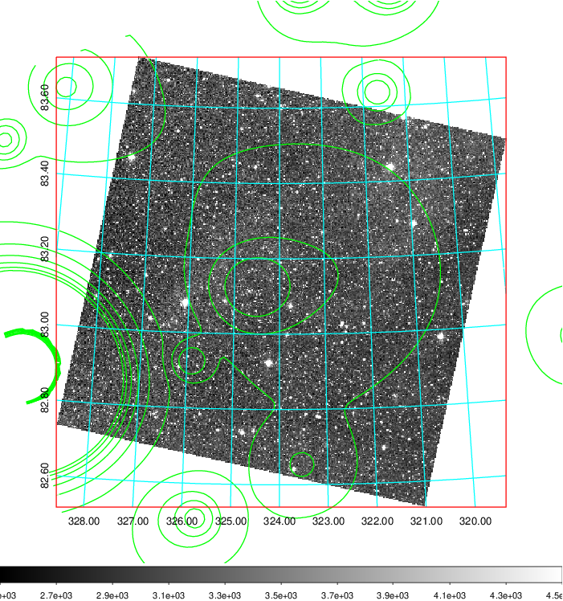 Blue circle for optical clusters;  Magenta circle for XSZ clusters;  all with r=1Mpc;  Only GC with Delta_z<0.01 are shown.  |

|[Previous-identified clusters](../image/854/854_gc.pdf) | [2MASS image](../image/854/854_2mass.pdf)      |
|-------------------|-------------------|
|  Green, magenta, and blue circles  for optical, X-ray and SZ clusters  respectively, with redshift of clusters  labelled. The radius of circles  are 1Mpc.|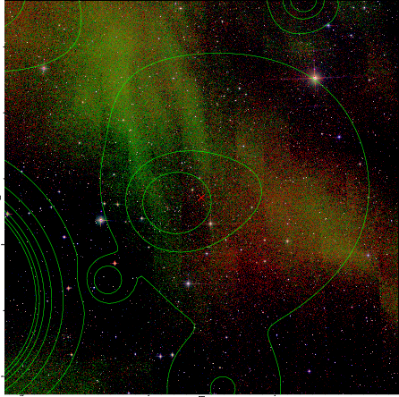  |

|[PS1 image](../image/854/854_ps1.pdf)            |
|-------------------|
| 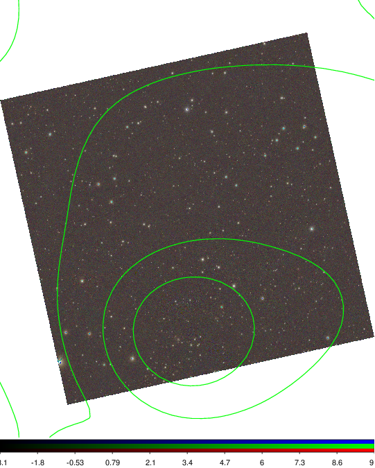  |
