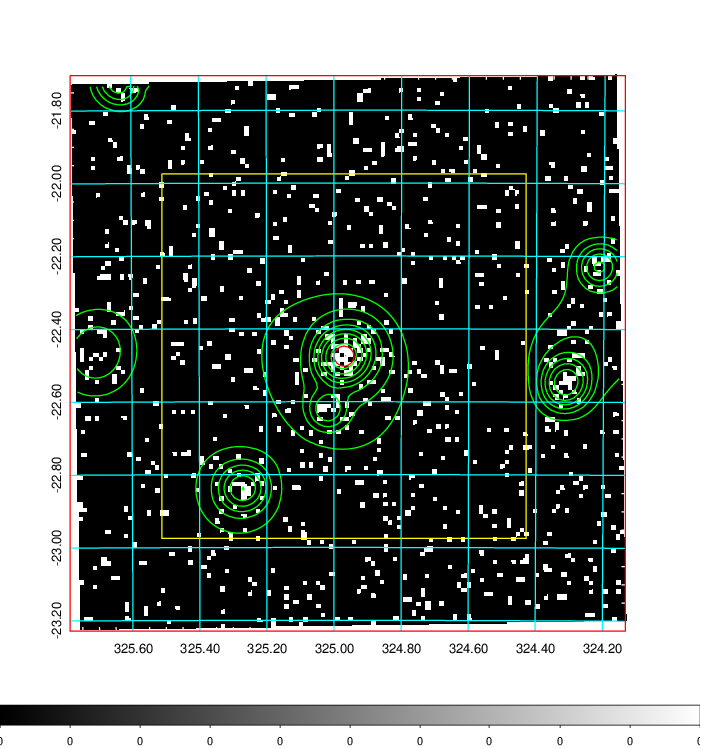
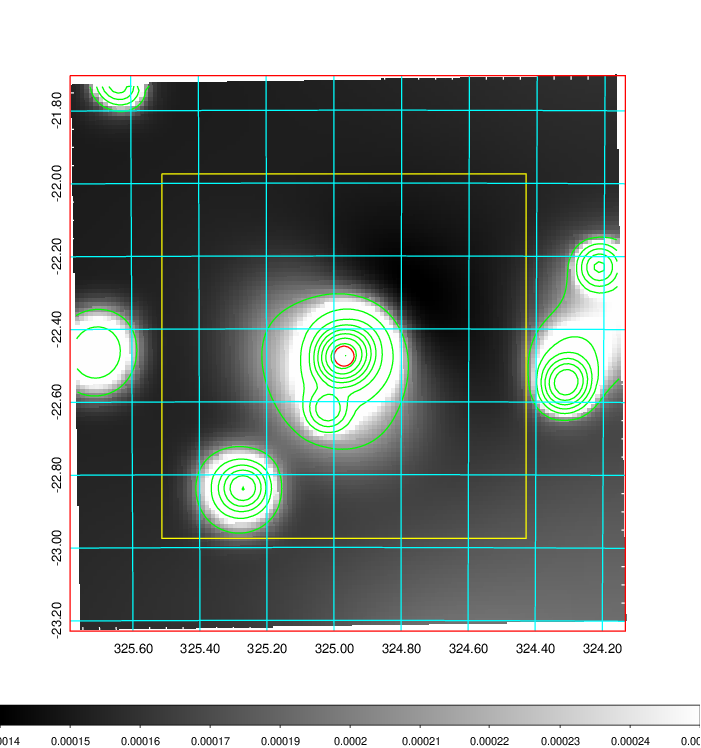
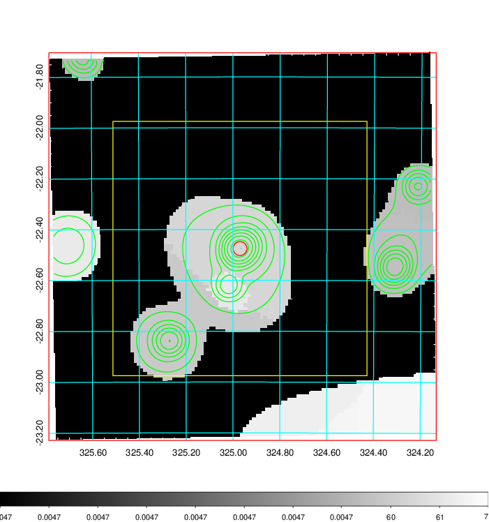
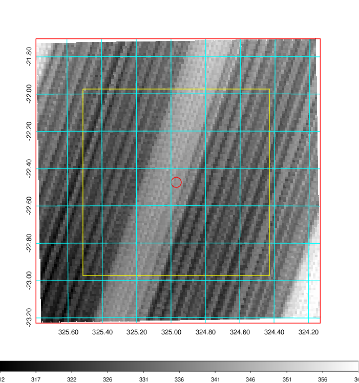
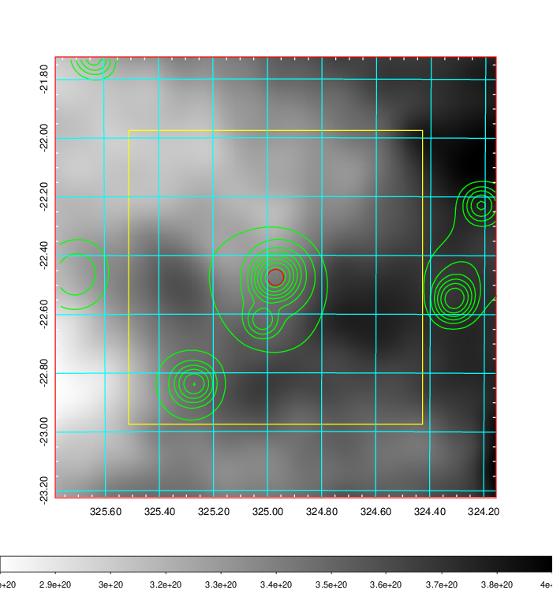
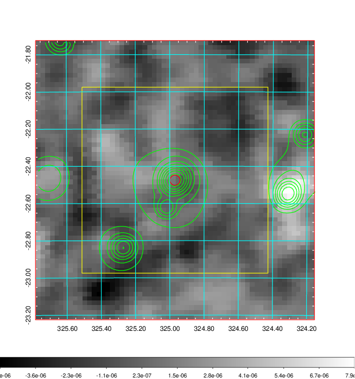
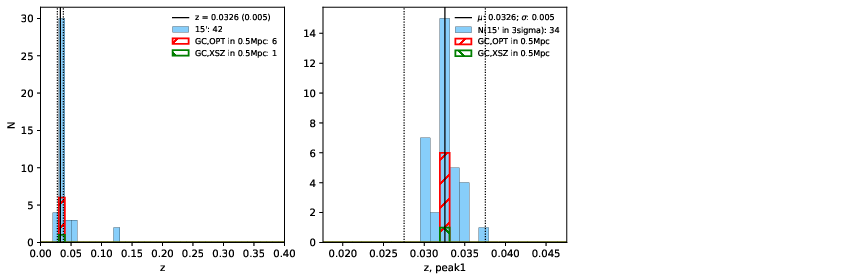
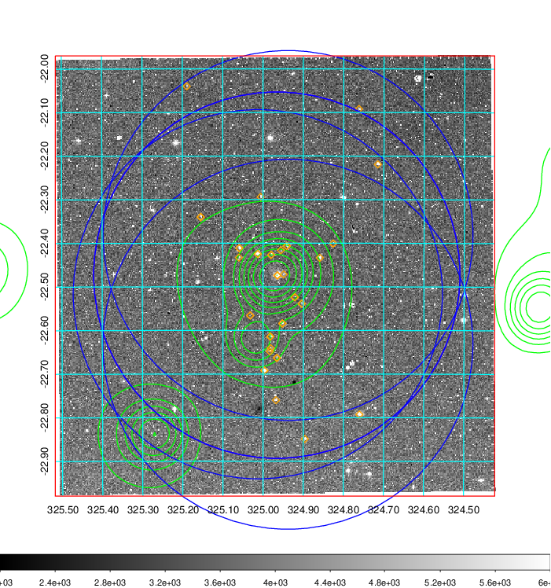
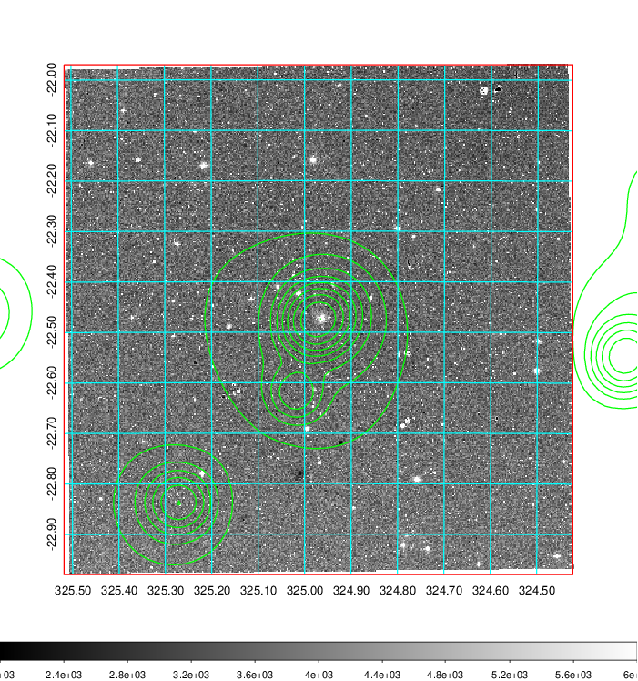
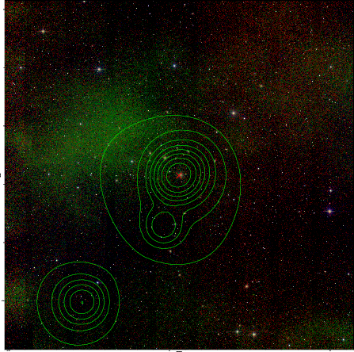

### 855

|Name|RAJ2000[deg]|DEJ2000[deg] |Ext[arcmin]| Ext,ml | z | z_src| C|GC(XSZ,Delta_z<0.01)| GC(OPT,Delta_z<0.01)|GC| R_sig[arcmin] | R500[arcmin] | R500[Mpc]| CRsig[c/s] | CR500[c/s] |L500[1E44 erg/s]|F500[1E-12 erg/s/cm^2]| M500[1E14 Msun]|Tx[keV]|Cnt_sig|Beta|Rc[arcmin]|Comment|Alias|
|---|---|---|---|---|---|------|---|--------|---------|----------|---|---|---|---|---|---|---|---|---|---|---|---|---|---|
|855| 324.970| -22.475| 1.64| 31.84| 0.0326(0.005)| z1, z_xsz| B| MCXC| A, N| A, MCXC, N| 9.775| 15.810| 0.617| 0.261(0.042)| 0.291(0.047)| 0.118(0.012)| 4.832(0.505)| 0.69(0.04)| 1.72(0.06)| 78.3| 0.588(-0.062+0.114)| 1.948(-0.632+0.948)| -| k146|

|[RASS image](../image/855/855_img.pdf)|[filtered image](../image/855/855_fil.pdf)|[Segment image](../image/855/855_seg.pdf)|
|-------------------|--------------------|-------------------|
|   |    |   |

|[Exposure image](../image/855/855_mex.pdf)| [nH image](../image/855/855_nh.pdf)| [Planck image](../image/855/855_p.pdf)|
|-------------------|--------------------|-------------------|
|   |     |  |

|[Redshift Histogram](../image/855/855_zg.pdf) | [DSS image(z1)](../image/855/855_dss_z1.pdf)      |  [DSS image(z2)](../image/855/855_dss_z2.pdf)    |
|-------------------|--------------------|-------------------|
| |  Blue circle for optical clusters;  Magenta circle for XSZ clusters;  all with r=1Mpc;  Only GC with Delta_z<0.01 are shown. |  Blue circle for optical clusters;  Magenta circle for XSZ clusters;  all with r=1Mpc;  Only GC with Delta_z<0.01 are shown.  |

|[known Abell/XSZ clusters](../image/855/855_gc.pdf) | [2MASS image](../image/855/855_2mass.pdf)      |
|-------------------|-------------------|
|  Magenta, blue and green circles  for optical, X-ray and SZ clusters  respectively, with redshift of clusters  labelled. The radius of circles  are 1Mpc.|  |

|[ATLAS image](../image/855/855_s.pdf)        |
|-------------------|
|   |
