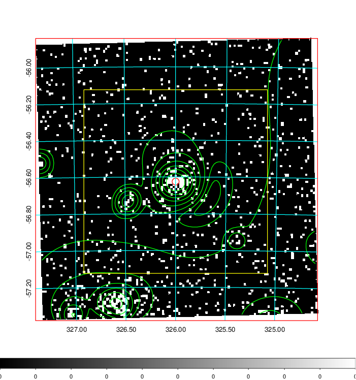
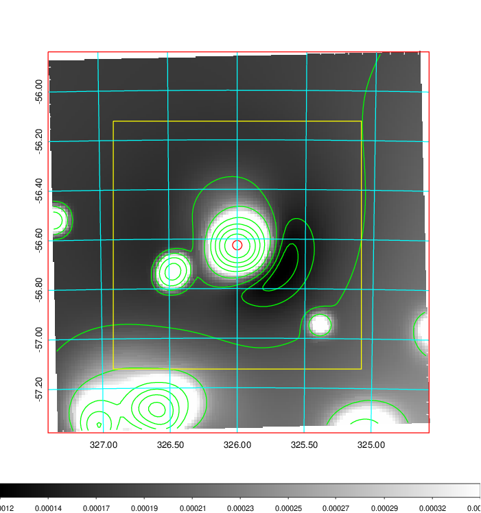
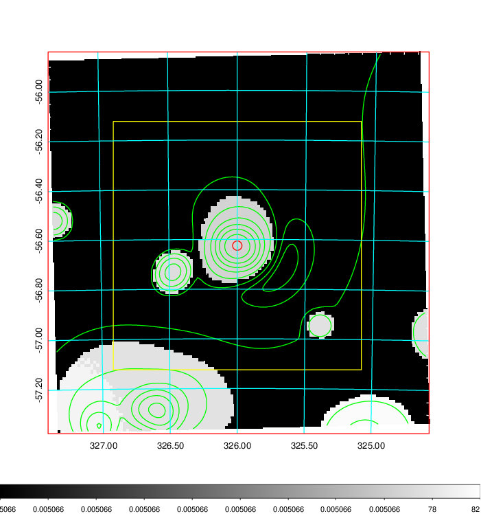
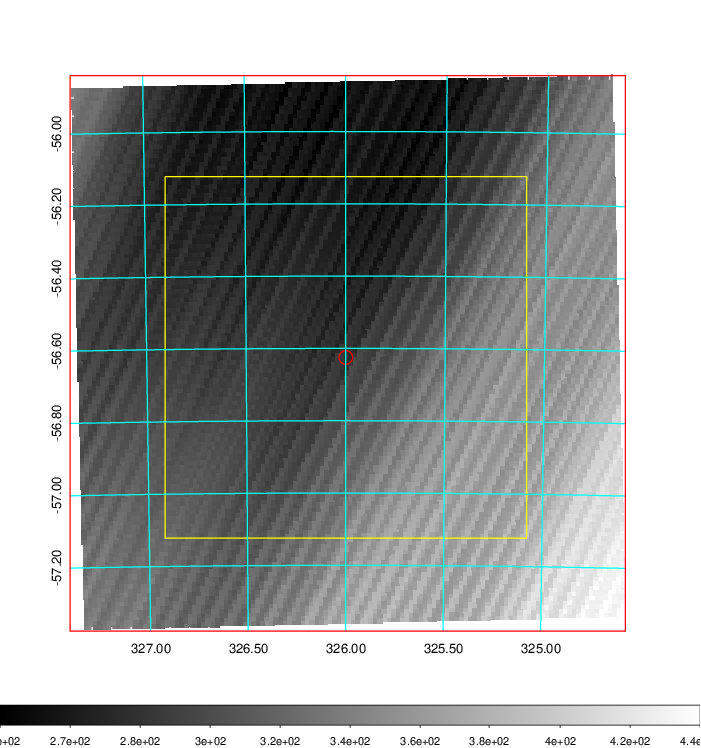
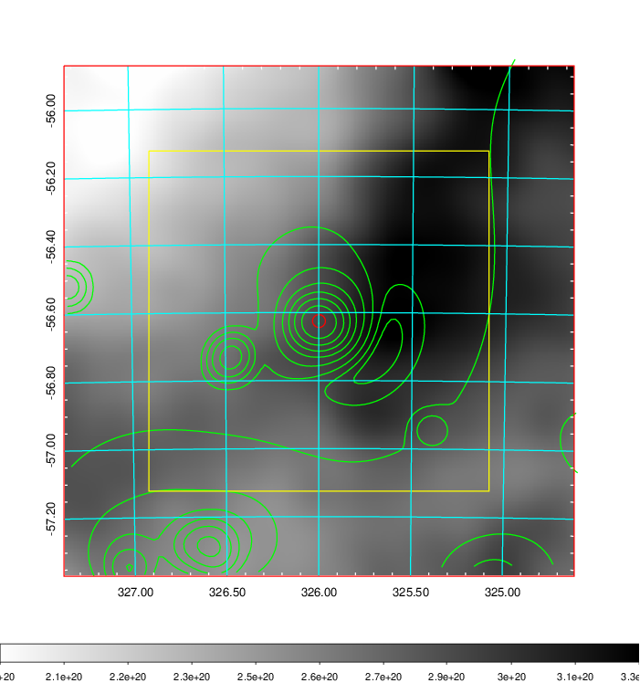
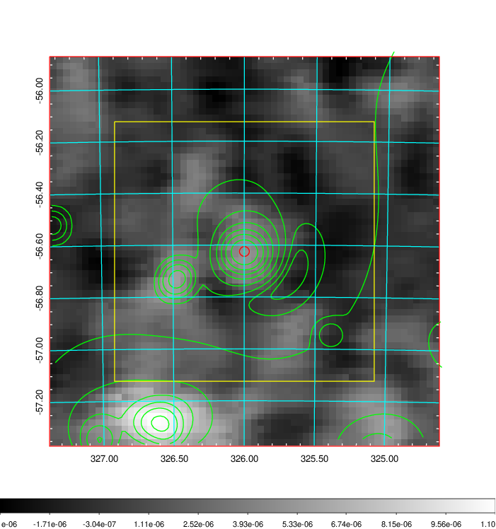
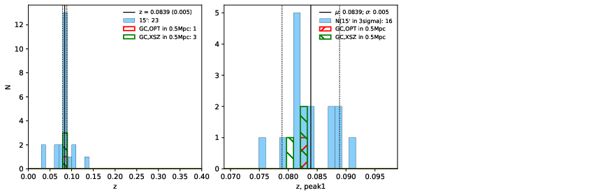
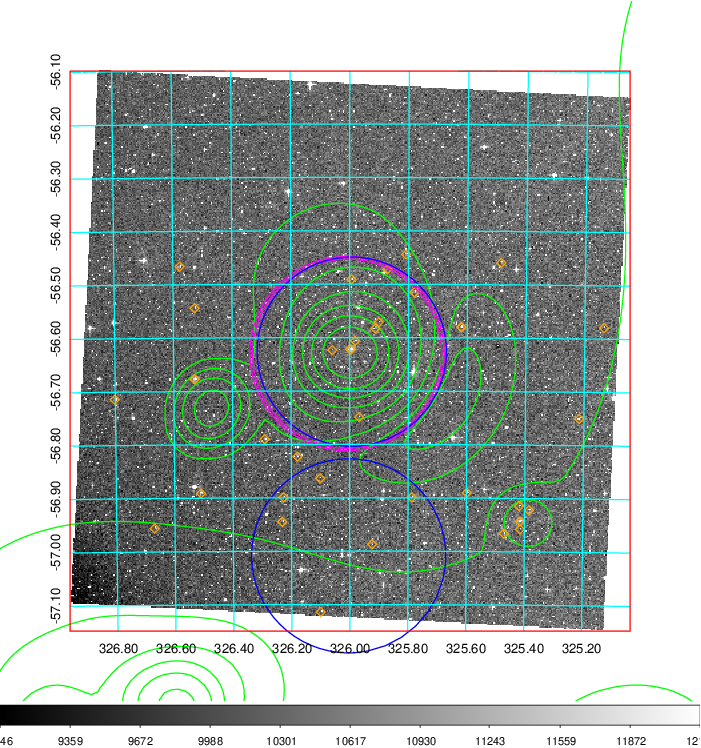
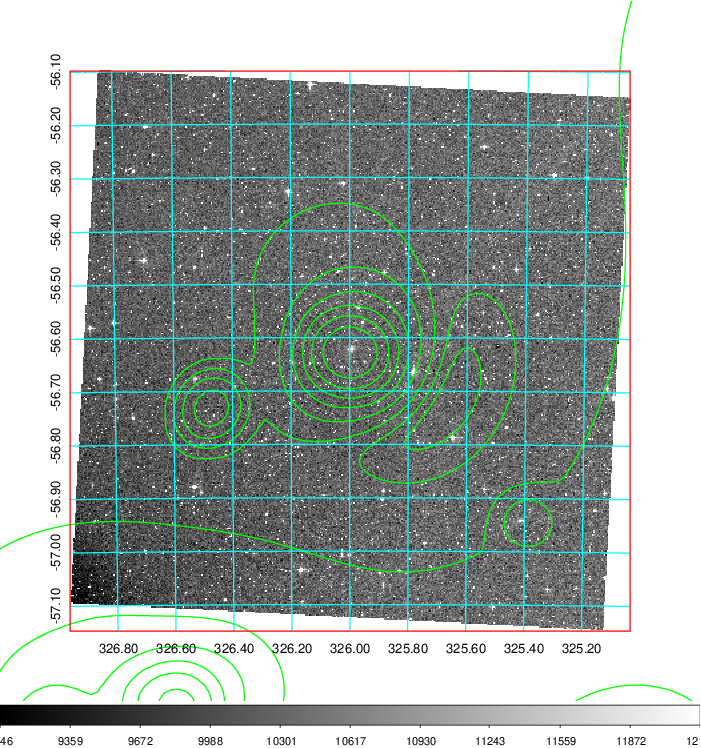

### 856

|Name|RAJ2000[deg]|DEJ2000[deg] |Ext[arcmin]| Ext,ml | z | z_src| C|GC(XSZ,Delta_z<0.01)| GC(OPT,Delta_z<0.01)|GC| R_sig[arcmin] | R500[arcmin] | R500[Mpc]| CRsig[c/s] | CR500[c/s] |L500[1E44 erg/s]|F500[1E-12 erg/s/cm^2]| M500[1E14 Msun]|Tx[keV]|Cnt_sig|Beta|Rc[arcmin]|Comment|Alias|
|---|---|---|---|---|---|------|---|--------|---------|----------|---|---|---|---|---|---|---|---|---|---|---|---|---|---|
|856| 325.999| -56.625| 1.14| 41.46| 0.0839(0.005)| z1, z_xsz| B| MCXC, Tar| N| MCXC, N, SWXCS, Tar| 10.750| 10.686| 1.011| 0.495(0.054)| 0.494(0.053)| 1.638(0.080)| 9.383(0.460)| 3.18(0.08)| 4.49(0.07)| 138.7| 0.637(-0.070+0.104)| 1.853(-0.599+0.726)| -| k050|

|[RASS image](../image/856/856_img.pdf)|[filtered image](../image/856/856_fil.pdf)|[Segment image](../image/856/856_seg.pdf)|
|-------------------|--------------------|-------------------|
|   |    |   |

|[Exposure image](../image/856/856_mex.pdf)| [nH image](../image/856/856_nh.pdf)| [Planck image](../image/856/856_p.pdf)|
|-------------------|--------------------|-------------------|
|   |     |  |

|[Redshift Histogram](../image/856/856_zg.pdf) | [DSS image(z1)](../image/856/856_dss_z1.pdf)      |  [DSS image(z2)](../image/856/856_dss_z2.pdf)    |
|-------------------|--------------------|-------------------|
| |  Blue circle for optical clusters;  Magenta circle for XSZ clusters;  all with r=1Mpc;  Only GC with Delta_z<0.01 are shown. |  Blue circle for optical clusters;  Magenta circle for XSZ clusters;  all with r=1Mpc;  Only GC with Delta_z<0.01 are shown.  |

|[known Abell/XSZ clusters](../image/856/856_gc.pdf) | [2MASS image](../image/856/856_2mass.pdf)      |
|-------------------|-------------------|
|  Magenta, blue and green circles  for optical, X-ray and SZ clusters  respectively, with redshift of clusters  labelled. The radius of circles  are 1Mpc.|  |

|[DES image](../image/856/856_des.pdf)   |
|-------------------|
|   |
