

### 857

|Name|RAJ2000[deg]|DEJ2000[deg] |Ext[arcmin]| Ext,ml | z | z_src| C|GC(XSZ,Delta_z<0.01)| GC(OPT,Delta_z<0.01)|GC| R_sig[arcmin] | R500[arcmin] | R500[Mpc]| CRsig[c/s] | CR500[c/s] |L500[1E44 erg/s]|F500[1E-12 erg/s/cm^2]| M500[1E14 Msun]|Tx[keV]|Cnt_sig|Beta|Rc[arcmin]|Comment|Alias|
|---|---|---|---|---|---|------|---|--------|---------|----------|---|---|---|---|---|---|---|---|---|---|---|---|---|---|
|857| 326.306| -19.999| 4.68| 36.81| 0.0619(0.006)| z1, z_xsz| B| L03| A, W| A, L03, N, SWXCS, W| 7.825| 9.237| 0.661| 0.114(0.035)| 0.118(0.036)| 0.188(0.037)| 2.039(0.401)| 0.87(0.09)| 2.01(0.13)| 41.7| 0.867(-0.149+0.094)| 5.656(-1.236+0.948)| -| t245|

|[RASS image](../image/857/857_img.pdf)|[filtered image](../image/857/857_fil.pdf)|[Segment image](../image/857/857_seg.pdf)|
|-------------------|--------------------|-------------------|
| 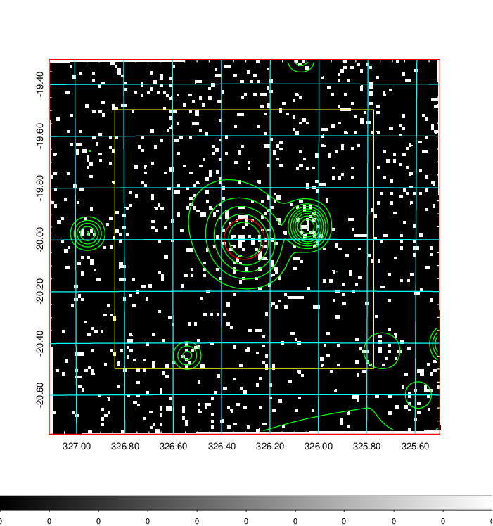  | 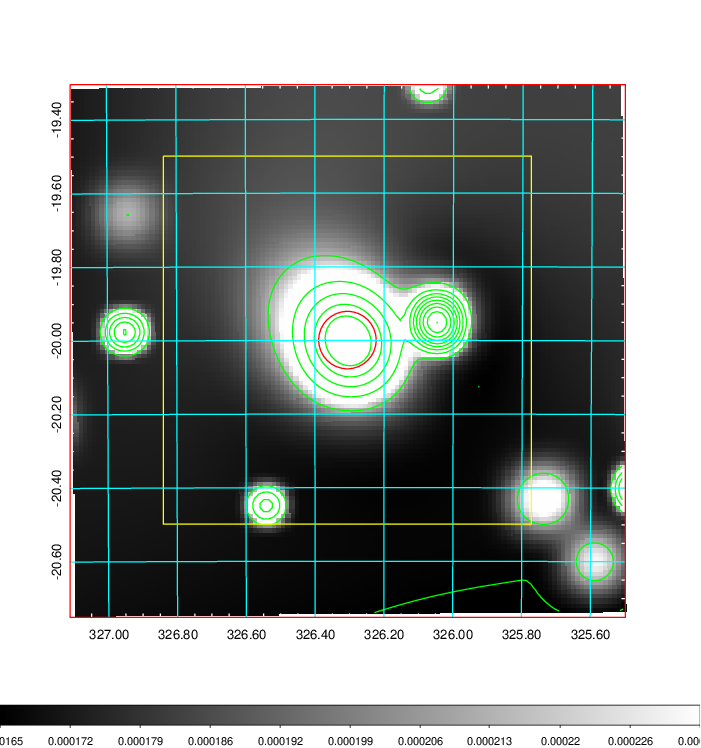   | 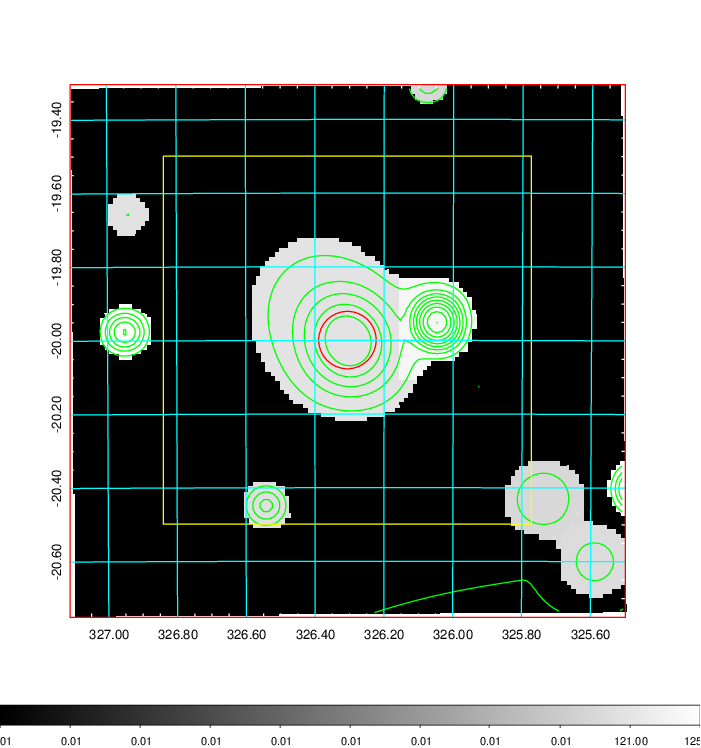  |

|[Exposure image](../image/857/857_mex.pdf)| [nH image](../image/857/857_nh.pdf)| [Planck image](../image/857/857_p.pdf)|
|-------------------|--------------------|-------------------|
|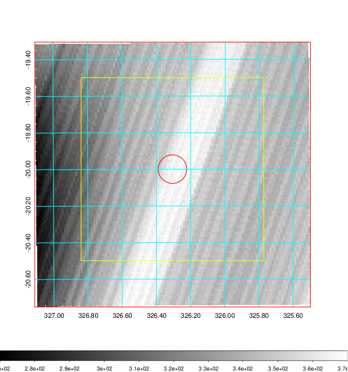   | 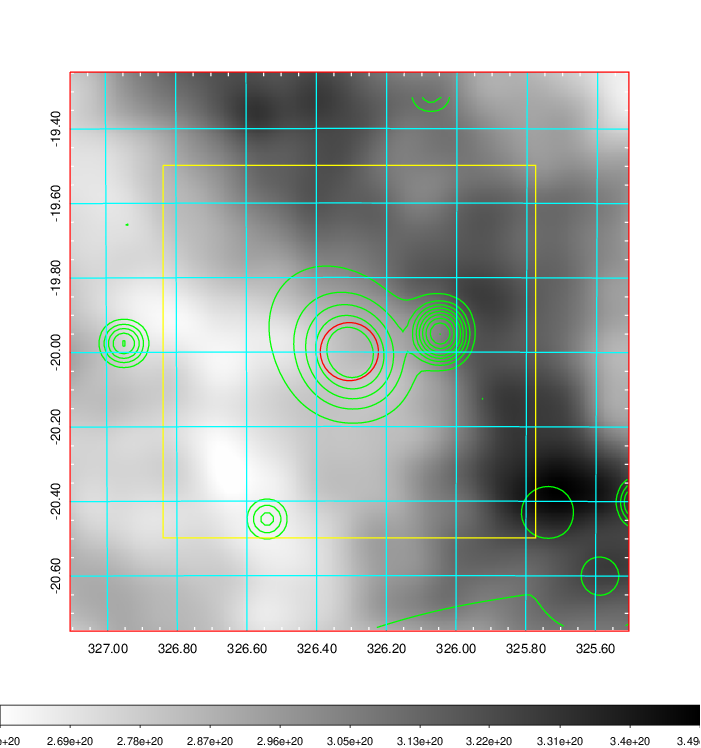    | 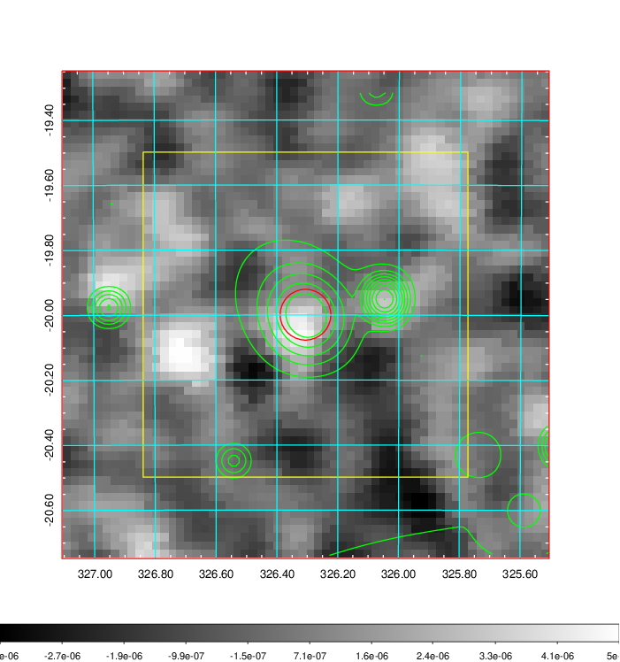 |

|[Redshift Histogram](../image/857/857_zg.pdf) | [DSS image(z1)](../image/857/857_dss_z1.pdf)      |  [DSS image(z2)](../image/857/857_dss_z2.pdf)    |
|-------------------|--------------------|-------------------|
|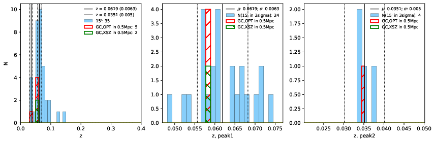 |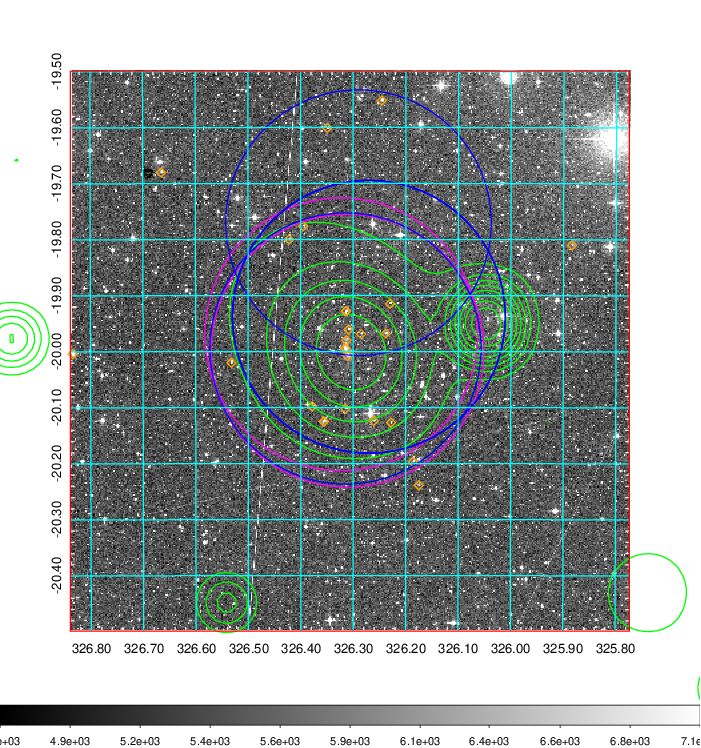  Blue circle for optical clusters;  Magenta circle for XSZ clusters;  all with r=1Mpc;  Only GC with Delta_z<0.01 are shown. | 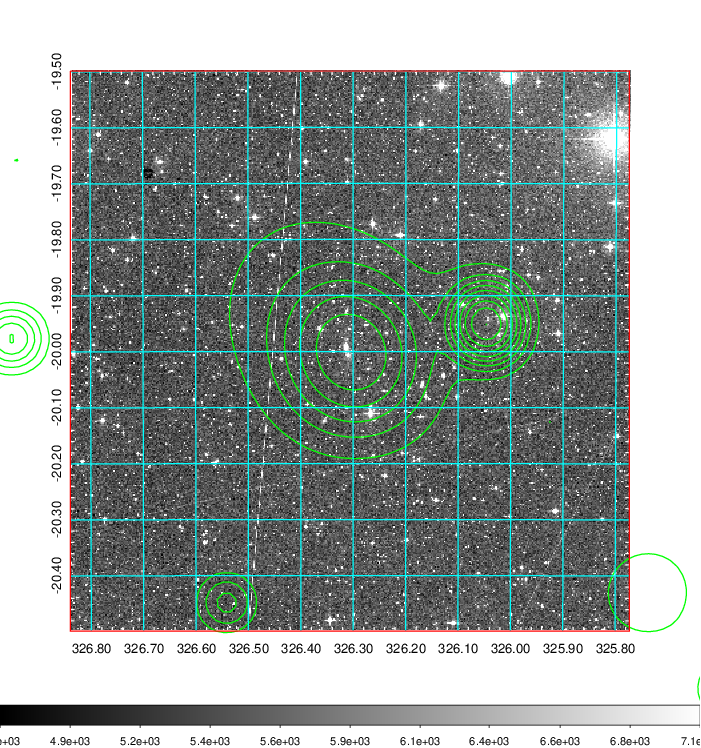 Blue circle for optical clusters;  Magenta circle for XSZ clusters;  all with r=1Mpc;  Only GC with Delta_z<0.01 are shown.  |

|[Previous-identified clusters](../image/857/857_gc.pdf) | [2MASS image](../image/857/857_2mass.pdf)      |
|-------------------|-------------------|
|  Green, magenta, and blue circles  for optical, X-ray and SZ clusters  respectively, with redshift of clusters  labelled. The radius of circles  are 1Mpc.|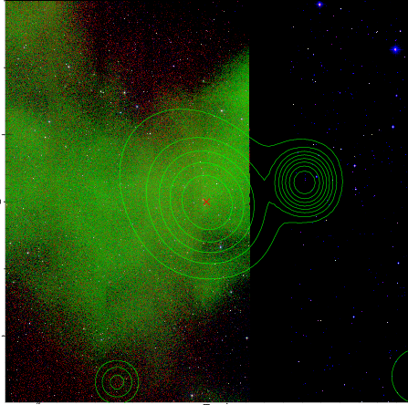  |

|[ATLAS image](../image/857/857_s.pdf)        |
|-------------------|
| 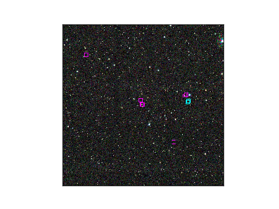  |
